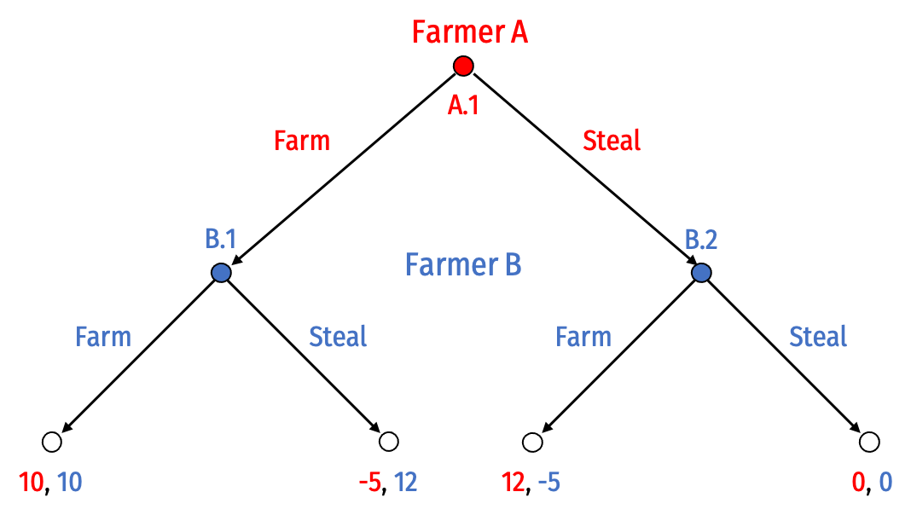
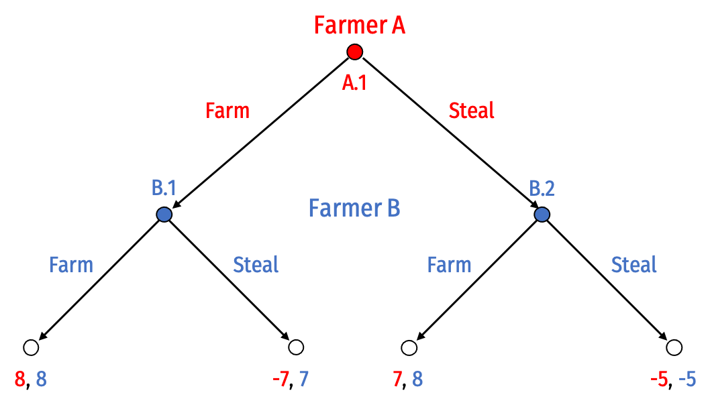

```{r message=FALSE, warning=FALSE, include=FALSE}
library(tidyverse)
library(pander)
#source(file.path(here::here(), "lib", "graphics.R"))
```

*Due by 11:59 PM Wednesday, March 24, 2021 by PDF upload in Blackboard Assignments*

- [<i class="fas fa-file-pdf"></i> Download as PDF](/assignment/01-problem-set-pdf.pdf)
<!-- [<i class="far fa-life-ring"></i> Answer Key](/assignment/01-problem-set-answers.html)
- [<i class="fas fa-file-pdf"></i> Answer Key (PDF)](/assignment/01-problem-set-answers-pdf.pdf)-->

Please **type** your answers to the following questions in a document and **save as a PDF**^[In MS Word, or Pages, or most word processing software, File -> Save As -> PDF, or File -> Export -> PDF.] to **upload on Blackboard** under Assignments. You may handwrite answers if you will be able to scan/photograph & convert them **to a single PDF**, if they are easily readable, but this is *not preferred*. See my [guide to making a PDF](/resources/#how-to-make-a-pdf-for-submitting-assignments) - an essential skill in the modern world. If you are handwriting answers, you may print the `pdf` above and write on it, or just write on a piece of paper (we only need your answers).

For any questions that ask you to draw a **graph**, *try* to do so *on your computer* (use MS Paint, the drawing tools in MS Word or MS Powerpoint, plot points in MS Excel, drawing/notetaking apps, etc.), and save it as an image to include on your homework document. Again, they need not be perfect or to scale, just show that you understand the broad idea. Being able to understand and sketch the graphs is still a very important and useful skill! If all else fails, I will be lenient in grading graph questions if you are unable to technologically include a graph. 

You may work together (and I highly encourage that) but you must turn in your own answers. I will grade homeworks 70% for completion, and for the remaining 30%, and one question will be graded for accuracy - so it is best that you try every problem, even if you are unsure how to complete it accurately.

# Concepts and Critical Thinking

## Question 1

Explain the difference between Pareto efficiency and Kaldor-Hicks efficiency. Give an example of an action or a policy that is a Kaldor-Hicks improvement but not a Pareto improvement.

## Question 2

Explain some differences between the Common Law tradition and the Civil Law tradition. How is this distinction *different* from the differences between Civil law and Criminal law?

## Question 3

Explain two normative guidelines for designing an efficient legal system, depending on transaction costs. You book calls these the Normative Coase and Normative Hobbes theorems.

## Question 4

Explain the difference between a *property rule*, a *liability rule*, and an *unalienability rule*. Under an efficient legal system, in what circumstances would each type of rule be used?

## Question 5

Explain the major differences between patents, copyrights, trademarks, and trade secrets. You do not need to go into detail, but what does each type of intellectual property cover, and how does each basically work?

# Problems

## Question 6

Consider the farm or steal game that motivated our discussion of property in lesson 2.1, but recast as a *sequential* game. Farmer A decides to farm or (commit to) steal *first*, and then given this decision, Farmer B decides to farm or steal.



### Part A

Solve this game for the rollback equilibrium using backwards induction. Prune the game tree as you do so.

### Part B

Circle (or describe) all subgames of this game.

### Part C

Carefully convert this game from extensive form to strategic form. (Be mindful of how many potential strategies each player has!)^[Hint: This will not look exactly like the payoff matrix in the slides!] Find any Nash equilibria in strategic form.

### Part D

What is the subgame perfect Nash Equilibrium? Why?

### Part E

Suppose before the game begins, Farmer B promises Farmer A that if Farmer A *farms*, Farmer B will *farm* as well. What should Farmer A make of this?

### Part F

Suppose the farmers set up a property system like we discussed in class. Administering property rights costs 2, and the penalty for theft is -5. The new game looks like this:



Find the rollback equilibrium using backwards induction. Prune the game tree as you do so.

### Part G

Convert this game to strategic form. Find any Nash equilibria. Which is/are subgame perfect, and why?

## Question 7

A railroad operates trains on a route that runs adjacent to farmland, where farmers are growing wheat. Occasionally, sparks from the railroad cause the wheat to catch fire. Suppose that sparks cause $1,000 worth of crop damage. The railroad could install spark arresters that would prevent fires at a cost of $300. Farmers could install a fence that would prevent fires at a cost of $800.

### Part A

What would the classic Pigouvian approach to understanding and solving this dilemma be?

### Part B

Regardless of the rule, what is the efficient outcome, and why?

### Part C

The farmers sue the railroad. For each of the following parts, explain what the consequences are under each scenario, and the resulting payoffs to each party. Assume transaction costs are zero, and in the event of a bargain, assume parties split the cooperative surplus evenly.

i. The court grants farmers a property right to spark-free crops and issues an injunction against the railroad operating in the area.
ii. The court grants the railroad a property right to run the trains regardless of interference.
iii. The court adopts a liability rule, and awards damages to the farmers that the railroad must pay.

### Part D
Suppose instead, transaction costs are *high*, and *no* bargains will occur. What will happen under each rule:

i. Railroad has the right to run its railroad regardless of crop damage.
ii. Court issues an injunction against the Railroad.
iii. Court awards damages against the Railroad.

Which outcome is most efficient?

### Part E

Redo part D, but assume the crop damage is only $100.

## Question 8

Under the ancient law of admiralty, the finder of an abandoned shipwreck becomes the owner of the full value of the ship and its cargo under the *law of finds*. It is quite difficult and requires a lot of investment to discover an abandoned shipwreck.

### Part A
Discuss the incentives (good and bad) this rule creates for would-be treasure hunters.

### Part B
Suppose instead, the law followed a “first-committed searcher doctrine” where the first hunter to invest resources, regardless of whether they were the party to find the shipwreck, was awarded ownership. Discuss how this would affect incentives for would-be treasure hunters.

### Part C
The Abandoned Shipwreck Act of 1987 is a federal law that upended this doctrine by awarding ownership of the discovered ship and its cargo to the U.S. State in whose waters the ship is found (rather than to the discoverer). Discuss how this would affect incentives for would-be treasure hunters.