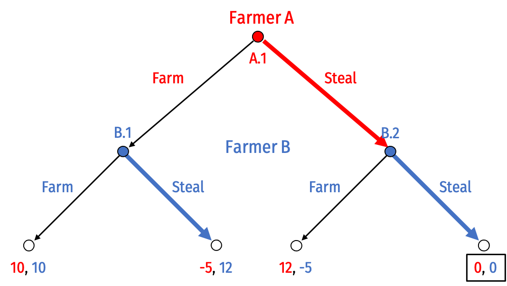
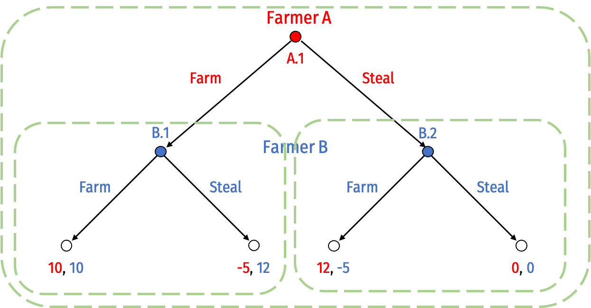
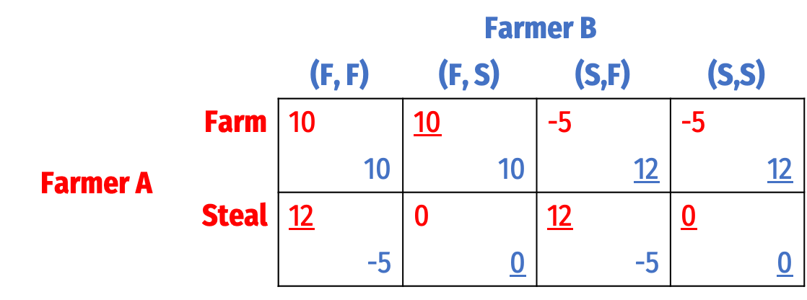
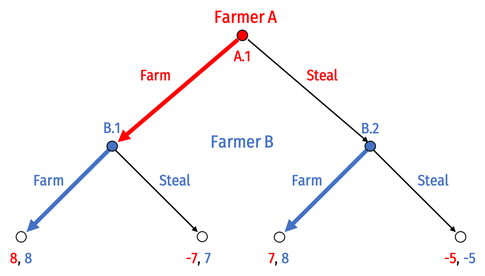
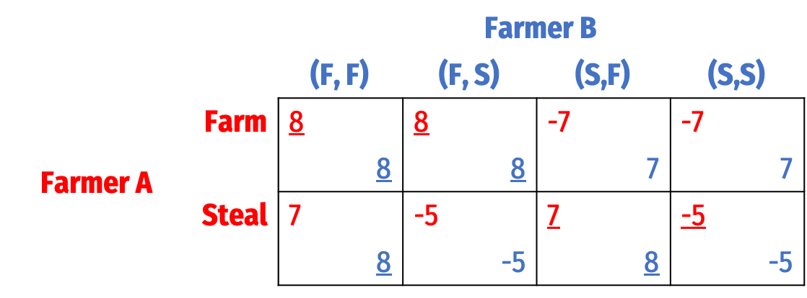

```{r setup, include=FALSE}
knitr::opts_chunk$set(echo = F)
```

<style type="text/css">
.table {

    width: 40%;

}
</style>

# Concepts and Critical Thinking

## Question 1

#### Explain the difference between Pareto efficiency and Kaldor-Hicks efficiency. Give an example of an action or a policy that is a Kaldor-Hicks improvement but not a Pareto improvement.

An allocation of resources is Pareto efficient when there are no possible Pareto improvements, that is, when there are no changes that would make at least one person better off without making at least one person worse off. Voluntary exchange is a Pareto improvement, moving resources to a higher valued use. 

In market equilibrium, all possible trades have taken place, and under current market conditions, there are no more possible trades that would make at least one party better off, and no party worse off: thus, competitive markets in equilibrium are Pareto efficient.

An allocation of resources is Kaldor-Hicks efficient when there are no possible Kaldor-Hicks improvements, that is, when there are no changes that create more benefits than costs. In principle, if a change creates more benefits than costs, those that benefit could compensate those that are harmed by the change, making everyone at least as well off as before. Kaldor-Hicks keeps the intuitive appeal of Pareto, but does not require the same unanimous consent as Pareto improvements do — simply if the social benefits exceed the social costs, the change is an improvement for efficiency. 

## Question 2

#### Explain some differences between the Common Law tradition and the Civil Law tradition. How is this distinction *different* from the differences between Civil law and Criminal law?

The Common Law tradition, which grew out of England and former British colonies, is a decentralized adversarial system where law is determined only out of disputes between private parties whose lawyers argue their case in court. The role of the judge in these cases is to “discover” what the law is — primarily based on precedent (rulings from previous cases with similar facts) and the reasonable expectations of the parties — rather than to “make law.”

The Civil Law tradition, which grew out of Napoleonic France and former French/Spanish colonies, is a centralized inquisitorial system where law is primarily codified into a very rigorous system derived by applying first principles and reason. Judges are the primary player in any dispute, finding both the facts and deducing the application of the law from the code.

This is a very separate distinction than the one between civil law — law governing disputes between private parties (like contracts, torts, property) — and criminal law — law governing disputes between private parties and the State, where the State often acts to punish individual transgressions.

## Question 3

#### Explain two normative guidelines for designing an efficient legal system, depending on transaction costs. You book calls these the Normative Coase and Normative Hobbes theorems.

The Normative Coase approach suggests that when transaction costs are low, law should primarily be designed to facilitate exchange between the parties. This is because the Coase Theorem demonstrates that in these circumstances (low transaction costs, clear and tradeable property rights) the rule about initial ownership is irrelevant, as parties will bargain among themselves to reach the efficient allocation of rights. This is easy for courts to do, since it does not require them to investigate who “should” be given the right.

The Normative Hobbes approach suggests that when transaction costs are high, law should primarily be designed to not rely on private bargains, and instead try to get the allocation of rights correct initially. This is because parties will be unable to bargain, and whomever the court assigns rights to initially will end up with them. Therefore the court should investigate and determine who best to give the rights to (who can avoid external harm, or internalize externalities at the lowest cost), which requires more of the court.

## Question 4

#### Explain the difference between a *property rule*, a *liability rule*, and an *unalienability rule*. Under an efficient legal system, in what circumstances would each type of rule be used?

A *property rule* protects an entitlement with an *injunction*, a court order typically commanding a party to refrain from an activity. Owners of entitlements protected by property rules are free to exercise, not exercise, gift, or sell their rights to others as they see fit. For efficiency, injunctions should primarily be used when transaction costs are low, since parties will bargain to the efficient outcome regardless, and injunctions are cheap and easy for the court to implement.

A *liability rule* protects an entitlement with the right to collect *damages* from the injurer, equal to the harm done. For efficiency, liability rules should be used when transaction costs are high, since parties would not otherwise bargain. Damages are more costly to the court, since it has to determine the value of the harm done in order to properly set the amount of damages awarded. Furthermore, in these cases of higher transaction costs and no bargaining, damages are more efficient than an injunction, because the possibility of damages still gives the injurer a choice to either injure and pay the damages or to invest in reducing harm (i.e. installing equipment to reduce pollution, etc.), and will do whichever is cheaper.

An *unalienability rule* is like a property rule, except the owner of the entitlement is not prohibited by law from selling this right to others (or sometimes: giving it away, or even possessing it). Examples include kidneys and other human organs, illegal drugs, sex (prostitution), and other things that many people find "repugnant" or "immoral" and have enacted statutes preventing their ownership or exchange. While the primary motivation behind such rules is often merely paternalism (people, especially those in power, restrict the freedom of others, claiming to know what is best for them), one can argue that in many of these situations, allowing sales and ownership would create *more* negative externalities than preventing sales or ownership.

## Question 5

#### Explain the major differences between patents, copyrights, trademarks, and trade secrets. You do not need to go into detail, but what does each type of intellectual property cover, and how does each basically work?

A patent is a property right from the government given to inventors to protect their ideas and inventions. Patents grant the exclusive right to produce and sell their goods for a limited period of time, and allow the patent holder to sue others producing/using the good for infringement.

A copyright is a property right from the government given to artists to protect their expressions. Copyrights grant the exclusive right to publish their particular work for a limited period of time, and allow the copyright holder to sue others publishing the same work for infringement.

A trademark protects a distinctive name, phrase, logo, or image that uniquely identifies a seller. Trademarks last as long as the business continues to use the unique mark, and can sue others who use the same mark (essentially, committing fraud).

A trade secret protects information that gives a business a competitive advantage so long as it remains secret (such as a secret formula). Trade secrets remain protected so long as the owner undertakes reasonable efforts to keep it secret, and can sue anyone who misappropriated the information (essentially, committing theft).

# Problems

## Question 6

Consider the farm or steal game that motivated our discussion of property in lesson 2.1, but recast as a *sequential* game. Farmer A decides to farm or (commit to) steal *first*, and then given this decision, Farmer B decides to farm or steal.


### Part A

#### Solve this game for the rollback equilibrium using backwards induction. Prune the game tree as you do so.



To solve via backwards induction, start at the terminal nodes at the bottom, and determine what decisions the last-mover will make at their decision nodes, and given that, work your way up to earlier decision nodes.

So start with <span style="color: blue;">Farmer B</span>, who at node B.1 can choose to <span style="color: blue;">Farm</span> (and earn 10) or <span style="color: blue;">Steal</span> (and earn 12). They will <span style="color: blue;">Steal</span> At node B.2 <span style="color: blue;">Farmer B</span> can choose to <span style="color: blue;">Farm</span> (and earn -5) or <span style="color: blue;">Steal</span> (and earn 0). They will <span style="color: blue;">Steal</span> I have highlighted these optimal choices on the game tree in blue (alternatively, you can cross out the non-highlighted branches.)

Now move to <span style="color: red;">Farmer A</span>, who at node A.1 can choose to <span style="color: red;">Farm</span> or <span style="color: red;">Steal</span> If <span style="color: red;">A Farms</span>, they know <span style="color: blue;">B</span> will <span style="color: blue;">Steal</span>; and if <span style="color: red;">A Steals</span>, they know <span style="color: blue;">B</span> will <span style="color: blue;">Steal</span>; so really the decision for <span style="color: red;">Farmer A</span> is between <span style="color: red;">Farm</span> and earning -5 (since <span style="color: blue;">Farmer B</span> will respond with <span style="color: blue;">Steal</span>), or <span style="color: red;">Steal</span> and earning 0 (since <span style="color: blue;">Farmer B</span> will respond with <span style="color: blue;">Steal</span>). So <span style="color: red;">A</span> will <span style="color: red;">Steal</span>

This is the outcome: <span style="color: red;">Steal</span>, <span style="color: blue;">Steal</span>

### Part B

#### Circle (or describe) all subgames of this game.



There are three:

1. The game itself (initiated at A.1)
2. The subgame initiated at B.1
3. The subgame initiated at B.2

### Part C

#### Carefully convert this game from extensive form to strategic form. (Be mindful of how many potential strategies each player has!)^[Hint: This will not look exactly like the payoff matrix in the slides!] Find any Nash equilibria in strategic form.

<span style="color: red;">Farmer A</span> only has two possible strategies based on their single decision node A.1:

1. <span style="color: red;">Farm</span>
2. <span style="color: red;">Steal</span>

<span style="color: blue;">Farmer B</span>, however, has $2^2=4$ possible strategies, based on their two decision nodes (B.1, B.2) which have two possible choices each. For convenience, I denote each strategy as an ordered pair of what choice they would select at decision nodes (B.1, B.2), for shorthand, F stands for Farm, S stands for Steal:

1. <span style="color: blue;">(Farm, Farm)</span>
2. <span style="color: blue;">(Farm, Steal)</span>
3. <span style="color: blue;">(Steal, Farm)</span>
4. <span style="color: blue;">(Steal, Steal)</span>

Representing this in strategic form:



Using best-response analysis, I have highlighted each player's best response to each strategy of the other player by underlining the associated payoff. Nash equilibrium requires all players to be playing mutual best responses to each other. We can see there is only a single Nash equilibrium:

1. {<span style="color: red;">Steal</span>, <span style="color: blue;">(Steal, Steal)</span>}

<span style="color: red;">Farmer A</span> plays <span style="color: red;">Steal</span>, and <span style="color: blue;">Farmer B</span> plays (<span style="color: blue;">Steal, Steal</span> - i.e. always Steal).

### Part D

#### What is the subgame perfect Nash Equilibrium? Why?

The single Nash equilibrium identified in Part C, {<span style="color: red;">Steal</span>, <span style="color: blue;">(Steal, Steal)</span>}, is subgame perfect. For proof, see the answer to Part A, which shows this strategy to be sequentially rational (and the rollback equilibrium). This strategy is a Nash equilibrium in all possible subgames, i.e., in any of the three possible subgames, no player would want to deviate from this strategy set.

### Part E

#### Suppose before the game begins, Farmer B promises Farmer A that if Farmer A *farms*, Farmer B will *farm* as well. What should Farmer A make of this?

This is clearly not a credible promise. If by any means the game reaches B.2, it is always in the interest of <span style="color: blue;">Farmer B</span> to <span style="color: blue;">Steal</span>. So playing <span style="color: blue;">Farm</span> would not be a Nash equilibrium in that subgame, since <span style="color: blue;">Farmer B</span> would want to switch to <span style="color: blue;">Steal</span>.

### Part F

Suppose the farmers set up a property system like we discussed in class. Administering property rights costs 2, and the penalty for theft is -5. The new game looks like this:


#### Find the rollback equilibrium using backwards induction. Prune the game tree as you do so.



Solving similarly to part A, we get the outcome where both players Farm.

### Part G

#### Convert this game to strategic form. Find any Nash equilibria. Which is/are subgame perfect, and why?

Representing this in strategic form:



Using best-response analysis, I have highlighted each player's best response to each strategy of the other player by underlining the associated payoff. Nash equilibrium requires all players to be playing mutual best responses to each other. We can see there are three Nash equilibria:

1. {<span style="color: red;">Farm</span>, <span style="color: blue;">(Farm, Farm)</span>}
2. {<span style="color: red;">Farm</span>, <span style="color: blue;">(Farm, Steal)</span>}
3. {<span style="color: red;">Steal</span>, <span style="color: blue;">(Steal, Farm)</span>}

Only the first is subgame perfect. This is a Nash equilibrium in all possible subgames, and you can see this strategy set is sequentially rational by seeing this is exactly the rollback solution to part F.

The second (where <span style="color: blue;">Farmer B's</span> strategy is to <span style="color: blue;">Farm</span> if <span style="color: red;">A Farms</span> and <span style="color: blue;">Steal</span> if <span style="color: red;">A Steals</span>) is not subgame perfect: if the game ever reaches node B.2 (if <span style="color: red;">A Steals</span>), <span style="color: blue;">B</span> would not want to <span style="color: blue;">Steal</span>, they would want to switch to <span style="color: blue;">Farm</span> to earn 8 instead of -5.

The third (where <span style="color: blue;">Farmer B's</span> strategy is to <span style="color: blue;">Steal</span> if <span style="color: red;">A Farms</span> and <span style="color: blue;">Farm</span> if <span style="color: red;">A Steals</span>) is not subgame perfect: if the game ever reaches node B.1 (if <span style="color: red;">A Farms</span>), <span style="color: blue;">B</span> would not want to <span style="color: blue;">Steal</span>, they would want to switch to <span style="color: blue;">Farm</span> to earn 8 instead of -5.

## Question 7

A railroad operates trains on a route that runs adjacent to farmland, where farmers are growing wheat. Occasionally, sparks from the railroad cause the wheat to catch fire. Suppose that sparks cause $1,000 worth of crop damage. The railroad could install spark arresters that would prevent fires at a cost of $300. Farmers could install a fence that would prevent fires at a cost of $800.

### Part A

#### What would the classic Pigouvian approach to understanding and solving this dilemma be?

The Pigouvian approach would likely identify the railroad as being the injurer creating a negative externality on the farmers, and would compel the railroad to internalize their external cost by imposing a tax (or damages) on the railroad equal to the $1,000 damages they cause from the sparks.

### Part B

#### Regardless of the rule, what is the efficient outcome, and why?

It is most efficient for the railroad to install the spark arresters. This avoids a $1,000 harm at a $300 expense, which is cheaper than if the farmers were to avoid the $1,000 harm by spending $800 with the fence.

### Part C

#### The farmers sue the railroad. For each of the following parts, explain what the consequences are under each scenario, and the resulting payoffs to each party. Assume transaction costs are zero, and in the event of a bargain, assume parties split the cooperative surplus evenly.

#### i. The court grants farmers a property right to spark-free crops and issues an injunction against the railroad operating in the area.

The railroad will install the arresters to avoid creating any crop damage.

|    |    |
|-----------------|---:|
| Railroad payoff | -300 |
| Farmers payoff | 0 |
| **Joint payoff** | **-300** |

#### ii. The court grants the railroad a property right to run the trains regardless of interference.

There is a bargain to be made here, with the cooperative surplus being $500 — the difference between the Railroad's cost of avoiding the harm and the Farmers' cost of avoiding the harm. Another way to look at this: the Railroad is willing to accept at least $300 to install arresters and the Farmers are willing to pay up to $800 for the Railroad to install arresters, rather than build the $800 fence.

Assuming they split this surplus, each gains $250. In other words, the Farmers will pay the railroad $550 ($300+$250) to install arresters.

|    |    |
|-----------------|---:|
| Railroad payoff | 550-300=250 |
| Farmers payoff | -550 |
| **Joint payoff** | **-300** |

#### iii. The court adopts a liability rule, and awards damages to the farmers that the railroad must pay.

The Railroad faces a choice: (1) to do nothing, causing $1,000 of damages, which it must pay to the Farmers or (2) to install the arresters at a $300 expense. Since the latter is cheaper, it will install arresters.

|    |    |
|-----------------|---:|
| Railroad payoff | -300 |
| Farmers payoff | 0 |
| **Joint payoff** | **-300** |

Notice in all the above outcomes, the joint payoff is -300, and the arresters (least-cost method of avoiding harm) are always installed.

### Part D
Suppose instead, transaction costs are *high*, and *no* bargains will occur. What will happen under each rule:

#### i. Railroad has the right to run its railroad regardless of crop damage.

The Railroad will do nothing, why should they do anything? Since the Farmers are unable to bargain with the Railroad, they could no nothing and suffer $1,000 of damages, or they could spend $800 to build the fence, which is what they will do.

|    |    |
|-----------------|---:|
| Railroad payoff | 0 |
| Farmers payoff | -800 |
| **Joint payoff** | **-800** |

This is inefficient — Farmers are spending $800 to avoid a $1,000 when it could be avoided for $300. Notice the joint payoff is lower than in Part C by exactly 500, the amount of the cooperative surplus. 

#### ii. Court issues an injunction against the Railroad.

The railroad must install arresters if it hopes to keep operating, so it will spend $300 installing them. 

|    |    |
|-----------------|---:|
| Railroad payoff | 0 |
| Farmers payoff | -300 |
| **Joint payoff** | **-300** |

This is the efficient outcome. 

#### iii. Court awards damages against the Railroad.

The railroad could do nothing, causing $1,000 of damages which it would have to pay, or install arresters for $300, which it would rather do. 

|    |    |
|-----------------|---:|
| Railroad payoff | 0 |
| Farmers payoff | -300 |
| **Joint payoff** | **-300** |

This is also an efficient outcome.

#### Which outcome is most efficient?

As we can see, when transaction costs are too high and parties will not bargain, the choice of rule matters for efficiency. The court must determine which party can prevent the harm at the lowest cost. In this case, it is the Railroad installing arresters, so the court should award rights to the Farmers. In this particular case, it does not matter whether this is a property or liability rule, the railroad will always install the arresters.

### Part E

#### Redo part D, but assume the crop damage is only $100.

i. Under Railroad's rights, again the Railroad has no reason to do anything. This causes $100 of crop damage. The farmers could build their $800 fence to stop the damage, but the damage is only $100. The farmers simply take the $100 hit.

|    |    |
|-----------------|---:|
| Railroad payoff | 0 |
| Farmers payoff | -100 |
| **Joint payoff** | **-100** |

This is the most efficient.

ii. Under the injunction against sparks, the Railroad is forced to install arresters to keep operating. It will spend $300 on arresters.

|    |    |
|-----------------|---:|
| Railroad payoff | 0 |
| Farmers payoff | -300 |
| **Joint payoff** | **-300** |

This is less efficient than (i).

iii. Under a damages rule, the Railroad could do nothing, cause $100 worth of damages, and pay that to the farmers; or it could prevent damage with $300 arresters. It would rather do nothing, cause the damage, and then compensate the farmers.

|    |    |
|-----------------|---:|
| Railroad payoff | -100 |
| Farmers payoff | -100+100=0 |
| **Joint payoff** | **-100** |

This is equally efficient to (i).

As we can see, like the previous question, it will matter for efficiency what the court decides. Again, the Railroad is the least-cost avoider of the harm (arresters cost $300 vs. the $800 farmers fence), but we can now see that an injunction will be less efficient than a damages rule. The damages rule allows the Railroad to pick whichever is cheaper (more efficient): to do nothing to prevent harm and compensate, or invest in avoiding harm (the arresters). Because arresters are more expensive than the damage the sparks cause, it is actually efficient *not* to internalize the externality and to continue causing the sparks.