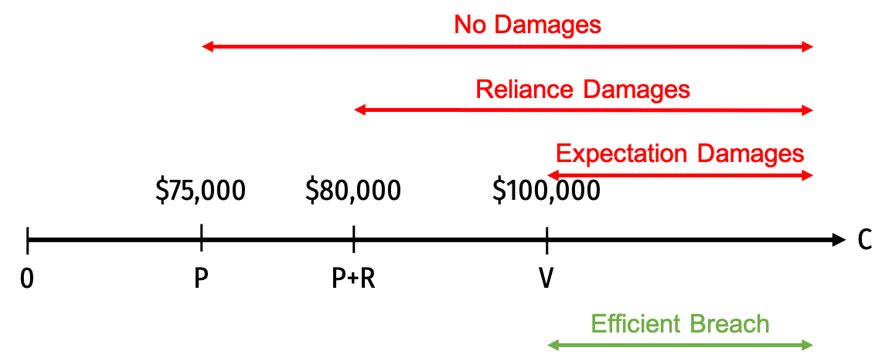

```{r setup, include=FALSE}
knitr::opts_chunk$set(echo = F)
```

<style type="text/css">
.table {

    width: 40%;

}
</style>

# Concepts and Critical Thinking

## Question 1

#### Explain the “bargain theory” of contracts, and what types of contracts courts will enforce or not enforce, under this approach.

The bargain theory of contracts is a famous legal theory courts use to determine which promises should be enforced as valid contracts. Essentially, only promises made as part of a bargain are enforceable, all other promises are not. A bargain is comprised of three elements: 

1. Offer
2. Acceptance
3. Consideration

The first two is commonly referred to as a "meeting of the minds." Both parties must give up something of value to induce the other party to agree. In legal disputes, consideration refers to something of value the promisee gives to the promisor in exchange for the promise which will be performed.^[Disputes arise when the promisor fails to perform their promise to the promisee.]

## Question 2

#### List, and explain at least five ways that contract law (at least ideally), promotes efficient behavior.

1. Contract law **facilitates trade** and **makes promises credible.** As a recourse for parties that otherwise would not want to keep their promise, knowing the court may force them to pay damages will force parties to credibly commit to performance, and allow the other party to trust them. This facilitates cooperation and exchange that might not otherwise be possible due to lack of trust.

2. Contract law encourages **efficient disclosure of information**. Similar to the first point, it will often be in the interest of parties to disclose information (whether or not the law *compels* them to) if it further facilitates trade by getting the other party to trust them. For example, it is in the interest of used car dealerships to disclose which cars are high vs. low quality, to prevent the lemons problem.

3. Contract law incentivizes promisors to **efficiently invest in performance**. With expectation damages as the main remedy, promisors will want to breach only when it is socially efficient to do so, and otherwise to perform (when it is socially efficient to do so). This ensures they sign contracts and make decisions that make it more likely for them to perform when it is efficient.

4. Contract law incentivizes promisees to **efficienty invest in reliance.** With the Hadley v. Baxendale rule limiting expectation damages to what is *reasonably forseeable*, it prevents the promisee from overrelying on successful performance of the contract (and not over-exposing themselves to the risk of the promisor breaching).

5. Contract law provides **efficient default rules and regulations**. By generally filling in gaps in contracts with rules that parties generally *would have wanted*, this tends to allocate risk of unexpected contingencies to the lower-cost bearer of the risk (what parties probably would have done anyway), as it is most efficient. Also, by invalidating certain agreements, such as when performance becomes impossible, it prevents excessive promises that would be inefficient to keep.

6. Contract law fosters **enduring relationships.**

## Question 3

#### Explain the purpose of default rules. Why might parties leave gaps in their contract? What types of default rules promote efficiency? Also explain the idea of penalty defaults.

A gap in a contract is a situation where an unexpected contingency arises that might affect performance of the contract, and parties have not agreed in advance upon what to do in the situation. Parties could have written into the contract what should be done if circumstances change, but may have chosen not to do so, either because it would be too costly to negotiate and hash out *every possible contingency* (and is more efficient to just rely on the court's default rules), or perhaps for strategic reasons. 

It might be easier for the parties to leave it out and hope the circumstances simply don't happen, and then if they do, figure out who should bear the loss.

Default rules are what courts use to fill gaps in contracts if those circumstances arise and a loss must be allocated. In general, to be efficient, these rules should allocate a loss to whichever party can bear it at a lower cost (the efficient bearer of risk), which is what the parties probably would have done anyway if they had written what they would do under this possibility into the contract. Often this is the party that had better knowledge and/or control over the likelihood of these circumstances arising.

An alternate perspective is to use a penalty default rule, which penalizes parties for leaving gaps, by creating an *inefficient* rule to use if the parties do not specify their own. By giving them something that they *would not want*, this forces the parties to negotiate in advance and address the potential risk by putting it into the contract what they would do under this set of circumstances.

## Question 4

#### Explain several legal doctrines that courts use to invalidate contracts. What are the economic rationales behind each of these doctrines?

In general, contracts are invalidated because of some lack of rationality, or some market failure or high transactions cost that deviate from the ideal of a bargain in a competitive market.

Courts will invalidate a contract using the doctrine of **incompetence** if a party lacks the capacity to understand the consequences of the contract (such as a child or person with severe disabilities). These should not be enforced because, lacking full rationality, both parties may not expect to benefit from the transaction, making it inefficient.

Courts will also invalidate contracts agreed to (or changed) under **duress**, where one party is in dire circumstances if they refuse, and the other party is *responsible* for those circumstances (such as putting a gun to the other person's head). These situations of duress should be invalidated, since we do not want to give extra incentives for people to coerce others into a contract just to redistribute wealth (rent-seeking).

Courts will excuse a promisor from performance (i.e the contract was valid, but the promisor may breach without paying damages) if performance becomes **impossible** or the **purpose frustrated** from some unexpected change. It is efficient to breach these contracts since performance when they would not create any net surplus^[In our notation, when $C>V$.] The court should assign the loss from the change to the party that can bear it the cheapest.

Courts will also invalidate a contract formed under **mutual mistake**, where *both* parties have incorrect information regarding the promise to be performed (no meeting of the minds), or about the facts material to the transaction. If a single party is mistaken (unilateral mistake), this is often insufficient to invalidate a contract. Efficiency suggests contracts formed on mutual mistake should be invalidated, and contracts formed on unilateral mistake should be enforced, as this tends to give incentives to parties to acquire accurate information that enhances the production of wealth, but not incentives that reward fortuitously acquired information for purely redistributive purposes. 

## Question 5

#### Explain the difference between the following remedies:

- (i) expectation damages
- (ii) reliance damages
- (iii) opportunity cost damages
- (iv) and specific performance.

#### What is the court's goal (in terms of compensating the Plaintiff) with each amount of damages? How is specific performance similar to an injunction in property law?

**Expectation damages** are an amount to make the Plaintiff (promisee) as well off as if the contract had been *performed*. This is equal to the amount the promisee expected to be better off under the contract.

**Reliance damages** are an amount to make the Plaintiff (promisee) as well off as if the contract had *never been made*. This is equal to any amount the promisee invested in reliance assuming the performance would occur (essentially refunding them back to 0).

**Opportunity cost damages** are an amount to make the Plaintiff (promisee) as well off as if the *next best contract* had been performed. This is equal to the net benefit the promisee expected from the next best opportunity.

**Specific performance** mandates the Promisor to perform the promise. This is similar to an injunction (property rule) in that it grants the Promisee the right to force the Promisor to perform. Like any property right, the Promisee can choose to excercise this or not (excuse the Promisor from performance), or reach a bargain where the Promisor can buy their way out of performance (paying the Promisee to not perform).

# Problems

## Question 6

Suppose I run a retail shop that hires extra cashiers during the holiday rush. Each year, we typically sign 6-week contracts with short-term employees, where we train them for 2 weeks before Thanksgiving and then employ them as cashiers for all of December at a pre-agreed wage.

Suppose you agree to such a contract. Consider the following scenarios:

- (i) The day after Thanksgiving, I have already invested time and money in training you, and do not have time to train a replacement. You suddenly realize you are in a strong bargaining position and threaten to quit unless I raise your salary. With little choice, I rewrite the contract to pay you more.

- (ii) Watching you interact with customers and other employees during training, I realize you are better suited to be a store *manager* than a cashier. There is more work involved and you would not agree to do it for the same wage – but your additional value to me as a manager is much greater than the additional cost (effort) to you. We rewrite the contract to make you a manager and pay you more.

### Part A

#### Give an economic argument why the renegotiated contract should be enforced in the second scenario, while the original contract should be enforced in the first.

Both are situations of contract modification. The first scenario is one of duress — you exploit my situation to extract greater wealth from me in exchange for no additional work. The second one reflects a genuine economic change, you are providing more services and are compensated with a higher wage.

### Part B

#### Would either renegotiated contract be enforced under the Bargain Theory of contracts?

The first would not be enforced since there is no additional consideration provided by the promisee in exchange for the new promise. You are not offering to do any additional work for the higher wage. Under the "preexisting duty" doctrine, at the higher wage, you are only fulfilling your original agreed-upon duty, nothing more.

The second would be enforced, since there is additional consideration provided in exchange for the new promise. You are offering to do additional valuable work in exchange for more money.

## Question 7

Amy inherits an 1963 Aston Martin DB5 from her eccentric rich uncle. Having little interest in antique cars, she agrees to sell it to Ben for $30,000, who would have paid up to $40,000 for it. A day before Amy and Ben meet to exchange a check and the keys, Cary hears about Amy trying to sell her car, and offers Amy $50,000 for it.

### Part A

#### Who is the efficient owner of the car?

Cary is the most efficient owner, as Cary values the car the highest of the three people.

### Part B

#### Suppose Amy decides to break her promise to Ben, and sell the car instead to Cary. Ben sues Amy for breach of contract. How much would *expectation damages* be? Under expectation damages, who will end up owning the car?

Ben expected to benefit by $10,000 (he was willing to pay $40,000 and actually paid $30,000 for it), so expectation damages should be $10,000.

If the contract dispute is remedied with expectation damages, Cary will end up with the car. Amy would choose to breach the contract with Ben and sell the car to Cary for $50,000. She still has to pay $10,000 in damages to Ben, but Amy still nets $40,000 in this arrangement.

### Part C

#### Not wanting his new car to get snowed on, Ben pays a nonrefundable $1,000 fee to rent an indoor parking space near his home. Both parties live in Denver, where both know it is likely to snow often. With the car and the parking space, Ben expects to get a benefit of $40,000. If Ben wins *reliance damages* in his lawsuit, how much will this be?

Reliance damages would reimburse Ben for his reliance investment in the parking space, so just $1,000. He is restored back to the position he was in had he never agreed to the contract.

### Part D

#### Suppose instead, the contract is protected by *specific performance*. Cary doesn’t like Ben and will not buy the car from him, and Amy and Ben are unable to renegotiate their contract. Who will end up with the car? What will Amy and Ben's payoffs be?

Specific performance would require Amy to sell the car to Ben for the originally-agreed $25,000. Amy will get $25,000 and Ben will net $15,000 (see answer to A). Ben will keep the car (since Cary will not buy it from him, even if it would be efficient).

### Part E

#### Under specific performance, what would be the gains from cooperation if Amy and Ben agreed to void their original contract so that Amy could sell the car to Cary? What would be each party's BATNA? If the gains were split evenly, how much would Amy have to pay Ben to buy her way out of their contract?

If Amy and Ben could renegotiate their contract, the cooperative surplus would be $10,000, since their joint payoff (excluding Cary) is $40,000 ($25,000 to Amy, $15,000 to Ben) and it would rise to $50,000 (Amy's payoff) if she could sell to Carol for $50,000.

Amy's BATNA is $25,000 (what she gets from Ben if they fail to *re*negotiate). Ben's BATNA is $15,000 (what he gets if he fails to *re*negotiate with Amy.) These are their payoffs from part D. Note again there is a $10,000 difference (the cooperative surplus).

If they divide the surplus evenly, that is $5,000 in value going to each party. So we can add that to each party's BATNA, to get their total payoffs: $30,000 to Amy; $20,000 to Ben.

What this means is Amy would pay Ben $20,000 to breach their contract so she could sell to Cary instead (and earn net of $30,000).

### Part F

#### Which remedy, specific performance or expectation or damages, results in more efficient outcomes when transaction costs (to renegotiate the contract) are low? What about when transaction costs are high?

When transaction costs are low, either rule will lead to the efficient outcome. (One could argue that specific performance leads to the more efficient outcome, since the parties renegotiate and no lawsuit is required, while expectation damages might require a costly trial.) When transaction costs are high, expectation damages lead to the more efficient outcome. (In this case, specific performance would prevent Cary from acquiring the car when transaction costs are high.)

## Question 8

Suppose a buyer contracts with a construction company to build a new building. The buyer values the building at $100,000 and will pay the company $75,000. Expecting a new building, the buyer had already purchased $5,000 worth of nonrefundable custom art to decorate the building.

### Part A
#### Calculate the amount of expectation damages for this case.

Based on the problem, define:

- $V$: 100,000
- $P$: 75,000
- $R$: 5,000

Expectation damages are the net benefit to the buyer, their valuation of $100,000 minus the $75,000 price they pay, so $25,000.

$$D_{E}=100,000-75,000=25,000$$

### Part B
#### Suppose the construction company's costs, $C$, are uncertain at the time the contract is signed. Over what range of $C$ would it socially *efficient* for the company to breach?

It would be efficient for the company to breach anytime their cost is greater than the value to the buyer, i.e. when costs are above $100,000:

$$\begin{align*}C &>V\\
C &> 100,000 \\ \end{align*}$$

### Part C
#### Over what range of $C$ will the company *actually* breach if the contract were protected by:

- i. no damages
- ii. reliance damages
- iii. expectation damages

Under *no* damages, the company will breach anytime they earn a loss on the contract, i.e. when their costs are above the price the buyer pays them, $75,000.

$$\begin{align*}C &>P\\
C &> 75,000 \\ \end{align*}$$

Under *reliance damages*, the company is liable only for the $5,000 reliance investment the buyer made, $R$. They would want to breach only when their payoff from performing, $P-C$, is lower than the (reliance) damages they must pay, $-D_R$:

$$\begin{align*}P-C &>-D\\
C &> D+P \\ \end{align*}$$

In this case, this is when costs are higher than $80,000 ($75,000+$5,000).

Finally, under *expectation damages*, the company is liable for the net gains the buyer would earn under performance, $V-P$. We saw in part A this was $25,000. They would want to breach only when their payoff from performing, $P-C$, is lower than their payoff under breach (with expectation damages):

$$\begin{align*}P-C &<-D_E\\
C &> D_E+P \\ \end{align*}$$

In this case, this is when costs are higher than $100,000 ($75,000+$25,000). This is exactly when it would be efficient to breach (from part B)!

Comparing the different ranges of cost $C$ where the company would breach, depending on the damages awarded:



Under reliance damages we get *too much* breach, and no damages, even more breach. Under expectation damages, we get exactly the efficient amount of breach.

### Part D
#### Suppose the costs turn out to be $125,000. Under expectation damages, will the company perform or breach?

They would want to breach if their payoff from performing, $P-C$, is lower than the (expectation) damages they must pay, $-D_E$:

$$\begin{align*}P-C &<-D_E\\
75,000- 125,000&< -25,000 \\ 
-50,000 &< -25,000 \checkmark \end{align*}$$

They will breach and lose $25,000 in damages paid (which is better than performing and losing $50,000).

### Part E 
#### With the $125,000 costs, suppose the contract is protected by specific performance. If transaction costs are low, and the parties can (re)negotiate, what will happen? Assume that if a bargain occurs, any surplus is split evenly.

Under specific performance, the company is mandated to build the building unless the buyer releases it from performance. The construction company could renegotiate with the buyer to buy its way out of the contract.

The construction company's BATNA, if they fail to renegotiate, is losing $50,000 from constructing the building. The buyer's BATNA, if they fail to renegotiate, is enjoying the $25,000 gain from the building being built. The joint payoff is -$25,000. The cooperative surplus to be gained is to bring the joint payoff to 0, so a $25,000 surplus to be split. Each party gets $12,500 above their BATNA, bringing the buyer to a payoff of $37,500 and the company to a payoff of -$37,500. In other words, the company pays the buyer $37,500 to not build the building.

## Question 9

#### The case of *Kerr S. S. Co. v. Radio Corp. of America* (245 N.Y. 284, 157 N.E. 140, 1927) concerned a radio message sent by the plaintiff to its affiliate in the Philippines regarding the loading of a ship with cargo. The message was sent in code to prevent its competitors from reading it. The defendant, however, negligently failed to send the message, costing the plaintiff nearly $7,000, which it sought in damages. The defendant countered that it should be liable for only $27, the cost of sending the message. Under what conditions, if any, should the plaintiff recover the $7,000? What should the court invoke as precedent in making its decision?

This is like the case of *Hadley v. Baxendale,* where the miller (Hadley) hired a shipper (Baxendale) to ship a broken crankshaft, and the shipper decided to ship it slower, not knowing time was of the essence to the miller (because the miller had not told the shipper). The court ruled that Baxendale did *not* owe damages to cover the lost profits this delay caused, since the delay was not *reasonably forseeable* (it was common for millers to keep a spare crankshaft, which Hadley did not, and failed to inform Baxendale of this).

So, if it was reasonably forseeable that the radio company would fail to send the coded message accurately, then it should be liable for the $7,000. Otherwise, if it was *not* reasonably forseeable that this was a possibility, then the radio company should *not* be liable.