```{r setup, include=FALSE}
options(htmltools.dir.version = FALSE)
knitr::opts_chunk$set(echo=F,
                      message=F,
                      warning=F,
                      fig.retina=3,
                      fig.align = "center")
library("tidyverse")

theme_slides <- theme_light() + 
  theme(
    text = element_text(family = "Fira Sans", size = 24)
  )
```

# *Micro*-economics

.center[

]

---

# Micro- vs. Macro-economics

.pull-left[

- What is “an economy?”

- Where do aggregates (“GDP”, “unemployment”, & “inflation”) come from? 

- .hi[Micro]: [modelling] .hi-purple[Choices] and .hi-purple[consequences]

- .hi[Macro]: [modelling] .hi-purple[Systemic interaction] of choosers & .hi-purple[emergent behavior]

]

.pull-right[
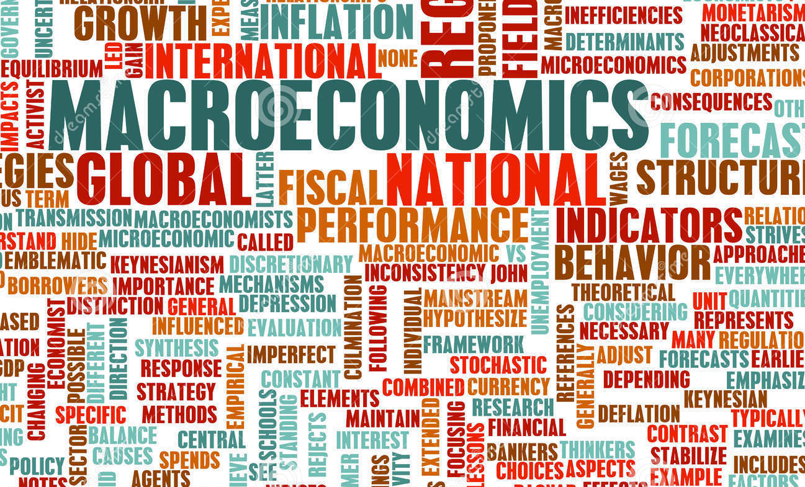
]

---

# Where You Are Now

.pull-left[
- .hi-purple[Basic concepts] of markets, individuals (consumers & firms), economies:
    - ECON 205: Principles of Macroeconomics
    - ECON 206: Principles of Microeconomics

- .hi-purple[Modelling] markets, individuals (consumers & firms), economies
    - ECON 306: Microeconomic Analysis
    - ECON 305: Macroeconomic Analysis<sup>1</sup>
]

.pull-right[
.center[

]
.footnote[<sup>1</sup> Required for ECON majors only. Calculus I is required.]

]

---

# Economists Speak a Foreign Language...

.pull-left[

- Terms you “know” from ordinary life mean .hi-purple[very different things] to economists:

> Cost, efficiency, welfare, competition, marginal, equilibrium, profit, public good, discrimination, elasticity

- Using these words’ “ordinary” meanings will lead to wrong economic conclusions!

- You will need to .hi-purple[“relearn”] the economic meanings of these words
]

.pull-right[

.center[

]
]

---

# ...But You Can Learn It

.pull-left[

- You’ll need to master a new vocabulary:

> externality, marginal rate of substitution, marginal cost, consumer surplus, allocative efficiency

- Avoid excessive jargon, but these concepts are useful to explain reality! 

]

.pull-right[

.center[

]
]

---

# ...But You Can Learn It

.pull-left[

- Everyone thinks they are *already* an economist and can speak this foreign language

- Be humble!

- Economics is *often* common sense, but reached via deep analytical thinking

]

.pull-right[

.center[

]
]

---

# Economics $\neq$ Business or $$$

.center[
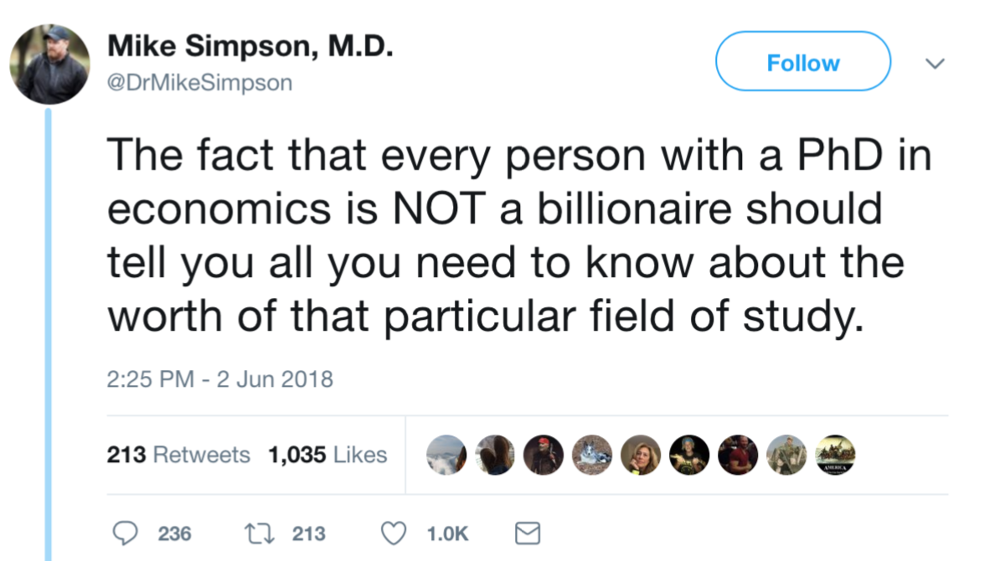
]

---

# Economics $\neq$ Business or $$$

.center[
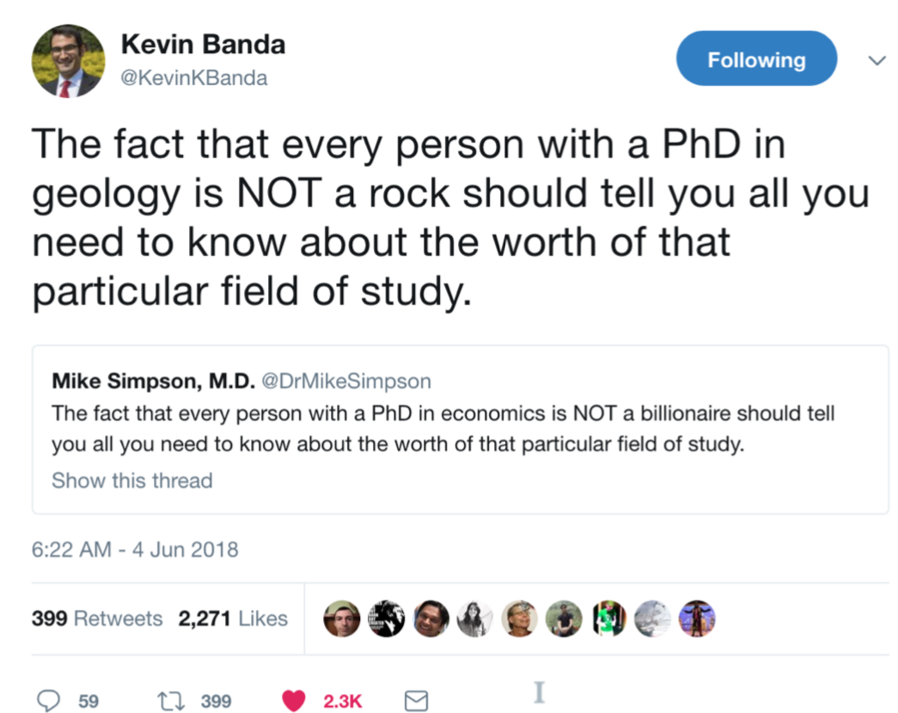
]

---

class: inverse, center, middle

# The Tools of Microeconomics

---

# Economics as a *Way of Thinking*

.pull-left[

- Economics is a .hi-purple[way of thinking] based on a few core ideas:
]

---

# Economics as a *Way of Thinking*

.pull-left[

- Economics is a .hi-purple[way of thinking] based on a few core ideas:

- .hi[People respond to incentives]
    - Money, punishment, taxes and subsidies, risk of injury, reputation, profits, sex, effort, morals

]

.pull-right[

.center[

]
]

---

# Economics as a *Way of Thinking*

.pull-left[

- Economics is a .hi-purple[way of thinking] based on a few core ideas:

- .hi[People respond to incentives]
    - Money, punishment, taxes and subsidies, risk of injury, reputation, profits, sex, effort, morals

- .hi[Environments adjust until they are in equilibrium]
    - People adjust their choices until optimal, given others’ actions
]

.pull-right[

.center[


]
]

---

class: inverse, center, middle

# Incentives

---

# Incentives Example: Subway I

.center[
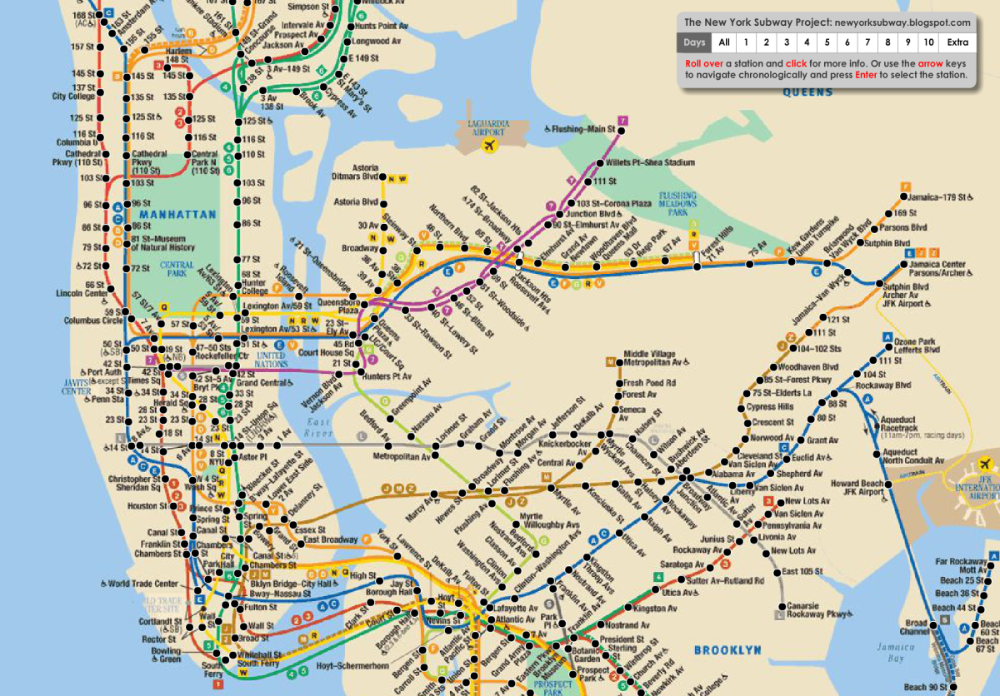

The NYC Subway bans dogs unless they can be [“enclosed in a container”](https://cityroom.blogs.nytimes.com/2009/09/30/answers-about-exploring-new-york-with-your-dog/?_r=0)
]

---

# Incentives Example: Subway II

.center[
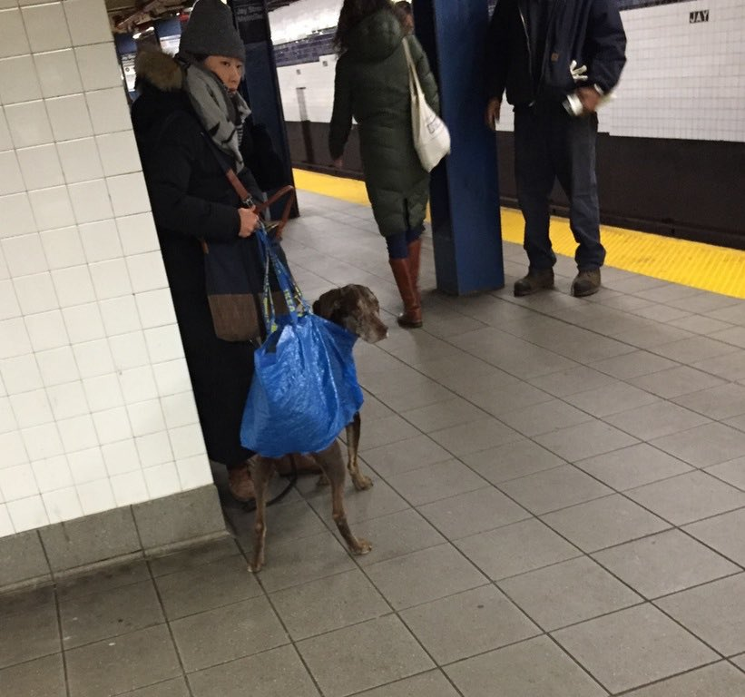 

Pictures [Source](https://www.rover.com/blog/nyc-subway-dogs-fs/)
]

---

# Incentives Example: Rat Bounty

.content-box-green[
Some governments pay bounties to reduce pest populations such as rats.

.green[**Example**]: Suppose the government were to pay $250 for every rat tail turned in. 
]

--

.center[
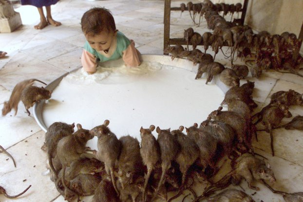
]

---

# Incentives: Even Dolphins Understand I

.center[
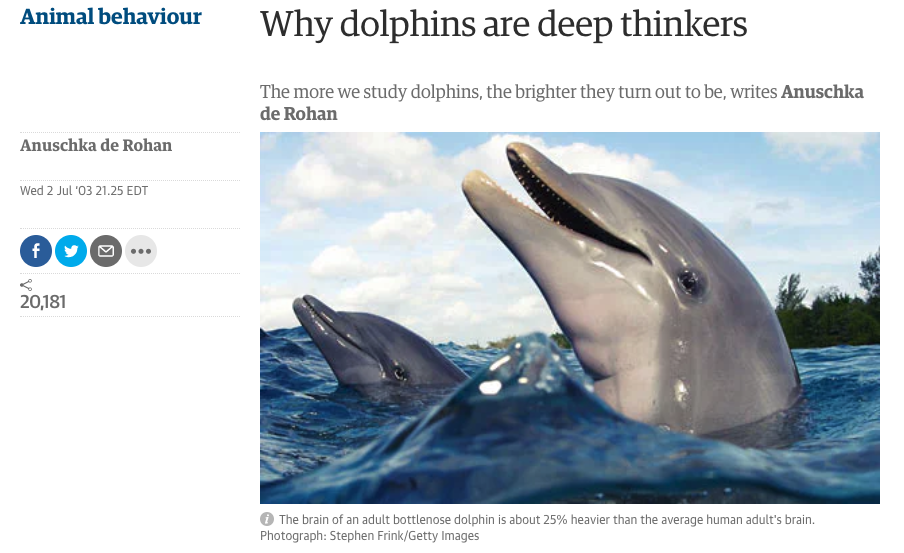
]

.source[July 2 2003, [“Why Dolphins are Deep Thinkers”](https://www.theguardian.com/science/2003/jul/03/research.science), *The Guardian*]

---

# Incentives: Even Dolphins Understand II

.center[
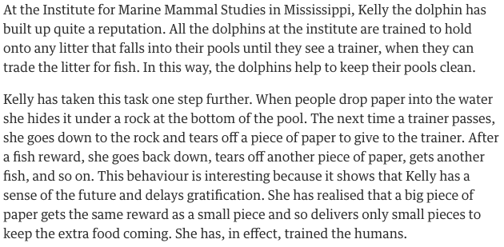
]

.source[July 2 2003, [“Why Dolphins are Deep Thinkers”](https://www.theguardian.com/science/2003/jul/03/research.science), *The Guardian*]

---

# Takeaways About Incentives I

.pull-left[

- People respond to (changes in) incentives

- People have goals they seek to attain

- Removing one alternative $\neq$ people *stop* persuing their goals

- People will seek (less preferred) alternative methods to attain goals

- .hi-purple[Unintended consequences]!

] 

.pull-right[

.center[
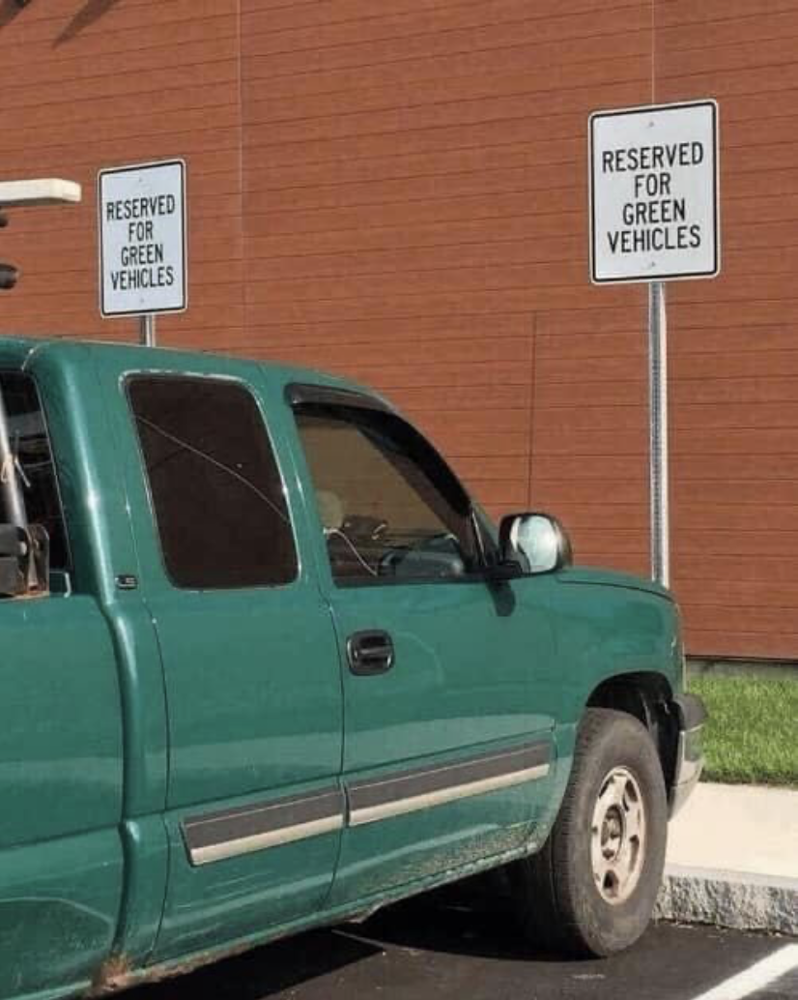
]
]

---

# Takeaways About Incentives II

.center[
<blockquote class="twitter-tweet"><p lang="en" dir="ltr">Whenever I am working on policy decisions I think of this image... 🚴
♂️ <a href="https://t.co/GE3yyDmjs0">pic.twitter.com/GE3yyDmjs0</a></p>&mdash; Councillor Peter Fortune (@PeterTFortune) <a href="https://twitter.com/PeterTFortune/status/1159176114230763520?ref_src=twsrc%5Etfw">August 7, 2019</a></blockquote> <script async src="https://platform.twitter.com/widgets.js" charset="utf-8"></script>
]

---

class: inverse, center, middle

# Equilibrium

---

# Equilibrium Example I

.pull-left[
.center[

]
]

.pull-right[

- Suppose 2 roads connect Frederick and Washington

- 100 cars commute

- Local road travel time: 30 min + 1 min/car

- Highway travel time: 1 hour (always)
]

---

# Equilibrium Example I

.pull-left[
.center[

]
]

.pull-right[

- Suppose 2 roads connect Frederick and Washington

- 100 cars commute

- Local road travel time: 30 min + 1 min/car

- Highway travel time: 1 hour (always)

- Assume people .hi[optimize]: choose road to **minimize travel time** between cities
]

---

# Equilibrium Example II

.pull-left[
.center[
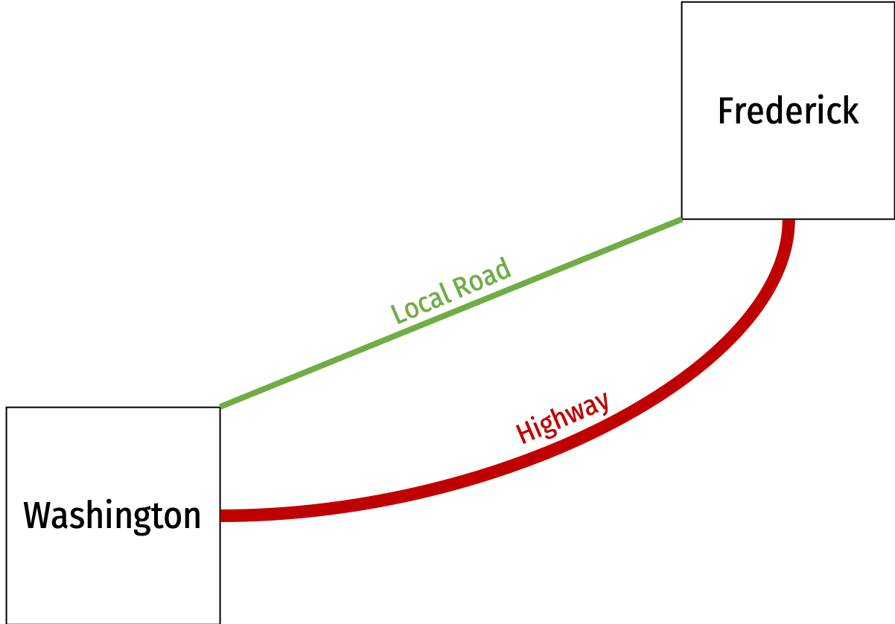
]
]

.pull-right[

- Suppose 2 roads connect Frederick and Washington

- 100 cars commute

- Local road travel time: 30 min + 1 min/car

- Highway travel time: 1 hour (always)

.content-box-green[
.green[**Scenario I**:] There are **less than 30 cars** on the local road
- What will people do?
]
]

---

# Equilibrium Example III

.pull-left[
.center[
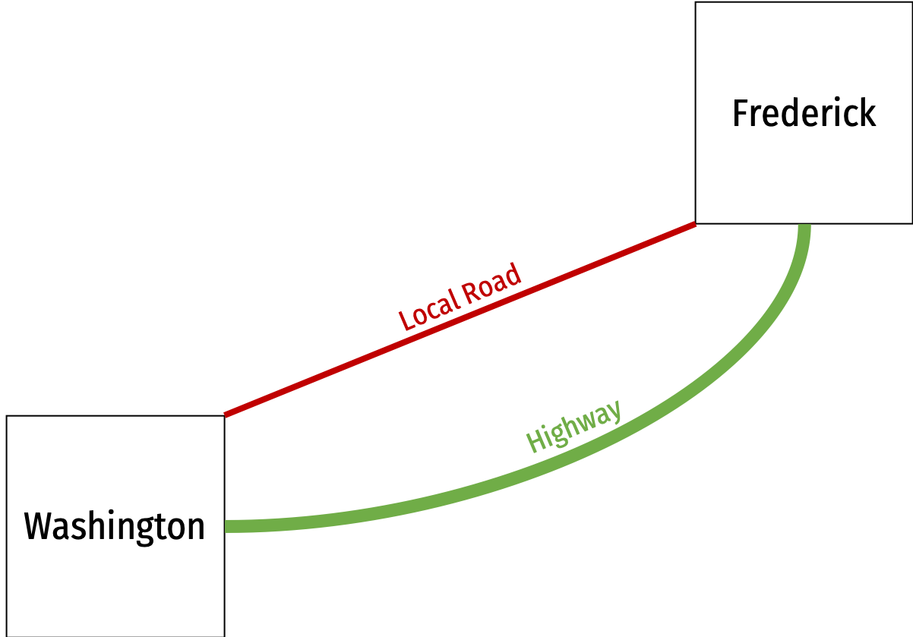
]
]

.pull-right[

- Suppose 2 roads connect Frederick and Washington

- 100 cars commute

- Local road travel time: 30 min + 1 min/car

- Highway travel time: 1 hour (always)

.content-box-green[
.green[**Scenario II**:] There are **more than 30 cars** on the local road
- What will people do?
]
]

---

# Equilibrium Example IV

.pull-left[
.center[
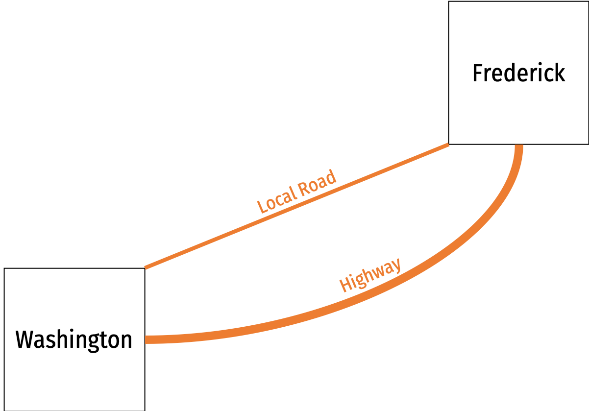
]
]

.pull-right[

- Suppose 2 roads connect Frederick and Washington

- 100 cars commute

- Local road travel time: 30 min + 1 min/car

- Highway travel time: 1 hour (always)

.content-box-green[
.green[**Equilibrium**:] How many cars are on each road?
- Why?
]
]

---

# Equilibrium Example V

.pull-left[
.center[

]
]

.pull-right[
.smaller[
- Suppose the State *doubles the capacity* of the local road

- Local road travel time: .hi-purple[30 min + 0.5 min/car]

- Highway travel time: 1 hour (always)
]
]

---

# Equilibrium Example V

.pull-left[
.center[

]
]

.pull-right[
.smaller[
- Suppose the State *doubles the capacity* of the local road

- Local road travel time: .hi-purple[30 min + 0.5 min/car]

- Highway travel time: 1 hour (always)

- Will this reduce travel time? 

- Yes! says the State:
    - 30 cars use the local road, takes 1 hour
    - With wider road it takes 45 min!
]
]

---

# Equilibrium Example V

.pull-left[
.center[

]
]

.pull-right[

.smaller[
- Suppose the State *doubles the capacity* of the local road

- Local road travel time: .hi-purple[30 min + 0.5 min/car]

- Highway travel time: 1 hour (always)

- Will this reduce travel time? 

- Yes! says the State:
    - 30 cars use the local road, takes 1 hour
    - With wider road it takes 45 min!

- .hi[Is this an equilibrium?]
]
]

---

# In the Long Run...(& Repeating the Same Mistake)

.center[
<blockquote class="twitter-tweet"><p lang="en" dir="ltr">1970: One more lane will fix it.<br>1980: One more lane will fix it.<br>1990: One more lane will fix it.<br>2000: One more lane will fix it.<br>2010: One more lane will fix it.<br>2020: ?<a href="https://t.co/NjS1IPORG2">pic.twitter.com/NjS1IPORG2</a><br>via <a href="https://twitter.com/avelezig?ref_src=twsrc%5Etfw">@avelezig</a></p>&mdash; Urban Planning &amp; Mobility 🚲🚶
♂️🚆 (@urbanthoughts11) <a href="https://twitter.com/urbanthoughts11/status/1191295205187686400?ref_src=twsrc%5Etfw">November 4, 2019</a></blockquote> <script async src="https://platform.twitter.com/widgets.js" charset="utf-8"></script> 
]

---

# Comparative Statics

- .hi[Comparative statics]: examining changes in equilibria cased by an external change (in incentives, constraints, etc.)

```{r, echo = F, message = F, warning = F, fig.align = "center", fig.width = 12, fig.asp = 0.618, fig.retina = 3}
library("ggrepel")

plot_eqs <- tibble(x = c(1, 3),
                 y = c(1, 1),
                 lab = c("Equilibrium 1", "Equilibrium 2"))

plot_shock <- tibble(x = c(2),
                 y = c(1),
                 lab = c("Change"))

ggplot(plot_eqs, aes(x = x,
                   y = y))+
  geom_point(data = plot_eqs, shape = 22, size = 40, fill = "limegreen")+ # shape for equilibria
  geom_point(data = plot_shock, shape = 23, size = 28, fill = "firebrick2")+ # shape for shock
  geom_text(data = plot_eqs, mapping = aes(label = lab), color = "white")+ # text for equilibria
  geom_text(data = plot_shock, mapping = aes(label = lab), color = "white")+ # text for shock
  scale_x_continuous(expand = c(0.125,0.125))+
  scale_y_continuous(breaks=c(0.99, 1.01), limits = c(0.99, 1.01), expand = c(0,0))+
  annotate("segment", x = 1.25, xend = 1.75, y = 1, yend = 1, colour = "#000000", size=0.5, linetype = 2, alpha=1, arrow=arrow(length=unit(0.25,"cm"), ends="last", type="closed"))+
  annotate("segment", x = 2.25, xend = 2.75, y = 1, yend = 1, colour = "#000000", size=0.5, linetype = 2, alpha=1, arrow=arrow(length=unit(0.25,"cm"), ends="last", type="closed"))+
  theme_void()
```

---

# Optimization and Equilibrium

.pull-left[
- If people can **learn** and **change** their behavior, they will always **switch** to a higher-valued option

- If there are no alternatives that are better, people are at an .hi[optimum]

- If everyone is at an optimum, the system is in .hi[equilibrium]
]

.pull-right[
.center[


]
]


---

# Economics Is Broader Than You Think

.center[
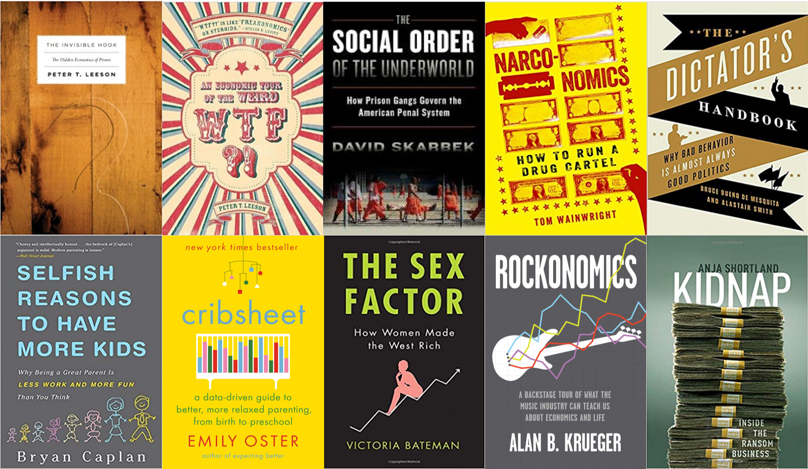
]

---

class: inverse, center, middle

# Real Talk: The Math

---

# Real Talk

.center[

]

---

# Real Talk

.center[

]

---

# Real Talk

.center[

]

---

# Real Talk

.pull-left[
.center[
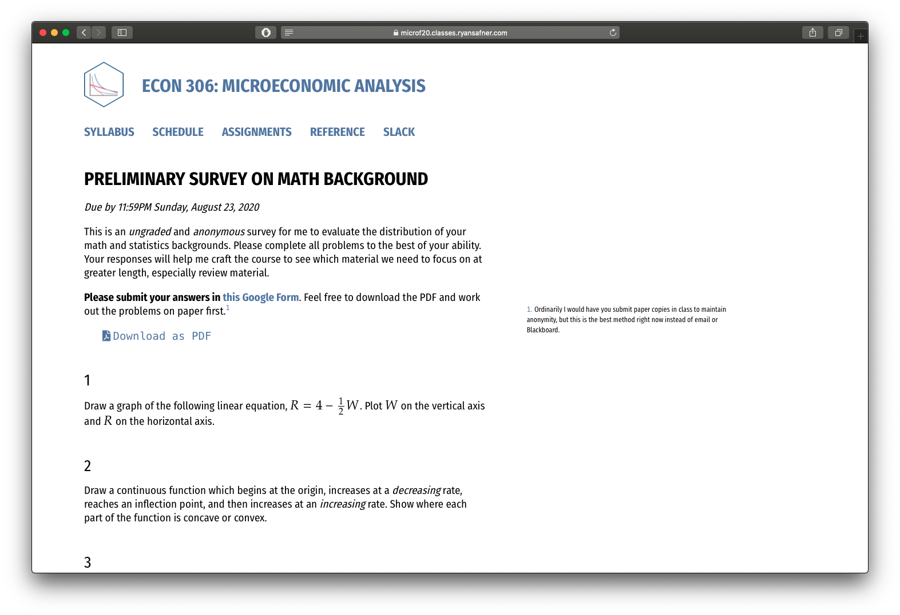
]
]

.pull-right[

- Complete the .hi-purple[preliminary math survey]

- Help me help you with the math!

]

---

# Why We Model I

.pull-left[

- Economists often “speak” in models that explain and predict human behavior

- The pure language of models is mathematics
    - things that are universally true, deducible from axioms, can easily spot errors
    - often equations and graphs
    - this is what scares students most about economics 

]

.pull-right[
.center[
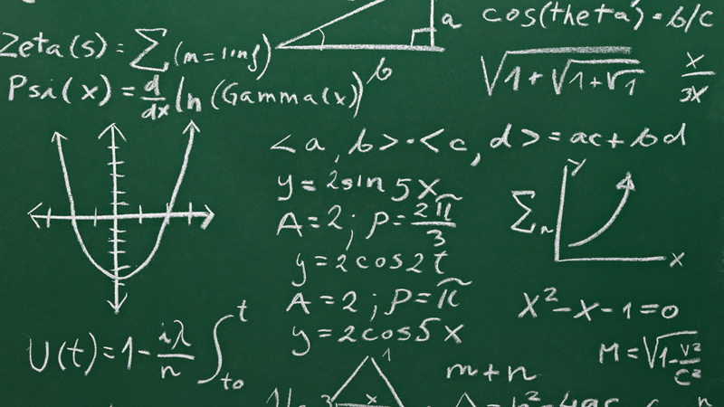
]
]

---

# Why We Model II

.pull-left[

- Economists use conceptual models: fictional constructions to logically examine consequences

- Very different from other sciences
    - No social experiments
    - Purposive, strategic human beings 
    - Introspective understanding

> “All models lie. The art is telling useful lies.” - George Box

]

.pull-right[
.center[

]
]

---

# The Two Major Models of Economics as a “Science”

.pull-left[

## Optimization

- Agents have .hi[objectives] they value

- Agents face .hi[constraints]

- Make .hi[tradeoffs] to maximize objectives within constraints

.center[

]
]

--

.pull-right[

## Equilibrium

- Agents .hi[compete] with others over **scarce** resources

- Agents .hi[adjust] behaviors based on prices

- .hi[Stable outcomes] when adjustments stop

.center[

]

]

---

# Remember: All Models are Wrong!

.pull-left[
.content-box-red[
.red[**Caution**:] Don't conflate models with reality!
]
- Models help us *understand* reality.

- A good economist is always aware of:
    - “*ceterus paribus*”
    - “...and then what?”
    - “...compared to what?”

]

.pull-right[
.center[

]
]

---

# Economics Uses, but Is Not Limited to, Math

```{r, fig.width=12}
red_pink <- "#e64173"
blue <- "#2b59c3"

venn_colors <- c(red_pink, blue)
venn_lines <- rep("solid", 10)
# Locations of circles
venn_df <- tibble(
  x  = c( 0.0,   2.0),
  y  = c( 0.0,   0.0),
  r  = c( 2.0,   2.0),
  l  = c( "Math \n Modeling", "Thinking Like \n an Economist"),
  xl = c( -1.0,    3.0),
  yl = c( 0.0,   0.0))
# Venn
ggplot(data = venn_df, aes(x0 = x, y0 = y, r = r, fill = l, color = l)) +
ggforce::geom_circle(aes(linetype = l), alpha = 0.3, size = 0.75) +
theme_void() +
theme(legend.position = "none") +
scale_fill_manual(values = venn_colors) +
scale_color_manual(values = venn_colors) +
scale_linetype_manual(values = venn_lines) +
  geom_text(aes(x = xl, y = yl, label = l), size = 8, family = "Fira Sans Condensed") +
coord_equal()
```

---

class: inverse, middle, center
# About This Course

---

# Logistics: Hybrid Course

.smaller[
- .hi[hybrid]: more .hi-purple[synchronous] material than .hi-turquoise[asynchronous] material

- I will always be teaching .hi[remotely]
  - A classroom is available to you
  - I may make occasional visits to campus if you *need* something in person (TBD)

- Office hours: Tu/Th 3:30-5:00 PM on Zoom
  - <i class="fas fa-video"></i> Zoom link in Blackboard's `LIVE CLASS SESSIONS` link
  - <i class="fab fa-slack"></i> Slack channels

- Teaching Assistant(s): TBD
  - grade HWs & hold (likely virtual) office hours
]

---

# Logistics: Hybrid Course

- We will have .hi-purple[synchronous] sessions Mon/Wed 2:00-3:15 PM on **<i class="fas fa-video"></i> Zoom**

- Lecture videos will be posted on **Blackboard** via Panopto for students unable to join synchronously
  - If you were present, you do not need to watch the video (again)!
  - You are not *required* to attend synchronously, but it will help you

- All graded assignments are .hi-turquoise[asynchronous]
  - (Probably) submitted on Blackboard by 11:59 PM Sundays
  - (Probably) timed exams on Blackboard

---

# Learning Goals

By the end of this course, you will: 

1. apply the models of microeconomics (constrained optimization and equilibrium) towards explaining real world behavior of individuals, firms, and governments

2. explore the effects of economic and political processes on market performance (competition, market prices, profits and losses, property rights, entrepreneurship, market power, market failures, public policy, government failures)

3. apply the economic way of thinking to real world issues in writing

---


# Assignments

```{r}
assignments <- tribble(
  ~"",  ~Assignment, ~Percent,
  "1"     , "Opinion-Editorial", "20%",
  "n"  , "Homeworks (Average)", "20%",
  "3"      , "Exams", "20% each",
)

knitr::kable(assignments, "html")
```

---

# Your “Textbook”

.center[
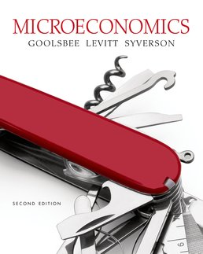
]

---

# Course Website

.pull-left[
.center[


]
]

.pull-right[
.center[
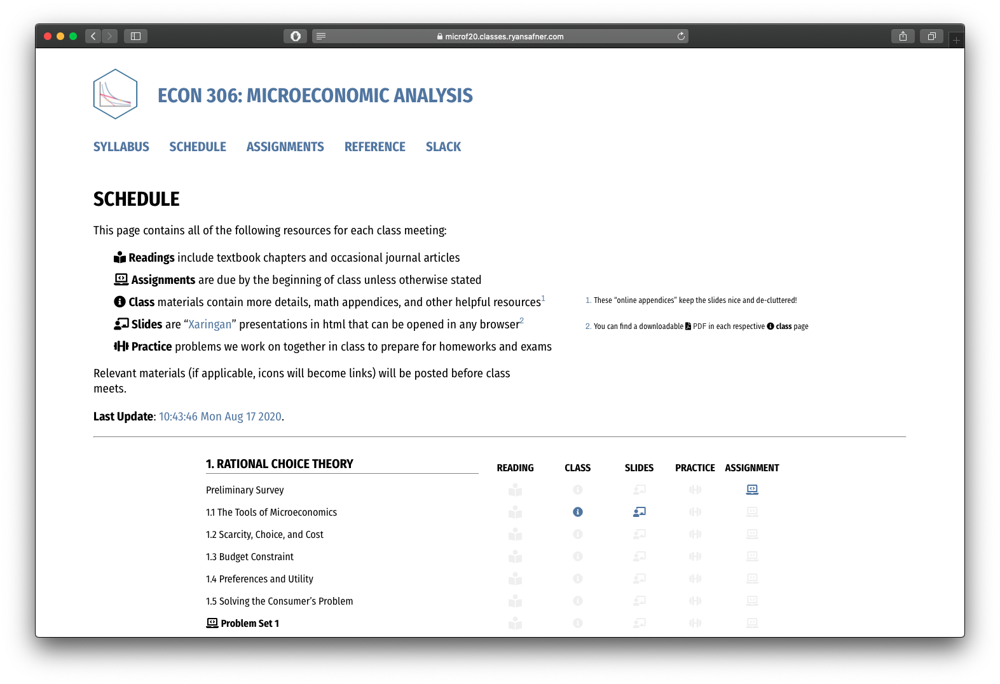
]
]

.center[
[microF20.classes.ryansafner.com](https://microF20.classes.ryansafner.com)
]

---

# Tips for Success, Or: How to College

.pull-left[
- Take notes. On paper. Really.

- Read the readings.

- Ask questions, come to office hours. Don’t struggle in silence, you are not alone!

- You are learning how to learn

- See the [reference page](http://microF20.classes.ryansafner.com/reference) for more
]

.pull-right[
.center[

]
]

---

# Roadmap for the Semester

.center[

]
