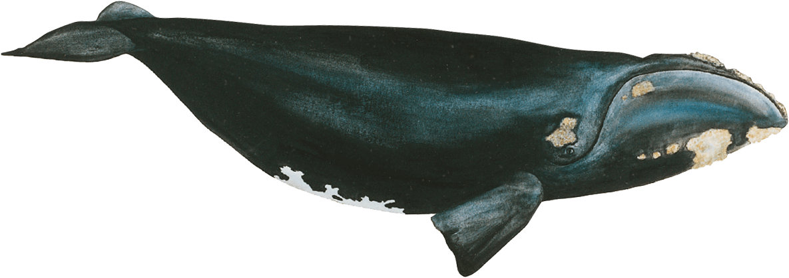
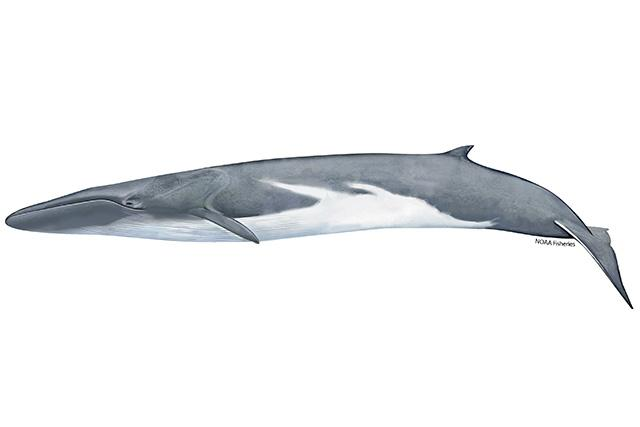
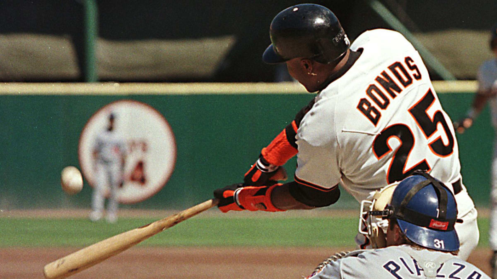
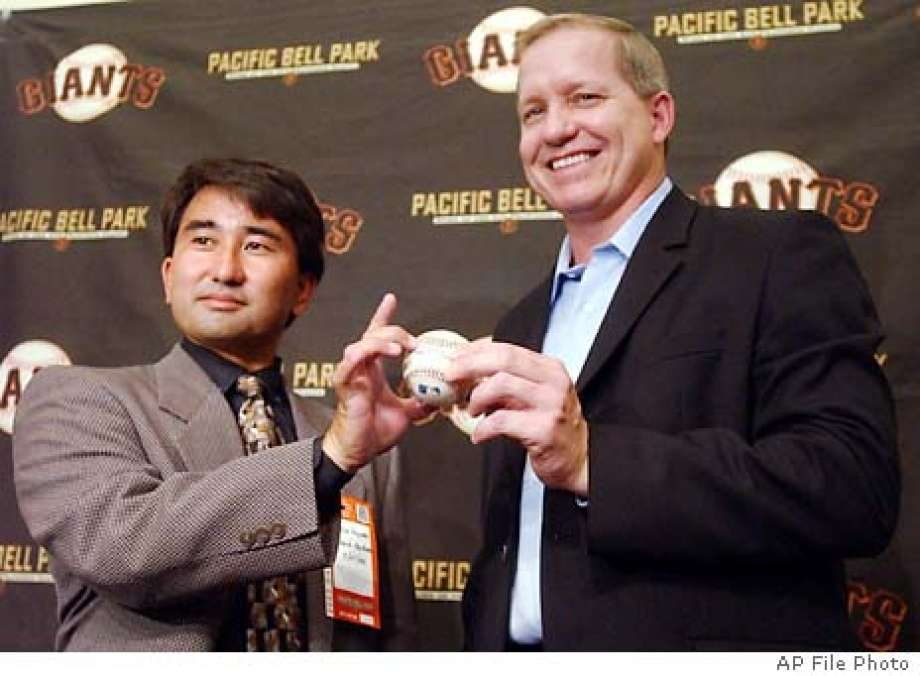
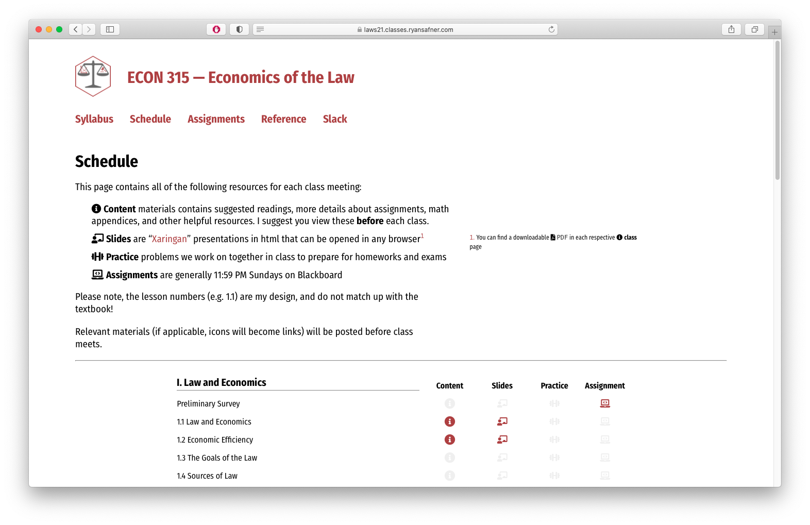

```{r setup, include=FALSE}
options(htmltools.dir.version = FALSE)
knitr::opts_chunk$set(echo=F,
                      message=F,
                      warning=F,
                      fig.retina=3,
                      fig.align = "center")
library("tidyverse")
library("fontawesome")
xaringanExtra::use_tile_view()
xaringanExtra::use_tachyons()

theme_slides <- theme_light() + 
  theme(
    text = element_text(family = "Fira Sans", size = 24)
  )
```


# About Me

.left-column[
.center[

]
]

.right-column[
.smallest[

- Ph.D (Economics) — George Mason University, 2015

- B.A. (Economics) — University of Connecticut, 2011

- Specializations:
  - Law and Economics
  - Austrian Economics

- Research interests
  - modeling innovation & economic growth
  - political economy & economic history of intellectual property

- Expecting a son in March 2021 👶 (expect cameos!)
]
]


---

# What Is This Class About?

.pull-left[
- This is not a class “about” the law (or a law class)

- I am not a lawyer...though I am happily married to one

- This is a class about how to *think* about the law, using economics

]

.pull-right[
.center[

]
]

---

# What's Economics Got to Do With Law?

.pull-left[
.bg-washed-green.b--dark-green.ba.bw2.br3.shadow-5.ph4.mt5[
.hi-green[Example 1]: Why have locks on doors?
]
]

.pull-right[
.center[

]
]

---

# What's Economics Got to Do With Law?

.pull-left[
.bg-washed-green.b--dark-green.ba.bw2.br3.shadow-5.ph4.mt5[
.hi-green[Example 2]: Police have evidence sufficient to convict a criminal
  - Suppose the conviction costs the criminal $50,000
  - The conviction benefits the police officer's career by $10,000
]
]

.pull-right[
.center[

]
]

---

# What's Economics Got to Do With Law?

.pull-left[
.bg-washed-green.b--dark-green.ba.bw2.br3.shadow-5.ph4.mt5[
.hi-green[Example 3]: Civil asset forfeiture
]
]

.pull-right[
.center[

]
]

---

# What's Economics Got to Do With Law?

.pull-left[
.bg-washed-green.b--dark-green.ba.bw2.br3.shadow-5.ph4.mt5[
.hi-green[Example 4]: Life imprisonment for petty theft
]
]

.pull-right[
.center[

]
]

---

# What's Economics Got to Do With Law?

.left-column[
.center[


.smallest[
David D. Friedman

(1945—)
]
]
]

.right-column[
.smallest[
> “You live in a state where the most severe criminal punishment is life imprisonment. Someone proposes that since armed robbery is a very serious crime, armed robbers should get a life sentence. A constitutional lawyer asks whether that is consistent with the prohibition on cruel and unusual punishment. A legal philosopher asks whether it is just.”

> “An economist points out that if the punishments for armed robbery and for armed robbery plus murder are the same, the additional punishment for the murder is zero—and asks whether you really want to make it in the interest of robbers to murder their victims.” (p.8)

]
.source[Friedman, David D, 2000, *Law's Order: What Economics Has to do with Law and Why it Matters*]
]

---

# Economic Analysis of Law

.left-column[
.center[


.smallest[
Oliver Wendell Holmes, Jr.

1841—1935

Associate Justice of U.S. Supreme Court
]]
]

.right-column[

> “If you want to know the law and nothing else, you must look at it as a bad man, who cares only for the material consequences which such knowledge enables him to predict.”

]

.source[Holmes, Oliver Wendell, Jr., 1897, “The Path of the Law,” *10 Harvard Law Review* 457:12-16]

---

# Economic Analysis of Law

.left-column[
.center[


.smallest[
Oliver Wendell Holmes, Jr.

1841—1935

Associate Justice of U.S. Supreme Court
]]
]

.right-column[

> “For the rational study of the law the blackletter man may be the man of the present, but the man of the future is the man of statistics and the master of economics...As a step toward that ideal it seems to me that every lawyer ought to seek an understanding of economics...We learn that for everything we have we give up something else, and we are taught to set the advantage we gain against the other advantage we lose, and to know what we are doing when we elect.”

]

.source[Holmes, Oliver Wendell, Jr., 1897, “The Path of the Law,” *10 Harvard Law Review* 457:12-16]

---

# Economic Analysis of Law

.pull-left[

- Economics focuses on rationality
  - Choices made rationally
  - Consequences of law internalized into future choices

- Most of us are not Holmes’ figurative “bad man”
  - What's stopping us from committing various crimes on the margin is *not* the prison sentence
  - Yet you still engage in risky activities (driving a car) that place others in danger and subject you to tort liability
]

.pull-right[

]

---

# Thinking Like a Lawyer vs. Thinking Like an Economist

.pull-left[
- Suppose something has happened

- Lawyer: damage is *already* done, how to clean up the mess:
  - assign blame
  - maybe punish someone
  - maybe compensate

- Interesting/important only to the parties involved
]

.pull-right[
.center[

]
]

---

# Thinking Like a Lawyer vs. Thinking Like an Economist

.pull-left[

- What is interesting to economists:

- .hi-turquoise[Before] the incident, lots of .hi-turquoise[decisions] were made, e.g.
  - how much to invest in precaution (how fast to drive, wearing a helmet while biking, etc)
  - reaching a contractual agreement
  - transforming my property (planting trees that block my neighbor's view)
  - relying on my supplier to deliver on time

- These were made based on .hi-turquoise[expectations] about what will happen

- These decisions affect the .hi-turquoise[outcomes] and .hi-purple[how much value is created and destroyed by society]

]

.pull-right[
.center[

]
]

---

# Thinking Like a Lawyer vs. Thinking Like an Economist

.pull-left[

- More importantly, .hi[how do laws and court decisions affect *future* behavior on the margin?]
  - switch the U.S. from a "first to discover" to a "first to file" patent system
  - change mandatory minimum sentences for drug-related crimes

- Economists are more *forward*-looking about law
]

.pull-right[
.center[

]
]

---

# Of Course It's Not the Whole Story

.pull-left[

- Laws themselves have to come from somewhere
  - Constitution, legislation, regulation, common law, custom

- .hi[Political economy] of how laws are determined
  - Legislators, judges, police, voters are all agents that have their own objectives and respond to incentives
  - We might cover a bit in this course, but better left to other courses
]

.pull-right[
.center[

]
]

---


# Three Projects in Law & Economics

.pull-left[

1. Predicting consequences of law
  - least controversial

2. Predicting what law will be
  - an empirical conjecture: law *is* efficient

3. Recommending what law should be
  - a normative project: law *should* be efficient

- You could still believe:
  - law is efficient, but should not be
  - law is not efficient, but should be
]

.pull-right[

]

---

# Outline and Areas of Law

.pull-left[

1. Property Law
  - how do we establish who is entitled to what?
2. Contract Law
  - how do individuals permit use or exchange of entitlements?
3. Tort Law
  - how do we remedy violations of persons or entitlements?
4. Criminal Law
  - how does *the State* remedy *egregious* harms to *society*?

- You will see the same economic analysis showing up...if you understand one area of law, you can easily understand the others! 
]

.pull-right[
.center[

]
]

---

class: inverse, center, middle

# Example: 19th Century Whaling

---

# The Law & Economics of 19th Century Whaling

.pull-left[

- A burning legal question: **who owns a dead whale**?

- 18<sup>th</sup>—19<sup>th</sup> Century: whales hunted for oil, blubber, bone, other valuable products

- A whale could be worth 3-4 times the median family income

]

.pull-right[
```{r,out.width = "100%", fig.cap = ""}
knitr::include_graphics("../images/whaling19thc.jpg")
```
]

---

# The Law & Economics of 19th Century Whaling

.left-column[

```{r,out.width = "80%", fig.cap = ""}
knitr::include_graphics("../images/mobydick.jpg")
```
]

.right-column[
.quitesmall[
> “It frequently happens that when several ships are cruising in company, a whale may be struck by one vessel, then escape, and be finally killed and captured by another vessel...

> [Or] after a weary and perilous chase and capture of a whale, the body may get loose from the ship by reason of a violent storm;	

> and drifting far away to leeward, be retaken by a second whaler, who, in a calm, snugly tows it alongside, without risk of life or line.

> Thus the most vexatious and violent disputes would often arise between the fishermen...”

]
]

---

# The Law & Economics of 19th Century Whaling

.left-column[

```{r,out.width = "80%", fig.cap = "Robert C. Ellickson"}
knitr::include_graphics("../images/ellickson.jpg")
```
]

.right-column[

- Looks at 12 U.S. & U.K. cases where ownership of a dead whale was contested

- Whaling industry had established norms in each case
  - Very different case by case, but well-suited to each situation

- In every case, court ruled in accordance with the established norms

]

.source[Ellickson, Robert C, 1989, “A Hypothesis of Wealth-Maximizing Norms: Evidence from the Whaling Industry,” *Journal of Law, Economics, & Organization* 5(1): 83-97]

---

# The Law & Economics of 19th Century Whaling

.pull-left[

.smaller[
- One norm: .hi[“fast fish/loose fish”]
  - Discussed in *Moby Dick*

- British whalers in Greenland hunting *right whales* with harpoons roped to whaling boat

- .hi[“Fast fish”]: a harpooned whale attached to boat
  - belonged to attached boat

- .hi[“loose fish”]: whale that broke free, or had not been harpooned
  - other ships free to pursue it

]

]

.pull-right[
```{r,out.width = "100%", fig.cap = "Right whale"}

```
]

.source[Ellickson, Robert C, 1989, “A Hypothesis of Wealth-Maximizing Norms: Evidence from the Whaling Industry,” *Journal of Law, Economics, & Organization* 5(1): 83-97]

---

# The Law & Economics of 19th Century Whaling

.pull-left[

- *Sperm whales* swim faster, deeper, and fight harder, and travel in packs
  - hunt with “drogues” to tire out whale
  - most important to kill or wound as many whales as possible quickly rather than secure one at a time

- Another norm: .hi[“iron holds the whale”]
  - first to harpoon the whale owns it, so long as your are in “fresh pursuit”

]

.pull-right[
```{r,out.width = "100%", fig.cap = "A pack of sperm whales"}

```
]

.source[Ellickson, Robert C, 1989, “A Hypothesis of Wealth-Maximizing Norms: Evidence from the Whaling Industry,” *Journal of Law, Economics, & Organization* 5(1): 83-97]

---

# The Law & Economics of 19th Century Whaling

.pull-left[

- A tradeoff between simpler rules vs. better incentives:

- “Fast fish/loose fish” is simpler/clearer
  - fewer disputes
  - but doesn't work for sperm whales!

- “Iron holds the whale” is more complication & ambiguous
  - but better incentives for sperm whaling
]

.pull-right[
```{r,out.width = "100%", fig.cap = ""}
knitr::include_graphics("../images/whaling19thc.jpg")
```
]

.source[Ellickson, Robert C, 1989, “A Hypothesis of Wealth-Maximizing Norms: Evidence from the Whaling Industry,” *Journal of Law, Economics, & Organization* 5(1): 83-97]

---

# The Law & Economics of 19th Century Whaling

.pull-left[

- Finback whales — extremely fast swimmers

- Hunted with “bomb lances”
  - dead whales sink, wash up on shore a few days later

- Norm emerged that original killer & the finder would *split* the whale
  - *Ghen v Rich* (1881)

]

.pull-right[
```{r,out.width = "100%", fig.cap = "Finback whale"}

```
]

.source[Ellickson, Robert C, 1989, “A Hypothesis of Wealth-Maximizing Norms: Evidence from the Whaling Industry,” *Journal of Law, Economics, & Organization* 5(1): 83-97]


---

# The Law & Economics of 19th Century Whaling

.left-column[

```{r,out.width = "80%", fig.cap = "Robert C. Ellickson"}
knitr::include_graphics("../images/ellickson.jpg")
```
]

.right-column[

.smallest[
- In each situation, norms emerged which were well-suited to the environment

> “[W]hen people are situated in a close-knit group, they will tend to develop for the ordinary run of problems norms that are wealth-maximizing.”

> “A norm is wealth-maximizing when it operates to minimize the members' objective sum of (1) transaction costs, and (2) deadweight losses arising from failures to exploit potential gains from trade,” (p.84).

]

]

.source[Ellickson, Robert C, 1989, “A Hypothesis of Wealth-Maximizing Norms: Evidence from the Whaling Industry,” *Journal of Law, Economics, & Organization* 5(1): 83-97]

---

# The Law & Economics of 19th Century Whaling

.left-column[

```{r,out.width = "80%", fig.cap = "Robert C. Ellickson"}
knitr::include_graphics("../images/ellickson.jpg")
```
]

.right-column[

.smallest[
- Best explains the variation in whaling norms

- More interestingly, in all whaling dispute cases Ellickson cites, the judge ruled in accordance with the local custom

> “Anglo-American whaling norms seem to have emerged spontaneously, not from decrees handed down by either organizational or governmental authorities. .hi[In fact, whalers’ norms not only did not mimic law; they *created* law.] In the dozen reported Anglo-American cases in which ownership of a whale carcass was contested, judges invariably held proven whalers’ usages to be reasonable and deferred to those rules,” (p.85).

]

]

.source[Ellickson, Robert C, 1989, “A Hypothesis of Wealth-Maximizing Norms: Evidence from the Whaling Industry,” *Journal of Law, Economics, & Organization* 5(1): 83-97]

---

# A More Modern Dispute

.center[

<iframe width="980" height="550" src="https://www.youtube.com/embed/af4dRPV_dUc" frameborder="0" allow="accelerometer; autoplay; clipboard-write; encrypted-media; gyroscope; picture-in-picture" allowfullscreen></iframe>

]

---

# A More Modern Dispute

.pull-left[

- Barry Bonds (record 73<sup>rd</sup>) home run ball in 2001

- Alex Popov had the ball in his glove first, lost it in fight

- Patrick Hayashi ended up with the ball

- Popov sued Hayashi

.source[*Popov v. Hayashi* (WL 31833731 Ca. Sup. Ct. 2002)]
]

.pull-right[
```{r,out.width = "100%"}

```

]

---

# A More Modern Dispute

.left-column[
```{r,out.width = "100%"}
knitr::include_graphics("../images/court1.jpg")
```

]

.right-column[
.quitesmall[
>	“Simply put, the Court should adopt a rule of first possession for baseballs that .hi[recognizes the longstanding customs and practices of baseball fans] who for more than seventy years have competed to catch and gain title to baseballs that leave the field of play…

> “With these principles in mind, the Court should define the law of first possession of baseballs...by answering two questions:

> “First, .hi[what is the custom, practice, and understanding of baseball fans] about first possession and title to baseballs that enter the stands?

> “Second, should the rules as practiced in the stands be modified to .hi[minimize the risk of violence, misconduct, and tortious behavior]?”

]
.source[Gray, Brian E, 2002, “Report and Recommendation on the Law of Capture and First Possession: Popov v. Hayashi"]
]

---

# A More Modern Dispute

.pull-left[

- In the end, court found no lawful grounds to deprive either of the ball

- Equitable division: ball was sold for $450,000 and Popov & Hayashi split the proceeds 50-50

- If any of the facts of the case were slightly different, very clear ownership to one party

.source[*Popov v. Hayashi* (WL 31833731 Ca. Sup. Ct. 2002)]
]

.pull-right[
```{r,out.width = "80%", fig.cap = "Hayashi and Popov"}

```

]

---

class: inverse, middle, center
# About This Course

---

# Logistics: Hybrid Course

.smaller[
- .hi[Hybrid]: more .hi-purple[synchronous] material than .hi-turquoise[asynchronous] material

- I will always be teaching .hi[remotely]
  - A physical classroom is available to you
  - I may make *occasional* visits to campus

- Office hours: Tu/Th 3:30-5:00 PM on Zoom
  - `r fa("video", fill ="#5E81AC")` Zoom link in Blackboard's `LIVE CLASS SESSIONS` link
  - `r fa("slack", fill ="#5E81AC")` Slack channels
]

---

# Logistics: Hybrid Course

- We will have .hi-purple[synchronous] sessions Tues/Thus 11:30AM—2:00 PM on `r fa("video", fill ="#5E81AC")` Zoom

- Lecture videos will be posted on **Blackboard** via Panopto for students unable to join synchronously
  - If you were present, you do not need to watch the video (again)!
  - You are not *required* to attend synchronously, but it will help you

- All graded assignments are .hi-turquoise[asynchronous]
  - Homework submitted on Blackboard by 11:59 PM Sundays

---

# Learning Goals

By the end of this course, you will: 

1. Predict the consequences of various laws, institutions, and customs
2. Predict what law will emerge under given conditions
3. Determine whether law *is* economically efficient, and discuss whether the law *should* be economically efficient
4. Derive the economic functions of key concepts, legal maxims, and rules in the substantive areas of law: torts, property, contracts, and criminal law
5. Identify the sources of law in the United States
6. Identify the key legal institutions of the United States

---

# Assignments

```{r}
assignments <- tribble(
  ~"",  ~Assignment, ~Percent,
  "1", "Midterm", "25%",
  "1", "Final", "25%",
  "n", "Homework (Average)", "20%",
  "1", "Term Paper", "20%",
  "n", "Participation/Discussion Boards", "10%"
)

knitr::kable(assignments, "html")
```

---

# Your Textbook

```{r,out.width = "30%"}
knitr::include_graphics("../images/cooter_ulen.jpg")
```

.center[
Free online as a `r fontawesome::fa("file-pdf")` [PDF](https://lawcat.berkeley.edu/record/1127400?ln=en)
]

---

# Course Website

.pull-left[
.center[


]
]

.pull-right[
.center[

]
]

.center[
[lawS21.classes.ryansafner.com](https://laws21.classes.ryansafner.com)
]

---

# Tips for Success, Or: How to College

.pull-left[
- Take notes. On paper. Really.

- Read the readings.

- Ask questions, come to office hours. Don’t struggle in silence, you are not alone!

- You are learning how to learn

- See the [reference page](http://microF20.classes.ryansafner.com/reference) for more
]

.pull-right[
.center[

]
]

---

# Roadmap for the Semester

.center[

]
