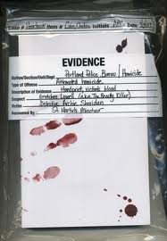
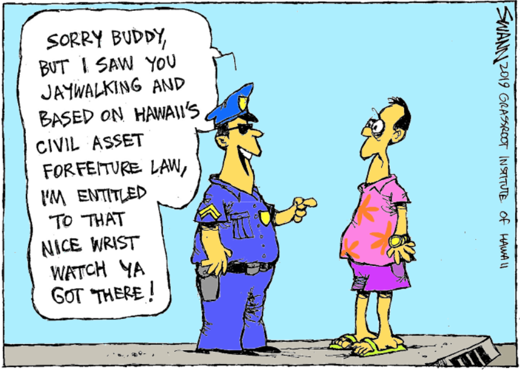
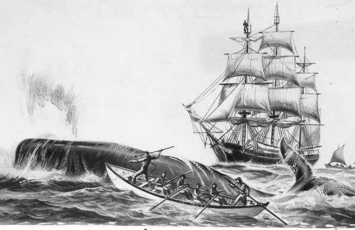
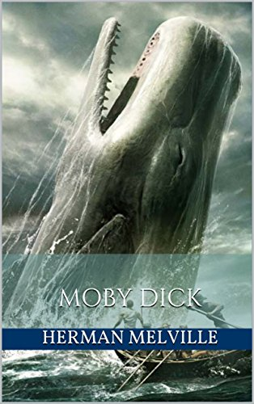
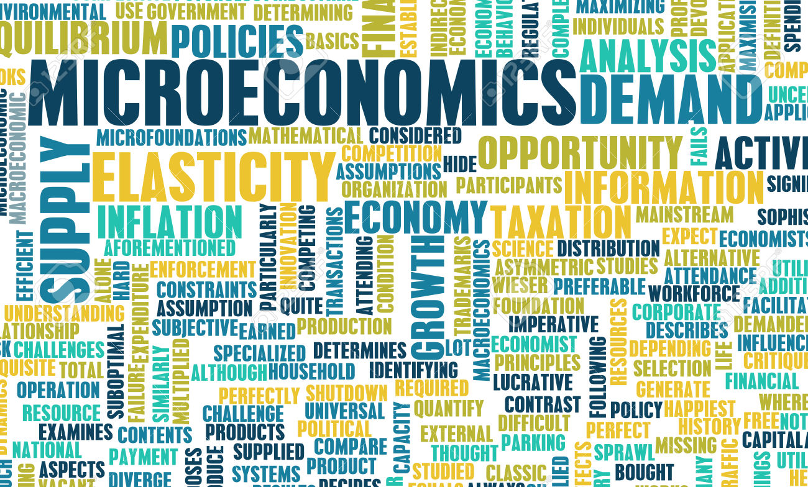
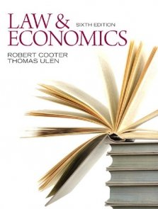
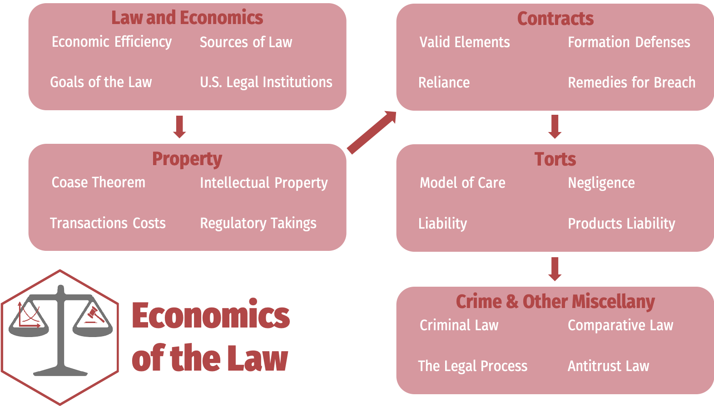

```{r setup, include=FALSE}
options(htmltools.dir.version = FALSE)
knitr::opts_chunk$set(echo=F,
                      message=F,
                      warning=F,
                      fig.retina=3,
                      fig.align = "center")
library("tidyverse")
xaringanExtra::use_tile_view()
xaringanExtra::use_tachyons()

theme_slides <- theme_light() + 
  theme(
    text = element_text(family = "Fira Sans", size = 24)
  )
```


# About Me

.left-column[
.center[

]
]

.right-column[
.smallest[

- Ph.D (Economics) — George Mason University, 2015

- B.A. (Economics) — University of Connecticut, 2011

- Specializations:
  - Law and Economics
  - Austrian Economics

- Research interests
  - modeling innovation & economic growth
  - political economy & economic history of intellectual property

- Expecting a son in March 2021 👶 (expect cameos!)
]
]


---

# What Is This Class About?

.pull-left[

- This is not a class “about” the law (or a law class)

- I am not a lawyer...though I am happily married to one

- This is a class about how to *think* about the law, using economics
  - Economics is a set of tools, not a bunch of facts or topics

- Using microeconomic tools to analyze laws and legal systems:
  - the incentives they create
  - the choices and outcomes they lead to

sag

.tr[sag1
]

]

---

# What's Economics Got to Do With Law?

.pull-left[
.content-box-green[
.hi-green[Example 1]: Why have locks on doors?
]
]

.pull-right[
.center[

]
]

---

# What's Economics Got to Do With Law?

.pull-left[
.content-box-green[
.hi-green[Example 2]: Police have evidence sufficient to convict a criminal
  - Suppose the conviction costs the criminal $50,000
  - The conviction benefits the police officer's career by $10,000
]
]

.pull-right[
.center[

]
]

---

# What's Economics Got to Do With Law?

.pull-left[
.content-box-green[
.hi-green[Example 3]: Civil asset forfeiture
]
]

.pull-right[
.center[

]
]

---

# What's Economics Got to Do With Law?

.pull-left[
.content-box-green[
.hi-green[Example 4]: Life imprisonment for petty theft
]
]

.pull-right[
.center[

]
]

---

# What's Economics Got to Do With Law?

.left-column[
.center[


.smallest[
David D. Friedman

(1945—)
]
]
]

.right-column[
.smallest[
> “You live in a state where the most severe criminal punishment is life imprisonment. Someone proposes that since armed robbery is a very serious crime, armed robbers should get a life sentence. A constitutional lawyer asks whether that is consistent with the prohibition on cruel and unusual punishment. A legal philosopher asks whether it is just.”

> “An economist points out that if the punishments for armed robbery and for armed robbery plus murder are the same, the additional punishment for the murder is zero—and asks whether you really want to make it in the interest of robbers to murder their victims.” (p.8)

]
.source[Friedman, David D, 2000, *Law's Order: What Economics Has to do with Law and Why it Matters*]
]

---

# Thinking Like a Lawyer vs. Thinking Like an Economist

- Suppose something has happened

- Lawyer — damage is *already* done, what to do:
  - assign blame
  - maybe punish someone
  - maybe compensate

- Not interesting to economists!

---

# Thinking Like a Lawyer vs. Thinking Like an Economist

- **Before** the incident, lots of **decisions** were made

- These were made based on **expectations** about what will happen

- These decisions affect the **outcomes** and **how much value is created and destroyed** by society

---

# The Law & Economics of 19th Century Whaling

.pull-left[

- A burning legal question: **who owns a dead whale**?

- 18<sup>th</sup>—19<sup>th</sup> Century: whales hunted for oil, blubber, bone, other valuable products

- A whale could be worth 3-4 times the median family income

]

.pull-right[
```{r,out.width = "100%", fig.cap = ""}

```
]

---

# The Law & Economics of 19th Century Whaling

.left-column[

```{r,out.width = "80%", fig.cap = ""}

```
]

.right-column[

> “It frequently happens that when several ships are cruising in company, a whale may be struck by one vessel, then escape, and be finally killed and captured by another vessel...

> [Or] after a weary and perilous chase and capture of a whale, the body may get loose from the ship by reason of a violent storm;	

> and drifting far away to leeward, be retaken by a second whaler, who, in a calm, snugly tows it alongside, without risk of life or line.

> Thus the most vexatious and violent disputes would often arise between the fishermen...”

]

---

# The Law & Economics of 19th Century Whaling

.left-column[

```{r,out.width = "80%", fig.cap = "Robert C. Ellickson"}
knitr::include_graphics("../images/ellickson.jpg")
```
]

.right-column[

- Looks at 12 U.S. & U.K. cases where ownership of a dead whale was contested

- Whaling industry had established norms in each case
  - Very different case by case, but well-suited to each situation

- In every case, court ruled in accordance with the established norms

.source[Ellickson, Robert C, 1989, “A Hypothesis of Wealth-Maximizing Norms: Evidence from the Whaling Industry,” *Journal of Law, Economics, & Organization* 5(1): 83-97]
]

---

# The Law & Economics of 19th Century Whaling

.left-column[

```{r,out.width = "80%", fig.cap = "Robert C. Ellickson"}
knitr::include_graphics("../images/ellickson.jpg")
```
]

.right-column[

- One norm: “fast fish/loose fish”
  - Discussed in *Moby Dick*

- British whalers in Greenland hunting *right whales* with harpoons roped to whaling boat

- “Fast fish”: a harpooned whale attached to boat
  - belonged to attached boat

- “loose fish”: whale that broke free, or had not been harpooned
  - other ships free to pursue it

.source[Ellickson, Robert C, 1989, “A Hypothesis of Wealth-Maximizing Norms: Evidence from the Whaling Industry,” *Journal of Law, Economics, & Organization* 5(1): 83-97]
]

---

# The Law & Economics of 19th Century Whaling

.left-column[

```{r,out.width = "80%", fig.cap = "Robert C. Ellickson"}
knitr::include_graphics("../images/ellickson.jpg")
```
]

.right-column[

- *Sperm whales* swim faster, deeper, and fight harder, and travel in packs
  - hunt with “drogues” to tire out whale
  - most important to kill or wound as many whales as possible quickly rather than secure one at a time

- Another norm: “iron holds the whale”
  - first to harpoon the whale owns it, so long as your are in “fresh pursuit”

.source[Ellickson, Robert C, 1989, “A Hypothesis of Wealth-Maximizing Norms: Evidence from the Whaling Industry,” *Journal of Law, Economics, & Organization* 5(1): 83-97]
]

---

# The Law & Economics of 19th Century Whaling

.left-column[

```{r,out.width = "80%", fig.cap = "Robert C. Ellickson"}
knitr::include_graphics("../images/ellickson.jpg")
```
]

.right-column[

- A tradeoff between these rules

- “Iron holds the whale” is more complication & ambiguous

- “Fast fish/loose fish” is simpler

.source[Ellickson, Robert C, 1989, “A Hypothesis of Wealth-Maximizing Norms: Evidence from the Whaling Industry,” *Journal of Law, Economics, & Organization* 5(1): 83-97]
]

---
# Outline and Areas of Law

.pull-left[

1. Property Law
  - how do we establish who is entitled to what?
2. Contract Law
  - how do individuals permit use or exchange of entitlements?
3. Tort Law
  - how do we remedy violations of persons or entitlements?
4. Criminal Law
  - how does *the State* remedy *egregious* harms to *society*?

]

.pull-right[

]

---


# Transaction costs

- Costs of bargaining and reaching consensus

- Industrial org
- Law & Econ

# Types of Laws


|     | Punishment by State | Civil remedies |
|-----|---------------------|----------------|
| Imposed rules | Criminal law | Torts |
| Consent to rules | -- | Contract |

---

.center[

]

---

class: inverse, middle, center
# About This Course

---

# Logistics: Hybrid Course

.smaller[
- .hi[hybrid]: more .hi-purple[synchronous] material than .hi-turquoise[asynchronous] material

- I will always be teaching .hi[remotely]
  - A physical classroom is available to you
  - I may make *occasional* visits to campus

- Office hours: Tu/Th 3:30-5:00 PM on Zoom
  - <i class="fas fa-video"></i> Zoom link in Blackboard's `LIVE CLASS SESSIONS` link
  - <i class="fab fa-slack"></i> Slack channels
]

---

# Logistics: Hybrid Course

- We will have .hi-purple[synchronous] sessions Mon/Wed 2:00-3:15 PM on **<i class="fas fa-video"></i> Zoom**

- Lecture videos will be posted on **Blackboard** via Panopto for students unable to join synchronously
  - If you were present, you do not need to watch the video (again)!
  - You are not *required* to attend synchronously, but it will help you

- All graded assignments are .hi-turquoise[asynchronous]
  - (Probably) submitted on Blackboard by 11:59 PM Sundays
  - (Probably) timed exams on Blackboard

---

# Learning Goals

By the end of this course, you will: 

1. Grapple with the conflicting social goals of justice and efficiency

2. Derive the economic functions of key concepts, legal maxims, and rules in the substantive areas of law: torts, property, contracts, and criminal law

3. Apply economic models to determine the efficiency of legal rules

4. Identify the sources of law in the United States: common law jurisprudence, legislative statutes, administrative law

5. Identify the key legal institutions of the United States: state vs. federal courts, the appellate court system, state and federal constitutions, regulatory agencies, arbitration

---

# Assignments

```{r}
assignments <- tribble(
  ~"",  ~Assignment, ~Percent,
  "1"     , "Opinion-Editorial", "20%",
  "n"  , "Homeworks (Average)", "20%",
  "3"      , "Exams", "20% each",
)

knitr::kable(assignments, "html")
```

---

# Your Textbook

.center[

]

Free online as a `r fontawesome::fa("file-pdf")` PDF

---

# Your Textbook (Knitr)

```{r,out.width = "30%", fig.cap = "Your Textbook"}

```

---

# Course Website

.pull-left[
.center[


]
]

.pull-right[
.center[

]
]

.center[
[microF20.classes.ryansafner.com](https://microF20.classes.ryansafner.com)
]

---

# Tips for Success, Or: How to College

.pull-left[
- Take notes. On paper. Really.

- Read the readings.

- Ask questions, come to office hours. Don’t struggle in silence, you are not alone!

- You are learning how to learn

- See the [reference page](http://microF20.classes.ryansafner.com/reference) for more
]

.pull-right[
.center[

]
]

---

# Roadmap for the Semester

.center[

]
