```{r setup, include=FALSE}
options(htmltools.dir.version = FALSE)
knitr::opts_chunk$set(echo=F,
                      message=F,
                      warning=F,
                      fig.retina=3,
                      fig.align = "center")
library("tidyverse")
library("fontawesome")
xaringanExtra::use_tile_view()
xaringanExtra::use_tachyons()

theme_slides <- theme_light() + 
  theme(
    text = element_text(family = "Fira Sans", size = 24)
  )
```

class: inverse

# Outline

### [The Civil Law vs. Criminal Law Distinction](#3)

### [Common Law Tradition vs. Civil Law Tradition](#9)

### [Legal Institutions in the U.S.](#29)

### [The Legal Process: A Summary](#39)

---

class: inverse, center, middle

# The Civil Law vs. Criminal Law Distinction

---

# The Civil Law vs. Criminal Law Distinction

.pull-left[

- Major areas of law can be split into:

- .hi[Public law] vs. .hi[Private law]
  - laws about relationship between individuals and State
  - laws about relationship between individuals

- .hi[Criminal] vs. .hi[Civil law]

]

.pull-right[
.center[

]
]

---

# Criminal Law

.pull-left[

- State proscribes behaviors deemed to be harmful to property, health, safety, or morals

- Established by statute (legislation)

- Punishes and/or rehabilitates criminal with fines, imprisonment, or execution

- *Highest* burden of proof against Plaintiff (State): .hi-turquoise[“beyond a reasonable doubt”]
]

.pull-right[
.center[

]
]

---

# Civil Law

.pull-left[

- Property, contracts, torts, family, business associations, etc

- Statutes, regulations, and case law

- Burden of proof lower: .hi-turquoise[“preponderance of the evidence”] (i.e. 50.1%)

]

.pull-right[
.center[

]
]

---

# Civil vs. Criminal Law

.pull-left[

- The same dispute can have both a criminal *and* a civil lawsuit

- O.J. Simpson
  - *The People of the State of California v. Simpson*: acquitted of 1st degree murder (criminal)
  - *Rufo v. Simpson*: lost civil case, Plaintiffs awarded $33.5 million in damages for wrongful death and battery
]

.pull-right[
.center[

]
]

---

# Civil vs. Criminal Law

.pull-left[
- Antitrust, insider trading, financial regulation, etc.
  - SEC or FTC fine company or officers
  - DOJ charges officers for criminal activities
]

.pull-right[
.center[


]
]

---

class: inverse, center, middle

# Common Law Tradition vs. Civil Law Tradition

---

# Types of Legal Systems

.center[
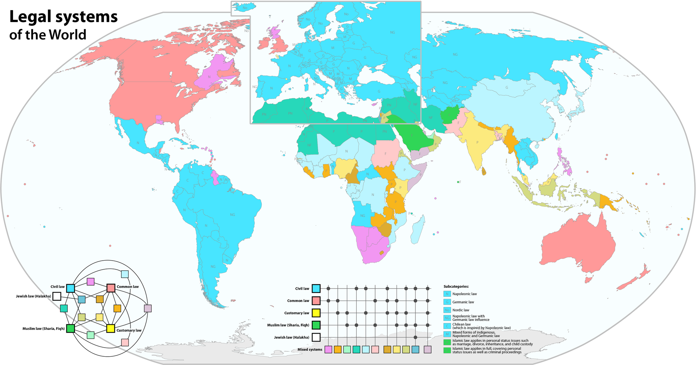
]

---

# Types of Legal Systems

.pull-left[

- Two great legal traditions in the West:

- .hi-purple[Civil Law] tradition
  - confusing: we're *not* talking about "civil vs. criminal" here

- .hi[Common Law] tradition

- About 90-95% of the world's population, and world GDP, operates under one (or a mix) of these systems
]

.pull-right[
.center[

]
]

---

# Civil Law System

.pull-left[

- Primarily statutes codified into a centralized, rigorous system, serving as the font of all law

- Heavily influenced by Roman Law & Napoleonic reforms:
  - *Corpus Juris Civilis* 529—534 A.D. (“Code of Justinian”)
  - *Code Napoléon* 1804 (“Civil Code of the French”)
  
- Dominates European continent and all former French colonies
]

.pull-right[
.center[
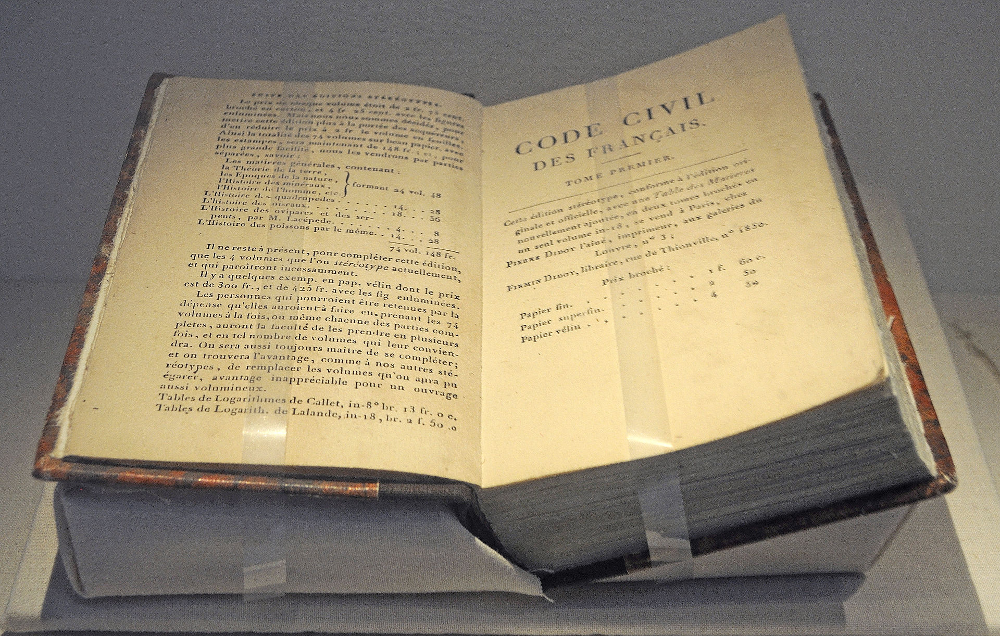
]
]

---

# Civil Law System: History

.pull-left[
.smaller[
- French Revolution overthrows the Ancién Regime
  - Extremely unequal and rigid feudalism
  - Law was arbitrary, not uniform, lots of privileges & exemptions (by class and patronage)
  - King's ministers & judges seen as corrupt

- Voided all existing laws and tried to start from scratch, using more “rational” and scientific principles
]
]

.pull-right[
.center[

]
]

---

# Civil Law System: History

.pull-left[
.smallest[
- Napoleon commissions legal scholars to develop a uniform set of law for all of France

- Basically set out to write down and derive all law from a blank slate
  - Borrowed heavily from *Code of Justinian*

- Very rationalistic, set of first principles, derive conclusions
  - Not much room for history, customs, or precedent

- Put into an extremely detailed *Code*, exhaustively applies to all forseeable circumstances
]
]

.pull-right[
.center[

]
]

---

# Civil Law System: Features

.pull-left[

- .hi-purple[Inquisitorial]: State officials act as judge and jury
  - judge dominates trial and determines the truth
  - Court itself has interest in outcome
  - No jury trials except for most heinous crimes

- Judges must interpret meaning of the code using reason and scholarly commentaries

]

.pull-right[
.center[

]
]

---

# Common Law System

.pull-left[
.smaller[
- Primarily .hi[case law] that arise out of individual disputes and .hi-purple[precedent]
  - statutes by legislatures can supersede, but play a smaller role

- Strongly determined by historical customs, practices, and expectations of the community
  - .hi-turquoise[“judge-made law”]

- First arose in England, all former British colonies (including U.S.) follow common law tradition
]
]

.pull-right[
.center[

]
]

---

# Common Law System: History

.pull-left[

- Roots in Germanic, Anglo-Saxon England

- Henry II standardized law in 12<sup>th</sup> Century and made it “common” in all courts across country
  - all judges ruled according to local customs
  - “go out and find the law as it's being practiced"
]

.pull-right[
.center[
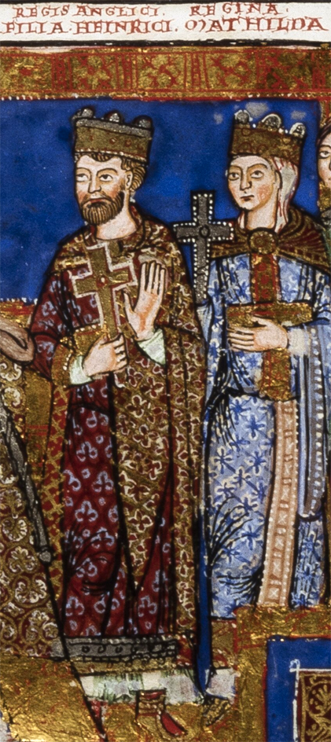
]
]

---

# Common Law System: Features

.pull-left[
.smaller[
- .hi[Adversarial]: “law” arises out of disputes between two private parties
  - Parties have legal counsel, each run the trial in their clients' interest
  - Role of judge is neutral referee, lawyers follow rules of evidence & procedure

- Jury trials in most (not necessarily all) cases
  - Jury determines questions of fact; judge determines questions of law
]
]
.pull-right[
.center[
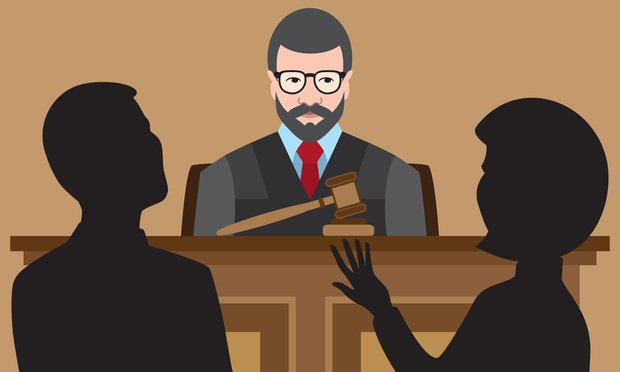
]
]

---

# Common Law System: Features

.pull-left[
.smallest[
- Judges help settle *specific* disputes by interpreting law, relying heavily on .hi[precedent] (decisions of previous judges in cases with similar facts)
  - judges “discover” the law as it already exists
  - extract common applicable principles out of a variety of individual cases (“case law”)
  - in that sense, they do not “*make* law” like a legislature does
  
- Common law rooted in common practices, evolves over time with new cases and decisions

- .hi-purple[Statutes] enacted by legislatures can change law
]
]

.pull-right[
.center[

]
]

---

# Common Law System: Features

.left-column[
.center[
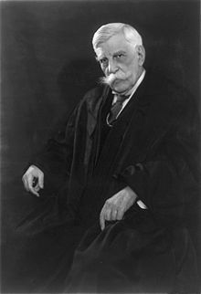

.smallest[
Oliver Wendell Holmes, Jr.

1841—1935

Associate Justice of U.S. Supreme Court
]]
]

.right-column[

.quitesmall[

> “The life of the law has not been logic: it has been experience. The felt necessities of the time, the prevalent moral and political theories, intuitions of public policy, avowed or unconscious, even the prejudices which judges share with their fellow-men, have had a good deal more to do than the syllogism in determining the rules by which men should be governed. The law emodies the story of a nation's development through many centuries, and it cannot be dealt with as if it contained only the axioms and corollaries of a book of mathematics. In order to know what it is, we must know what it has been, and what it tends to become...The substance of the law at any given time pretty nearly corresponds, so far as it goes, with what is then understood to be convenient; but its form and machinery, and the degree to which it is able to work out desired results, depend very much upon its past.”

]

.source[Holmes, Oliver Wendell, Jr., 1881, [*The Common Law*](https://www.gutenberg.org/files/2449/2449-h/2449-h.htm), Lecture I]

]

---

# Common Law System: Features

.left-column[
.center[


.smallest[
Benjamin N. Cardozo

1870—1938

Associate Justice of U.S. Supreme Court
]]
]

.right-column[

> “Common law does not work from pre-established truths of universal and inflexible validity to conclusions derived from them deductively...Its method is inductive, and it draws its generalizations from particulars” (p.22-23).

.source[ Benjamin N. Cardozo, 1921, *The Nature of the Judicial Process*]
]

---

# Common Law System: Features

.pull-left[
- If you go to (a good) law school in the U.S., you *are not taught* “the law” (“here it is”)

- You read a ton of cases, and are made to *think* about what the law is, by extracting common principles from those cases

- You only learn “the law” of the State you will be barred in when you are studying for the Bar exam!
]

.pull-right[
.center[

]
]

---

# Common Law System: Law is Expectations & Customs

.left-column[
.center[
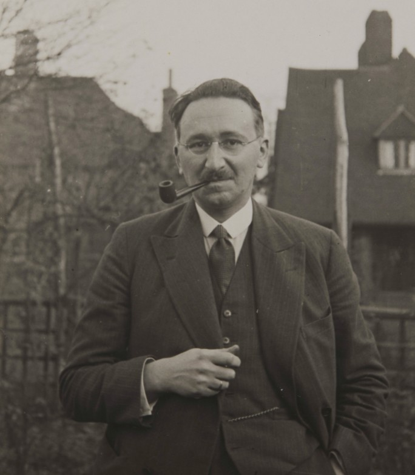

.smallest[
F.A. Hayek

1899—1992

Economics Nobel 1974]
]
]

.right-column[

.quitesmall[
> “*Rule* in this context means simply a propensity or disposition to act or not to act in a certain manner, which will manifest itself in what we call a *practice*  or custom,” (p. 75)

> “While the process of articulation of pre-existing rules will thus often lead to alterations in the body of such rules, this will have little effect on the belief that .hi[those formulating the rules do no more, and have no power to do more, than to find and express already existing rules], a task in which fallible humans will often go wrong, but in the performance of which they have no free choice. .hi[The task will be regarded as one of discovering something which exists, not as one of creating something new],” (p.78)

> “The group may have persisted only because its members have developed and transmitted ways of doing things which made the group as a whole more effective than others; but the reason why certain things are done in certain ways no member of the group needs to know,” (p.80).

]

.source[Hayek, F.A., 1973, "The Changing Concept of Law," Ch. 10 in *Law, Legislation, and Liberty, Vol. 1: Rules and Order*]

]

---

# Common Law System: Separation of Powers

.left-column[
.center[


.smallest[
F.A. Hayek

1899—1992

Economics Nobel 1974]
]
]

.right-column[

.quitesmall[
> “.hi[The freedom of the British] which in the eighteenth century the rest of Europe came so much to admire was thus not...originally a product of the separation of powers between legislature and executive, but rather .hi[a result of the fact that the law that governed the decisions of the courts was the common law], a law existing independently of anyone's will and at the same time binding upon and developed by the independent courts; .hi[a law with which parliament only rarely interfered] and, when it did, mainly only to clear up doubtful points within a given body of law. One might even say that a sort of .hi[separation of powers had grown up in England, not because the 'legislature' alone made law, but because it did *not*]: because the law was determined by courts independent of the power which organized and directed government, the power namely of what was misleadingly called the 'legislature',” (p.85).

]
.source[Hayek, F.A., 1973, "The Changing Concept of Law," Ch. 10 in *Law, Legislation, and Liberty, Vol. 1: Rules and Order*]
]

---
# Common Law System: Role of the Judge

.left-column[
.center[


.smallest[
F.A. Hayek

1899—1992

Economics Nobel 1974]
]
]

.right-column[

.smallest[
> “.hi[The chief concern of a common law judge must be the expectations which the parties in a transaction would have reasonably formed] on the basis of the general practices that the ongoing order of actions rests on. In deciding what expectations were reasonable in this sense he can take account only of such practices (customs or rules) as in fact could determine the expectations of the parties and such facts as may be presumed to have been known to them. And these parties would have been able to form common expectations, in a situation which in some respects must have been unique, only because they interpreted the situation in terms of what was thought to be appropriate conduct and which need not have been known to them in the form of an articulated rule,” (p.86)

]

.source[Hayek, F.A., 1973, "The Changing Concept of Law," Ch. 10 in *Law, Legislation, and Liberty, Vol. 1: Rules and Order*]

]
---

# Common Law System: Role of the Judge

.left-column[
.center[


.smallest[
F.A. Hayek

1899—1992

Economics Nobel 1974]
]
]

.right-column[

.smallest[
> “By the time the judge is called upon to decide a case, the parties in the dispute will already have acted in the pursuit of their own ends and mostly in particular circumstances unknown to any authority; and the expectations which have guided their actions and in which one of them has been disappointed will have been based on what they regarded as established practices. The task of the judge will be to tell them what ought to have guided their expectations, not because anyone had told them before that this was the rule, but because this was the established custom which they ought to have known. The question for the judge here can never be whether the action in fact taken was expedient from some higher point of view, or served a particular result desired by authority, but only whether the conduct under dispute conformed to recognized rules,” (p.86)

]

.source[Hayek, F.A., 1973, "The Changing Concept of Law," Ch. 10 in *Law, Legislation, and Liberty, Vol. 1: Rules and Order*]
]
---

# Summing Up Common Law vs. Civil Law Systems

| Common Law | Civil Law |
|------------|-----------|
| Britain & fmr. British colonies | European continent & fmr. French colonies |
| Origins in 12<sup>th</sup> Century | Origins in 19<sup>th</sup> Century |
| Adversarial | Inquisitorial |
| Rooted in common practices & precedent | Rooted in “Ancient Sources” & pure reason |
| Trials are run by counsel for parties | Trials run by judges |
| More evolutionary | More static |
| More decentralized | More centralized |
| “Spontaneous order” | “Planned order” |

---

# There Are Some Overlaps!

.pull-left[

- State of Louisiana uses a Civil Law system (inherited from France)

- States have attempted to adopt more uniform statutes 
  — *Uniform Commercial Code*

- Famous commentaries on law and its interpretation
  - *Restatement (Second) of Contracts* ... *of Torts*, etc.

]

.pull-right[
.center[
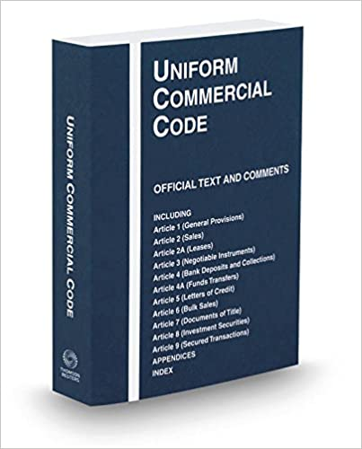
]
]

---

class: inverse, center, middle

# Legal Institutions in the U.S.

---

# Sources of Law in the United States

.pull-left[
.quitesmall[
1. .hi[Constitution of the United States]
  - "the rules of the game"
  - framework for government

2. .hi[Legislation]
  - Congress
  - State & local legislatures
  - "the will of the people"

3. .hi[Regulation ("Administrative Law")]
  - regulatory agencies
  - executive orders

4. .hi[Common law & judiciary]
  - "case law"
  - judge-made law
]
]
.pull-right[
.center[

]
]

---

# Federalism: State vs. Federal Issues

.pull-left[

- The U.S. is, famously, a .hi[federalist] system

- Federal government, States, and local governments overlap, but also have their own separate domains of authority
  - some powers exclusive to States, some powers exclusive to Feds, etc.

- Their exact relationship (both ideal and real) has evolved and much debated since the 18<sup>th</sup> century
]

.pull-right[
.center[
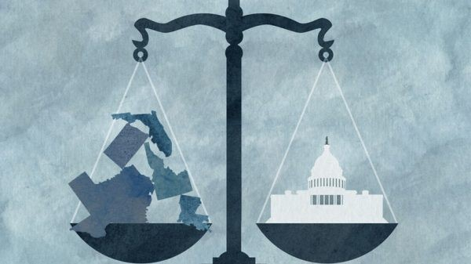
]
]

---

# Federalism: State vs. Federal Issues

.pull-left[
.smaller[
- States have .hi["police power"]: to regulate and intervene against individuals to promote health, safety, morals, and general welfare of the public
  - determined by a State's legislature & limited by it's constitution

- Federal government does *not* have broad police power
  - enumerated powers listed in Constitution
  - expanded over 20th Century, primarily through "commerce clause"
]
]

.pull-right[
.center[

]
]

---

# Federalism: State vs. Federal Issues

.pull-left[
- Doesn't grab the headlines, but most legislation & case law is actually the exclusive domain of each State, not the Federal gov't!
  - property, contracts, torts, family, criminal laws
  - police, education, health care, infrastructure
  - economic regulation: licensing, land use, resource management, price controls, business law

]

.pull-right[
.center[
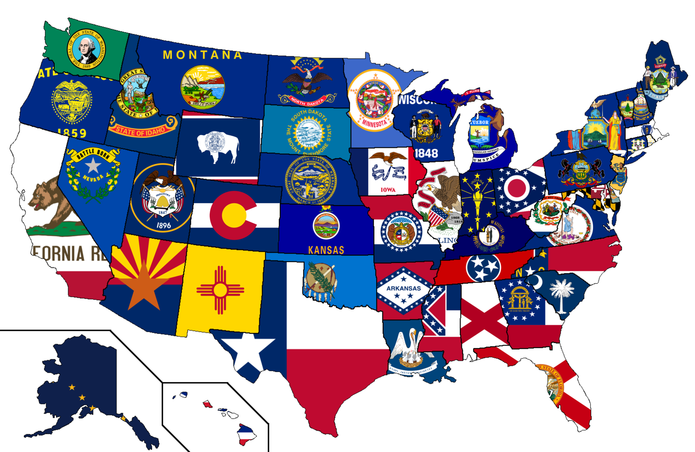
]
]

---

# Courts in the U.S.

.center[
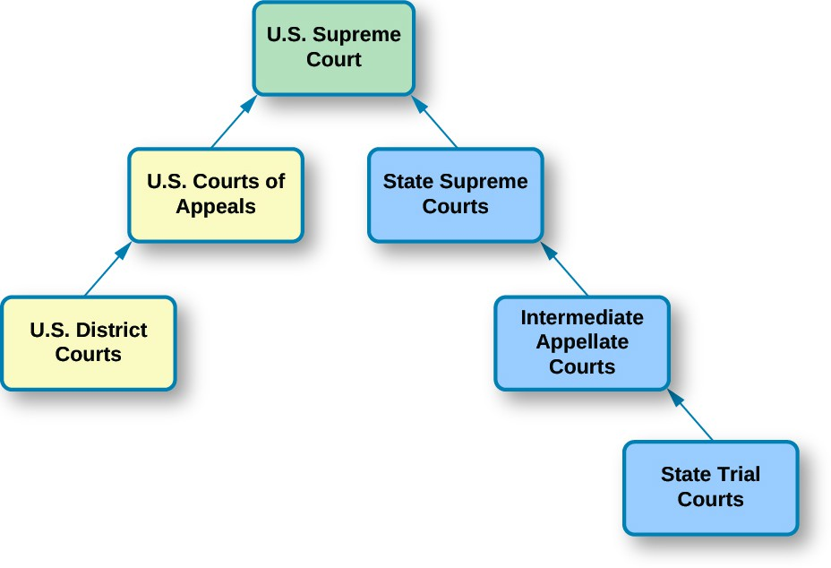
]

---

# Courts in the U.S.: States

.pull-left[

- Most disputes start in State trial courts

- Can be appealed to State appellate courts (if applicable), ultimately the State Supreme court
  - Supreme court has discretion over what cases it will hear

- Note each State determines its own court system
]

.pull-right[
.center[
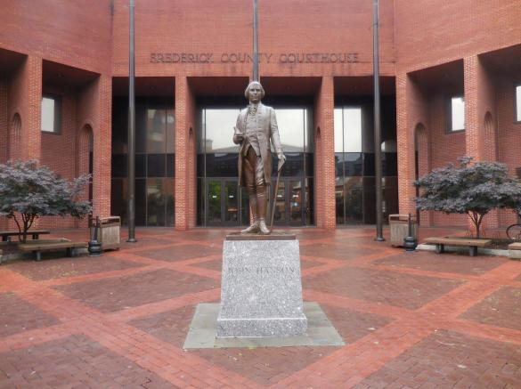

.smallest[
Frederick County Courthouse
]
]
]

---

# Courts in the U.S.: Federal Courts

.pull-left[
.smaller[
- U.S. is divided into 94 judicial districts, each with a .hi[U.S. District Court]
  - and U.S. Attorney for the district representing the federal gov't
  - ex: most famous is SDNY

- Only have jurisdiction over:
  1. .hi-purple["Federal questions"]: dispute about a federal law, regulation, or Constitutional issue
  2. Cases to which the U.S. is a party
  3. Diversity cases: civil disputes of citizens between different states
]
]

.pull-right[
.center[

]
]

---

# Courts in the U.S.: Federal Courts

.pull-left[

- 13 .hi[U.S. Circuit Courts] — appellate courts hearing appeals from district courts
  - discretionary right of review
  - often a panel of 3 judges per case; or *en banc* if the whole slate hears important case, majority vote

]

.pull-right[
.center[

]

]

---

# Courts in the U.S.: Federal Courts

.pull-left[

- Can appeal from Circuit court to .hi[U.S. Supreme Court]
  - again, discretionary right of review: .hi-turquoise[*writ of certiorari*]
  - 9 justices, majority vote

- Some issues, defined by the Constitution, have “original jurisdiction” and automatically *start* at Supreme Court:
  - e.g. disputes between states, or states and U.S.

]

.pull-right[
.center[
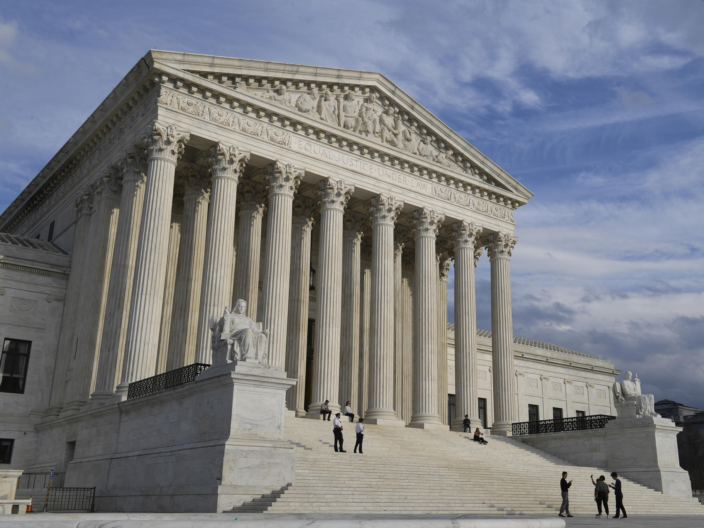
]
]

---

class: inverse, center, middle

# The Legal Process: A Summary

---

# The Legal Process in Common Law

.pull-left[

- We will examine the incentives in greater detail at the end of the semester

- Focus right now on **civil disputes** and procedures
  - Will look at criminal law and procedure later
]

.pull-right[
.center[

]
]

---

# The Legal Process: A Summary

.pull-left[

- Two parties have a dispute (about property, a contract, a tort, etc)

- .hi[At any time, the parties can resolve the dispute on their own (“settle”)], and the lawsuit will be dismissed

]

.pull-right[
.center[

]
]

---

# The Legal Process: A Summary

.pull-left[

1) A .hi[Plaintiff] files a .hi-turquoise[complaint] (lawsuit) in district court against the .hi-purple[Defendant]
  - state the facts
  - explain how they have been harmed by the defendant
  - relevant laws
  - relief sought

2) The .hi-purple[Defendant] must answer the complaint
  - dispute the facts, the law, or both
  - preview what they will argue if goes to trial

]

.pull-right[
.center[
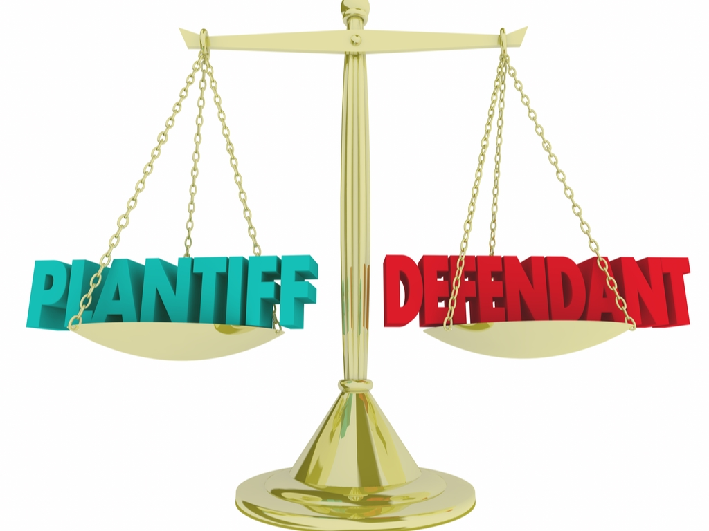
]
]

---

# The Legal Process: A Summary

.pull-left[

3) .hi-turquoise[Discovery phase] of pre-trial
  - compiling of evidence for both sides
  - documents, deposition of parties and witnesses
  - often leads to settlement (or dismissal), as everyone sees the strengths of each party's case
]

.pull-right[
.center[

]
]

---
# The Legal Process: A Summary

.pull-left[

4) Judge must determine whether case should proceed to trial, or else **dismiss** the case (“summary judgment” for Defendant).

5) Dispute proceeds to .hi-turquoise[trial]
  - May empanel a jury to determine the facts (judge clarifies law only)
  - Or a “bench trial” just before a judge (no jury)
]

.pull-right[
.center[

]
]

---

# The Legal Process: A Summary

.pull-left[

6) Jury & judge reach a verdict
  - Find for the Defendant or the Plaintiff on .hi-turquoise[preponderance of the evidence]
  - If Plaintiff wins: award damages against Defendant to pay Plaintiff
]

.pull-right[
.center[

]
]

---
# The Legal Process: A Summary

.pull-left[
.smallest[
7) Either party may .hi-turquoise[appeal] the trial court's decision
  - Must claim the court made a mistake about *law*

8) Trial at appellate court
  - Only about the *law*, no arguments about *the facts*
  - Lawyers for both **appellant** & **appellee** submit briefs, oral argument before appellate judges
  - Third parties may submit their own .hi-turquoise[*amicus curiae*] briefs — if they have an interest in the outcome
  - Court can **affirm** or **reverse** the trial court's decision, or **remand** them to redo a specific portion
]
]

.pull-right[
.center[

]
]
