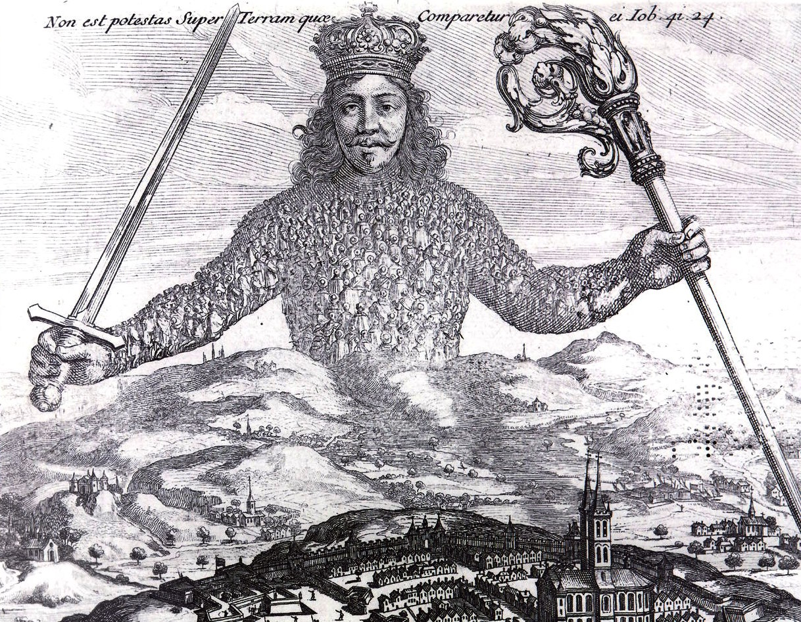
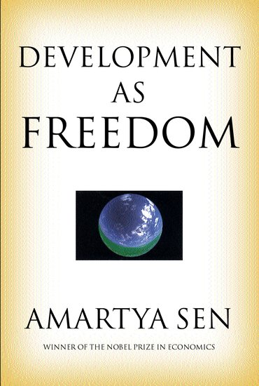

```{r setup, include=FALSE}
options(htmltools.dir.version = FALSE)
knitr::opts_chunk$set(echo=F,
                      message=F,
                      warning=F,
                      fig.retina=3,
                      fig.align = "center")
library("tidyverse")
library("ggrepel")
library("fontawesome")
xaringanExtra::use_tile_view()
xaringanExtra::use_tachyons()

theme_slides <- theme_light() + 
  theme(
    text = element_text(family = "Fira Sans", size = 24)
  )
```

class: inverse

# Outline

### [Efficiency](#3)

### [Common Law Tradition vs. Civil Law Tradition](#9)

### [Legal Institutions in the U.S.](#29)

### [The Legal Process: A Summary](#39)

---

# The Two Major Models of Economics as a “Science”

.pull-left[

## Optimization

- Agents have .hi[objectives] they value

- Agents face .hi[constraints]

- Make .hi[tradeoffs] to maximize objectives within constraints

.center[

]
]

--

.pull-right[

## Equilibrium

- Agents .hi[compete] with others over **scarce** resources

- Agents .hi[adjust] behaviors based on prices

- .hi[Stable outcomes] when adjustments stop

.center[

]

]


---

# Modeling Individual Choice

.pull-left[

- The .hi[consumer's utility maximization problem]: 

1. **Choose:** .hi-purple[ < a consumption bundle >]

2. **In order to maximize:** .hi-green[< utility >]

3. **Subject to:** .hi-red[< income and market prices >]

]

.pull-right[
.center[

]
]

---

# Modeling Firm's Choice

.pull-left[
.smallest[
- 1<sup>st</sup> Stage: .hi-purple[firm's profit maximization problem]: 

1. **Choose:** .hi-blue[ < output >]

2. **In order to maximize:** .hi-green[< profits >]

- 2<sup>nd</sup> Stage: .hi-purple[firm's cost minimization problem]: 

1. **Choose:** .hi-blue[ < inputs >]

2. **In order to _minimize_:** .hi-green[< cost >]

3. **Subject to:** .hi-red[< producing the optimal output >]
]

]

.pull-right[

.center[

]
]

---

# What Does "Efficiency" Mean?

.pull-left[

- Regular sense of the word:

- Achieving a .hi-purple[specified goal] with as .hi-purple[few resources as possible]

- .hi-green[Examples]:
  - driving
  - carrying groceries
  - producing pencils
]

.pull-right[
.center[

]
]

---

# Problem: What Goal for Society?

.pull-left[

- We will ruminate more on this next class

- .hi-purple[Society, government, law, etc. has no single, universally agreed-upon goal]

- “Society” is not a choosing agent
]

.pull-right[
.center[

]
]

---

# Social Problems

.pull-left[
.center[

]
]

.pull-right[
- .hi[Problem 1]: Resources are scarce, and have multiple, rivalrous uses

- .hi[Problem 2]: Different people have different subjective valuations for uses of resources

]

---

# The Origins of Exchange I

.pull-left[
- Why do we trade?

- .hi-purple[Resources are in the wrong place!]

- People have *better* uses of resources than they are currently being used! 

]

.pull-right[
.center[

]
]

---

# The Origins of Exchange II

.pull-left[
- *Why* are resources in the wrong place?

- .hi-purple[We have the same stuff but different preferences]


]

.pull-right[
.center[


]
]

---

# The Origins of Exchange III

.pull-left[
- *Why* are resources in the wrong place?

- .hi-purple[We have different stuff and different preferences]

]

.pull-right[
.center[


]
]

---

# Economic Efficiency: First Pass

.pull-left[

.hi[Economic efficiency]: degree to which as many people as possible get as much as possible of what they want
  - degree of .hi-purple[preference satisfaction]

- How do we measure this?
  - Expanding budget set $\implies$ satisfying more goals
  - Income is a main constraint $\implies$ maximize incomes
  - GDP per capita: market value of what is produced $\iff$ incomes
]

.pull-right[

```{r, fig.retina=3}
points<-tribble(
  ~letter, ~x, ~y,
  "A", 10, 5,
)

IC_7=function(x){50/x}
BC=function(x){10-0.5*x}

ggplot(data.frame(x=c(0,10)), aes(x=x))+
  stat_function(fun=IC_7, geom="line", size=2, color = "#3CBB75FF")+
  stat_function(fun=BC, geom="line", size=2, color = "red")+
    geom_label(aes(x=3.5,y=IC_7(3.5)), color = "#3CBB75FF", label="u", size = 4)+
    geom_label(aes(x=2,y=BC(2)), color = "red", label="BC", size = 6)+
  geom_point(data = points,
             mapping=aes(x=x, y=y),
             size = 3)+
  geom_segment(aes(x = 0, xend = 10, y = 5, yend=5), linetype="dotted", size=1)+
  geom_segment(aes(x = 10, xend = 10, y = 5, yend=0), linetype="dotted", size=1)+
    scale_x_continuous(breaks=seq(0,20,2),
                     limits=c(0,20),
                     expand=expand_scale(mult=c(0,0.1)))+
  scale_y_continuous(breaks=seq(0,20,2),
                     limits=c(0,20),
                     expand=expand_scale(mult=c(0,0.1)))+
  #scale_colour_manual("Curves", values = line_colors, guide=F)+
  labs(x = "x",
       y = "y")+
  theme_classic(base_family = "Fira Sans Condensed", base_size=20)
```
]

---

# The Economic Point of View

.pull-left[

- Preferences are .hi-purple[subjective]
  - .hi-purple[Egalitarianism]: Nobody's preferences are dismissed

- .hi-turquoise[Higher incomes + freedom of choice = greater preference satisfaction]

- Harder to directly evaluate outcomes, better to look at basic processes/mechanisms (especially exchange)
]

.pull-right[
.center[

]
]

---

class: inverse, center, middle

# Exchange, Markets, and Efficiency

---

# Social Problems that Markets Solve Well 

.pull-left[
.center[

]
]

.pull-right[

- **Solution**: Prices in a functioning market accurately measure .hi[opportunity cost] of using resources in a particular way

- .hi-purple[The price of a resource is the amount someone else is willing to pay to acquire it from its current use/owner]
]

---

# Perfectly Competitive Market

.pull-left[
```{r, fig.retina=3, fig.height=4.5}
demand<-function(x){10-x}
supply<-function(x){x}
demand_firm<-function(x){10}
mc_cc<-function(x){3*x^2-8*x+9}
ac_cc<-function(x){x^2-4*x+10+10/x}

pc<-ggplot(data.frame(x=c(0,10)), aes(x=x))+
  stat_function(fun=demand_firm, geom="line", size=2, color = "blue")+
  geom_label(aes(x=4.5,y=demand_firm(4.5)), color = "blue", label="Demand", size = 5)+
    stat_function(fun=mc_cc, geom="line", size=2, color = "red")+
  geom_label(aes(x=3.5,y=mc_cc(3.5)), color = "red", label="MC(q)", size = 5)+
    stat_function(fun=ac_cc, geom="line", size=2, color = "orange")+
  geom_label(aes(x=4.5,y=ac_cc(4.5)), color = "orange", label="MC(q)", size = 5)+
  geom_segment(x=2.8, xend=2.8, y=0, yend=10, size=1, linetype="dotted")+
    scale_x_continuous(breaks=NULL,
                     limits=c(0,5),
                     expand=expand_scale(mult=c(0,0.1)))+
  scale_y_continuous(breaks=NULL,
                     limits=c(0,20),
                     expand=expand_scale(mult=c(0,0.1)))+
  guides(fill=F)+
  labs(title = "Representative Firm",
       x = "Quantity",
       y = "Price")+
  theme_classic(base_family = "Fira Sans Condensed", base_size=20)
pc
```
]

.pull-right[
```{r, fig.retina=3, fig.height=4.5}
cs_1<-tribble(
  ~x, ~y,
  0, 10,
  0, 5,
  5, 5
)
ps_1<-tribble(
  ~x, ~y,
  0, 0,
  0, 5,
  5, 5
)

ggplot(data.frame(x=c(0,10)), aes(x=x))+
  geom_polygon(data=cs_1, aes(x=x,y=y), fill="blue", alpha=0.5)+
  geom_polygon(data=ps_1, aes(x=x,y=y), fill="red", alpha=0.5)+
  stat_function(fun=demand, geom="line", size=2, color = "blue")+
    geom_label(aes(x=9,y=demand(9)), color = "blue", label="Demand", size = 5)+
  stat_function(fun=supply, geom="line", size=2, color = "red")+
    geom_label(aes(x=9,y=supply(9)), color = "red", label="Supply", size = 5)+
  geom_segment(x=5, xend=5, y=0, yend=5, size=1, linetype="dotted")+
  geom_segment(x=0, xend=5, y=5, yend=5, size=1, linetype="dotted")+
  
  # point A
  geom_point(x = 5, y = 5, size=3)+
  geom_text(x = 5, y = 5.5, label = "A", size=5)+
  
    scale_x_continuous(breaks=NULL,
                     limits=c(0,10),
                     expand=expand_scale(mult=c(0,0.1)))+
  scale_y_continuous(breaks=NULL,
                     limits=c(0,10),
                     expand=expand_scale(mult=c(0,0.1)))+
  guides(fill=F)+
  labs(title = "Industry",
       x = "Quantity",
       y = "Price")+
  theme_classic(base_family = "Fira Sans Condensed", base_size=20)
```
]

.smallest[
- In a .hi[competitive market] in .hi[long run equilibrium]:
  - .hi-purple[Economic profit] is driven to $0; resources (factors of production) optimally allocated
  - .hi-purple[Allocatively efficient]: $p=MC(q)$, maximized .blue[CS] $+$ .red[PS]
  - .hi-purple[Productively efficient]: $p=AC(q)_{min}$ (otherwise firms would enter/exit)
]

---

# Allocative Efficiency in Competitive Equilibrium I

.pull-left[

```{r, fig.retina=3}
Demand=function(x){10-x}
Supply=function(x){x}
eq<-tribble(
  ~letter, ~x, ~y,
  "A", 5, 5
)

CS<-tibble(x=c(0,0,5),
           y=c(5,10,5))

PS<-tibble(x=c(0,0,5),
           y=c(0,5,5))

p<-ggplot(data.frame(x=c(0,10)), aes(x=x))+
  stat_function(fun=Demand, geom="line", size=2, color = "blue")+
  stat_function(fun=Supply, geom="line", size=2, color = "red")+
  geom_label(aes(x=9,y=Demand(9)), color = "blue", label="Demand = MB", size = 6)+
  geom_label(aes(x=9,y=Supply(9)), color = "red", label="Supply = MC", size = 6)+
  geom_segment(aes(x=0, xend=5, y=5, yend=5),size=1, linetype="dotted")+
  geom_segment(aes(x=5, xend=5, y=5, yend=0),size=1, linetype="dotted")+
  geom_polygon(data=CS, aes(x=x,y=y), fill="blue", alpha=0.5)+ #CS
  geom_polygon(data=PS, aes(x=x,y=y), fill="red", alpha=0.5)+ #PS
  geom_label(aes(x=1.5, y= 3), label="PS", color="red", size =6)+
  geom_label(aes(x=1.5, y= 7), label="CS", color="blue", size =6)+
  geom_point(data = eq,
             mapping=aes(x=x, y=y),
             size = 4)+
  geom_text_repel(data = eq,
             mapping=aes(x=x, y=y,
             label = letter),
             size = 6)+
    scale_x_continuous(breaks=seq(0,10,1),
                     limits=c(0,10),
                     expand=expand_scale(mult=c(0,0.1)))+
  scale_y_continuous(breaks=seq(0,10,1),
                     limits=c(0,10),
                     expand=expand_scale(mult=c(0,0.1)))+
  guides(fill=F)+
  labs(x = "Quantity",
       y = "Price")+
  theme_classic(base_family = "Fira Sans Condensed", base_size=20)
p
```

]

.pull-right[

- .hi[Allocative efficiency]: resources are allocated to highest-valued uses
  - Goods are produced up to the point where .blue[marginal benefit] $=$ .red[marginal costs]
]

---

# Allocative Efficiency in Competitive Equilibrium II

.pull-left[

```{r, fig.retina=3}
p
```

]

.pull-right[

- **Economic surplus** = .blue[Consumer surplus] + .red[Producer surplus]

- Maximized in competitive equilibrium

- Resources flow away from those who value them the lowest (min WTA) to those that value them the highest (max WTP)
  - creating .red[PS] and .blue[CS]

- .hi-purple[The social value of resources is **maximized** by allocating them to their highest valued uses!]

]

---

# Markets and Pareto Efficiency

.pull-left[
.smallest[
- Suppose we start from some initial allocation (.blue[A])

]
]

.pull-right[
```{r}
pareto_points<-tribble(
  ~x, ~y, ~letter, ~fill,
  4, 5, "A", "Endowment",
  2, 5, "B", "No",
  2, 7, "C", "No",
  4, 9, "D", "Yes",
  6, 8, "E", "Yes",
  8, 7, "F", "Yes",
  9, 5, "G", "Yes",
  7, 3, "H", "No",
  4, 3, "I", "No"
)

ggplot(data = tibble(x=1:10),aes(x=x))+
  geom_label(data = subset(pareto_points, letter=="A"), aes(x=x, y=y, label = letter, fill = fill), color = "white")+
  labs(x = "Person 1’s Goods",
       y = "Person 2’s Goods")+
  scale_fill_manual("Improvement?",
                    values = c("Endowment" = "blue", "Yes" = "green", "No" = "red"))+
  scale_x_continuous(breaks=seq(0,10,1),
                     limits = c(0,10),
                     expand=c(0,0))+
  scale_y_continuous(breaks=seq(0,10,1),
                     limits = c(0,10),
                     expand=c(0,0))+
  ggthemes::theme_pander(base_family = "Fira Sans Condensed", base_size = 16)

```

]

---

# Markets and Pareto Efficiency

.pull-left[
.smallest[
- Suppose we start from some initial allocation (.blue[A])

- .hi[Pareto Improvement]: at least one party is better off, and no party is worse off
  - .green[D, E, F, G] are improvements
  - .red[B, C, H, I] are not

]
]

.pull-right[
```{r}
pareto<-ggplot(data = tibble(x=1:10),aes(x=x))+
  geom_label(data = pareto_points, aes(x=x, y=y, label = letter, fill = fill), color = "white")+
  labs(x = "Person 1’s Goods",
       y = "Person 2’s Goods")+
  scale_fill_manual("Improvement?",
                    values = c("Endowment" = "blue", "Yes" = "green", "No" = "red"))+
  scale_x_continuous(breaks=seq(0,10,1),
                     limits = c(0,10),
                     expand=c(0,0))+
  scale_y_continuous(breaks=seq(0,10,1),
                     limits = c(0,10),
                     expand=c(0,0))+
  ggthemes::theme_pander(base_family = "Fira Sans Condensed", base_size = 16)
pareto
```
]

---

# Markets and Pareto Efficiency

.pull-left[
.smallest[
- Suppose we start from some initial allocation (.blue[A])

- .hi[Pareto Improvement]: at least one party is better off, and no party is worse off
  - .green[D, E, F, G] are improvements
  - .red[B, C, H, I] are not

- .hi[Pareto optimal/efficient]: no possible Pareto improvements
  - Set of Pareto efficient points often called the .hi-green[Pareto frontier]<sup>.magenta[†]</sup>
  - Many possible efficient points!

]

.tiny[<sup>.magenta[†]</sup>I’m simplifying...for full details, see [class 1.8 appendix](https://microf20.classes.ryansafner.com/files/CT_Application_2_Exchange.pdf) about applying consumer theory!]

]

.pull-right[
```{r}
pareto+annotate("segment", x = 4, xend = 4, y = 5, yend = 10, color = "purple", size=2, alpha=1, arrow=arrow(length=unit(0.5,"cm"), ends="last", type="closed"))+
  annotate("segment", x = 4, xend = 10, y = 5, yend = 5, color = "purple", size=2, alpha=1, arrow=arrow(length=unit(0.5,"cm"), ends="last", type="closed"))+
  geom_rect(xmin=4,xmax=10,ymin=5,ymax=10,fill="green",alpha=0.025)+
  geom_segment(x = 4, y = 9, xend=6, yend=8, color = "green", size = 2)+
  geom_segment(x = 6, y = 8, xend=8, yend=7, color = "green", size = 2)+
  geom_segment(x = 8, y = 7, xend=9, yend=5, color = "green", size = 2)
```
]


---

# Markets and Pareto Efficiency

.pull-left[
.smallest[
- Voluntary exchange in markets is a .hi[Pareto improvement]

- *In equilibrium*, markets are .hi[Pareto efficient]: there are no more possible Pareto improvements
  - all gains from trade exhausted, $q_S=q_D$, no pressure for change

- Note Pareto efficiency contains a normative claim about .hi-purple[equity]
  - It might be possible to improve the *total* welfare of *society*
  - But if this comes *at the expense of even 1 individual*, it’s not a Pareto improvement!
]
]
.pull-right[

.center[

]
]

---

# Markets and Pareto Efficiency

.pull-left[

- Pareto efficiency is conceptual gold standard: allow all welfare-improving exchanges so long as nobody gets harmed

- In practice: Pareto efficiency is a *first best* solution
  - only takes one holdout to disapprove to violate Pareto efficiency

]

.pull-right[

.center[

]
]

---

# Markets and Kaldor-Hicks Efficiency

.pull-left[
.smallest[
- .hi[Kaldor-Hicks Improvement]: an action improves efficiency its generates more social gains than losses
    - those made better off could in principle compensate those made worse off

- .hi[Kaldor-Hicks efficiency]: no potential Kaldor-Hicks improvements exist

- Keeps intuitive appeal of Pareto but more practical
    - Every Pareto improvement is a KH-improvement (but not the other way around!)
    
- Consider policies where winners' maximum WTP $>$ losers' minimum WTA

- Policies should **maximize social value of resources**
]
]

.pull-right[

.center[


]
]

---

# Pareto vs. Kaldor-Hicks Efficiency

.pull-left[
.smallest[
- .hi-green[Example]: .hi-purple[“eminent domain”]

- The “takings clause” of the 5<sup>th</sup> Amendment to the U.S. Constitution:

> “No person shall...be deprived of life, liberty, or property, without due process of law; nor shall private property be taken for public use, without just compensation.”

- What is a “public use”? What is “just compensation”?

- [*Kelo v. City of New London*](https://en.wikipedia.org/wiki/Kelo_v._City_of_New_London), 545 U.S. 469 (2005
]
]
.pull-right[

.center[


]
]

---

# Welfare Economics
.smallest[
- The .hi[1st Fundamental Welfare Theorem]: markets in competitive equilibrium maximize allocative efficiency of resources and are Pareto efficient
  - initial endowments does not affect efficiency but does affect final distribution

]

--

.smallest[

- The .hi[2nd Fundamental Welfare Theorem]: any desired Pareto efficient distribution can be achieved with a lump-sum tax & transfer scheme, and then allowing markets to work freely
  - allows a targetted (re)-distribution to be achieved without sacrificing efficiency

]

---

# Welfare Economics

.smallest[
- **Markets are great when:**
  1. They are .hi-purple[Competitive]: many buyers and many sellers
  2. They each .hi-purple[equilibrium] (.hi-purple[prices are free to adjust]): absence of transactions costs or policies *preventing prices from adjusting* to meet supply and demand
  3. .hi-purple[There are no externalities]<sup>.magenta[†]</sup> are present: costs and benefits are fully internalized by the parties to transactions 
]

--

.smallest[
- If any of these conditions are not met, we have .hi[market failure]
  - May be a role for governments, other institutions, or entrepreneurs to fix
]

.footnote[<sup>.magenta[†]</sup> Or public goods, or asymmetric information. But in essence, I am treating these as special cases of more common externalities.]

---

class: inverse, center, middle

# Problem: Transaction Costs

---

# Dis-equilibrated Markets

.pull-left[

- To *reach* equilibrium, market prices need to be able to adjust
  - Shortage: price needs to rise
  - Surplus: price needs to fall

- There are .b[*unrealized* gains from trade] that exist in disequilibrium (shaded)
  - Buyers & sellers both can be made better off if they can adjust the price

]

.pull-right[
```{r}
dwl<-tribble(
  ~x, ~y,
  3, 3,
  3, 7,
  5, 5
)
dwlp<-ggplot(data.frame(x=c(0,10)), aes(x=x))+
  geom_polygon(data=dwl, aes(x=x,y=y), fill="black", alpha=0.5)+
  stat_function(fun=Demand, geom="line", size=2, color = "blue")+
  stat_function(fun=Supply, geom="line", size=2, color = "red")+
  geom_label(aes(x=9,y=Demand(9)), color = "blue", label="Demand", size = 6)+
  geom_label(aes(x=9,y=Supply(9)), color = "red", label="Supply", size = 6)+
  geom_segment(aes(x=0, xend=7, y=3, yend=3),size=1, linetype="dotted")+
  geom_segment(aes(x=0, xend=7, y=7, yend=7),size=1, linetype="dotted")+
  geom_segment(aes(x=3, xend=3, y=7, yend=0),size=1, linetype="dotted")+
  geom_segment(aes(x=7, xend=7, y=7, yend=0),size=1, linetype="dotted")+
  scale_x_continuous(breaks=seq(0,10,1),
                     limits=c(0,10),
                     expand=expand_scale(mult=c(0,0.1)))+
  scale_y_continuous(breaks=seq(0,10,1),
                     limits=c(0,10),
                     labels=scales::dollar,
                     expand=expand_scale(mult=c(0,0.1)))+
  coord_cartesian(clip="off")+
  labs(x = "Quantity",
       y = "Price")+
  theme_classic(base_family = "Fira Sans Condensed", base_size=16)
dwlp
```
]

---

# Dis-equilibrated Markets

.pull-left[
.smallest[
- If market prices are *prevented* from adjusting, shortage/surplus becomes *permanent*

- Lost .blue[CS] and/or .red[PS]: .b[Deadweight loss (DWL)]
  - **inefficiency** created by (permanent) diseq.

- Various government policies can prevent markets from equilibrating & create DWL:
  - .hi-purple[Price regulations] (price ceiling like rent control, price floor like minimum wage)
  - .hi-purple[Taxes, subsidies, tariffs, quotas]<sup>.magenta[†]</sup>
  - These should have been covered in Principles
]

.tiny[<sup>.magenta[†]</sup> Some may be necessary (taxes fund government), but create market inefficiencies.]
]

.pull-right[
```{r}
dwl<-tribble(
  ~x, ~y,
  3, 3,
  3, 7,
  5, 5
)
dwlp<-ggplot(data.frame(x=c(0,10)), aes(x=x))+
  geom_polygon(data=dwl, aes(x=x,y=y), fill="black", alpha=0.5)+
  stat_function(fun=Demand, geom="line", size=2, color = "blue")+
  stat_function(fun=Supply, geom="line", size=2, color = "red")+
  geom_label(aes(x=9,y=Demand(9)), color = "blue", label="Demand", size = 6)+
  geom_label(aes(x=9,y=Supply(9)), color = "red", label="Supply", size = 6)+
  geom_segment(aes(x=0, xend=7, y=3, yend=3),size=1, linetype="dotted")+
  geom_segment(aes(x=0, xend=7, y=7, yend=7),size=1, linetype="dotted")+
  geom_segment(aes(x=3, xend=3, y=7, yend=0),size=1, linetype="dotted")+
  geom_segment(aes(x=7, xend=7, y=7, yend=0),size=1, linetype="dotted")+
  scale_x_continuous(breaks=seq(0,10,1),
                     limits=c(0,10),
                     expand=expand_scale(mult=c(0,0.1)))+
  scale_y_continuous(breaks=seq(0,10,1),
                     limits=c(0,10),
                     labels=scales::dollar,
                     expand=expand_scale(mult=c(0,0.1)))+
  coord_cartesian(clip="off")+
  labs(x = "Quantity",
       y = "Price")+
  theme_classic(base_family = "Fira Sans Condensed", base_size=16)
dwlp
```
]

---

# Transaction Costs and Exchange I

.pull-left[
- .hi[Transaction costs]:
  - .hi-purple[Search costs]: cost of finding trading partners
  - .hi-purple[Bargaining costs]: cost of reaching an agreement
  - .hi-purple[Enforcement costs]: **trust** between parties, cost of upholding agreement, dealing with unforeseen contingencies, punishing defection, using police and courts 
]

.pull-right[
.center[

]
]

---

# Transaction Costs and Exchange II

.pull-left[
- With high transaction costs, resources *cannot* be traded

- Resources *cannot* be switched to higher-valued uses

- If others value goods higher than their current owners, resources are *inefficiently* allocated!
]

.pull-right[
.center[

]
]

---

class: inverse, center, middle

# Problem: Collective Action

---

# Generalizing: Collective Action Problems

.pull-left[

- .hi[Collective action problem]: situation where an individual's interest and a group's interest may conflict

- Benefits (or costs) of outcome are **nonrival** and flow to *all members* of the group

- Decisions & costs need to be incurred by individuals

- **Individual preferences** need to aggregate into a **single decision/outcome**
]

.pull-right[
.center[

]
]

---

# Collective Action Problem: Examples I

.center[

]

---

# Collective Action Problem: Examples II

.center[

]

---

# Collective Action Costs I

.pull-left[

- Groups may share a **common interest**

- But **composed of individuals with their own preferences**
  - Individuals bear the personal cost of contributing
  - Individuals gain a small share of the benefits of group action

- Additionally, **cost of bargaining** to get a group to agree on decision
]

.pull-right[
.center[

]

]

---

class: inverse, center, middle

# Problem: Public Goods

---

# A Classic Economic Problem

.pull-left[
.center[

]
]

.pull-right[

- .hi[Public Good]: a good that is .hi-purple[non-rival] and .hi-purple[non-excludable]

- .hi-purple[Rivalry]: one use of a resource removes it from other uses

- .hi-purple[Excludability]: ability or right to prevent others from using it (ownership)

]

---

# The Free Rider Problem

.pull-left[
- Individual bears a **private cost to contribute**, but only gets a **small fraction of the (dispersed) benefit** of a good

- If individuals can gain **access** to the good (nonexcludable) **without paying**, may lead to...

- .hi[Free riding]: individuals consume the good without paying for it
]

.pull-right[
.center[

]
]

---

# Examples?

.pull-left[
.center[

]
]

.pull-right[
.center[

]
]

---

# Market Failure from Public Goods

.pull-left[

- No incentive for people to contribute and pay for the good

- If enough people obtain the benefits without incurring the costs...

- **Not profitable** for private market actors to supply it

]

.pull-right[
.center[

]
]

---

class: inverse, center, middle

# Problem: Externalities

---

```{r}
library("mosaic")
demand_1=function(x){10-x}
supply_1=function(x){x}

changes<-ggplot(data.frame(x=c(0,10)), aes(x=x))+
  stat_function(fun=demand_1, geom="line", size=2, color = "blue")+
    geom_label(aes(x=9,y=demand_1(9)), color = "blue", label="MSB", size = 8)+
  stat_function(fun=supply_1, geom="line", size=2, color = "#e64173")+
    geom_label(aes(x=9,y=supply_1(9)), color = "#e64173", label="MSC", size = 8)+
  geom_segment(x=0, xend=5, y=5, yend=5, size=1, linetype="dotted")+
  geom_segment(x=5, xend=5, y=0, yend=5, size=1, linetype="dotted")+
    scale_x_continuous(breaks=seq(0,10,1),
                     limits=c(0,10),
                     expand=expand_scale(mult=c(0,0.1)))+
  scale_y_continuous(breaks=seq(0,10,1),
                     limits=c(0,10),
                     expand=expand_scale(mult=c(0,0.1)),
                     labels = function(x){paste("$", x, sep="")})+
  labs(x = "Quantity (q)",
       y = "Price (p)")+
  theme_classic(base_family = "Fira Sans Condensed", base_size=20)
```

# Supply and Demand: Social Costs & Benefits

.pull-left[

```{r, fig.retina=3}

changes
```

]

.pull-right[

- .hi-blue[Demand: marginal social benefit (MSB)]
  - value to consumers of consuming output

- .hi-pink[Supply: marginal social cost (MSC)]
  - opportunity cost of pulling resources out of other uses

- **Equilibrium**: $MSB=MSC$
  - using resources efficiently, no *better* alternative uses
]

---

# Supply and Demand: Social Costs & Benefits

.pull-left[

```{r, fig.retina=3}

changes
```

]

.pull-right[

- **Price system** mitigates costs and benefits of people's actions

- People using scarce resources must **account for consequences**:
  - Pay to pull scarce resources out of other uses in society
  - Compensated for producing something valuable for others

]

---

# Externality 

.pull-left[

- .hi[Externality]: an action that incurs a cost or a benefit not compensated via prices

- Often interpretted as an action that affects (benefits or harms) a third party not privy to the action

]

.pull-right[

.center[

]
]

---

# Externality 

.pull-left[
- The real problem is that it is .hi-purple[external] to the price system!

- People base decisions off of their preferences and opportunity costs of resources for society (captured in prices)

- Prices properly negotiate the opportunity costs and provide information to people 

- But without price, decisions do not .hi-purple[internalize] those effects! 
]

.pull-right[

.center[

]
]

---

# Pigouvian Solutions

.left-column[
.center[


A.C. Pigou

1877-1959
]
]

.right-column[

- 1920, *The Economics of Welfare*

- Principle of .hi["payment in accordance with product"]

- People should pay average externality of their actions
  - Markets make you do this automatically
  - If markets fail, policy can force the market to work again

- .hi-purple[Problem with externality is that there is a missing price!]
]

---

# Negative Externality

.pull-left[

```{r, fig.retina=3}
supply_up=function(x){x-2}

changes+
  stat_function(fun=supply_up, geom="line", size=2, color = "#fb6107")+
    geom_label(aes(x=9,y=supply_up(9)), color = "#fb6107", label="MPC", size = 8)+
  geom_segment(x=0, xend=6, y=4, yend=4, size=1, linetype="dotted")+
  geom_segment(x=6, xend=6, y=0, yend=4, size=1, linetype="dotted")+
  geom_point(aes(x = c(5,6),
                 y = c(5,4)),
             size = 4)+
  geom_text(x=5,y=5.5, label="A", size=8)+
  geom_text(x=6,y=4.5, label="B", size=8)
```

]

.pull-right[

.hi-pink[Marginal _Private_ Cost] to producer
is less than
.hi-red[Marginal _Social_ Cost] to society

**Market Equilibrium (B)** too much $q$ at too low $p$ compared to **Social Optimum (A)**
]

---

# Negative Externality

.pull-left[

```{r, fig.retina=3}
changes+
  stat_function(fun=supply_up, geom="line", size=2, color = "#fb6107")+
    geom_label(aes(x=9,y=supply_up(9)), color = "#fb6107", label="MPC", size = 8)+
  geom_segment(x=0, xend=6, y=4, yend=4, size=1, linetype="dotted")+
  geom_segment(x=6, xend=6, y=0, yend=4, size=1, linetype="dotted")+
  geom_point(aes(x = c(5,6),
                 y = c(5,4)),
             size = 4)+
  geom_text(x=5,y=5.5, label="A", size=8)+
  geom_text(x=6,y=4.5, label="B", size=8)+
  
  annotate("segment", x = 6, xend = 6, y = 4, yend = 6, colour = "purple", size=2, alpha=1, arrow=arrow(length=unit(0.5,"cm"), ends="both", type="closed"))+
  geom_label(x=8, y=5, label="External Cost", color = "purple", size =8)+
    geom_segment(x=0, xend=6, y=6, yend=6, size=1, linetype="dotted")


```

]

.pull-right[

.hi-pink[Marginal _Private_ Cost] to producer
is less than
.hi-red[Marginal _Social_ Cost] to society

**Market Equilibrium (B)** too much $q$ at too low $p$ compared to **Social Optimum (A)**

- Overproduction due to external cost

]

---

# Negative Externality

.pull-left[

```{r, fig.retina=3}
dwl_neg<-tribble(
  ~x, ~y,
  5, 5,
  6, 6,
  6, 4
)

changes+
  geom_polygon(data = dwl_neg,
               aes(x = x,
                   y = y),
               fill = "black",
               alpha = 0.7)+
  stat_function(fun=supply_up, geom="line", size=2, color = "#fb6107")+
    geom_label(aes(x=9,y=supply_up(9)), color = "#fb6107", label="MPC", size = 8)+
  geom_segment(x=0, xend=6, y=4, yend=4, size=1, linetype="dotted")+
  geom_segment(x=6, xend=6, y=0, yend=4, size=1, linetype="dotted")+
  geom_point(aes(x = c(5,6),
                 y = c(5,4)),
             size = 4)+
  geom_text(x=5,y=5.5, label="A", size=8)+
  geom_text(x=6,y=4.5, label="B", size=8)+
  
  annotate("segment", x = 6, xend = 6, y = 4, yend = 6, colour = "purple", size=2, alpha=1, arrow=arrow(length=unit(0.5,"cm"), ends="both", type="closed"))+
  geom_label(x=8, y=5, label="External Cost", color = "purple", size =8)+
    geom_segment(x=0, xend=6, y=6, yend=6, size=1, linetype="dotted")
```

]

.pull-right[

.hi-pink[Marginal _Private_ Cost] to producer
is less than
.hi-red[Marginal _Social_ Cost] to society

**Market Equilibrium (B)** too much $q$ at too low $p$ compared to **Social Optimum (A)**

- Overproduction due to external cost

- A **deadweight loss** from overproduction
]

---

# Negative Externality: Pigouvian Solution

.left-column[
.center[


A.C. Pigou

1877-1959
]
]

.right-column[

- Policy solutions to externalities should .hi-purple[focus on the missing price]
  - Narrowly tailor policy to create or modify price

- "Pigouvian" tax or subsidy
]

---

# Negative Externality: Pigouvian Solution

.pull-left[

```{r, fig.retina=3}
ggplot(data.frame(x=c(0,10)), aes(x=x))+
  stat_function(fun=demand_1, geom="line", size=2, color = "blue")+
    geom_label(aes(x=9,y=demand_1(9)), color = "blue", label="MSB", size = 8)+
  stat_function(fun=supply_1, geom="line", size=2, color = "red")+
    geom_label(aes(x=9,y=supply_1(9)), color = "red", label="MSC=MPC+t", size = 8)+
  geom_segment(x=0, xend=5, y=5, yend=5, size=1, linetype="dotted")+
  geom_segment(x=5, xend=5, y=0, yend=5, size=1, linetype="dotted")+
    scale_x_continuous(breaks=seq(0,10,1),
                     limits=c(0,10),
                     expand=expand_scale(mult=c(0,0.1)))+
  scale_y_continuous(breaks=seq(0,10,1),
                     limits=c(0,10),
                     expand=expand_scale(mult=c(0,0.1)),
                     labels = function(x){paste("$", x, sep="")})+
  labs(x = "Quantity (q)",
       y = "Price (p)")+
  theme_classic(base_family = "Fira Sans Condensed", base_size=20)
```

]

.pull-right[

- Set a specific tax 
$$t = MSC-MPC$$

- Eliminates the DWL

- .hi-purple[Internalizes the externality] into the price system

- Producers (and consumers) now consider the true cost to society
  - $MPC$ (with tax) $=MSC$
]

---

# Another Classic Economic Problem

.pull-left[
.center[

]
]

.pull-right[

- .hi[Tragedy of the commons]: multiple people have unrestricted access to the same .hi-purple[rivalrous] resource

- .hi-purple[Rivalry]: one use of a resource removes it from other uses

.source[Hardin, Garett, 1968, "The Tragedy of the Commons," *Science* 162(3859):1243-1248]

]

---

# Another Classic Economic Problem

.pull-left[
.center[

]
]

.pull-right[

- Cannot exclude others

- No responsibility over outcome

- Incentive to **overexploit** and **deplete** resource (before others do)

- A negative externality on others
]

---

class: inverse, center, middle

# Problem: Market Power

---

# Perfectly Competitive Market

.pull-left[
```{r, fig.retina=3, fig.height=4.5}
demand<-function(x){10-x}
supply<-function(x){x}
demand_firm<-function(x){10}
mc_cc<-function(x){3*x^2-8*x+9}
ac_cc<-function(x){x^2-4*x+10+10/x}

ggplot(data.frame(x=c(0,10)), aes(x=x))+
  stat_function(fun=demand_firm, geom="line", size=2, color = "blue")+
  geom_label(aes(x=4.5,y=demand_firm(4.5)), color = "blue", label="Demand", size = 5)+
    stat_function(fun=mc_cc, geom="line", size=2, color = "red")+
  geom_label(aes(x=3.5,y=mc_cc(3.5)), color = "red", label="MC(q)", size = 5)+
    stat_function(fun=ac_cc, geom="line", size=2, color = "orange")+
  geom_label(aes(x=4.5,y=ac_cc(4.5)), color = "orange", label="MC(q)", size = 5)+
  geom_segment(x=2.8, xend=2.8, y=0, yend=10, size=1, linetype="dotted")+
    scale_x_continuous(breaks=NULL,
                     limits=c(0,5),
                     expand=expand_scale(mult=c(0,0.1)))+
  scale_y_continuous(breaks=NULL,
                     limits=c(0,20),
                     expand=expand_scale(mult=c(0,0.1)))+
  guides(fill=F)+
  labs(title = "Representative Firm",
       x = "Quantity",
       y = "Price")+
  theme_classic(base_family = "Fira Sans Condensed", base_size=20)
```
]

.pull-right[
```{r, fig.retina=3, fig.height=4.5}
cs_1<-tribble(
  ~x, ~y,
  0, 10,
  0, 5,
  5, 5
)
ps_1<-tribble(
  ~x, ~y,
  0, 0,
  0, 5,
  5, 5
)

ggplot(data.frame(x=c(0,10)), aes(x=x))+
  geom_polygon(data=cs_1, aes(x=x,y=y), fill="blue", alpha=0.5)+
  geom_polygon(data=ps_1, aes(x=x,y=y), fill="red", alpha=0.5)+
  stat_function(fun=demand, geom="line", size=2, color = "blue")+
    geom_label(aes(x=9,y=demand(9)), color = "blue", label="Demand", size = 5)+
  stat_function(fun=supply, geom="line", size=2, color = "red")+
    geom_label(aes(x=9,y=supply(9)), color = "red", label="Supply", size = 5)+
  geom_segment(x=5, xend=5, y=0, yend=5, size=1, linetype="dotted")+
  geom_segment(x=0, xend=5, y=5, yend=5, size=1, linetype="dotted")+
  
  # point A
  geom_point(x = 5, y = 5, size=3)+
  geom_text(x = 5, y = 5.5, label = "A", size=5)+
  
    scale_x_continuous(breaks=NULL,
                     limits=c(0,10),
                     expand=expand_scale(mult=c(0,0.1)))+
  scale_y_continuous(breaks=NULL,
                     limits=c(0,10),
                     expand=expand_scale(mult=c(0,0.1)))+
  guides(fill=F)+
  labs(title = "Industry",
       x = "Quantity",
       y = "Price")+
  theme_classic(base_family = "Fira Sans Condensed", base_size=20)
```
]

.smallest[
- In a .hi[competitive market] in .hi[long run equilibrium]:
  - .hi-purple[Economic profit] is driven to $0; resources (factors of production) optimally allocated
  - .hi-purple[Allocatively efficient]: $p=MC(q)$, maximized .blue[CS] $+$ .red[PS]
  - .hi-purple[Productively efficient]: $p=AC(q)_{min}$ (otherwise firms would enter/exit)
]
---

# Market Power

.pull-left[

```{r, fig.retina=3}
library(mosaic)
mc<-function(x){2}
demand<-function(x){10-x}
mr<-function(x){10-2*x}

CS<-tibble(x=c(0,0,8),
           y=c(10,2,2))
#PS<-tibble(x=c(0,0,2),
#           y=c(10,2,2))

#line_colors <- c("Supply" = "red", "Demand" = "blue")
#surplus_colors <-c("Consumer" = "blue", "Producer" = "red")

ggplot(data.frame(x=c(0,10)), aes(x=x))+
  geom_polygon(data=CS, aes(x=x,y=y), fill="blue",alpha=0.5)+
  stat_function(fun=demand, geom="line", size=2, color = "blue")+
    geom_label(aes(x=9,y=demand(9)), color = "blue", label="Demand", size = 5)+
  stat_function(fun=mc, geom="line", size=2, color = "red")+
    geom_label(aes(x=6,y=mc(6)), color = "red", label=expression(MC(q)==AC(q)), size = 5)+
  geom_segment(x=8, xend=8, y=0, yend=2, size=1, linetype="dotted")+
  geom_label(aes(x=3, y= 5), label="CS", color="blue", size =5)+
    scale_x_continuous(breaks=c(0,8),
                       labels=c(0,expression(q[c])),
                     limits=c(0,10),
                     expand=expand_scale(mult=c(0,0.1)))+
  scale_y_continuous(breaks=c(0,2),
                     labels=c(0,expression(p[c])),
                     limits=c(0,10),
                     expand=expand_scale(mult=c(0,0.1)))+
  guides(fill=F)+
  labs(x = "Quantity",
       y = "Price")+
  theme_classic(base_family = "Fira Sans Condensed", base_size=16)
```

]

.pull-right[

- Consider a market with some simplified cost assumptions:
  - No fixed costs, constant variable costs
  - implies $\color{red}{MC(q)=AC(q)}$

- If this was a *competitive* market, firms would set $p_c=MC(q)$ and (collectively), industry would produce $q_c$
  - .blue[Consumer surplus] maximized
]

---

# Market Power

.pull-left[

```{r, fig.retina=3}
mc<-function(x){2}
demand<-function(x){10-x}
mr<-function(x){10-2*x}

CS<-tibble(x=c(0,0,8),
           y=c(10,2,2))

CS_2<-tibble(x=c(0,0,4),
           y=c(10,6,6))
dwl<-tibble(x=c(4,4,8),
           y=c(6,2,2))
mr<-function(x){10-2*x}

#line_colors <- c("Supply" = "red", "Demand" = "blue")
#surplus_colors <-c("Consumer" = "blue", "Producer" = "red")

ggplot(data.frame(x=c(0,10)), aes(x=x))+
  
  # surpluses
  geom_polygon(data=CS_2, aes(x=x,y=y), fill="blue",alpha=0.5)+
  geom_rect(xmin=0,xmax=4,ymin=2,ymax=6,fill="green", alpha=0.25)+ #profit
  geom_polygon(data=dwl, aes(x=x,y=y), fill="black",alpha=0.5)+ #dwl
  
  # surplus labels
  geom_label(aes(x=1.5, y= 4), label="Profit", color="green", size =5)+
  geom_label(aes(x=1.5, y= 7.5), label="CS", color="blue", size =5)+
  geom_label(aes(x=5.5, y= 3.5), label="DWL", color="black", size =5)+
  
  # lines 
  stat_function(fun=demand, geom="line", size=2, color = "blue")+
    geom_label(aes(x=9,y=demand(9)), color = "blue", label="Demand", size = 5)+
  stat_function(fun=mr, geom="line", size=2, color = "purple")+
    geom_label(aes(x=4.5,y=mr(4.5)), color = "purple", label=expression(MR(q)), size = 5)+
  stat_function(fun=mc, geom="line", size=2, color = "red")+
    geom_label(aes(x=6,y=mc(6)), color = "red", label=expression(MC(q)==AC(q)), size = 5)+
  
  # optimal dots
  geom_segment(x=0, xend=4, y=6, yend=6, size=1, linetype="dotted")+
  geom_segment(x=8, xend=8, y=0, yend=2, size=1, linetype="dotted")+
  geom_segment(x=4, xend=4, y=0, yend=6, size=1, linetype="dotted")+
  
  #geom_point(x=4,y=6, size=3)+

  scale_x_continuous(breaks=c(0,4,8),
                       labels=c(0,expression(q[m]),expression(q[c])),
                     limits=c(0,10),
                     expand=expand_scale(mult=c(0,0.1)))+
  scale_y_continuous(breaks=c(0,2,6),
                       labels=c(0,expression(p[c]),expression(p[m])),
                     limits=c(0,10),
                     expand=expand_scale(mult=c(0,0.1)))+
  guides(fill=F)+
  labs(x = "Quantity",
       y = "Price")+
  theme_classic(base_family = "Fira Sans Condensed", base_size=16)

```

]

.pull-right[

- A **monopolist** faces the *entire* market demand and sets $(q_m,p_m)$:
  - Sets .purple[`\\(MR(q)\\)`] $=$ .red[`\\(MC(q)\\)`] at $q_m$
  - Raises price to .blue[maximum consumers are WTP (Demand)]: $p_m$

- .hi-purple[Restricts output and raises price], compared to competitive market

- Earns .hi-green[monopoly profits (`\\(p>AC\\)`)] 

- Loss of .hi-blue[consumer surplus]

]

---

# Market Power

.pull-left[

```{r, fig.retina=3}
mc<-function(x){2}
demand<-function(x){10-x}
mr<-function(x){10-2*x}

CS<-tibble(x=c(0,0,8),
           y=c(10,2,2))

CS_2<-tibble(x=c(0,0,4),
           y=c(10,6,6))
dwl<-tibble(x=c(4,4,8),
           y=c(6,2,2))
mr<-function(x){10-2*x}

#line_colors <- c("Supply" = "red", "Demand" = "blue")
#surplus_colors <-c("Consumer" = "blue", "Producer" = "red")

ggplot(data.frame(x=c(0,10)), aes(x=x))+
  
  # surpluses
  geom_polygon(data=CS_2, aes(x=x,y=y), fill="blue",alpha=0.5)+
  geom_rect(xmin=0,xmax=4,ymin=2,ymax=6,fill="green", alpha=0.25)+ #profit
  geom_polygon(data=dwl, aes(x=x,y=y), fill="black",alpha=0.5)+ #dwl
  
  # surplus labels
  geom_label(aes(x=1.5, y= 4), label="Profit", color="green", size =5)+
  geom_label(aes(x=1.5, y= 7.5), label="CS", color="blue", size =5)+
  geom_label(aes(x=5.5, y= 3.5), label="DWL", color="black", size =5)+
  
  # lines 
  stat_function(fun=demand, geom="line", size=2, color = "blue")+
    geom_label(aes(x=9,y=demand(9)), color = "blue", label="Demand", size = 5)+
  stat_function(fun=mr, geom="line", size=2, color = "purple")+
    geom_label(aes(x=4.5,y=mr(4.5)), color = "purple", label=expression(MR(q)), size = 5)+
  stat_function(fun=mc, geom="line", size=2, color = "red")+
    geom_label(aes(x=6,y=mc(6)), color = "red", label=expression(MC(q)==AC(q)), size = 5)+
  
  # optimal dots
  geom_segment(x=0, xend=4, y=6, yend=6, size=1, linetype="dotted")+
  geom_segment(x=8, xend=8, y=0, yend=2, size=1, linetype="dotted")+
  geom_segment(x=4, xend=4, y=0, yend=6, size=1, linetype="dotted")+
  
  scale_x_continuous(breaks=c(0,4,8),
                       labels=c(0,expression(q[m]),expression(q[c])),
                     limits=c(0,10),
                     expand=expand_scale(mult=c(0,0.1)))+
  scale_y_continuous(breaks=c(0,2,6),
                       labels=c(0,expression(p[c]),expression(p[m])),
                     limits=c(0,10),
                     expand=expand_scale(mult=c(0,0.1)))+
  guides(fill=F)+
  labs(x = "Quantity",
       y = "Price")+
  theme_classic(base_family = "Fira Sans Condensed", base_size=16)

```

]

.pull-right[

- **Deadweight loss** of surplus destroyed from lost gains from trade
  - Consumers willing to buy more than $q_m$, if the monopolist would lower prices!
  - Monopolist *would* benefit by accepting lower prices to sell more, but this would yield *less* than maximum profits

]