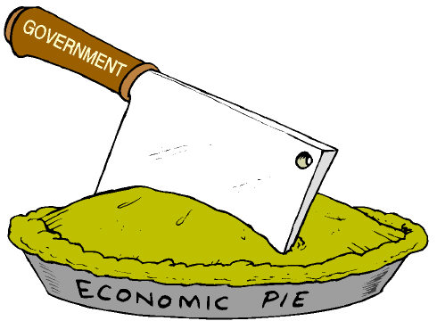
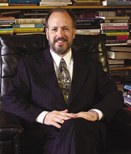

```{r setup, include=FALSE}
options(htmltools.dir.version = FALSE)
knitr::opts_chunk$set(echo=F,
                      message=F,
                      warning=F,
                      fig.retina=3,
                      fig.align = "center")
library("tidyverse")
library("ggrepel")
library("fontawesome")
xaringanExtra::use_tile_view()
xaringanExtra::use_tachyons()

theme_slides <- theme_light() + 
  theme(
    text = element_text(family = "Fira Sans", size = 24)
  )
```

# Three Projects in Law & Economics

.pull-left[

.smallest[
1. .hi-purple[Predicting consequences of law]
  - least controversial

2. .hi-purple[Predicting what law will be]
  - an empirical conjecture: law *is* efficient

3. .hi-purple[Recommending what law should be]
  - a normative project: law *should* be efficient

- You could still believe:
  - law is efficient, but should not be
  - law is not efficient, but should be
]
]

.pull-right[
.center[

]
]

---

# Positive vs. Normative Economics

.pull-left[

.hi[Positive economics]: descriptive statements about the world
  - “The Common Law *tends toward* efficiency”

.hi-purple[Normative economics]: prescriptive statements about how the world *ought to be*
  - “The Common Law *should be* efficient”
]

.pull-right[
.center[

]
]

---

# What Should the Goals of the Law Be?

.pull-left[

> “Fiat justitia ruat caelum”

- What is justice?
  - Absence of *injustices*?

- .hi-purple[Utilitarian] & .hi-purple[deontological] views of justice (among others)

]

.pull-right[
.center[

]
]

---

# Efficiency or Justice?

.left-column[
.center[


.smallest[
David D. Friedman

(1945—)
]
]
]

.right-column[
.smallest[
> “The statement that we should choose just rules, while emotionally satisfying, does not convey much information. Economic value may capture only part of what we want out of a legal system, but at least economic theory tells us how to get it. And consequences are an important part of what we want. The doctrine *fiat justicia, ruat coelum* (let justice be done though the skies fall) is, in my experience, uniformly proclaimed by people who are confident that doing justice will not, in fact, bring down the sky,” (p.22).

]
.source[Friedman, David D, 2000, *Law's Order: What Economics Has to do with Law and Why it Matters*]
]

---

# If You Remain Unconvinced

.left-column[
.center[


.smallest[
David D. Friedman

(1945—)
]
]
]

.right-column[
.smallest[
> “As we develop the economic analysis of law, we will observe a surprising correspondence between justice and efficiency. In many cases principles we think of as just correspond fairly to rules that we discover are efficient...This suggests a radical conjecture—that what we call principles of justice may actually be rules of thumb for producing an efficient outcome, rules we have somehow internalized. Whether that is a sufficient account of justice you will have to decide for yourself,” (p.22-23).

]
.source[Friedman, David D, 2000, *Law's Order: What Economics Has to do with Law and Why it Matters*]
]

---

# Posner: Common Law Is & Should Be Efficient

.left-column[
.center[


.smallest[
Richard A. Posner

1939—

Fmr. U.S. 7<sup>th</sup> Circuit Judge
]
]
]

.right-column[

- Major figure in Law & Economics field

- 1981—2017 Judge of U.S Court of Appeals for the 7<sup>th</sup> Circuit

- University of Chicago Law Professor

- Considered for U.S. Supreme Court, but too pragmatic & libertarian-ish

- The most cited legal scholar of the 20<sup>th</sup> (and 21<sup>st</sup>) Century

- Absolutely prolific scholarly output
]

---

# Posner: Common Law Is & Should Be Efficient

.left-column[
.center[


.smallest[
Richard A. Posner

1939—

Fmr. U.S. 7<sup>th</sup> Circuit Judge
]
]
]

.right-column[

- Defends Kaldor-Hicks efficiency, or “wealth-maximization” approach to law

- Notion of consent as “ex-ante compensation”

- We often consent *ex*-ante to the possibility of many *involuntary*, uncompensated losses

- .hi-green[Example]: If you buy a lottery ticket and you don't win anything, you have consented to the loss (and deserve no compensation)

.source[Posner, Richard A, 1980, “The Ethical and Political Basis of the Efficiency Norm in Common Law Adjudication,” *Hofstra Law Review* 8: 487]

]

---

# Posner: Common Law Is & Should Be Efficient

.left-column[
.center[


.smallest[
Richard A. Posner

1939—

Fmr. U.S. 7<sup>th</sup> Circuit Judge
]
]
]

.right-column[

- Imagine before we all drive, everyone got together and negotiated a liability rule for traffic accidents

- If one rule was clearly more efficient than another, we would all vote for that rule

- The rule has our *ex*-ante consent (before any accident occurs)
  - *Ex*-post, when you are a party in an accident, you only care about the rule best *for you*
  - but if that rule were more efficient, you would have supported it before the accident

.source[Posner, Richard A, 1980, “The Ethical and Political Basis of the Efficiency Norm in Common Law Adjudication,” *Hofstra Law Review* 8: 487]

]

---

# Consent as Ex-Ante Compensation: Example I

.left-column[
.center[

]
]

.right-column[
.smallest[
- Suppose there are two possible rules for accident liability
  - One favors pedestrians, one favors drivers
  - The one favoring drivers is more efficient

]

.tiny[

| Rule | Expected Payoff for Drivers | Expected Payoff for Pedestrians | Expected Payoff for Unknown in Advance|
|---:|------------:|----------------:|------------------------:|
| Strict Liability | -100 | 0 | -50 |
| Negligence | -20 | -60 | -40 |

]

.smallest[
- Posner: *before we know who we'll be*, everyone would unanimously agree to the second rule (less costly)

]
]

---

# Consent as Ex-Ante Compensation: Example II

.left-column[
.center[

]
]

.right-column[
- Consider two potential tenancy laws, one that is “tenant-friendly” and one that is “landlord-friendly”
  - might think tenants would prefer pro-tenant laws

- But rents are determined competitively!
  - tenant-friendly laws might go up to compensate
  - less rental housing available to poor tenants

- If the tenant-friendly law is less efficient, *nobody* would agree to it ex-ante (both sides harmed)

]

---

# Posner's Basic Argument

.left-column[
.center[


.smallest[
Richard A. Posner

1939—

Fmr. U.S. 7<sup>th</sup> Circuit Judge
]
]
]

.right-column[

- If we choose the most efficient legal system, everyone is “compensated *ex*-ante”, should willingly accept the outcome they get
  - buying the lottery ticket, you were compensated ahead of time for the possible loss, by the possibility that you could win big

- As members of society, our choosing efficient rules compensates us ex-ante, since these are the “lottery tickets” with the highest expected value


.source[Posner, Richard A, 1980, “The Ethical and Political Basis of the Efficiency Norm in Common Law Adjudication,” *Hofstra Law Review* 8: 487]

]

---

# Limitations to Posner’s Argument

.pull-left[

- The “lottery ticket” analogy assumes .hi-purple[risk neutrality]
  - 50% chance at $1 million is just as good as a 50% chance at $900,000 and 50% chance at $100,000

- And equal marginal utility of money
]

.pull-right[
.center[

]
]

---

# What Efficiency is Not

.pull-left[

- Highlights some of the things that efficiency is **not**:
  - equity
  - fairness
  - maximizing happiness

- A famous trade-off between efficiency and equity
]

.pull-right[
.center[

]
]

---

# Equality vs. Equity

.center[

]

---

# More Pragmatic Cases for Efficiency

.left-column[
.center[

]

.smallest[
Robert C. Ellickson
]
]

.right-column[

.smallest[
- In each situation, norms emerged which were well-suited to the environment

> “[W]hen people are situated in a close-knit group, .hi[they will tend to develop for the ordinary run of problems norms that are wealth-maximizing].”

> “A norm is wealth-maximizing when it operates to minimize the members' objective sum of (1) transaction costs, and (2) deadweight losses arising from failures to exploit potential gains from trade,” (p.84).

]


.source[Ellickson, Robert C, 1989, “A Hypothesis of Wealth-Maximizing Norms: Evidence from the Whaling Industry,” *Journal of Law, Economics, & Organization* 5(1): 83-97]

]

---

# More Pragmatic Cases for Efficiency

.left-column[

.center[

.smallest[
Steven Landsburg
]
]

]

.right-column[

.quitesmall[

> “I think economists are right to emphasize efficiency, and I think so for (at least) two reasons. First, emphasizing efficiency forces us to concentrate on the most important problems... 

> “In fact, whenever a policy is inefficient, there’s always an alternative policy that, in principle, is better for everyone. That’s what inefficiency means...

> “So maybe we don’t want to pursue this alternative policy after all. But, says the economist, we ought at least to consider it...

> “And — here’s the point — the bigger the deadweight loss, the greater the potential gains from an alternative policy. Therefore, the bigger the deadweight loss, the more it’s worth at least attempting to devise a good alternative policy. We calculate the deadweight loss as a rough but useful guide to how much effort we should put into this problem. (Calculating deadweight losses is the same thing as worrying about efficiency.)”

]

.source[Landsburg, Steven, August 30, 2011, [“Efficiency Experts”](http://www.thebigquestions.com/2010/08/30/efficiency-experts/)]

]
---

# More Pragmatic Cases for Efficiency

.left-column[

.center[

.smallest[
Steven Landsburg
]
]
]

.right-column[

.quitesmall[

“Second, emphasizing efficiency forces us to be honest about our goals...efficiency analysis strikes down political smokescreens. Like this:
]

.tiny[
> Politician: Here’s my program to make the health care system work better by subsidizing health care for the poor.

> Economist: Your program costs a billion dollars and delivers half a billion dollars worth of benefits. That’s inefficient.

> Politician: So what?

> Economist: Well, the “so what” is that maybe you could take that billion dollars and deliver a full billion dollars worth of benefits instead if you spent it a little differently. Why not just hand the cash out to poor people?

> Politician: Because I don’t want to help all poor people. I only want to help sick poor people — and this is the only way I can think of to do that.

> Economist: Ah. So your goal here is not to make the health care system work better after all. Instead it’s to transfer resources to sick poor people.

> Politician: I guess so.

> Economist: That’s fine. Now we can have a healthy debate about whether that’s what we want to do.

]

.quitesmall[
“And now, you see, thanks to the economist’s insistence on thinking about efficiency, we end up having an honest debate about the politician’s real goal instead of a dishonest debate about the politician’s feigned goal. However the debate turns out, that’s a useful exercise.”

]

.source[Landsburg, Steven, August 30, 2011, [“Efficiency Experts”](http://www.thebigquestions.com/2010/08/30/efficiency-experts/)]

]

---

# Law Is a Bad Way To Redistribute Wealth

.pull-left[

- Efficiency should not necessarily be the goal of .hi-turquoise[society]

- But efficiency should be the goal of the .hi-turquoise[legal system]

- If redistribution is desirable for justice, better to have the legal system be efficient, and redress distribution via taxes and spending
]

.pull-right[
.center[

]
]

---

# Law Is a Bad Way To Redistribute Wealth

.pull-left[
.smallest[
- Cooter & Ulen have 4 good reasons why using tax policy is superior for redistribution

1. Taxes can target “rich” and “poor” more precisely than the legal system can

2. Distributional effects of legal changes are hard to predict

3. Transaction costs are higher for using the legal system (“Lawyers are more expensive than accountants”)

4. Broad-based taxes cause less distortion than narrowly-targeted laws/policies (or equivalent taxes)
]
]

.pull-right[
.center[

]
]