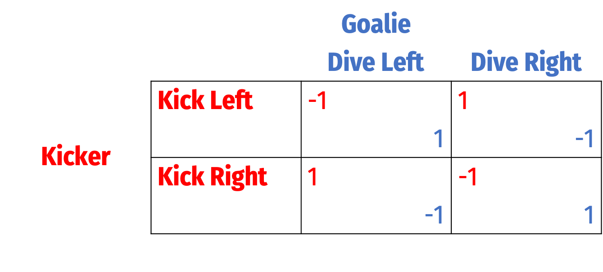
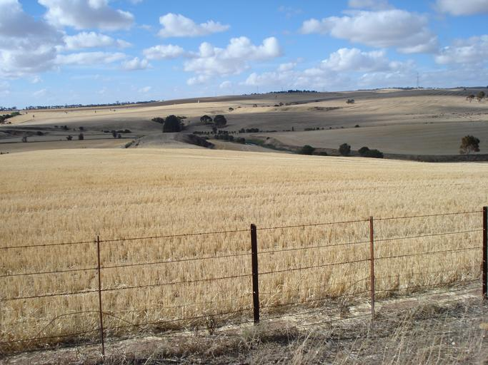
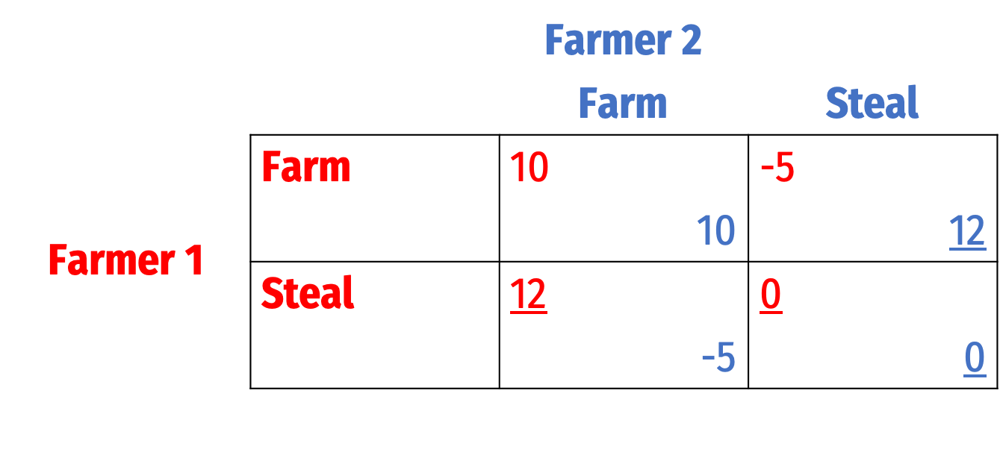
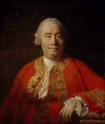
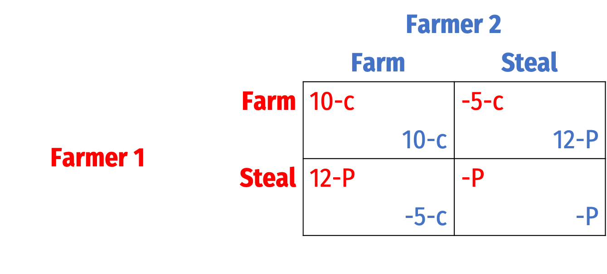
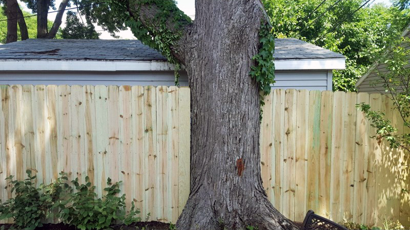
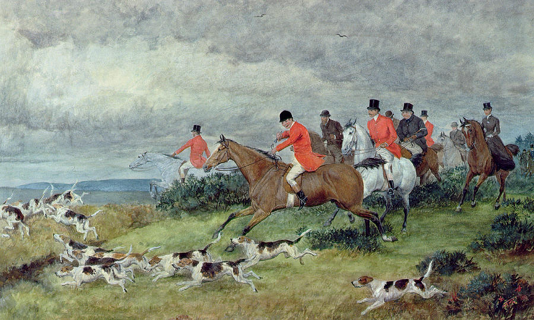
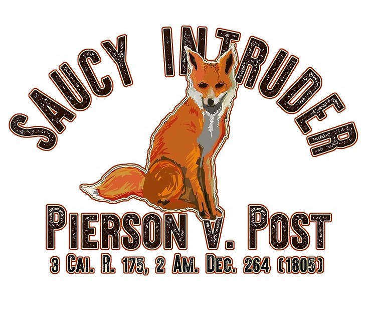

```{r setup, include=FALSE}
options(htmltools.dir.version = FALSE)
knitr::opts_chunk$set(echo=F,
                      message=F,
                      warning=F,
                      fig.retina=3,
                      fig.align = "center")
library("tidyverse")
library("ggrepel")
library("fontawesome")
xaringanExtra::use_tile_view()
xaringanExtra::use_tachyons()

theme_slides <- theme_light() + 
  theme(
    text = element_text(family = "Fira Sans", size = 24)
  )
```

class: inverse, center, middle

# Review of Static Game Theory

---

# Game Theory

.pull-left[
.center[

]
]

.pull-right[

- .hi[Game theory]: a set of tools that model .hi-purple[trategic interactions] (.hi-purple[“games”]) between rational agents, 3 elements:
    1. **Players**
    2. **Strategies** that each player can choose from
    3. **Payoffs** to each player that are *jointly-determined* from combination of all players’ strategies 

]

---

# Game Theory vs. Decision Theory Models I

.pull-left[
.center[

]
]

.pull-right[

- Traditional economic models are often called .hi[“Decision theory”]:

- .hi-purple[Optimization models] **ignore all other agents** and just focus on how can **you** maximize **your** objective within **your** constraints
  - Consumers max utility; firms max profit, etc.

- **Outcome**: .hi-purple[optimum]: decision where *you* have no better alternatives

]


---

# Game Theory vs. Decision Theory Models I

.pull-left[

.center[

]
]

.pull-right[

- Traditional economic models are often called .hi[“Decision theory”]:

- .hi-purple[Equilibrium models] assume that there are **so many agents** that **no agent’s decision can affect the outcome**
  - Firms are price-takers or the *only* buyer or seller
  - **Ignores all other agents’ decisions**!

- **Outcome**: .hi-purple[equilibrium]: where *nobody* has no better alternatives

]

---

# Game Theory vs. Decision Theory Models III

.pull-left[
.center[

]
]

.pull-right[

- .hi[Game theory models] directly confront .hi-purple[strategic interactions] between players
  - How each player would optimally respond to a strategy chosen by other player(s)
  - Lead to a stable outcome where everyone has considered and chosen mutual best responses

- .hi-purple[Nash equilibrium]: set of strategy profiles where *nobody* wants to switch strategies *given the strategies everyone else is playing*
  - each player is playing a **best response** against other players’ strategies

]

---

# As a Prisoner's Dilemma I

.pull-left[
.center[


]
]

.pull-right[

- Suppose we have a simple **duopoly** between .hi-red[Apple] and .hi-blue[Google]

- Each is planning to launch a new tablet, and choose to sell it at a **High Price** or a **Low Price**

]


---

# As a Prisoner's Dilemma I

.pull-left[

- Payoff matrix represents profits to each firm
  - First number in each box goes to .hi-red[Row player (Apple)]
  - Second number in each box goes to .hi-blue[Column player (Google)]
]

.pull-right[
.center[

]
]
---

# As a Prisoner's Dilemma II

.pull-left[

- From .hi-red[Apple]'s perspective:
  - .hi-red[Low Price] is a .hi-purple[dominant strategy] for .hi-red[Apple]

]

.pull-right[
.center[

]
]

---

# As a Prisoner's Dilemma II

.pull-left[

- From Google's perspective:
  - .hi-blue[Low Price] is a .hi-purple[dominant strategy] for .hi-blue[Google]

]

.pull-right[
.center[

]
]

---

# As a Prisoner's Dilemma II

.pull-left[

- .hi[Nash equilibrium]: (.hi-red[Low Price], .hi-blue[Low Price])
  - neither player has an incentive to change price, *given the other's price*

]

.pull-right[
.center[


]
]

---

# As a Prisoner's Dilemma III

.pull-left[

- .hi[Nash equilibrium]: (.hi-red[Low Price], .hi-blue[Low Price])
  - neither player has an incentive to change price, *given the other's price*
  
- A possible **Pareto improvement**: (.hi-red[High Price], .hi-blue[High Price])
  - Both players are better off, nobody worse off!
  - Is it a Nash Equilibrium?

]

.pull-right[
.center[


]
]

---

# As a Prisoner's Dilemma IV

.pull-left[

- Google and Apple could .hi-purple[collude] with one another and agree to both raise prices

- .hi[Cartel]: group of sellers coordinate to raise prices to act like a collective monopoly and split the profits	

]

.pull-right[

.center[

]
]

---

# Game Theory: Some Generalizations

.pull-left[
.center[

]
]

.pull-right[

There's a *lot* more to game theory than a one-shot prisoners' dilemma:

- one shot vs. repeated game

- discrete vs. continuous strategies

- perfect vs. incomplete vs. and asymmetric information

- simultaneous vs. sequential game

- See my [game theory course](https://ryansafner.com/courses/econ316/) for more (likely taught next in Fall 2021)
]

---

# Solution Concepts

.pull-left[
.center[

]
]

.pull-right[

- We use .hi-purple["solution concepts"] to allow us to predict an .hi-purple[equilibrium] of a game

- .hi[Nash Equilibrium] is the primarly solution concept
  - Note it has *many* variants depending on if games are sequential vs. simultaneous, perfect vs. imperfect information, etc.

]

---

# Solution Concepts: Nash Equilibrium

.pull-left[
.center[

]
]

.pull-right[

- Recall, .hi[Nash Equilibrium]: no players want to change their strategy given what everyone else is playing
  - All players are playing a best response to each other

]

---

# Solution Concepts: Nash Equilibrium

.pull-left[
.center[

]
]

.pull-right[

- Important about Nash equilibrium:

1. N.E. $\neq$ the "*best*" or *optimal* outcome
  - Recall the Prisoners' Dilemma!

2. Game may have *multiple* N.E.

3. Game may have *no* N.E. (in "pure" strategies)

]

---

# Example: Coordination Game

.pull-left[
.center[

]
]

.pull-right[

- A .hi-purple[Coordination Game]
  - No dominant strategies

]

---

# Example: Coordination Game

.pull-left[
.center[

]
]

.pull-right[

- .hi-purple[Two Nash equilibria]: (.red[A],.blue[A]) and (.red[B],.blue[B])
  - Either just as good
  - Coordination is most important

]

---

# Example: Coordination Game

.pull-left[
.center[

]
]

.pull-right[

- Two general methods to solve for Nash equilibria:

.hi-purple[1) Cell-by-Cell Inspection]: look in each cell, does either player want to deviate?
  - .hi-purple[If no: a Nash equilibrium]
  - If yes: *not a Nash equilibrium*

]

---

# Example: Coordination Game

.pull-left[
.center[

]
]

.pull-right[

- Two general methods to solve for Nash equilibria:

.hi-purple[2) Best-Response Analysis]: take the perspective of each player. If the other player plays a particular strategy, what is your strategy(s) that gets you the highest payoff?
  - Ties are allowed
  - .hi-purple[Any cell where both players are playing a best response is a Nash Equilibrium]

]

---

# Example: Coordination Game

.pull-left[
.center[


.red[Player 1's] best responses
]
]

.pull-right[

- Two general methods to solve for Nash equilibria:

.hi-purple[2) Best-Response Analysis]: take the perspective of each player. If the other player plays a particular strategy, what is your strategy(s) that gets you the highest payoff?
  - Ties are allowed
  - .hi-purple[Any cell where both players are playing a best response is a Nash Equilibrium]

]

---

# Example: Coordination Game

.pull-left[
.center[


.blue[Player 2's] best responses
]
]

.pull-right[

- Two general methods to solve for Nash equilibria:

.hi-purple[2) Best-Response Analysis]: take the perspective of each player. If the other player plays a particular strategy, what is your strategy(s) that gets you the highest payoff?
  - Ties are allowed
  - .hi-purple[Any cell where both players are playing a best response is a Nash Equilibrium]

]

---

# Example: Coordination Game

.pull-left[
.center[


.hi-purple[N.E.]: each player is playing a best response
]
]

.pull-right[

- Two general methods to solve for Nash equilibria:

.hi-purple[2) Best-Response Analysis]: take the perspective of each player. If the other player plays a particular strategy, what is your strategy(s) that gets you the highest payoff?
  - Ties are allowed
  - .hi-purple[Any cell where both players are playing a best response is a Nash Equilibrium]

]

---

# A Change in the Game

.pull-left[
.center[

]
]

.pull-right[

- Two Nash equilibria again: (.red[A],.blue[A]) and (.red[B],.blue[B])

- But here (.red[A],.blue[A]) $\succ$ (.red[B],.blue[B])!

]

---

# A Change in the Game

.pull-left[
.center[

]
]

.pull-right[
- .hi-purple[Path Dependence]: early choices may affect later ability to choose or switch

- .hi-purple[Lock-in]: the switching cost of moving from one equilibrium to another becomes prohibitive

- Suppose we are currently in equilibrium (B,B)

- .hi-purple[Inefficient lock-in]:
  - Standard A is superior to B
  - But too costly to switch from B to A

]

---

# Some Games Have No Nash Equilibrium

.pull-left[

.center[

]
]

---

# Some Games Have No Nash Equilibrium

.pull-left[

.center[

]
]

.pull-right[

- Best responses

- No strategy profile where both players are playing a best responses

- No Nash Equilibrium in .hi-purple[“pure strategies”]

- But there is (always) a Nash Equilibrium in .hi-turquoise[“mixed strategies”]
]

---

class: inverse, center, middle

# The Problem, Philosophically, and Game-Theoretically

---

# Why Do We Need Property Law?

.pull-left[

- A solution to the tragedy of the commons

- Imagine two neighboring farmers
  - game theoretic interaction
  - each farmer can either .hi-purple[Farm] or .hi-purple[Steal]
]

.pull-right[
.center[

]
]

---

# Why Do We Need Property Law?

.pull-left[

- Suppose:
  - crops are valued at 15
  - planting & watering costs 5
  - stealing costs 3

]

.pull-right[
.center[

]
]

---

# Why Do We Need Property Law?

.pull-left[

- Suppose:
  - crops are valued at 15
  - planting & watering costs 5
  - stealing costs 3

- With no legal system, the game looks like:

]

.pull-right[
.center[

]
]

---

# Why Do We Need Property Law?

.pull-left[

- .hi-purple[Nash Equilibrium]: (.red[Steal],.blue[Steal])

]

.pull-right[
.center[

]
]

---

# The Hobbesian Dilemma

.left-column[
.center[


Thomas Hobbes

1588-1679
]
]

.right-column[

> "In [the state of nature], there is no place for Industry; because the fruit thereof is uncertain; and consequently no Culture of the Earth...no Knowledge of the face of the Earth; no account of Time; no Arts; no Letters; no Society; and which is worst of all, continuall feare, and danger of violent death; .ji[And the life of man, solitary, poore, nasty, brutish, and short], (Ch. XVIII).
]

.source[Hobbes, Thomas, 1651, [*Leviathan: Or the Matter, Forme and Power of a Commonwealth, Ecclesiasticall and Civil*](https://www.gutenberg.org/files/3207/3207-h/3207-h.htm)]

---

# The Hobbesian Dilemma

.left-column[
.center[


Thomas Hobbes

1588-1679
]
]

.right-column[

> "And because the condition of man...is a condition of .hi[war of every one against every] one...it followeth that in such a condition .hi[every man has a right to every thing, even to one another's body]. And therefore, as long as this natural right of every man to every thing endureth, .hi[there can be no security to any man]...The .hi[first fundamental law of nature] is: .hi[to seek peace and follow it] (Ch. XVIV).
]

.source[Hobbes, Thomas, 1651, [*Leviathan: Or the Matter, Forme and Power of a Commonwealth, Ecclesiasticall and Civil*](https://www.gutenberg.org/files/3207/3207-h/3207-h.htm)]

---

# The Hobbesian Dilemma

.left-column[
.center[


Thomas Hobbes

1588-1679
]
]

.right-column[

> "For the Lawes of Nature (as Justice, Equity, Modesty, Mercy, and (in summe) Doing To Others, As Wee Would Be Done To,) if themselves, without the terrour of some Power, to cause them to be observed, are contrary to our naturall Passions, that carry us to Partiality, Pride, Revenge, and the like. And .hi[Covenants, without the Sword, are but Words, and of no strength to secure a man at all], (Ch. XVIII).
]

.source[Hobbes, Thomas, 1651, [*Leviathan: Or the Matter, Forme and Power of a Commonwealth, Ecclesiasticall and Civil*](https://www.gutenberg.org/files/3207/3207-h/3207-h.htm)]

---

# The Hobbesian Dilemma 

.pull-left[

- .hi[Nash equilibrium]: everyone *steals*! 

- Pareto-improvement: (.red[Farm],.blue[Farm])
  - This is the .hi-purple[socially optimal equilibrium]

- Hobbes' insight: .hi-purple[no _individual_ has an incentive to farm when everyone steals!]

]

.pull-right[
.center[

]
]

---

# The Hobbesian Solution

.left-column[
.center[


Thomas Hobbes

1588-1679
]
]

.right-column[

> "It is a real unity of them all in one and the same person, made by covenant of every man with every man, in such manner as ife every man should say to every man: .hi[I authorise and give up my right of governing myself to this man, or to this assembly of men, on this condition; that thou give up, thy right to him, and authorise all his actions in like manner]. This done, the multitude so united in one person is called a .hi[COMMONWEALTH]," (Ch. XVII).

]

.source[Hobbes, Thomas, 1651, [*Leviathan: Or the Matter, Forme and Power of a Commonwealth, Ecclesiasticall and Civil*](https://www.gutenberg.org/files/3207/3207-h/3207-h.htm)]

---

# The Hobbesian Solution

.center[

]

---

# The Hobbesian Solution Is Not the Only Solution

.left-column[
.center[


David Hume

1711-1776
]
]

.right-column[

> But although men can maintain a small uncultivated society without government, they can’t possibly maintain a society of any kind without justice, i.e. without obeying the three fundamental laws concerning the stability of ownership, its transfer by consent, and the keeping of promises.


.source[Hume, David, 1751, *Enquiry Concerning the Principles of Morals*]

]

---

# Why Do We Need Property Law?

.pull-left[

- Suppose there are many farmers that face the same problem

- They recognize that establishing rules of property and punishing theft gets them the Pareto improvement
  - Setting up a property law system (and someone to enforce it) has costs $c$
  - The punishment to theft is $P$

- If $10-c>12-P$, then (.red[Farm],.blue[Farm]) becomes an equilibrium
]

.pull-right[
.center[

]
]

---

# Government Exists to Protect Property Rights

.left-column[
.center[


.smallest[
John Locke

1632-1704
]
]
]

.right-column[

.smallest[
> "Why will he part with his freedom? ... Though .hi[in the state of nature he hath such a right, yet the enjoyment of it is very uncertain, and constantly exposed to the invasion of others]...the enjoyment of the property he has in this state is very unsafe very unsecure....hi[[He] is willing to join in society with others...for the mutual preservation of their lives, liberties, and estates], which I call by the general name, .hi[property.]" (Ch. IX).

> "The great and chief end, therefore, of men's uniting into commonwealths, and putting themselves under government, is the preservation of their property." (Ch. IX).

]

.source[Locke, John, 1689, *Second Treatise on Government*]
]

---

class: inverse, center, middle

# Property Law

---

# Property Rights

.pull-left[
.smaller[
> “Property is a bundle of legal rights over resources that the owner is free to exercise and whose exercise is protected from interference by others” (Cooter and Ulen, p.73)

- This bundle contains a lot of rights, to:

> possess, use, develop, improve, transform, consume, deplete, destroy, sell, donate, bequeath, transfer, mortgage, lease, loan, or exclude others

]
]

.pull-right[
.center[

]
]

---

# Property Rights

.pull-left[

- Three important legal points about property rights:
  1. These rights are .hi[impersonal] — they attach to property, not persons
  2. Owner is free to exercise rights over her property (law neither forbids nor obliges)
  3. Others are forbidden to interfere with owner’s exercise of her rights

]

.pull-right[
.center[

]
]

---

# Property Rights

.pull-left[
- Any property system must answer:
  1. What can be privately owned?
  2. What can (and can't) an owner do with her property?
  3. How are property rights established?
  4. What remedies are available when property rights are violated?
]

.pull-right[
.center[

]
]

---

# It's Not So Simple: A Story

.center[

]

---

# It's Not So Simple: A Story

.pull-left[
.center[

]
]

--

.pull-right[
.center[

]
]

---

# This Story Has Million Dollar Implications

.pull-left[
.center[


*Fontainebleau Hotel Corp. v. Forty-Five Twenty-Five, Inc* (1959) 114 So. 2d 357, 1959 Fla. App.
]
]

.pull-right[
.center[

]

.source[Source: [Florida Trend (2014)](https://www.floridatrend.com/article/17938/the-spite-wall-between-the-fontainbleau-and-the-eden-roc)]
]

---

# “The Fox Case”

.pull-left[
.smaller[
- In 1802, .hi-turquoise[Lodowick Post] organized a fox hunt in Southampton, NY
  - His dogs caught the scent, and he gave chase to a fox

- .hi-purple[Jesse Pierson] appears “out of nowhere,” kills, and claims the fox for his own
  - Claims not to have seen Post

- .hi-turquoise[Post] sued .hi-purple[Pierson] to get the fox back
  - Lower court sided with .hi-turquoise[Post]; .hi-purple[Pierson] appealed to NY Supreme Court
]
]
.pull-right[
.center[

]
]

---

# “The Fox Case”

.left-column[
.center[

]
]

.right-column[

- Legal question: When do you own an animal?

- NY Supreme Court ruled for .hi-purple[Pierson] (who killed fox)

.quitesmall[
> “If the first seeing, starting, or pursuing such animals...should afford the basis of actions against others for intercepting and killing them, .hi[it would prove a fertile source of quarrels and litigation]”

> “However uncourteous or unkind the conduct of Pierson towards Post, in this instance, may have been, yet his act was productive of no injury or damage for which a legal remedy can be applied. We are of opinion the judgment below was erroneous, and ought to be reversed.”

]
]


---

# “The Fox Case”

.left-column[
.center[

]
]

.right-column[

- Judge Livingston’s dissent:

.quitesmall[
> “[A] fox is a "wild and noxious beast." Both parties have regarded him, as the law of nations does a pirate, *"hostem humani generis,"*...His depredations on farmers and on barn yards, have not been forgotten; and to put him to death wherever found, is allowed to be meritorious, and of public benefit. Hence it follows, that our decision should have in view the greatest possible encouragement to the destruction of an animal, so cunning and ruthless in his career.”

> “But who would keep a pack of hounds; or what gentleman, at the sound of the horn, and at peep of day, would mount his steed, and for hours together...pursue the windings of this wily quadruped, if, just as night came on, and his stratagems and strength were nearly exhausted, a saucy intruder, who had not shared in the honours or labours of the chase, were permitted to come in at the death, and bear away in triumph the object of pursuit?”

]
]


---

# What Rule?

.pull-left[

- If .hi-purple[Pierson] gets the fox
  - simpler rule: “finders keepers”
  - bright-line, easy to implement, discourages disputes

- If .hi-turquoise[Post] gets the fox
  - better incentives for hunting hard-to-catch noxious animals (like foxes)

- Same tradeoff between simplicity and good incentives as the whaling cases!
]

.pull-right[
.center[

]
]
