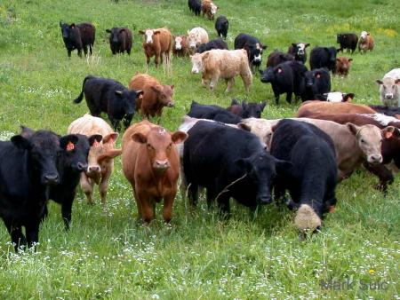
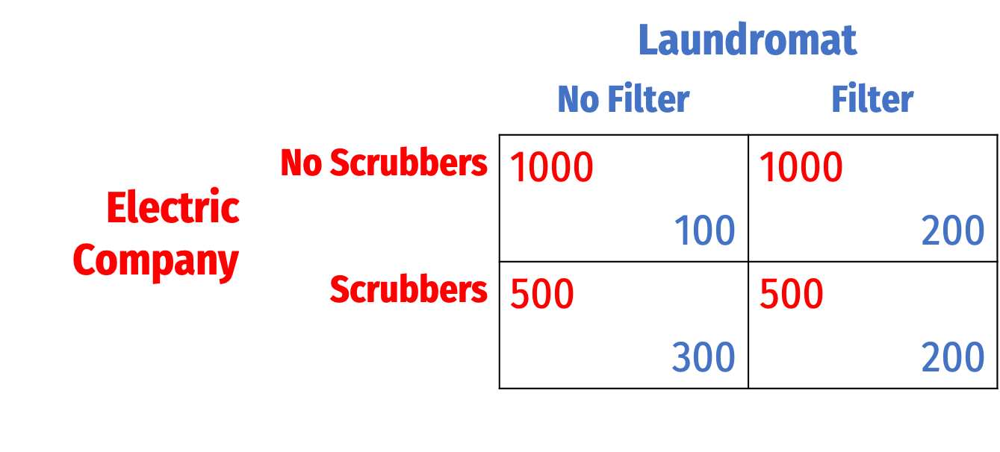
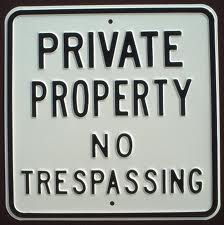
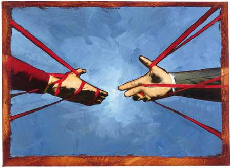

```{r setup, include=FALSE}
options(htmltools.dir.version = FALSE)
knitr::opts_chunk$set(echo=F,
                      message=F,
                      warning=F,
                      fig.retina=3,
                      fig.align = "center")
library("tidyverse")
library("ggrepel")
library("fontawesome")
xaringanExtra::use_tile_view()
xaringanExtra::use_tachyons()

theme_slides <- theme_light() + 
  theme(
    text = element_text(family = "Fira Sans", size = 24)
  )
```

class: inverse

# Outline

### [Remedies: Injunctions vs. Damages](#7)
### [Unalienability](#35)

---

# Two Normative Approaches to Law & Economics

.pull-left[

.smaller[
Design the law to:

1) .hi-purple[Minimize the <u>cost of</u> bargaining]
  - .hi[Normative Coase]: “Structure the law so as to remove the impediments to private bargaining”

2) .hi-purple[Minimize the <u>need for</u> bargaining]
  - .hi[Normative Hobbes]: “Structure the law so as to minimize the harm caused by failures in private agreements”

]
]

.pull-right[
.center[

]
]

---

# Two Normative Approaches to Law & Economics

.pull-left[
.smallest[

- Compare the .hi-turquoise[costs] of each approach
  - **Normative Coase**: .hi-turquoise[cost of bargaining], lubricate private exchange
  - **Normative Hobbes**: .hi-turquoise[information costs] of determining how to efficiently allocate property rights
]

.smaller[

- When .hi-purple[transaction costs are low] and .hi-purple[information costs are high], structure the law so as to .hi-purple[minimize transaction costs]

- When .hi-purple[transaction costs are high] and .hi-purple[information costs are low], structure the law so as to .hi-purple[allocate property rights to whomever values them the most]

]
]

.pull-right[
.center[

]
]

---

# What Would an Efficient Property Law Look Like?

.pull-left[
- Recall the 4 questions any property system must answer:

1. What can be privately owned?

2. What can (and can't) an owner do with her property?

3. How are property rights established?

4. What remedies are available when property rights are violated?

]

.pull-right[
.center[

]
]

---

# What Would an Efficient Property Law Look Like?

.pull-left[
- Recall the 4 questions any property system must answer:

1. What can be privately owned?

2. What can (and can't) an owner do with her property?

3. How are property rights established?

4. .hi-purple[What remedies are available when property rights are violated?]

]

.pull-right[
.center[

]
]

---

class: inverse, center, middle

# Remedies: Injunctions vs. Damages

---

# Some Common Law Terms & History

.pull-left[
.quitesmall[
- .hi[Legal remedy]: focuses on relief via payment of money compensation for damages to “make the Plaintiff whole”
  - grew out of Courts of Law

- .hi[Equitable remedy]: an order by the court to provide relief requiring the Defendant perform (or refrain from) some action
  - grew out of the Court of Chancery, originally made to streamline
  - most typically, an .hi[injunction] which .hi[enjoins] party to (not) perform a specific action

- A court ruling on a case may provide *both* types of relief
  - Note legal remedies are “backward-looking” vs. equitable remedies are “forward-looking”
]
]

.pull-right[
.center[

]
]

---

# Some Common Law Terms & History

.pull-left[

- We often summarize by referring to the difference between:

- .hi[“Property rule”]: equitable relief for .hi-purple[appropriation], .hi-purple[trespass], .hi-purple[interfering] with another's property
  - More common in law of property

- .hi[“Liability rule”]: damages awarded for broken promises and accidents
  - More common in law of contracts & torts
]

.pull-right[
.center[

]
]

---

# Applied to Our Farmer-Rancher Example

.pull-left[

- With Rancher's cattle straying onto Farmer's crops

- .hi[Liability rule]: Court may require Rancher to compensate Farmer for .hi-purple[damages]

- .hi[Property rule]: Court may .hi-purple[enjoin] Rancher from letting cattle trespass onto Farm (if Farmer found to have property right to be free of cattle's interference)
]

.pull-right[
.center[



]
]

---

# Calabresi & Melamed on Efficient Remedies

.left-column[
.center[


.smallest[
Guido Calabresi

1932—

Fmr. U.S. 2<sup>nd</sup> Circuit Judge
]
]
]

.right-column[

- **Guido Calabresi**: Major figure in Law & Economics field
  - 1994—2009 Judge of U.S Court of Appeals for the 2<sup>nd</sup> Circuit
  - Yale Law Professor

- **A. Douglas Melamed**: Stanford Law professor specializing in antitrust law; general counsel of Intel; antitrust lawyer

- Along with Coase (1960), one of the first applications of a consistent framework to unify property, contract, and (esp.) tort law

]

---

# Calabresi & Melamed on Efficient Remedies

.left-column[
.center[


.smallest[
Guido Calabresi

1932—

Fmr. U.S. 2<sup>nd</sup> Circuit Judge
]
]
]

.right-column[

- How are property rights .hi-purple[enforced]? What .hi-purple[remedies] are used when rights are violated?

- C&M: Treat property and liability law (different areas) under common framework

- Both are cases of .hi[entitlements]
  - is the Farmer .hi[entitled] to land free from trespassing animals?
  - is the Rancher .hi[entitled] to the natural actions of her cattle?
]

---

# Three Ways to Protect Entitlements

.left-column[
.center[


.smallest[
Guido Calabresi

1932—

Fmr. U.S. 2<sup>nd</sup> Circuit Judge
]
]
]

.right-column[
.smallest[
1. .hi[Property] rule/.hi[injunctive] relief
  - violation of entitlement punished as a .hi-turquoise[crime] (not mere restitution owed)
  - but entitlement is .hi-turquoise[negotiable] (owner can choose to sell or not exercise the right)

2. .hi[Liability] rule/.hi[damages]
  - violations of entitlement require .hi-turquoise[compensation]
  - Defendant pays .hi-turquoise[damages] to make the Plaintiff whole

3. .hi[Inalienability] rule
  - violations are punished as a .hi-turquoise[crime]
  - but entitlement **cannot** be sold or waived
]
]

---

# Calabresi & Melamed on Efficient Remedies

.left-column[
.center[


.smallest[
Guido Calabresi

1932—

Fmr. U.S. 2<sup>nd</sup> Circuit Judge
]
]
]

.right-column[

- What rule is more efficient?
  - Again: with low transaction costs, Coase reminds is it would not matter!

- But the different rules will still lead to different distributions, and there are transaction costs to worry about

]
---

# Calabresi & Melamed on Efficient Remedies

.left-column[
.center[


.smallest[
Guido Calabresi

1932—

Fmr. U.S. 2<sup>nd</sup> Circuit Judge
]
]
]

.right-column[
- .hi[Liability] (damages) rule is more favorable to the Defendant (injurer)
  - injurer has higher BATNA — has option to just violate and compensate

- .hi[Property] rule is more favorable to the Plaintiff (injuree)
  - punishment is severe
  - if two sides need to negotiate, injurer's BATNA is lower
]

---

# Comparing Injunctive Relief to Damages: Example

.pull-left[
.smallest[
.bg-washed-green.b--dark-green.ba.bw2.br3.shadow-5.ph4.mt5[
.hi-green[Example]: An .red[electric company (E)] emits smoke, which dirties the laundry at a nearby .blue[laundromat (L)]. Suppose:
]

- .red[E] earns profits of .red[1,000]
- Without smoke, .blue[L] would earn profits of .blue[300]
- Smoke reduces L's profits from .blue[300] to .blue[100]
- .red[E] could install scrubbers to cease pollution at cost .red[-500]
- .blue[L] could prevent smoke damage by installing a filter at cost .blue[-100]
]
]

.pull-right[
.center[

]
]

---

# Comparing Injunctive Relief to Damages: Example

.pull-left[
.smallest[
.bg-washed-green.b--dark-green.ba.bw2.br3.shadow-5.ph4.mt5[
.hi-green[Example]: An .red[electric company (E)] emits smoke, which dirties the laundry at a nearby .blue[laundromat (L)]. Suppose:
]

- .red[E] earns profits of .red[1,000]
- Without smoke, .blue[L] would earn profits of .blue[300]
- Smoke reduces L's profits from .blue[300] to .blue[100]
- .red[E] could install scrubbers to cease pollution at cost .red[-500]
- .blue[L] could prevent smoke damage by installing a filter at cost .blue[-100]
]
]

.pull-right[
.center[


]
]

---

# Comparing Injunctive Relief to Damages: Example

.pull-left[
.smallest[
- Consider the non-cooperative outcomes

1. Polluter's rights (.hi[no remedy])
  - .red[E] earns .red[1,000]
  - .blue[L] installs filters, earns .blue[300-100=200]
]
]
.pull-right[
.center[

]
]

---

# Comparing Injunctive Relief to Damages: Example

.pull-left[
.smallest[
- Consider the non-cooperative outcomes

1. Polluter's rights (.hi[no remedy])
  - .red[E] earns .red[1,000]
  - .blue[L] installs filters, earns .blue[300-100=200]

2. .blue[Laundromat] has right to .hi[damages]
  - .red[E] earns .red[1,000-200=800]
  - .blue[L] earns .blue[100+100=300]
]
]
.pull-right[
.center[

]
]

---

# Comparing Injunctive Relief to Damages: Example

.pull-left[
.smallest[
- Consider the non-cooperative outcomes

1. Polluter's rights (.hi[no remedy])
  - .red[E] earns .red[1,000]
  - .blue[L] installs filters, earns .blue[300-100=200]

2. .blue[Laundromat] has right to .hi[damages]
  - .red[E] earns .red[1,000-200=800]
  - .blue[L] earns .blue[100+100=300]

3. .blue[Laundromat] has right to .hi[injunction]
  - .red[E] installs .bred[scrubbers], earns .red[1,000-500=500]
  - .blue[L] earns .blue[300]
]
]

.pull-right[
.center[

]
]

---

# Noncooperative Payoffs

|    | Polluter's Rights | Damages | Injunction |
|----|------------------:|--------:|-----------:|
| .red[E] payoff (non-coop) | .red[1,000] | .red[800] | .red[500] |
| .blue[L] payoff (non-coop) | .blue[200] | .blue[300] | .blue[300] |
| **Joint payoff (non-coop)** | **1,200** | **1,100** | **800** |

- Polluter's rights is most efficient in non-cooperative case (no bargains)
  - .blue[L] buys .blue[filters] to reduce smoke damage (cheapest)
  - Maximized joint payoff
  
---

# Payoffs with Potential Bargaining

|    | Polluter's Rights | Damages | Injunction |
|----|------------------:|--------:|-----------:|
| .red[E] payoff (non-coop) | .red[1,000] | .red[800] | .red[500] |
| .blue[L] payoff (non-coop) | .blue[200] | .blue[300] | .blue[300] |
| **Joint payoff (non-coop)** | **1,200** | **1,100** | **800** |
| .hi-purple[Gains from cooperation] | .purple[0] | .purple[100] | .purple[400] |

.smaller[
- What if they were to bargain from these outcomes?
  - **Polluter's Rights**: No gains to be had (already efficient outcome)
  - **Damages**: .purple[100] to be gained (.red[E] was paying .red[-200] to reduce damage that can be prevented at .blue[-100] by .blue[L])
  - **Injunction**: .purple[400] to be gained (.red[E] was paying .red[-500] to reduce damage that can be prevented at .blue[-100] by .blue[L])
]
---

# Payoffs with Potential Bargaining

|    | Polluter's Rights | Damages | Injunction |
|----|------------------:|--------:|-----------:|
| .red[E] payoff (non-coop) | .red[1,000] | .red[800] | .red[500] |
| .blue[L] payoff (non-coop) | .blue[200] | .blue[300] | .blue[300] |
| **Joint payoff (non-coop)** | **1,200** | **1,100** | **800** |
| .hi-purple[Gains from cooperation] | .purple[0] | .purple[100] | .purple[400] |

- Again, for simplicity, assume parties split any .hi-purple[gains from cooperation] 50-50

---

# Payoffs with Potential Bargaining

|    | Polluter's Rights | Damages | Injunction |
|----|------------------:|--------:|-----------:|
| .red[E] payoff (non-coop) | .red[1,000] | .red[800] | .red[500] |
| .blue[L] payoff (non-coop) | .blue[200] | .blue[300] | .blue[300] |
| **Joint payoff (non-coop)** | **1,200** | **1,100** | **800** |
| .hi-purple[Gains from cooperation] | .purple[0] | .purple[100] | .purple[400] |
| .red[E] payoff (deal) | .red[1,000] | .red[850] | .red[700] |
| .blue[L] payoff (deal) | .blue[200] | .blue[350] | .blue[500] |
| **Joint payoff (deal)** | **1,200** | **1,200** | **1,200** |

- Gains from cooperation larger under Injunction than Damages (.red[E] has lower BATNA)
- .hi-turquoise[Coase Theorem] again implies we get the same efficient outcome, max'ed joint payoffs under any rule

---

# Comparing Damages and Injunctions

.pull-left[

- Injunctions are generally cheaper for court to administer
  - no need to estimate value of harm done

- But damages are generally more efficient when bargaining is unlikely

|    | Damages | Injunction |
|----|--------:|-----------:|
| .red[E] payoff (non-coop) | .red[800] | .red[500] |
| .blue[L] payoff (non-coop) | .blue[300] | .blue[300] |
| **Joint payoff (non-coop)** | **1,100** | **800** |

]

.pull-right[
.center[

]
]

---

# Comparing Damages and Injunctions

.pull-left[

- In general, three possible outcomes: injurer prevents harm, injuree prevents harm, or nobody prevents harm (injurer pays damages for it instead)
  - Efficient outcome is the cheapest of the three
  - **Damages**: injurer can prevent harm or compensate for it, injurer chooses whatever is cheapest
  - **Injunction**: injurer can only prevent harm
]

.pull-right[
.center[

]
]

---

# Summing Up Damages and Injunctions

.pull-left[

- So per Coase (1960), any rule leads to efficiency under no transaction costs

- Injunctions are cheaper to implement

- Damages lead to more efficient outcomes when transaction costs are high

]

.pull-right[
.center[

]
]

---

# Calabresi & Melamed on Efficient Remedies

.left-column[
.center[


.smallest[
Guido Calabresi

1932—

Fmr. U.S. 2<sup>nd</sup> Circuit Judge
]
]
]

.right-column[

- When .hi-purple[transaction costs are low], a .hi[property rule] (injunctive relief) is more efficient

- When .hi-purple[transaction costs are high], a .hi[liability rule] (damages) is more efficient


]

---

# This is Consistent With Before

.pull-left[
.smallest[

- When .hi-purple[transaction costs are low] and .hi-purple[information costs are high], structure the law so as to .hi-purple[minimize transaction costs]
  - .hi[Property] rule does this: clarify right and allow trade

- When .hi-purple[transaction costs are high] and .hi-purple[information costs are low], structure the law so as to .hi-purple[allocate property rights to whomever values them the most]
  - .hi[Liability] rule does this: give injurer right to violate entitlement when efficient, even without prior consent

]
]

.pull-right[
.center[

]
]

---

# This is Consistent With Our Previous Principle

> “Private bargaining is unlikely to succeed in disputes involving a large number of geographically dispersed strangers because communication costs are high, monitoring is costly, and strategic behavior is likely to occur.”

> “.hi[Large numbers of land owners] are typically affected by .hi[nuisances], such as air pollution or the stench from a feedlot. In these cases, .hi[damages are the preferred remedy].”

> “On the other hand, .hi[property disputes generally involve a small number of parties who live near each other] and can monitor each others’ behavior easily after reaching a deal; so .hi[injunctive relief is usually used] in these cases.”

.source[Cooter and Ulen]

---

# Injunctive Relief for When Transaction Costs are Low

.pull-left[

- Cheaper for court to administer

- With low transaction costs, we expect parties to bargain when right is inefficiently allocated

]

.pull-right[
.center[

]
]

---

# Injunctive Relief for When Transaction Costs are Low

.pull-left[

- Cheaper for court to administer

- With low transaction costs, we expect parties to bargain when right is inefficiently allocated

- .hi-purple[But do they?]
]

.pull-right[
.center[

]
]

---

# Injunctive Relief for When Transaction Costs are Low

.pull-left[
.smallest[
> “When transaction costs preclude bargaining, the court should protect a right by an injunctive remedy if it knows which party values the right relatively more and it does not know how much either party values it absolutely.”

> “Conversely, the court should protect a right by a damages remedy if it knows how much one of the parties values the right absolutely and it does not know which party values it relatively more.”
]


.source[Cooter and Ulen]

]

.pull-right[
.center[

]
]

---

# Damages for When Transaction Costs are High

.pull-left[
.smallest[
- Examine 20 nuisance cases; found no bargaining made after court judgment 

> “In almost every case the lawyers said that acrimony between the parties was an important obstacle to bargaining...Frequently the parties were not on speaking terms...The second recurring obstacle involves the parties’ disinclination to think of the rights at stake… as readily commensurable with cash.”

]

.source[Farnsworth, Ward, 1999, “Do Parties to Nuisance Cases Bargain After Judgment?  A Glimpse Inside The Cathedral”]

]

.pull-right[
.center[

]
]

---

class: inverse, center, middle

# Unalienability


---

# Third Way to Protect Entitlements: Unalienability Rule

.left-column[
.center[


.smallest[
Guido Calabresi

1932—

Fmr. U.S. 2<sup>nd</sup> Circuit Judge
]
]
]

.right-column[

- .hi[Inalienability]: when an entitlement is not transferable or sellable (regardless of consent)
  - Entitlement not see as “property”

- .hi-green[Examples]: sex, kidneys, cocaine, babies, nuclear weapons, votes

- Often the result of statutes governing “health, safety, and morals” for the public good, .hi[paternalism]
]

---

# Unalienability

.pull-left[

- From a Coasian perspective, this does not appear to make sense
  - Let people trade their entitlements as they please to achieve efficient allocation!

- Does makes more sense in certain scenarios (when allocating rights imposes an externality)

]

.pull-right[
.center[

]
]

---

# Unalienability

.pull-left[

- .hi-green[Example 1]: enriched uranium

]

.pull-right[
.center[

]
]

---

# Unalienability

.pull-left[

- .hi-green[Example 2]: human organs like kidneys, lungs

]

.pull-right[
.center[

]
]

---

# Unalienability

.pull-left[

- .hi-green[Example 2]: human organs like kidneys, lungs

]

.pull-right[
.center[

]
]

---

# Unalienability

.left-column[
.center[


.smallest[
Thomas Jefferson

1743—1826
]]
]

.right-column[

> “We hold these truths to be self-evident, that all men are created equal, that they are endowed by their Creator with certain unalienable Rights, that among these are Life, Liberty and the pursuit of Happiness”

.source[1776, *United States Declaration of Independence*]
]

---

# Alternative Interpretation of Unalienability

.left-column[
.center[


.smallest[
Alvin Roth

1951—

2012 Economics Nobel
]
]
]

.right-column[
- .hi[“Repugnant markets”]: exchanges made illegal because people find them morally or aesthetically objectionable

> “Many Californians not only don’t wish to eat horses or dogs themselves, but find it repugnant that anyone else should do so, and they enacted this repugnance into California law… in 1998”

.source[Roth, Alvin E, 2007, “Repugnance as a Constraint on Markets,” *Journal of Economic Perspectives* 21(3)]
]

---

# Alternative Interpretation of Unalienability

.pull-left[
- .hi[“Repugnant markets”]: exchanges made illegal because people find them morally or aesthetically objectionable

- .hi-green[Examples]: Ticket scalping, price gouging, gambling, drugs, prostitution, dwarf tossing, paying for kidneys, babies, etc

- Note what people find repugnant changes over time! (charging interest)
]

.pull-right[
.center[

]
]

---

# Summing Up Remedies

.pull-left[
.smallest[
- When transaction costs are low, use .hi[injunctive relief]
  - either rule will lead to efficiency (Coase)
  - but injunctions are easier to implement
  - .hi-purple[Normative Coase]: design law to .hi-purple[facilitate exchange]

- When transaction costs are high, use .hi[damages]
  - if bargaining unlikely, damages lead to more efficient outcomes
  - .hi-purple[Normative Hobbes]: design law to .hi-purple[not rely on bargaining]
]
]

.pull-right[
.center[

]
]