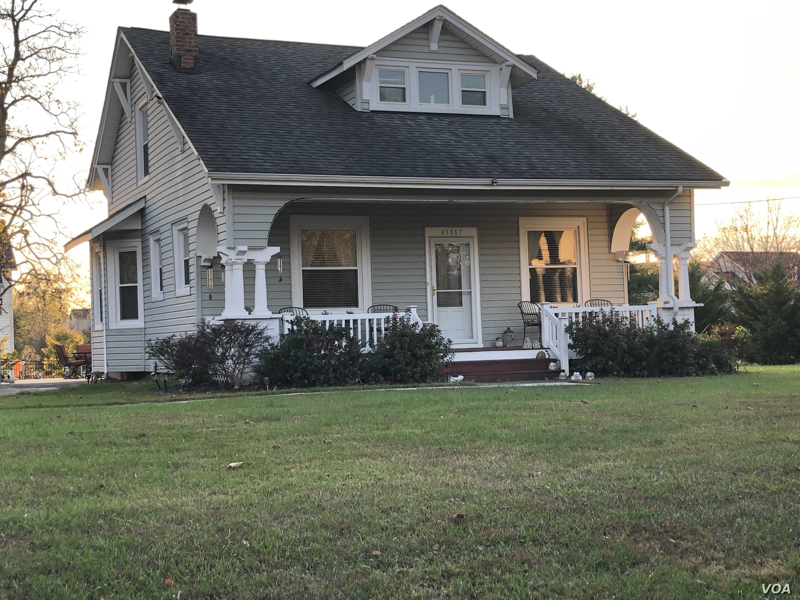
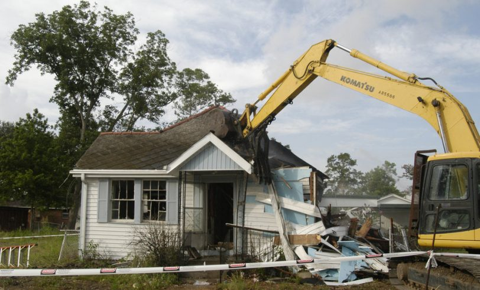
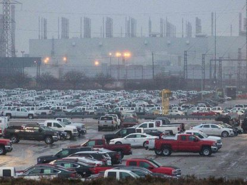
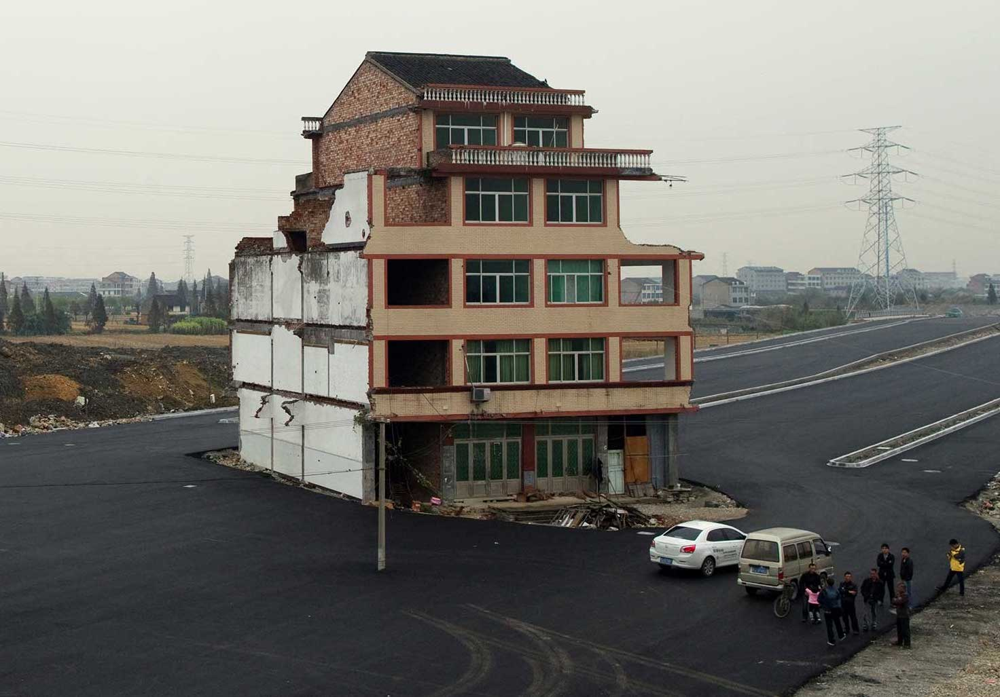
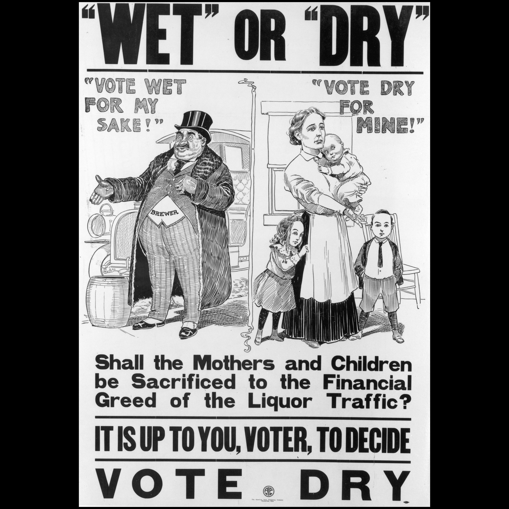
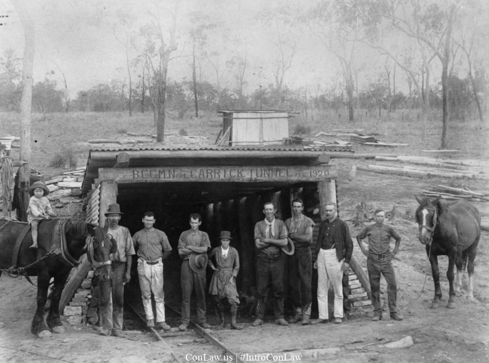
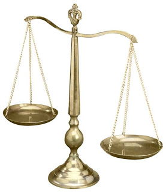

```{r setup, include=FALSE}
options(htmltools.dir.version = FALSE)
knitr::opts_chunk$set(echo=F,
                      message=F,
                      warning=F,
                      fig.retina=3,
                      fig.align = "center")
library("tidyverse")
library("ggrepel")
library("fontawesome")
xaringanExtra::use_tile_view()
xaringanExtra::use_tachyons()

theme_slides <- theme_light() + 
  theme(
    text = element_text(family = "Fira Sans", size = 24)
  )
```

# What Would an Efficient Property Law Look Like?

.pull-left[
- Recall the 4 questions any property system must answer:

1. .gray[What can be privately owned?]

2. .hi-purple[What can (and can't) an owner do with her property?]

3. .gray[How are property rights established?]

4. .gray[What remedies are available when property rights are violated?]

]

.pull-right[
.center[

]
]

---

class: inverse, center, middle

# Eminent Domain

---

# Eminent Domain

.pull-left[
.smallest[
- One potential role for government, provision of .hi[public goods]
 - Markets tend to *under*supply due to free rider problem

- To do this, government needs .hi-turquoise[land], which may already be owned by private parties

- In most countries, governments have right of .hi[eminent domain]: can seize property when owner does not want to sell
  - Also called a .hi[“taking”] (because that’s what the government is doing!)
]
]

.pull-right[
.center[


]
]

---

# Eminent Domain

.left-column[
.center[

]
]

.right-column[

> “nor shall private property be taken for public use, without just compensation”

United States Constitution, Amendment V

]

---

# Eminent Domain: Restrictions

.pull-left[

- Constitution constrains government’s ability to seize private property:
  1. Must be for a .hi-purple[“public-use”]
  2. Must provide .hi-purple[“just compensation”] to subject of taking

]

.pull-right[
.center[


]
]

---

# Eminent Domain: Restrictions

.pull-left[

- “Just compensation” consistently interpreted as .hi-purple[fair market value], what owner would likely have been able to sell the property for

- Note this might be much lower than owner’s .hi-turquoise[subjective value] placed on the property
]

.pull-right[
.center[


]
]

---

# Eminent Domain: Example

.pull-left[

.smallest[
.bg-washed-green.b--dark-green.ba.bw2.br3.shadow-5.ph4.mt5[
.hi-green[Example]: Suppose .blue[Ann] owns an estate whose fair market value is $100,000.
]
- .blue[Ann] does not want to sell it because she (subjectively) values the estate at $175,000 for sentimental reasons

]
]
.pull-right[
.center[

]
]

---

# Eminent Domain: Example

.pull-left[
.smallest[
.bg-washed-green.b--dark-green.ba.bw2.br3.shadow-5.ph4.mt5[
.hi-green[Example]: Suppose .blue[Ann] owns an estate whose fair market value is $100,000.
]
- .blue[Ann] does not want to sell it because she (subjectively) values the estate at $175,000 for sentimental reasons

- Suppose .red[Bob] covets .blue[Ann]’s estate, and would be willing to pay up to $120,000 for it

- .blue[Ann] values the estate more than .red[Bob], and does not want to sell to him
  - The house is efficiently allocated to .blue[Ann] who values it more
]
]

.pull-right[
.center[

]
]

---

# Eminent Domain: Example

.pull-left[
.smallest[
.bg-washed-green.b--dark-green.ba.bw2.br3.shadow-5.ph4.mt5[
.hi-green[Example]: Suppose .blue[Ann] owns an estate whose fair market value is $100,000.
]
- Suppose instead, .red[Bob] contributes $10,000 to the .green[Mayor]’s political campaign
  - The city .hi-purple[condemns] .blue[Ann]’s estate via eminent domain, compensating her $100,000 and then sells it to .red[Bob] at $100,000

- .red[Bob] gains $10,000, the .green[Mayor] gains $10,000, and .blue[Ann] loses $75,000
]
]

.pull-right[
.center[

]
]

---

# Eminent Domain: Example

.pull-left[

- Eminent domain prevents .red[Bob] from having to pay .blue[Ann]’s full reservation price ($175,000)

- The .hi-purple[just compensation] requirement for eminent domain alone clearly does not prevent abuse like this

- Eminent domain must also be for a .hi-purple[public use] of the land
]

.pull-right[
.center[

]
]

---

# Eminent Domain: Public Use

.pull-left[

- But eminent domain should not be used on a whim to produce *any* public good

- Individuals’ subjective value often is higher than fair market value
  - Eminent domain destroys a lot of surplus

]

.pull-right[
.center[

]
]

---

# Eminent Domain: Public Use

.pull-left[
.smallest[
.bg-washed-green.b--dark-green.ba.bw2.br3.shadow-5.ph4.mt5[
- .hi-green[Example]: motorists would be willing to pay $110,000 for a road through .blue[Ann]’s property
]

- .blue[Government] forces .red[Ann] to sell at $100,000

- Eminent domain *apparently* creates $10,000 in surplus!

- But remember, .blue[Ann] subjectively values her property at $175,000, so really a net social loss of **-$65,000!**
]
]
.pull-right[
.center[

]
]

---

# Eminent Domain: Contiguous properties

.pull-left[
.smaller[
- Main economic argument for eminent domain’s efficiency: when dealing with .hi-purple[contiguous properties] government must purchase to provide a public good

- .hi-green[Example]: a highway that goes through 500 residential properties
  - Gov’t must purchase *all* 500 properties
  - A single property along the line unwilling to sell can .hi-purple[hold up] the entire project
  - High transaction costs from strategic bargaining
]
]

.pull-right[
.center[

]
]

---

# Eminent Domain: Contiguous properties

.pull-left[
.smallest[
- $q'$: amount of parcels purchased so far

- $q^{\star}$: optimal number required for public use

- A: .red[owner]’s reservation price

- B: .blue[government]’s maximum WTP

- $\overline{AB}$ bargaining range between .red[parcel owner] and .blue[government]
  - for any regular transaction, owner can ask for up to B or walk away
  
]
]

.pull-right[
```{r}
points<-tribble(
  ~x, ~y, ~label,
  2, 4, "A",
  2, 8, "B",
  6, 4, "C"
)

mb<-function(x){10-x}

ggplot(data.frame(x=c(0,10)), aes(x=x))+
  stat_function(fun=mb, geom="line", size=2, color = "blue")+
  geom_label(aes(x=8,y=mb(8)), color = "blue", label="MB (value to public", size = 4)+
  geom_hline(yintercept=4, size=2, color = "red")+
  geom_label(x = 8, y = 4, color = "red", label="MC (value to owner)", size = 4)+
  geom_segment(x = 2, xend = 2, y = 0, yend = 8, linetype = "dotted", size = 1)+
  geom_segment(x = 6, xend = 6, y = 0, yend = 4, linetype = "dotted", size = 1)+
  #geom_point(data = points, aes(x = x, y=y), size=1)+
  geom_label(data = points, aes(x = x, y =y , label = label))+
    scale_x_continuous(breaks=c(2,6),
                       labels=c("q'", expression(q^"*")),
                     limits=c(0,10),
                     expand=expand_scale(mult=c(0,0.1)))+
  scale_y_continuous(breaks=NULL,
                     limits=c(0,10),
                     expand=expand_scale(mult=c(0,0.1)))+
  guides(fill=F)+
  labs(title = "",
       x = "Quantity of Land Parcels",
       y = "Price")+
  theme_classic(base_family = "Fira Sans Condensed", base_size=16)

```
]

---

# Eminent Domain: Contiguous properties

.pull-left[
.smallest[
- $q'$: amount of parcels purchased so far

- $q^{\star}$: optimal number required for public use

- A: .red[owner]’s reservation price

- B: .blue[government]’s maximum WTP

- $\overline{AB}$ bargaining range between .red[parcel owner] and .blue[government]
  - for any regular transaction, owner can ask for up to B or walk away
  
- .hi-red[Holdout] recognizes he can extract entire surplus $\Delta ABC$ from .blue[government]
  - Knows .blue[government] can’t proceed without $q'$!
]
]

.pull-right[
```{r}
points<-tribble(
  ~x, ~y, ~label,
  2, 4, "A",
  2, 8, "B",
  6, 4, "C"
)

mb<-function(x){10-x}

ggplot(data.frame(x=c(0,10)), aes(x=x))+
  geom_polygon(data = points, aes(x = x, y= y), fill = "blue", alpha = 0.5)+
  stat_function(fun=mb, geom="line", size=2, color = "blue")+
  geom_label(aes(x=8,y=mb(8)), color = "blue", label="MB (value to public", size = 4)+
  geom_hline(yintercept=4, size=2, color = "red")+
  geom_label(x = 8, y = 4, color = "red", label="MC (value to owner)", size = 4)+
  geom_segment(x = 2, xend = 2, y = 0, yend = 8, linetype = "dotted", size = 1)+
  geom_segment(x = 6, xend = 6, y = 0, yend = 4, linetype = "dotted", size = 1)+
  #geom_point(data = points, aes(x = x, y=y), size=1)+
  geom_label(data = points, aes(x = x, y =y , label = label))+
    scale_x_continuous(breaks=c(2,6),
                       labels=c("q'", expression(q^"*")),
                     limits=c(0,10),
                     expand=expand_scale(mult=c(0,0.1)))+
  scale_y_continuous(breaks=NULL,
                     limits=c(0,10),
                     expand=expand_scale(mult=c(0,0.1)))+
  guides(fill=F)+
  labs(title = "",
       x = "Quantity of Land Parcels",
       y = "Price")+
  theme_classic(base_family = "Fira Sans Condensed", base_size=16)

```
]

---

# Poletown Neighborhood Council v. Detroit

.pull-left[
.smallest[
- 1981, General Motors threatened to close Detroit factory
  - 6,000 jobs, millions of dollars in city tax revenue

- City used eminent domain to condemn entire neighborhood
  - 1,000 homeowners and 100 businesses forced to sell
  - land then given to GM for upgraded factory

- City claimed .hi-turquoise[employment] and .hi-turquoise[tax revenues] are public goods, justified taking
]
]
.pull-right[
.center[

]
]

---

# Poletown Neighborhood Council v. Detroit

.pull-left[

- MI Supreme Court:

> “Alleviating unemployment and revitalizing the economic base of the community [are valid public uses]...the benefit to a private interest [GM] is merely incidental”

- Overturned in 2004 *County of Wayne v. Hathcock*
 - found that taking property for developing a private business did not constitute a valid public use

]

.pull-right[
.center[

]
]

---

# Kelo v. City of New London

.pull-left[
.smaller[
- Pfizer planned to build large research facility in downtown New London, CT
  - City hoped this would attract other businesses

- Plaintiffs owned houses on portions of this land
  - Would otherwise be difficult to develop this land with sporadic residential properties
]
]
.pull-right[
.center[


.smallest[
Susette Kelo
]
]
]

---

# Kelo v. City of New London

.pull-left[
.smaller[

- City condemned the houses, claiming “the area was sufficiently distressed to justify a program of economic rejuvenation”

- Plaintiffs attorneys argued “If jobs and taxes can be a justification for taking someone's home and business, then no property in America is safe”

- CT Supreme Court ruled it a valid public use; U.S. Supreme Court in 2005 concurred (5-4) it was a valid public use

- Ironically, Pfizer never built their facility and the land remains undeveloped
]
]
.pull-right[
.center[


.smallest[
Susette Kelo
]
]
]

---

# Kelo v. City of New London

.pull-left[

- Major political backlash to *Kelo* case

- 45 States passed laws or amended their State constitutions to restrict eminent domain power, primarily excluding “economic development” as a valid public use

]

.pull-right[
.center[


.smallest[
Susette Kelo
]
]
]

---

# Eminent Domain: Public Use

.pull-left[

- *The law* requires that eminent domain be restricted to public uses

- *Economic efficiency* suggests only using eminent domain for dealing with holdout problems (contiguous properties) on high-valued public goods

- We can still use taxes to finance public goods and solve the free rider problem

]

.pull-right[
.center[

]
]

---

# Eminent Domain: Public Use

.pull-left[

- *The law* requires that eminent domain be restricted to public uses

- *Economic efficiency* suggests only using eminent domain for dealing with holdout problems (contiguous properties) on high-valued public goods

- We can still use taxes to finance public goods and solve the free rider problem

]

.pull-right[
.center[

]
]

---

# Eminent Domain and Takings

.pull-left[
.smallest[
- Takings are an .hi-purple[involuntary exchange]

- Possibility of a taking creates .hi-turquoise[uncertainty]
  - Perverse incentives for State to expropriate private property for its own ends

- Unlike taxes, takings concentrate cost on individual owners
  - Property owners go to great lengths to protect their property

- Lots of potential rent-seeking in “offense” and “defense” & the politics of redistribution

]]

.pull-right[
.center[

]
]

---

# Eminent Domain and Takings

.pull-left[

- Hence, public use and just compensation constraint

- So takings should only be used under limited conditions: .hi-purple[for public use and with just compensation, when transaction costs (hold out problems, etc) preclude the government’s purchase by consent]

]

.pull-right[
.center[

]
]

---
class: inverse, center, middle

# Regulation

---

# Regulation

.pull-left[

- Regulation $\approx$ any constraints on use of private property

- The State has broad authority to regulate via the .hi-purple[police power], often to promote “health, safety, morals and the general welfare”

- If a regulation diminishes the value of property enough, considered a .hi[taking] that requires just compensation 
]

.pull-right[
.center[

]
]

---

# When Is a Regulation a Taking?

.pull-left[

- Several legal tests that developed over time

- .hi-purple[Physical invasion test]: if regulation involves *any* physical invasion of the property by government, just compensation is due

]

.pull-right[
.center[

]
]

---

# Noxious Use Doctrine

.pull-left[
.smallest[
- *Mugler v. Kansas* 1887
  - Kansas passed a law prohibiting the manufacture of liquor without a permit, judging it to be a nuisance
  - Mugler owned a brewery, sued: this is a taking, demands just compensation

- Kansas Supreme Court upheld the law; U.S. Supreme Court upheld the law as well, creating the .hi-purple[noxious use doctrine]
  - regulations curbing noxious uses of property injurious to health, safety, morals are consistent with police power, do not require compensation
]
]

.pull-right[
.center[

]
]

---

# Diminution of Value

.pull-left[
.smallest[
- *Pennsylvania Coal v. Mahon* 1922

- In late 1800s, PA Coal purchased mineral and support rights tied to a piece of land, Mahon owned the surface rights

- 1921 PA legislature passed the Kohler Act, prohibiting:

> “mining of anthracite coal in such a way as to cause the subsidence of, among other things, any structure used as a human habitation”

- PA Coal sued PA government, claiming this destroyed the value of their property, and requires compensation as a taking
]
]

.pull-right[
.center[

]
]

---

# Pennsylvania Coal v. Mahon

.pull-left[

- *Pennsylvania Coal v. Mahon* 1922

- Lower court sided with government

- U.S. Supreme Court sided with PA Coal, that the regulation substantially .hi-purple[diminished the (economic) value] 

]

.pull-right[
.center[

]

]

---

# Pennsylvania Coal v. Mahon: Majority Opinion

.left-column[
.center[


.smallest[
Oliver Wendell Holmes, Jr.

1841—1935

Associate Justice of U.S. Supreme Court
]]
]

.right-column[

> “What makes the right to mine coal valuable is that it can be exercised with profit. To make it commercially impracticable to mine certain coal has very nearly the same effect for constitutional purposes as appropriating or destroying it. This we think that we are warranted in assuming that the statute does...”

> “The general rule at least is, that while property may be regulated to a certain extent, if regulation goes too far it will be recognized as a taking.”

]

---

# Pennsylvania Coal v. Mahon: Dissent

.left-column[
.center[


.smallest[
Louis Brandeis

1856—1941

Associate Justice of U.S. Supreme Court
]]
]

.right-column[
.smaller[
> “Every restriction upon the use of property imposed in the exercise of the police power deprives the owner of some right theretofore enjoyed, and is, in that sense, an abridgment by the States of rights in property without making compensation. But restriction imposed to protect the public health, safety or morals from dangers threatened is not a taking. The restriction here in question is merely the prohibition of a noxious use. The property so restricted remains in the possession of its owner.  The State does not appropriate it or make any use of it. The State merely prevents the owner from making a use which interferes with paramount rights of the public.”

]
]

---

# Diminution of Value

.pull-left[
.smaller[
- Famously, a lot of debate between Holmes & Brandeis’ opinions of this famous case

- But they both agree on .hi-turquoise[the law], they disagree about .hi-turquoise[the facts]
  - Law: if regulation “goes too far” in diminishing value, compensation is owed
  - Holmes: harm from regulation > harm from PA Coal’s externality, went too far
  - Brandeis: harm from PA Coal’s externality > harm from regulation, did not go too far
]
]
.pull-right[
.center[

]
]

---

# Blume and Rubinfeld

.pull-left[
.smaller[
- Blume and Rubinfeld (1984) argue that compensation for takings is efficient

- Shifts the burden of regulation’s cost from small group (property owners affected) to large group (all taxpayers)

- Normally, these are zero-sum transfers (no effect on efficiency)...so long as we assume risk-neutrality
]

.source[Blume, Lawrence and Daniel L. Rubinfeld, 1984, “Compensation for Takings: An Economic Analysis,” *California Law Review* 72(4): 569-628]
]

.pull-right[
.center[

]
]

---

# Blume and Rubinfeld

.pull-left[
.smaller[
- But if people are risk-averse, compensation effectively acts as an insurance policy against regulatory harms

- If insurance against regulatory harm was offered on the market, people would probably buy it
  - But private insurers do not provide this, for normal market failure reasons (adverse selection, moral hazard, etc)
]

.source[Blume, Lawrence and Daniel L. Rubinfeld, 1984, “Compensation for Takings: An Economic Analysis,” *California Law Review* 72(4): 569-628]

]

.pull-right[
.center[

]
]

---

# Blume and Rubinfeld

.pull-left[

- Requiring government to provide compensation for regulatory takings provides exactly this form of insurance
  - By compensating owners *after* harm occurs, spreads cost of regulation over everyone

.source[Blume, Lawrence and Daniel L. Rubinfeld, 1984, “Compensation for Takings: An Economic Analysis,” *California Law Review* 72(4): 569-628]

]

.pull-right[
.center[

]
]

---

# Wrapping Up Property Law
 
.pull-left[
- Recall the 4 questions any property system must answer:

1. .gray[What can be privately owned?]

2. .gray[What can (and can't) an owner do with her property?]

3. .gray[How are property rights established?]

4. .gray[What remedies are available when property rights are violated?]

]

.pull-right[
.center[

]
]

---

# Wrapping Up Property Law

.pull-left[

- Main set of questions: what are the .hi-purple[benefits] and .hi-purple[costs] of:
  - having property rights (at all)?
  - expanding property rights to cover more things?
  - introducing an exception/limitation to property rights?

- In what circumstances will benefits $>$ costs?

- Coming up next: .hi[contract] law
]

.pull-right[
.center[

]
]