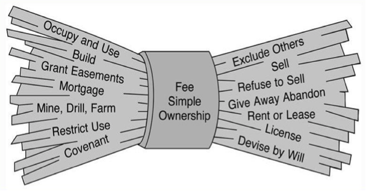
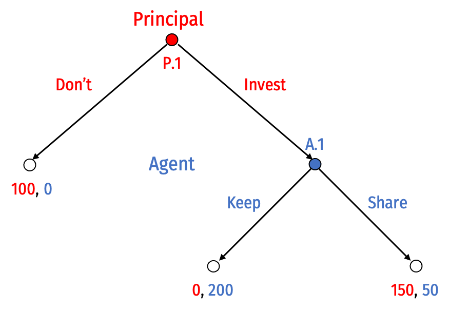
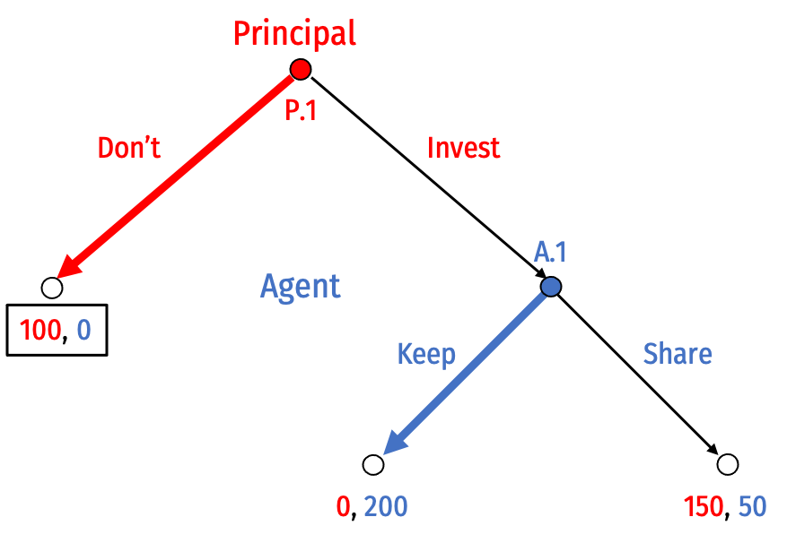
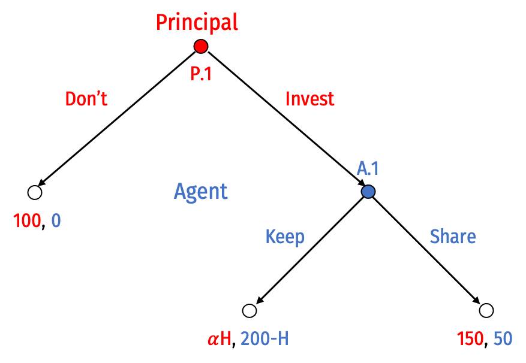
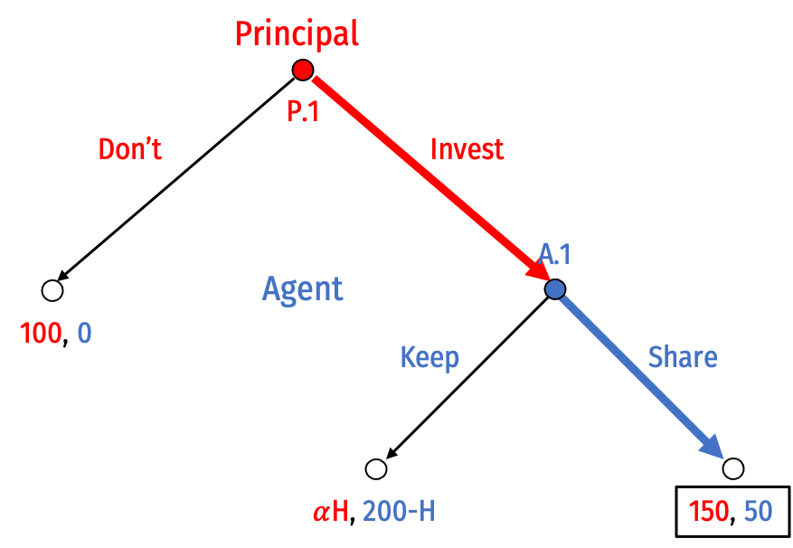
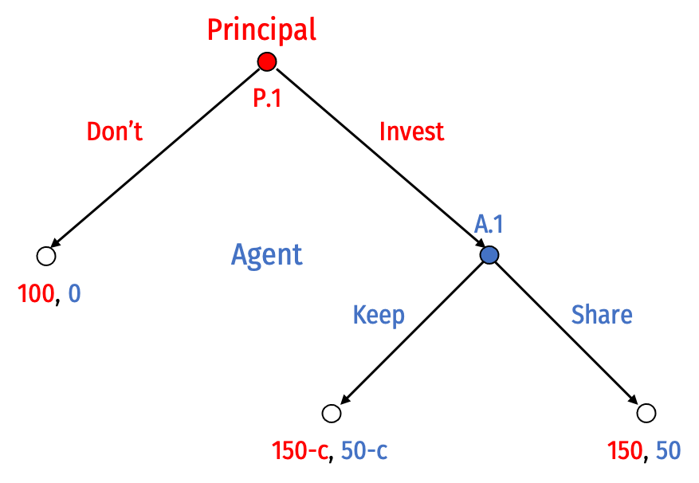
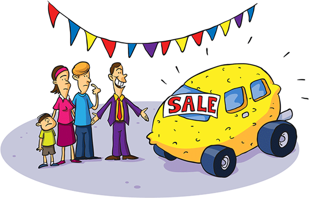

```{r setup, include=FALSE}
options(htmltools.dir.version = FALSE)
knitr::opts_chunk$set(echo=F,
                      message=F,
                      warning=F,
                      fig.retina=3,
                      fig.align = "center")
library("tidyverse")
library("ggrepel")
library("fontawesome")
xaringanExtra::use_tile_view()
xaringanExtra::use_tachyons()

theme_slides <- theme_light() + 
  theme(
    text = element_text(family = "Fira Sans", size = 24)
  )
```

# Summing Up So Far

.pull-left[
- Suppose we set up rules, and everyone does what’s best for them within the rules
  - What rules do we want to set up, if we want efficient outcomes?

- Some ideas:
  - Coase: initial rules don’t matter for efficiency if transaction costs are low
  - More complicated rules can lead to more efficient use of a resource, but at higher cost
  - Injunctive relief when transaction costs are low, damages when costs are high

]

.pull-right[
.center[

]
]

---

# Transaction Costs of Bargaining

.pull-left[
- When two parties want to reallocate rights
  - I want to buy your car
  - Or you want to “buy” my permission to have a noisy party
  - Or neighbors want to pay a factory to pollute less

- We’ve assumed they’ve been able to do so
  - Maybe with some transaction costs
]

.pull-right[
.center[

]
]
---

# The Timing of Exchange

.pull-left[

- But there are many other bargaining costs that make exchanges difficult

- Example: one type of problem is timing

- .hi[“Spot” transactions] happen on the spot
  - I hand you a check and you hand me keys to your car
  - You pay for a restaurant meal
  - Maybe some search & bargaining costs, but no enforcement costs
]

.pull-right[
.center[

]
]

---

# The Timing of Exchange

.pull-left[
.smallest[
- Many transactions are more complex
  - Neighbors pay factory to pollute less going forward
  - What if technology/cost changes, factory wants to pollute more?

- Other examples:
  - Booking a flight
  - Painting a house
  - Fixing a car

- There’s now additional .hi[enforcement costs] to ensure parties uphold their side of the bargain
]
]
.pull-right[
.center[

]
]

---

# Contracts

.pull-left[

- A .hi[contract] is a .hi[promise] that is legally binding
  - Courts will enforce many (but not all) promises

- Point of contracts: enable trades where the transaction is not concluded immediately (non-spot transactions)
]

.pull-right[
.center[

]
]

---

# Making Promises Credible

.pull-left[
.smaller[
- Simple .hi-purple[agency] or .hi-purple[trust] game

- .red[Principal] decides to .red[invest] money ($100) with .blue[Agent]
  - Investment grows to $200

- .blue[Agent] can then .blue[keep] or .blue[share] the returns with .red[Principal]
]
]
.pull-right[
.center[

]
]

---

# Making Promises Credible

.pull-left[
.smaller[
- Simple .hi-purple[agency] or .hi-purple[trust] game

- .red[Principal] decides to .red[invest] money ($100) with .blue[Agent]
  - Investment grows to $200

- .blue[Agent] can then .blue[keep] or .blue[share] the returns with .red[Principal]

- .hi-purple[SPNE]: (.red[Don't], .blue[Keep])
  - Inefficient outcome; Pareto improvement possible
  - A **promise** to .blue[Share] is .hi-purple[not credible]
]
]
.pull-right[
.center[

]
]

---

# Making Promises Credible

.pull-left[
.smaller[
- One solution: .hi-purple[reputation], which acts like a forfeitable .hi-purple[bond]

- If .blue[Agent] chooses to .blue[Keep], will lose -H, which is “hostage” value
  - .red[Principal] will earn $\alpha H$, where $\alpha$ is the faction of $H$ that is valuable to .red[Principal]
  - $\alpha = 0$: hostage has no value to .red[Principal]
  - $\alpha = 1$: cash
]
]

.pull-right[
.center[

]
]

---

# Making Promises Credible

.pull-left[
.smaller[
- One solution: .hi-purple[reputation], which acts like a forfeitable .hi-purple[bond]

- If .blue[Agent] chooses to .blue[Keep], will lose -H, which is “hostage” value
  - .red[Principal] will earn $\alpha H$, where $\alpha$ is the faction of $H$ that is valuable to .red[Principal]
  - $\alpha = 0$: hostage has no value to .red[Principal]
  - $\alpha = 1$: cash

- If $H >150$, .hi-purple[SPNE]: (.red[Invest], .blue[Share])
]
]
.pull-right[
.center[

]
]

---

# In The Old Days, These Were *Actual* Hostages

.center[

]

.source[Williamson, Oliver E, 1983, “Credible Commitments: Using Hostages to Support Exchange,” *American Economic Review* 73(4): 519–540]

---

# Today We Often Hold Property Hostage as Collateral

.center[

]

.source[Williamson, Oliver E, 1983, “Credible Commitments: Using Hostages to Support Exchange,” *American Economic Review* 73(4): 519–540]

---

# Making Promises Credible

.pull-left[
- However, reputation has limits

- Works best with .hi-purple[repeated interactions] where .blue[Agent] cares about prospect of (lost) future business
  - Large enough $H$

- What about **one-shot interactions** like this?
]

.pull-right[
.center[

]
]

---

# Making Promises Credible

.pull-left[
- Suppose instead we have courts enforce a promise to .blue[Keep]
  - Court will force .blue[Agent] to give $150 to .red[Principal]
  - Litigation cost of using courts $c$ to each party
]

.pull-right[
.center[

]
]

---

# Making Promises Credible

.pull-left[
- Suppose instead we have courts enforce a promise to .blue[Keep]
  - Court will force .blue[Agent] to give $150 to .red[Principal]
  - Litigation cost of using courts $c$ to each party
  
- With $c>0$, .hi-purple[SPNE]: (.red[Invest], .blue[Share])
  - Purpose of contract law is to .hi-purple[make promises credible]
]

.pull-right[
.center[

]
]

---

# Motivations of Contract Law

.pull-left[

1. .hi-purple[What kinds of promises should be enforceable at law?]

2. .gray[What should the remedies be for a broken promise?]

]

.pull-right[
.center[

]
]

---

# What Promises Should be Enforceable?

.smallest[
> “The rich uncle of a struggling college student learns at the graduation party that his nephew graduated with honors. Swept away by good feeling, the uncle promises the nephew a trip around the world. Later the uncle reneges on his promise. The student sues his uncle, asking the court to compel the uncle to pay for a trip around the world.”

]

--

.smallest[
> “One neighbor offers to sell a used car to another for $1000. The buyer gives the money to the seller, and the seller gives the car keys to the buyer. To her great surprise, the buyer discovers that the keys fit the rusting Chevrolet in the back yard, not the shiny Cadillac in the driveway. The seller is equally surprised to learn that the buyer expected the Cadillac. The buyer asks the court to order the seller to turn over the Cadillac.”

]

--

.smallest[
> “A farmer, in response to a magazine ad for “a sure means to kill grasshoppers,” mails $25 and receives in the mail two wooden blocks with the instructions, “Place grasshopper on Block A and smash with Block B.” The buyer asks the court to require the seller to return the $25 and pay $500 in punitive damages.”

]

.source[Cooter and Ulen, Ch.8]

---

class: inverse, center, middle

# The Bargain Theory of Contracts

---

# The Bargain Theory of Contracts

.pull-left[

- Legal theory developed in late 19<sup>th</sup>-early 20<sup>th</sup> Century

- .hi-purple[A promise should be enforced if it was given as part of a bargain, otherwise, it should not]

- Ideal bargain taken to have three classic elements:
  1. .hi[offer]
  2. .hi[acceptance]
  3. .hi[consideration]
]

.pull-right[
.center[

]
]

---

# The Bargain Theory of Contracts: Terms

.pull-left[

- .hi[Promisor]: person who gives a promise

- .hi[Promisee]: person who receives a promise

- In a bargain, both sides must give up something: .hi-purple[reciprocal inducement]

- .hi[Consideration]: what promisee gives to promisor, in exchange for promise
  - Under bargain theory, this is what makes contract enforceable
]

.pull-right[
.center[

]
]

---

# What Promises Should be Enforceable?

.bg-washed-green.b--dark-green.ba.bw2.br3.shadow-5.ph4.mt5[
“The rich uncle of a struggling college student learns at the graduation party that his nephew graduated with honors. Swept away by good feeling, the uncle promises the nephew a trip around the world. Later the uncle reneges on his promise. The student sues his uncle, asking the court to compel the uncle to pay for a trip around the world.”
]

- **No consideration** given as inducement for promise (it's a gift), therefore, **not enforceable**

---

# What Promises Should be Enforceable?

.bg-washed-green.b--dark-green.ba.bw2.br3.shadow-5.ph4.mt5[
“One neighbor offers to sell a used car to another for $1000. The buyer gives the money to the seller, and the seller gives the car keys to the buyer. To her great surprise, the buyer discovers that the keys fit the rusting Chevrolet in the back yard, not the shiny Cadillac in the driveway. The seller is equally surprised to learn that the buyer expected the Cadillac. The buyer asks the court to order the seller to turn over the Cadillac.”
]

- Despite consideration, **offer and acceptance not met**, so **not enforceable**
  - No .hi[“meeting of the minds”]
  - Seller (thought they) offered one thing
  - Buyer (thought they) accepted another
  
---
  
# What Promises Should be Enforceable?


.bg-washed-green.b--dark-green.ba.bw2.br3.shadow-5.ph4.mt5[
“A farmer, in response to a magazine ad for “a sure means to kill grasshoppers,” mails $25 and receives in the mail two wooden blocks with the instructions, “Place grasshopper on Block A and smash with Block B.” The buyer asks the court to require the seller to return the $25 and pay $500 in punitive damages.”

]

- Under bargain theory, a valid promise, hence, **enforceable**

---

# No Distinctions Between Fair & Unfair Bargains

.pull-left[

- Bargain theory of contract does *not* distinguish between fair and unfair bargains

- Even a highly one-sided bargain is enforceable under the theory
  - Courts should not determine whether bargain is “fair,” only whether a bargain **occurred**

]

.pull-right[
.center[

]
]

---

# No Distinctions Between Fair & Unfair Bargains

.pull-left[

- Too difficult to have a theory of what is “fair” and have court only enforce fair bargains
  - Court would have to calculate value of contract to each party and make sure they were about equal
]

.pull-right[
.center[

]
]

---
# No Distinctions Between Fair & Unfair Bargains

.pull-left[
.smallest[
- *Hamer v. Sidway* (1891) 124 N.Y. 538, 27 N.E. 256

- Uncle promised his nephew $5,000 to abstain from drinking, smoking, and gambling until his 21st birthday...then refused to pay
  - Some complications, but that's the basic story

- Court: **a bargain occurred**, Uncle owes damages
  - nephew’s (promisee) abstention from stimulants counts as consideration in exchange for promise
  - Uncle’s (promisor) promise should be enforced
]
]
.pull-right[
.center[

]
]

---

# No Distinctions Between Fair & Unfair Bargains

.left-column[
.center[

]
]

.right-column[

.smaller[
> “The promisee [previously] used tobacco, occasionally drank liquor, and he had a legal right to do so. That right he abandoned for a period of years upon the strength of the promise....hi[We need not speculate on the effort which may have been required to give up the use of these stimulants.] It is sufficient that he restricted his lawful freedom of action within certain prescribed limits upon the faith of his uncle’s agreement, and now, having fully performed the conditions imposed, .hi[it is of no moment whether such performance actually proved a benefit to the promisor], and the court will not inquire into it.”

]
.source[[Opinion of the Court](https://www.nycourts.gov/reporter/archives/hamer_sidway.htm)]
]

---

# Remedies: According to Bargain Theory

.pull-left[

- .hi[Expectation damages]: amount of benefit the promisee could .hi[reasonably expect] from performance of the promise

- Since promisee agreed to bargain, owes it to promisor to make her as well off as she .hi-purple[would have been] if the promise had been .hi-purple[performed]
  - but sometimes difficult to calculate, hence, *reasonable* standard
  - still lots of ambiguity (quality, tradeoffs, etc.)
]

.pull-right[
.center[

]
]

---

# The Limits of Bargain Theory

.pull-left[
.smaller[
- Bargain theory of contract highly influential, but two major problems:

1. Not an accurate description of what courts actually do
  - Courts do sometimes rule some contracts “unconscionable” 
2. Not always economically efficient
  - Would not enforce some promises that both parties want to be enforceable
  - Enforces some promises that should not be enforced
  - Often due to lack of consideration
]
]

.pull-right[
.center[

]
]

---

# What Promises Should be Enforced, *for Efficiency*?

.pull-left[
.smallest[
- Efficient: .hi-purple[enforce a promise if both the promisor and the promisee wanted it to be enforceable when it was made] (*ex ante*)
  - Note: very different from wanting it to actually be enforced (*ex post*)!
  
- .hi-purple[First purpose of contract law: enable people to cooperate and capture gains from trade]
  - convert games with noncooperative equilibria to games with cooperative equilibria
  - make promises credible
  - minimize deadweight loss from lost trading opportunities
]
]

.pull-right[
.center[

]
]

---

# The Problem of Credible Commitment

.pull-left[
.center[


]
]

.pull-right[
.smallest[
- The basic problem is .hi[credible commitment]
  - A much general problem in game theory & political economy

- .hi-purple["Talk is cheap"]

- With perfect information, **promises** or **threats** will not change equilibrium if they are .hi-purple[not credible]

- Strategy must be .hi-purple[subgame perfect], if game reaches the relevant decision, it must be in your interest to carry out your promise or threat!
]
]

---

# The Problem of Credible Commitment

.pull-left[
.center[


]
]

.pull-right[

- Threats and promises can be .hi-purple[credible] with .hi[commitment]

- A .hi[commitment] changes the game in a way that *forces* you to carry out your promise or threat, especially when you otherwise would not want to
  - tying your own hands makes you stronger!
]

---

# The Problem of Credible Commitment

.center[

]

---

# The Problem of Credible Commitment

.pull-left[

- A .hi[commitment device] can *bind* yourself in the future to obey your current wishes for the future

- What doesn't kill you makes you stronger
]

.pull-right[
.center[


]
]
---

# Credible Commitment and Bargaining

.left-column[
.center[


.smallest[
Thomas Schelling

1921—2016

Economics Nobel 2005
]
]
]

.right-column[

> “‘Bargaining power’...suggest[s] that the advantage goes to the powerful, the strong, or the skillful. It does, of course, if those qualities are defined to mean only that negotiations are won by those who win...The sophisticated negotiator may find it difficult to seem as obstinate as a truly obstinate man....hi[“Bargaining power [is] the power to bind oneself.”], (p.22)

.source[Schelling, Thomas, 1960, *The Strategy of Conflict*]
]

---

# Credible Commitment and Bargaining

.left-column[
.center[


.smallest[
Thomas Schelling

1921—2016

Economics Nobel 2005
]
]
]

.right-column[

.smaller[
> “.hi[How can one commit himself in advance to an act that he would in fact prefer not to carry out in the event], in order that his commitment may deter the other party? ... .hi[In bargaining, the commitment is a device to leave the last clear chance to decide the outcome with the other party], in a manner that he fully appreciates; it is to relinquish further initative, having rigged the incentives so that the other party must choose in one’s favor. If one driver speeds up so that he cannot stop, and the other realizes it, the latter has to yield...This doctrine helps to understand some of those cases in which .hi[bargaining ‘strength’ inheres in what is weakness by other standards], (p.22)

]
.source[Schelling, Thomas, 1960, *The Strategy of Conflict*]
]

---

# Credible Commitment

.center[


*Odysseus and the Sirens* by John William Waterhouse, Scene from Homer's *The Odyssey*

]

---

# Credible Commitment

.center[

]

---

# Credible Commitment and Bargaining

.left-column[
.center[


.smallest[
Sun Tzu

544—496 B.C.

]
]
]

.right-column[

> “When your army has crossed the border [into hostile territory], you should burn your boats and bridges, in order to make it clear to everybody that you have no hankering after home.”

.source[Sun Tzu, *The Art of War*]
]

---

# Credible Commitment and Bargaining

.pull-left[

- .hi[Contract law] can provide that commitment device

- Threat of legal punishment for breaking promises “ties your hands” and forces you to keep more promises, on the margin

- Easier to enter into a promise you would otherwise want to “wiggle out of” later
]

.pull-right[
.center[

]
]

---
# Efficient Disclosure of Information

.pull-left[
.smallest[
- A related purpose of contract law: .hi-purple[encourage the efficient disclosure of information]

- Recall the problem of private/asymmetric information for bargaining
  - e.g. Lemons problem in used car market (Akerlof 1972)
  - contract law can help: seller can issue a legally binding warranty; or impose on seller a duty to disclose information about car's quality

- Makes more trade possible by providing credible commitments!
]
]
.pull-right[
.center[

]
]
