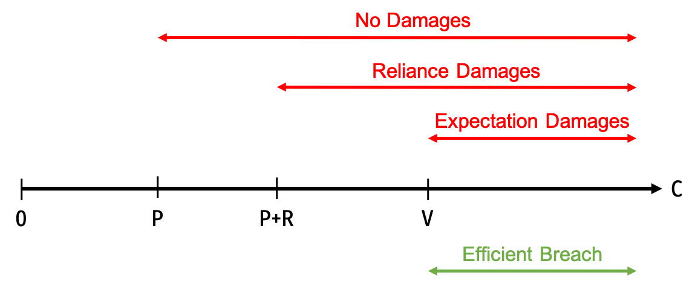
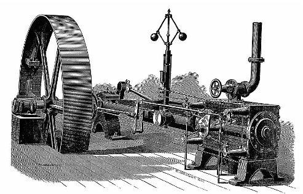

```{r setup, include=FALSE}
options(htmltools.dir.version = FALSE)
knitr::opts_chunk$set(echo=F,
                      message=F,
                      warning=F,
                      fig.retina=3,
                      fig.align = "center")
library("tidyverse")
library("ggrepel")
library("fontawesome")
xaringanExtra::use_tile_view()
xaringanExtra::use_tachyons()

theme_slides <- theme_light() + 
  theme(
    text = element_text(family = "Fira Sans", size = 24)
  )
```

class: inverse, center, middle

# Breach of Contract

---

# Breach of Contract

.pull-left[
.smaller[
- If a contract is a (legally enforceable) promise...

- ...what should happen when the promise is broken?

- .hi-green[Examples]:
  - I signed a contract with no intention of upholding it
  - or I signed it in good faith, intending to keep it
  - but circumstances changed, making my performance less desirable, maybe inefficient!
]
]
.pull-right[
.center[

]
]

---

# Example

.pull-left[

.quitesmall[
.bg-washed-green.b--dark-green.ba.bw2.br3.shadow-5.ph4.mt5[
- .hi-green[Example]: Consider a .blue[brewery] and an .red[ice company]. The .blue[brewery (buyer)] contracts to have the .red[ice company (seller)] deliver ice for storing beer.
]

- .red[Promisor]: ice company (seller)
- .blue[Promisee]: brewery (buyer)

- **V**: value of performance to .blue[promisee]
  - revenues from beer sold
- **C**: cost of performance to .red[promisor]
  - cost of supplying ice to brewery
- **P**: contract price buyer and seller agreed on
]

]

.pull-right[
.center[

]
]

---

# Example

.pull-left[

.center[

]
.smallest[

Lots of things could happen in between:

- Price of ice goes up, raising costs $C>P$
  - **efficient** to deliver, but .red[ice company] no longer wants to
- Or raises costs $C>V$
  - **no longer efficient** to deliver
- .purple[Another brewery] (with $V'>V)$ could show up and offer the .red[ice company] $P'>P$
- Ice delivery person could break a leg, making it impossible to deliver
]
]
.pull-right[
.center[

]

]

---

# Breach of Contract

.pull-left[
.smallest[
- A contract is a promise

- .hi[Breach of contract] is when .red[promisor] fails to keep a promise
  - To make promise legally binding, must be some consequence to breach

- So what should happen when a contract is breached?
  - If penalty too small: law has no bite
  - If penalty too big: promises might be kept that are inefficient
  - .hi-purple[Can we design law to get breach only when it is efficient to breach?]
]
]
.pull-right[
.center[

]
]

---

# Efficient Breach

.center[

|    |    |
|----|----|
| Buyer Payoff | $V-P$  (Buyer Surplus) |
| Seller Payoff | $P-C$ (Seller Surplus) |
| Joint Payoff | $V-C$  (Gains from Trade) |

*Net gains* from the contract *performed*
]

--

- Suppose the cost of delivery $C$ is uncertain when the contract is made

--

- Once the actual $C$ is realized, .red[promisor (ice company)] must decide to **perform** or **breach** contract
  - $C<V$: efficient for .red[promisor] to **perform**
  - $C>V$: efficient for .red[promisor] to **breach**

---

# Efficient Breach

.pull-left[

.smallest[
- Condition for .hi-purple[efficient performance]: $C<V$
  - .red[Promisor's cost to perform] $<$ .blue[Promisee's benefit of performance]
  - Social benefit of breach $<$ social cost of breach

- Condition for .hi-purple[efficient breach]: $C>V$
  - .red[Promisor's cost to perform] $>$ .blue[Promisee's benefit of performance]
  - Social benefit of breach $>$ social cost of breach
]
]
.pull-right[
.center[

]
]

---

# What Will *Actually* Happen?

.pull-left[
.smallest[
- We know it's **efficient** to breach when $C<V$, but what will .red[promisor] **actually** do?
  - Depends only on their personal costs & benefits

- .red[Promisor]'s cost to perform $<$ .red[promisor]'s liability from breach $\implies$ .red[Promisor] will .hi-purple[perform]

- .red[Promisor]'s cost to perform $>$ .red[promisor]'s liability from breach $\implies$ .red[Promisor] will .hi-purple[breach]

]
]

.pull-right[
.center[

]
]

---

# What Will *Actually* Happen?

.pull-left[

- $D$: damages court awards to .blue[Promisee] (paid by .red[Promisor])

- .hi-turquoise[Promisor will perform]: $-D>P-C$

- .hi-turquoise[Promisor will breach]: $-D<P-C$

]

.pull-right[
.center[

]
]

---

# What Will *Actually* Happen?

.pull-left[

- $D$: damages court awards to .blue[Promisee] (paid by .red[Promisor])

- .hi-turquoise[Promisor will perform]: $-D>P-C$

- .hi-turquoise[Promisor will breach]: $-D<P-C$

- .hi-purple[Can we design the law to only get *efficient* breach of contract?]

]

.pull-right[
.center[

]
]

---

# Getting Only Efficient Breach

.pull-left[

- What value of $D$ will equate the socially-optimal outcome and the .red[promisor's] private incentives to perform/breach?

$$D=V-P$$

- Set **liability from breach = .blue[promisee]'s net gain from performance**, then .red[promisor] will only breach when it is efficient
  - When .red[promisor] breaches, should owe penalty **exactly equal to** the benefit .blue[promisee] expected to recieve
  - This is .hi-purple[expectation damages]!

]

.pull-right[
|    |    |
|----|----|
| Buyer Payoff | $V-P$  (Buyer Surplus) |
| Seller Payoff | $P-C$ (Seller Surplus) |
| Joint Payoff | $V-C$  (Gains from Trade) |

*Net gains* from the contract *performed*

]

---

# Getting Only Efficient Breach

.pull-left[
- .hi-green[Example]: if I promise you something that you value at $100, if I break my promise, I owe you $100 worth of expectation damages

- That way:
  - if it costs me more than $100 to perform, I'll break it (efficient)
  - if it costs me less than $100 to perform, I'll keep it (efficient)
]

.pull-right[
.center[

]
]

---

# An Externalities View of Breach

.pull-left[
.smallest[
- If .red[Promisor] breaches contract, imposes a negative externality on .blue[Promisee]
  - .blue[Promisee] expected $V-P$ payoff if .red[Promisee] performed
  - Under breach, .blue[Promisee] is $V-P$ worse off

- If .red[Promisor] has to pay $V-P$ in damages for breach, then .hi-purple[they internalize the externality]
  - Now .red[Promisor's] decision no longer affects .blue[Promisee's] payoff
  - Gets the same surplus whether or not contract is performed
  - With externality internalized, .red[Promisor] chooses efficiently when deciding to *perform* or *breach*
]
]

.pull-right[
.center[

]
]

---

class: inverse, center, middle

# Reliance

---

# Return to Our Example

.pull-left[

.smallest[
.bg-washed-green.b--dark-green.ba.bw2.br3.shadow-5.ph4.mt5[
- .hi-green[Example]: Consider a brewery and an ice company. The brewery (buyer) contracts to have the ice company (seller) deliver ice for storing beer.
]

- **V**: value of performance to .blue[promisee]
  - revenues from beer sold
- **C**: cost of performance to .red[promisor]
  - cost of supplying ice to brewery
]

]

.pull-right[
.center[

]
]

---
# Return to Our Example

.pull-left[

.smallest[
.bg-washed-green.b--dark-green.ba.bw2.br3.shadow-5.ph4.mt5[
- .hi-green[Example]: Consider a brewery and an ice company. The brewery (buyer) contracts to have the ice company (seller) deliver ice for storing beer.
]
- Suppose the two companies agree on a price $P$ and the .red[ice company] *expects* $\mathbb{E}[C]<P$

- Then both parties can expect to benefit from performance:
$$V>P>\mathbb{E}[C]$$

]

]

.pull-right[
.center[

]
]

---

# Reliance

.pull-left[
.smallest[
- Suppose that in preparation for sale, the .blue[brewery] invests $R$ in producing a certain amount of beer, prior to the ice actually being delivered

- This is a .hi[reliance investment], which depends on the performance of the contract
  - .hi-purple[Increases the value of performance] to .blue[promisee]
  - .hi-purple[Increases the social cost of breach]

- Another goal of contract law is to attain .hi-purple[optimal level of reliance]
]
]

.pull-right[
.center[

]
]

---

# Reliance: Example

.pull-left[

- $V$ depends on the value of $R$
  - More $R$ makes $V$ higher to promisee

- But must choose $R$ *before* contract is performed/breached (ice delivered or not) and is a .hi[sunk cost] (beer will spoil if ice not delivered)

]

.pull-right[
.center[

]
]

---

# Reliance: Example

.pull-left[

- $D$: damages the court awards in the event of breach (promisor pays promisee)

- What value of $D$ is efficient, i.e. induces promisor to breach only when it is efficient to do so?

]

.pull-right[
.center[

]
]

---

# Breach

| Payoffs | Performance | Breach |
|---------|-------------|--------|
| Buyer's Payoff | $V-P$ | $D$ |
| Seller's Payoff | $P-C$ | $-D$ |
| Joint Payoff | $V-C$ | $0$ |

---

# Breach with Reliance

| Payoffs | Performance | Breach |
|---------|-------------|--------|
| Buyer's Payoff | $V-R-P$ | $D-R$ |
| Seller's Payoff | $P-C$ | $-D$ |
| Joint Payoff | $V-R-C$ | $-R$ |

--

- Recall condition for efficient breach: $\color{#6A5ACD}{C>V}$
  - cost of performance to .red[promisor] $>$ value of performance to .blue[promisee]

--

- Note since $R$ is a sunk cost, doesn't affect this condition!
  - Joint payoff from performance $>$ joint payoff from breach if: $V-R-C>-R$
  - $R$'s cancel, yielding $\color{#6A5ACD}{C>V}$

---

# Reliance: Example

| Payoffs | Performance | Breach |
|---------|-------------|--------|
| Buyer's Payoff | $V-R-P$ | $D-R$ |
| Seller's Payoff | $P-C$ | $-D$ |
| Joint Payoff | $V-R-C$ | $-R$ |

- Now consider what Seller will *actually* choose to do (once it knows $C)$:

- .hi-purple[Seller will breach when] $$\color{#6A5ACD}{C>P+D}$$
  - Left: benefit of breach (savings in cost)
  - Right: cost of breach (lost price plus damages)
  - Breaches when private benefits $>$ private costs

---

# Reliance: Example

| Payoffs | Performance | Breach |
|---------|-------------|--------|
| Buyer's Payoff | $V-R-P$ | $D-R$ |
| Seller's Payoff | $P-C$ | $-D$ |
| Joint Payoff | $V-R-C$ | $-R$ |

- We want law to incentivize seller to breach only when it is efficient
  - So set $C>P+D$ equal to $C>V$, i.e.
  - .hi-purple[Set damages] $\color{#6A5ACD}{D=V-P}$.hi-purple[, equal to consumer surplus]
  - Seller compensates buyer for the buyer's lost surplus from the exchange

---

# What Do Courts Set Damages At?

.pull-left[

- We know what damages induce efficient breach $(D=V-P)$, but what damages do courts **actually** set in breach cases?

- .hi[Expectation damages]: amount to make the promisor as well off .hi-purple[as if the contract had been performed]
  - by far the most popular method
  - We've seen this induces breach only when it's efficient ✅

]

.pull-right[
| Payoffs | Performance | Breach |
|---------|-------------|--------|
| Buyer's Payoff | $V-R-P$ | $D-R$ |
| Seller's Payoff | $P-C$ | $-D$ |
| Joint Payoff | $V-R-C$ | $-R$ |

]

---

# What Do Courts Set Damages At?

.pull-left[
- .hi[Reliance damages]: amount to make the promisor as well off .hi-purple[as if the contract had never been made]
  - reference point is *pre-contract* status, rather than *post-performance* status
  - buyer's pre-contract payoff was 0, so in breach case, set $D=R$

]

.pull-right[
| Payoffs | Performance | Breach |
|---------|-------------|--------|
| Buyer's Payoff | $V-R-P$ | $D-R$ |
| Seller's Payoff | $P-C$ | $-D$ |
| Joint Payoff | $V-R-C$ | $-R$ |

]

---

# What Do Courts Set Damages At?

.pull-left[

- Under .hi-purple[reliance damages] $(D=R)$, what are seller's incentives to breach?

- Recall seller will *want* to breach when $C>P+D$
  - If $D=R$, then:

- .hi-purple[Seller will want to breach when] $\color{#6A5ACD}{C>P+R}$
  - Since $V-P>R$ (.blue[promisee]'s reliance investment must be less than the gain from performance, otherwise unprofitable to invest!)...,
  - Then $P+R<V$, implying .hi-purple[seller will breach too often under reliance damages] (since $C<V$ is inefficient to breach) 
  
]

.pull-right[
| Payoffs | Performance | Breach |
|---------|-------------|--------|
| Buyer's Payoff | $V-R-P$ | $D-R$ |
| Seller's Payoff | $P-C$ | $-D$ |
| Joint Payoff | $V-R-C$ | $-R$ |

]

---

# What Do Courts Set Damages At?

.pull-left[

- Finally, consider a rule of no damages $(D=0)$

- .red[Promisor] will want to breach whenever $C>P$
  - Will want to breach **even more often** than reliance (or expectation) damages
  - Recall it's only efficient to breach when $C>V$, and $V>P$
]

.pull-right[
.center[

]
]

---

# What Do Courts Set Damages At?

.center[


Ranges of production costs over which breach occurs under the various damage measures

]

---

class: inverse, center, middle

# Incentives for Efficient Reliance

---

# Choosing Reliance

.pull-left[
- Extend our example to let .blue[Promisor] *choose* their level of reliance, .red[R]

- Let .red[R] enhance the value of .blue[V], but with diminishing returns
$$\begin{align*}
\frac{\partial V(R)}{\partial R} > 0\\
\frac{\partial^2 V(R)}{\partial R^2} < 0\\
\end{align*}$$

]

--

.pull-right[
```{r}
R<-function(x){x}
V<-function(x){2*sqrt(x)}

plot<-ggplot(data.frame(x=c(0,10)), aes(x=x))+
  stat_function(fun=R, geom="line", size=2, color = "red")+
    geom_label(aes(x=4.75,y=R(4.75)), color = "red", label="R", size = 4)+
  stat_function(fun=V, geom="line", size=2, color = "blue")+
    geom_label(aes(x=4.75,y=V(4.75)), color = "blue", label=expression(V(R)), size = 4)+
    scale_x_continuous(breaks=NULL,
                     limits=c(0,5),
                     expand=expand_scale(mult=c(0,0.1)))+
  scale_y_continuous(breaks=NULL,
                     limits=c(0,5),
                     expand=expand_scale(mult=c(0,0.1)))+
  labs(x = "R",
       y = "$")+
  theme_classic(base_family = "Fira Sans Condensed", base_size=16)
plot
```
]

---

# Choosing Reliance

.pull-left[
- If performance were certain, then socially efficient level of reliance would maximize net value of performance

$$\max_{R} V(R)-R$$
- Let $R^\star$ be the solution
  - Amount with greatest distance between $V(R)$ and $R$
  - Also where the two slopes are equal
]

.pull-right[
```{r}
plot+geom_segment(x=1,y=0,xend=1,yend=V(1),size=1,linetype="dotted")+
    scale_x_continuous(breaks=c(1),
                       labels=c(expression(R^{"*"})),
                     limits=c(0,5),
                     expand=expand_scale(mult=c(0,0.1)))
```
]

---

# Choosing Reliance

.pull-left[
.smaller[
- Now suppose .red[promisor]'s costs *could* become prohibitively high, and would *not* perform the contract (nor would it be efficient to do so)
  - $q$: probability of performance (low costs)
  - $1-q$: probability of breach (high costs)

$$\max_{R} qV(R)-R$$

- Solution is $\hat{R} < R^\star$
  - .blue[Promisee] should invest less reliance when performance is uncertain
  - As $\downarrow q$, $\downarrow \hat{R}$ (and vice versa)
]
]
.pull-right[
```{r}
qV<-function(x){1.5*sqrt(x)}

plot+stat_function(fun=qV, geom="line", size=2, color = "purple")+
    geom_label(aes(x=4.75,y=qV(4.75)), color = "purple", label=expression(qV(R)), size = 4)+
    geom_segment(x=1,y=0,xend=1,yend=V(1),size=1,linetype="dotted")+
    geom_segment(x=0.5625,y=0,xend=0.5625,yend=qV(0.5625),size=1,linetype="dotted")+
    scale_x_continuous(breaks=c(0.5625,1),
                       labels=c(expression(hat(R)),expression(R^{"*"})),
                     limits=c(0,5),
                     expand=expand_scale(mult=c(0,0.1)))

```
]


---

# Choosing Reliance

.pull-left[
.smallest[
- What will the .blue[promisee] *actually* do?

- Start with the possibility of recovering .hi[expectation damages] $D=V-P$

$$
\max_{R} q[V(R)-R-P]+(1-q)[D-R]
$$
- Substitute $D=V-P$ in to get

$$
\max_{R} V(R)-R-P
$$
]
]

.pull-right[
```{r}
plot+stat_function(fun=qV, geom="line", size=2, color = "purple")+
    geom_label(aes(x=4.75,y=qV(4.75)), color = "purple", label=expression(qV(R)), size = 4)+
    geom_segment(x=1,y=0,xend=1,yend=V(1),size=1,linetype="dotted")+
    geom_segment(x=0.5625,y=0,xend=0.5625,yend=qV(0.5625),size=1,linetype="dotted")+
    scale_x_continuous(breaks=c(0.5625,1),
                       labels=c(expression(hat(R)),expression(R^{"*"})),
                     limits=c(0,5),
                     expand=expand_scale(mult=c(0,0.1)))

```
]

---

# Choosing Reliance

.pull-left[
.smallest[
- Optimum reliance for buyer is $R^\star$ (since $P$ is just a constant, derivative is 0)
  - This (again) is the efficient amount of reliance *when performance is certain*
  - .hi-purple[Expectation damages causes the buyer to overinvest in reliance]
  - .hi[Moral hazard problem]: expectation damages fully insures buyer against risk of breach; behaves as if performance were certain!
    - buyer has no incentive to take precautions against possibility of breach!
]
]

.pull-right[
```{r}
plot+stat_function(fun=qV, geom="line", size=2, color = "purple")+
    geom_label(aes(x=4.75,y=qV(4.75)), color = "purple", label=expression(qV(R)), size = 4)+
    geom_segment(x=1,y=0,xend=1,yend=V(1),size=1,linetype="dotted")+
    geom_segment(x=0.5625,y=0,xend=0.5625,yend=qV(0.5625),size=1,linetype="dotted")+
    scale_x_continuous(breaks=c(0.5625,1),
                       labels=c(expression(hat(R)),expression(R^{"*"})),
                     limits=c(0,5),
                     expand=expand_scale(mult=c(0,0.1)))

```
]

---
# Overreliance

.pull-left[

- *Hadley v. Baxendale* (1854)

- Hadley owned a flour mill, crankshaft broke

- Hired Baxendale to transport broken shaft for repair
  - Baxendale shipped by boat instead of by train, causing a delay of a week

- Hadley sued Baxendale for week of lost profits

]
.pull-right[
.center[

]
]

---

# Overreliance

.pull-left[

- *Hadley v. Baxendale* (1854) EWHC J70

- Defendant conceded negligence in delaying the delivery, but claimed the requested damages were too high, since the need for the mill to close was only a “remote” possibility

> “The shipper assumed that Hadley, like most millers, kept a spare shaft...Hadley did not inform him of the special urgency in getting the shaft repaired.”

]
.pull-right[
.center[

]
]

---

# Hadley v. Baxendale

.left-column[
.center[

]
]

.right-column[

- Court elucidated the following rule:

.quitesmall[
> “Where two parties have made a contract which one of them has broken, the damages which the other party ought to recieve in respect of such breach of contract should be such as may fairly and reasonably be considered either arising naturally, i.e., according to the usual course of things, from such breach of contract itself, or such as may reasonably be supposed to have been in the conemplation of both parties, at the time they made the contract, as the probable results of the breach of it.”

]

.source[[Opinion of the Court](http://www.bailii.org/ew/cases/EWHC/Exch/1854/J70.html)]

]

---

# Hadley v. Baxendale

.pull-left[

- *Hadley v. Baxendale* (1854) EWHC J70

- In other words, damages for breach will be .hi[limited] to a .hi[reasonable] level
  - What the parties could have .hi-purple[reasonably foreseen] at the time they made the contract
  - And liable for .hi-purple[no more] than that

- Found the lost profits were not reasonably forseeable, thus not entitled to damages on those
]
.pull-right[
.center[

]
]

]
---

# The Hadley v. Baxendale Rule in Our Model

.pull-left[

- Expectation damages under the *Hadley* rule, set:
$$D=V(\hat{R})-P$$
- This is *not* the unlimited damages of $D=V-P$

- Here, damages are limited to *efficient level of reliance* (“reasonably forseeable”), vs. the *actual* level of reliance
]

.pull-right[
.center[

]
```{r, eval = F}
plot+geom_hline(yintercept = 3, size =2)+
  stat_function(fun=qV, geom="line", size=2, color = "purple")+
    geom_label(aes(x=4.75,y=qV(4.75)), color = "purple", label=expression(qV(R)), size = 4)+
    geom_segment(x=1,y=0,xend=1,yend=V(1),size=1,linetype="dotted")+
    geom_segment(x=0.5625,y=0,xend=0.5625,yend=qV(0.5625),size=1,linetype="dotted")+
    scale_x_continuous(breaks=c(0.5625,1),
                       labels=c(expression(hat(R)),expression(R^{"*"})),
                     limits=c(0,5),
                     expand=expand_scale(mult=c(0,0.1)))+
  scale_y_continuous(breaks=c(2),
                     labels = c("P"))

```
]