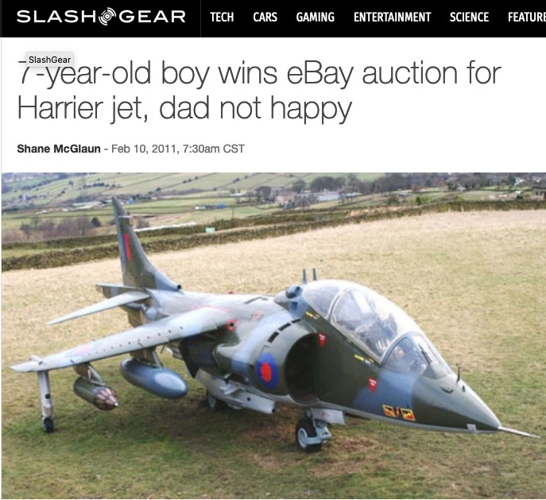
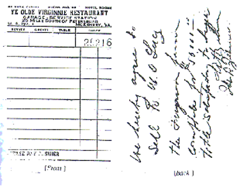
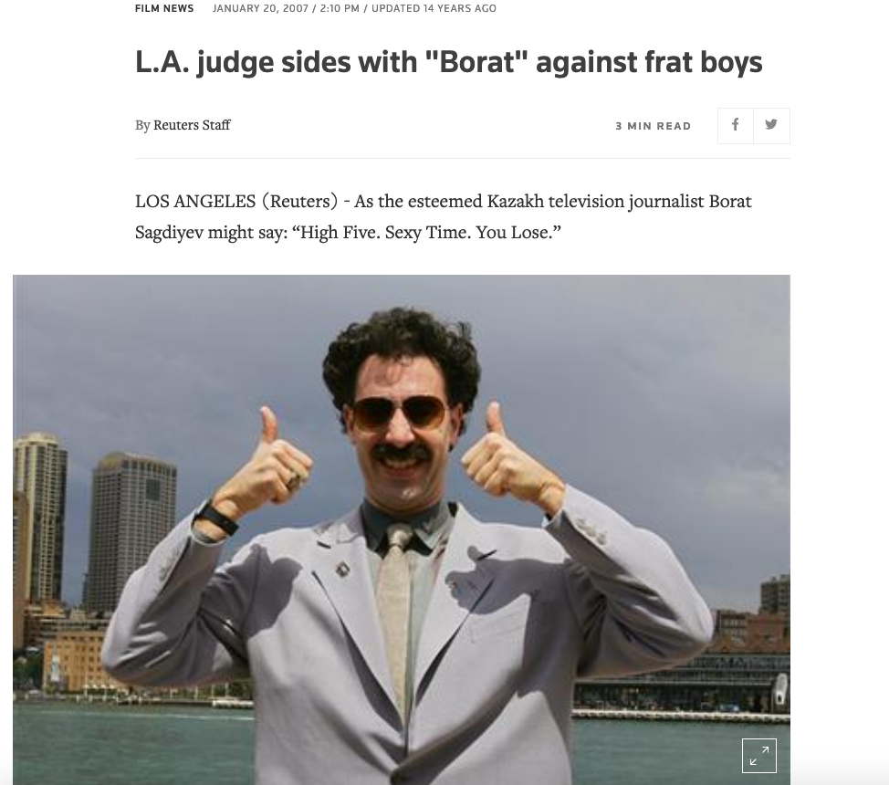
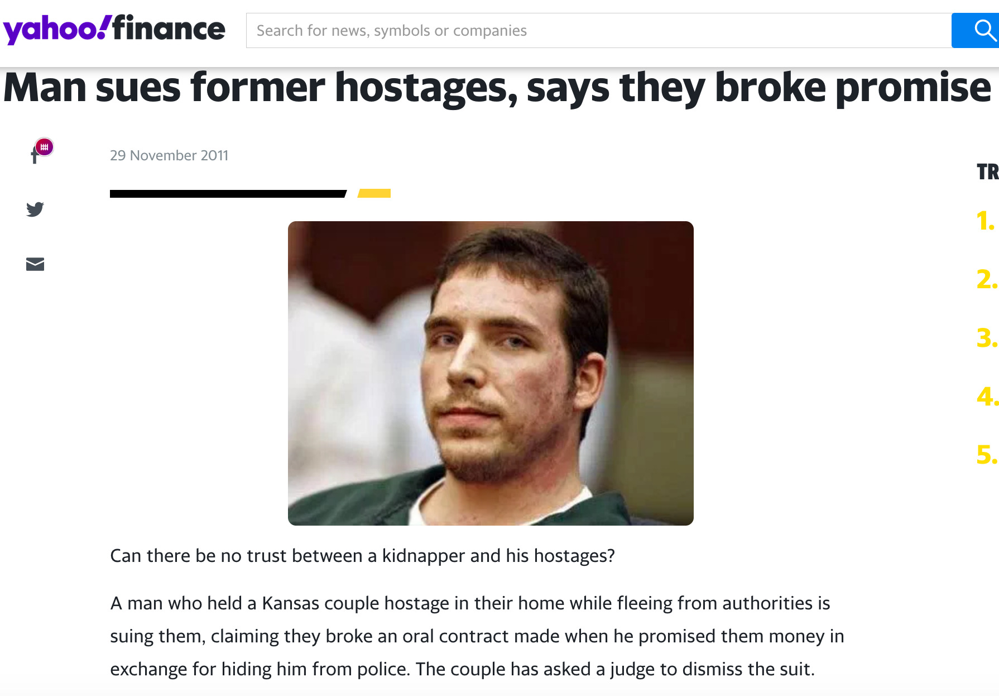
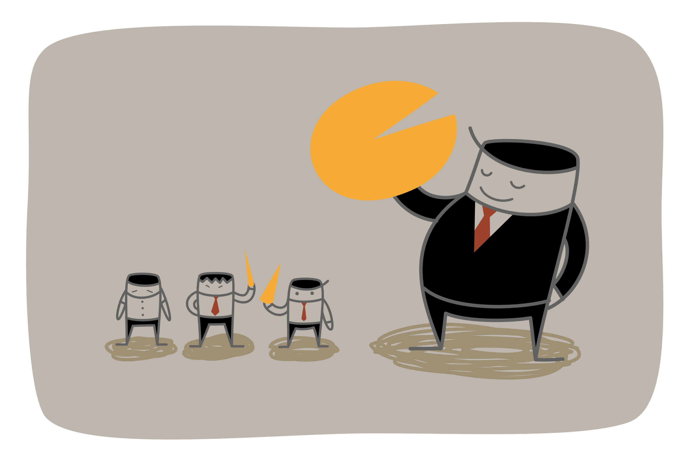
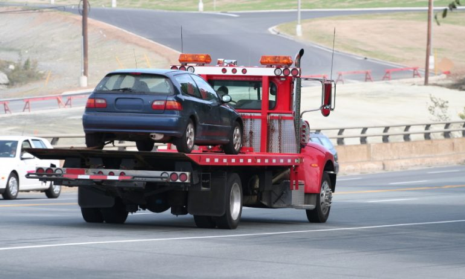
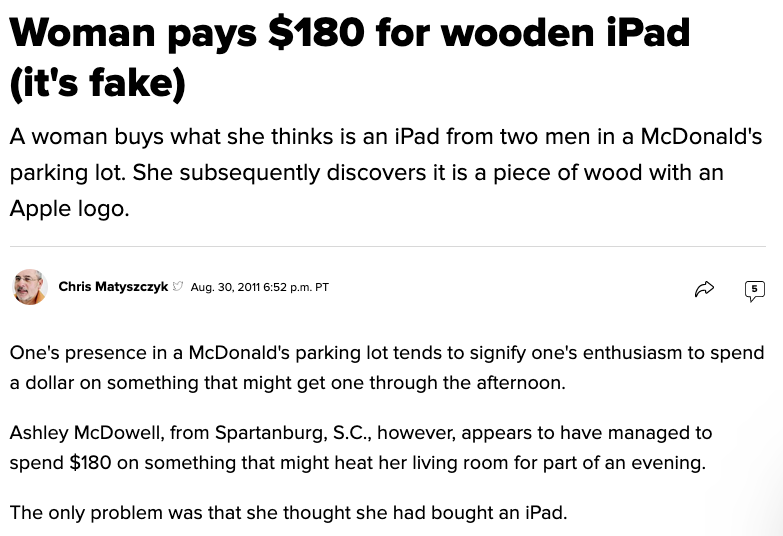
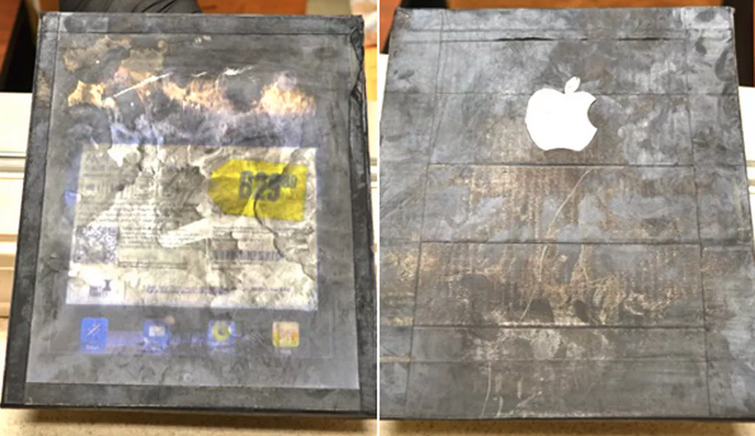
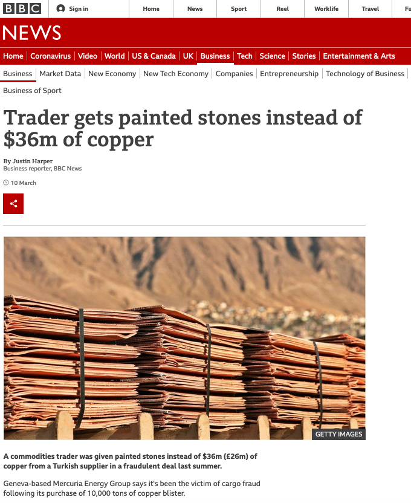
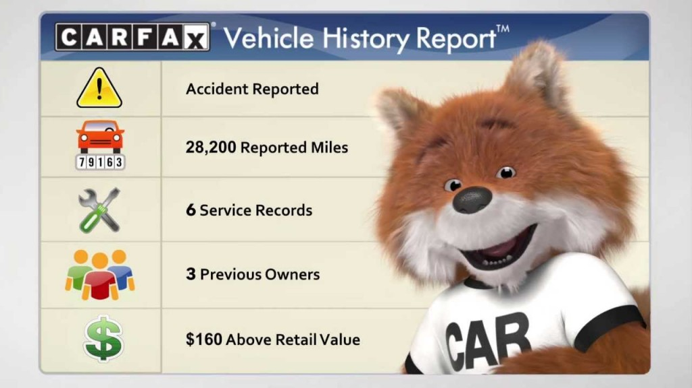

```{r setup, include=FALSE}
options(htmltools.dir.version = FALSE)
knitr::opts_chunk$set(echo=F,
                      message=F,
                      warning=F,
                      fig.retina=3,
                      fig.align = "center")
library("tidyverse")
library("ggrepel")
library("fontawesome")
xaringanExtra::use_tile_view()
xaringanExtra::use_tachyons()
xaringanExtra::use_freezeframe()
theme_slides <- theme_light() + 
  theme(
    text = element_text(family = "Fira Sans", size = 24)
  )
```

class: inverse, center, middle

# When Should a Contract Not be Enforced?

---

# When Should Voluntary Trade Be Prohibited?

.pull-left[
.smallest[
- Recalling in property law:
  - Coase theorem: to get efficient outcomes, let people trade whenever they want to
  - But also exceptions: unalienability rules, e.g. selling uranium to a terrorist

- Similarly with contract law:
  - To get efficient outcomes, generally enforce any contract both parties want enforced
  - But also exceptions: contracts that should not be enforced
]
]
.pull-right[
.center[

]
]

---

# When Should Voluntary Trade Be Prohibited?

.pull-left[
.smallest[

- Situations where promise will not be enforced and no compensation is due

- Two categories of conditions:

1. .hi[Formation defenses]
  - claim that valid contract *does not exist*
  - example: no consideration
  
2. .hi[Performance excuses]
  - Yes, a valid contract exists
  - but circumstances have changed and promisor should be allowed to breach without penalty

]
]
.pull-right[
.center[

]
]

---

# When Should Voluntary Trade Be Prohibited?

.pull-left[
.smallest[

- Most legal doctrines for invalidating a contract have two economic bases:
  1. individuals’ agreement was .hi-purple[not rational]
  2. .hi-purple[high transaction costs] or a .hi-purple[market failure]
      - information, externalities, monopoly, etc.
]
]
.pull-right[
.center[

]
]

---

# Ideal Contract Conditions & Ideal Market Conditions

.pull-left[
.smallest[
- Main goal of contract is facilitating gains from trade for efficiency

- Economic theory teaches us that competitive markets maximize gains from trade (and efficiency) when:
  1. Individuals are rational
  2. No externalities
  3. No market power/disproportionate bargaining power
  4. Perfect information
  5. Low transaction costs

- Violations of these conditions often imply a .hi[market failure]
  - analogously, *might* imply a contract should be invalid
]
]

.pull-right[
.center[

]
]

---

# Obvious Cases: Contracts that Break the Law

.pull-left[
.smallest[    
- Contract that violates the law is unenforceable
  - .hi-green[Examples]: buying a kilo of cocaine for $25,000; murder-for-hire

- Less obvious: contracts that .hi[derogate public policy] are also unenforceable
  - .hi-green[Examples]: victim of a crime rewarding police for catching criminal; contracts in restraint of trade (antitrust law)

- Recall inalienability rules; enforcing these contracts creates negative externalities

- Party that reasonably knew performance was illegal should be liable
]
]

.pull-left[
.center[

]
]

---

class: inverse, center, middle

# Incompetence

---

# Incompetence

.pull-left[

- Courts will not enforce contracts with people with .hi-purple[mental incapacity] (lack of rationality) — incapable of understanding the implications of a contract
  - Children
  - Legally insane
  - Intoxicated?

- Doctrine of .hi[incompetence]: one party “not competent to enter into the agreement”
  - Offer and acceptance not valid, no “meeting of the minds”

]

.pull-right[
.center[

]
]

---

# Incompetence

.pull-left[

> “The kid bid about $113,000 on the aircraft at a fixed price...The kid’s dad notified the seller that his son had hit the buy now button and lacked the money in his piggy bank to cover the jet.”

]

.pull-right[
.center[

]

.source[[Source](https://www.slashgear.com/7-year-old-boy-wins-ebay-auction-for-harrier-jet-dad-not-happy-10132489/)]
]

---

# Incompetence

.pull-left[

- What about if you signed a contract while drunk?

- Need to be really really really drunk to get out a contract

> “Intoxicated to the extent of being unable to comprehend the nature and consequences of the instrument he executed.”

]

.pull-right[
.center[

]
]

---

# Incompetence: Lucy v. Zehmer

.pull-left[
.smallest[
- *Lucy v. Zehmer* Virginia Sup Ct 1954

- Zehmer owned a farm (“the Ferguson farm”), Lucy had been trying to buy it for some time

- While out drinking, Lucy “already high as a Georgia pine” offers $50,000
  - Zehmer responds: “You haven’t got $50,000 in cash”
  - ...eventually, Lucy grabs a discarded guest check and writes:

> “We hereby agree to sell W.O. Lucy the Ferguson Farm complete for $50,000.00, title satisfactory to buyer.”

]
]

.pull-right[
.center[

]
]

---

# Incompetence: Lucy v. Zehmer

.pull-left[
.smallest[
- A day later, Lucy raises money to carry out the contract

- Zehmer later claims he was drunk and joking: “a bunch of two doggoned drunks bluffing to see who could talk the biggest and say the most”

- Lucy sues for .hi[specific performance]: court issuing an order for the contract to be performed as specified (i.e. Zehmer sell to Lucy for $50,000)

]
]

.pull-right[
.center[

]
]

---
# Incompetence: Lucy v. Zehmer

.pull-left[
.smallest[
- *Lucy v. Zehmer* 196 Va. 493; 84 S.E.2d 516 (1954)

- Court: Zehmer not so drunk as to be “unable to comprehend the nature and consequences” of what he was doing

- Joke or not, Zehmer behaved exactly as if he actually wanted to sell, wrote what looked like a proper (if unorthodox) contract
  - It's not Lucy’s duty to know Zehmer was joking!

- Court held the contract was valid and Zehmer owed .hi[specific performance]

]
]

.pull-right[
.center[

]
]

---

# Incompetence: Should Drunkenness Count?

.pull-left[
.smallest[
- Might think Zehmer, being drunk, lacked necessary intent to enter into a contract

- Makes more sense to not easily invalidate a contract just for drunkenness/joking
  - Otherwise, rent-seeking & excessive litigation over *how drunk* someone was, more signing of contracts at bars, etc.

- If you are *visibly* drunk and other party clearly knows, court might be more willing to invalidate (on some other grounds coming soon)

- Moral of the story: .hi-turquoise[don’t get drunk with people who might ask you to sign a contract!]
]
]

.pull-right[
.center[

]
]

---

# Similarly, the Borat Lawsuits

.pull-left[

.quitesmall[

> “Two college fraternity buddies shown guzzling alcohol and making racist remarks in the “Borat” movie have lost their bid for a court order to cut the scene they claim has tarnished their reputations...The students sued the movie’s distributor and producers last month, saying filmmakers had duped them into appearing in “Borat” by getting them drunk and falsely promising the film would never be shown in the United States.”

> “The scene at issue in the lawsuit depicts Borat getting drunk with three frat boys in a motor home while they watch a sex tape and make racist remarks about slavery and minorities in the United States.”

]

.source[Source: [Reuters (Jan 20, 2007)](https://www.reuters.com/article/us-borat-lawsuit/l-a-judge-sides-with-borat-against-frat-boys-idUSN1121340420061211)

See also [this great legal analysis of this case](https://supreme.findlaw.com/legal-commentary/borat-sequel-legal-proceedings-against-not-kazakh-journalist-for-make-benefit-guileless-americans-in-film.html), has to do with the validity of “merger clauses” in contracts
]
]

.pull-right[
.center[

]
]

---

class: inverse, center, middle

# Duress

---

# Dire Constraints

.pull-left[

- Court will not enforce contracts made under .hi-purple[dire constraints], e.g.:

- .hi[Necessity]
  - .hi-green[Example]: I'm about to starve, someone offers me a sandwich for $10,000; my boat is about to sink, someone offers to save me for $1 million
  - Contracts would be held invalid, I signed out of necessity (my BATNA is death)

]

.pull-right[
.center[

]
]

---

# Dire Constraints

.pull-left[

- Court will not enforce contracts made under .hi-purple[dire constraints], e.g.:

- .hi[Duress]
  - The other party is responsible for the situation I am in
  - “I made him an offer he couldn’t refuse”
  - Contract signed at gunpoint would not be enforced by courts

]

.pull-right[
.center[

]
]

---

# Duress

.pull-left[

.quitesmall[
“A man who held a Kansas couple hostage in their home while fleeing from authorities is suing them, claiming they broke an oral contract made when he promised them money in exchange for hiding him from police. The couple has asked a judge to dismiss the suit...Jesse Dimmick of suburban Denver is serving an 11-year sentence after bursting into Jared and Lindsay Rowley's Topeka-area home in September 2009...Dimmick filed a breach of contract suit in Shawnee County District Court.”

> “‘I, the defendant, asked the Rowleys to hide me because I feared for my life. I offered the Rowleys an unspecified amount of money which they agreed upon, therefore forging a legally binding oral contract,’ Dimmick said in his hand-written court documents. He wants $235,000, in part to pay for the hospital bills that resulted from him being shot by police when they arrested him.”

]
]

.pull-right[
.center[

]

.source[Source: [Yahoo Finance (Nov 29, 2011)](https://au.finance.yahoo.com/news/man-sues-former-hostages-says-they-broke-promise-12191680.html)]
]

---

# Friedman on Duress and Rent-Seeking

.left-column[
.center[


.smallest[
David D. Friedman

(1945—)
]
]
]

.right-column[
.smaller[
> “A mugger catches you alone in a dark alley and offers you a choice: Give him a hundred dollars or he kills you. You reply that your life is well worth the price, but unfortunately you are not carrying that much cash. He offers to take a check. When you get home, should you be free to stop payment? Should a contract made under duress be enforceable?” (p.152)

]
.source[Friedman, David D, 2000, *Law's Order: What Economics Has to do with Law and Why it Matters*]

]

---

# Friedman on Duress and Rent-Seeking

.left-column[
.center[


.smallest[
David D. Friedman

(1945—)
]
]
]

.right-column[
.smaller[
> “The argument in favor of enforceability is that if the contract is not enforceable, the mugger will refuse your check—or accept it and then make sure you can’t stop payment by killing you and cashing the check before news of your death reaches the bank. Seen from that perspective, it looks as though even a contract made under duress produces benefits for both parties and so should be enforceable. You prefer paying a hundred dollars to being killed, he prefers receiving a hundred dollars to killing you. Where’s the problem?

]
.source[Friedman, David D, 2000, *Law's Order: What Economics Has to do with Law and Why it Matters*]

]
---

# Friedman on Duress and Rent-Seeking

.left-column[
.center[


.smallest[
David D. Friedman

(1945—)
]
]
]

.right-column[
.smaller[
> “The problem is that making the contract enforceable makes offering people the choice between their money and their life a much more profitable business—most of us have more in our checking accounts than in our wallets. The gain from enforceability is a better chance, if you are mugged, to buy yourself free. It must be balanced against the higher probability of being mugged. It seems likely that the current legal rule, holding contracts made under duress unenforceable, is the efficient one.”

]
.source[Friedman, David D, 2000, *Law's Order: What Economics Has to do with Law and Why it Matters*]

]
---

# Duress and Rent-Seeking

.pull-left[
.smallest[
- Recall .hi-purple[Efficiency requires enforcing a contract if both parties wanted it to be enforceable]
  - Mugger did – he wants your $100
  - You did – you’d rather pay $100 than be killed

- So why not enforce it?
  - Makes muggings more profitable, leads to more muggings
  
- .hi-turquoise[Tradeoff: refuse to enforce a Pareto-improving trade in order to avoid incentive for bad behavior]
]
]

.pull-right[
.center[

]
]

---

# Peace Treaties?

.pull-left[
.quitesmall[
- Tradeoff means not *always* optimal to rule out enforceability under duress!

- .hi-green[Example]: what about peace treaties between nations at war?
  - Contract signed under duress: losing side facing threat of continuing to battle a superior force

- Most people agree peace treaties being enforceable is a good thing
  - *Ex post*, make war less costly, end it quicker
  - But might this encourage more wars?

- Likely efficient for peace treaties to be enforceable but promises made a mugger to not be!
]
]
.pull-right[
.center[

]
]

---

# Real Duress vs. Fake Duress

.pull-left[
- Courts won’t enforce contracts made under threat of harm
  - “Give me $100 or I'll shoot you”

- But many negotiations contain threats
  - “Give me a raise or I'll quit”
  - “$3,000 is my final offer, take it or I'll walk”
  - This is fine, often necessary to tease out both parties’ BATNAs and determine whether it’s efficient to cooperate

]

.pull-right[
.center[

]
]

---

# Real Duress vs. Fake Duress

.pull-left[

- What’s the difference? Consider what happens in each case **when bargaining fails**
  - First case: threat to **destroy** value
  - Second case: failure to **create** value

]

.pull-right[
.center[

]
]

---
# Real Duress vs. Fake Duress

.pull-left[
.quitesmall[
- More subtle in cases involving .hi-turquoise[contract modification]: changes to contract made between formation & performance

- .hi[“Preexisting duty” rule]: law only recognizes changes to contract supported by **new consideration**
  - Ordinarily, self-enforcing rule
  - .hi-green[Example]: hardware store requests more snow shovels from supplier during unexpectedly harsh winter; supplier will provide them for more payment; (essentially a new contract where both benefit)

- .hi-turquoise[What if events cause a party to agree to a modification that she later regrets?] Coerced?
]
]

.pull-right[
.center[

]
]
---

# Real vs. Fake Duress: Alaska Packers

.pull-left[
.smaller[
- *Alaska Packers’ Association v Domenico* (117 F. 99, 9th Cir. 1902)

- APA hired sailors to go fishing for salmon off coast of Alaska
  - Crew agreed to wage before setting sail

- Once at sea, sailors refused to work unless their wage was increased
  - Ship captain, in no position to refuse, complied with their demands
  - later refused to pay, sailors sued the company
]
]

.pull-right[

]

---

# Real vs. Fake Duress: Alaska Packers

.pull-left[
.smallest[
- *Alaska Packers’ Association v Domenico* (117 F. 99, 9th Cir. 1902)

- Court voided the new contract on grounds that there was no additional consideration to support the promised wage increase
  - All the crew offered in return was to complete the job they were initially hired for at wage they agreed to

- Want to avoid monopoly power and one-sided bargaining power
  - exploiting other side’s poor BATNA because *you put them in that position*
]
]
.pull-right[

]

---

# Real vs. Fake Duress: Goebel v. Linn

.pull-left[
.smallest[
- *Goebel v. Linn* (47 Mich. 489, 11 N.W. 284, 1882)

- Brewery contracted with ice company to supply ice during the summer

- Unusually warm winter caused ice shortage
  - Ice company requested a price increase, brewery (having already brewed beer that would spoil) agreed

- Brewery later reneged on paying the higher price
  - Claimed it was unenforceable because ice company had offered no new consideration (merely performed original promise)
]
]

.pull-right[

]

---

# Real vs. Fake Duress: Goebel v. Linn

.pull-left[

- *Goebel v. Linn* (47 Mich. 489, 11 N.W. 284, 1882)

- Seems like straightforward application of preexisting duty rule (?)

- Court enforced the modification in this case!
  - Reasoned the price increase was necessary to sustain the ice company in the face of .hi-turquoise[genuine economic changes]
]

.pull-right[

]

---

# Real vs. Fake Duress: Monopoly Power

.pull-left[
.smaller[
- These cases show “economic duress” is really about preventing monopoly power

- *Alaska Packers* case was pure opportunism, no genuine economic changes

- *Goebel* case was a genuine economic change (supply curve shifted upward)
  - Enforcing the contract resulting from true cost increases enhances the value of the contract
  - promotes beneficial trades that would have been lost otherwise (DWL)
]
]
.pull-right[

]

---

# Real vs. Fake Duress: Monopoly Power

.pull-left[

- Recall: under bargain theory, courts will enforce any legitimate *bargain*, not inquire whether the terms are *fair*
  - Historically, weak protection in common law against monopoly

- Primarily rely on .hi-purple[statutes] to reduce monopoly power
  - Antitrust laws, regulation of business

]

.pull-right[

]

---

# Unconscionability

.pull-left[

- But there is a growing body of precedent in common law banning contracts that are .hi[unconscionable]
  - terms appear to be grossly unfair to one of the parties
  - terms which would “shock the conscience of the court”

- Logic: party would not have voluntarily accepted such terms, must have been either incompetent, under duress, or defrauded
  - but there is no evidence of any of these (to constitute reasons to invalidate contract)

- Court shifts burden to defendant to prove that contract *was* fair when it was agreed to
]

.pull-right[

]

---
# Unconscionability

.pull-left[

.smallest[
- *Williams v. Walker-Thomas Furniture Co.* (350 F.2d 445, D.C. Cir. 1965)

- WT Co. extended credit to Williams to buy several pieces of furniture over 1957-1962
  - Contract contained “add-on” clause where none of the furniture could be considered paid off until *all* pieces were paid off
  - If Williams defaulted on any item, company could repossess *all* furniture items, including those apparently paid off

- Court ruled the clause unconscionable, grossly unfair to low-income buyers (form of economic duress)
]
]

.pull-right[

]

---

# Unconscionability

.left-column[
.center[

]
]

.right-column[

> “[W]e hold that where the element of unconscionability is present at the time a contract is made, the contract should not be enforced....Unconscionability has generally been recognized to include an absence of meaningful choice on the part of one of the parties together with contract terms which are unreasonably favorable to the other party....In many cases the meaningfulness of the choice is negated by a gross inequality of bargaining power.”

.source[*Williams v. Walker-Thomas Furniture Co.* (350 F.2d 445, D.C. Cir. 1965)]
]

---

# Unconscionability

.pull-left[

.smallest[
- But is this efficient?
  - Was the add-on clause the *cause*, or the *response* to a market failure?

- A tradeoff:
  - Firms often not willing to lend to low-income buyers without collateral (the paid-off furniture) to secure the loans
  - If contracts like this are invalid, low-income buyers might not be able to buy at all
]
]

.pull-right[

]

---

# Unconscionability

.pull-left[

- Of course consumers can be taken advantage of by complex contracts

- Ideally, evidence of incompetence, duress, or fraud should be external to the contract itself
]


.pull-right[

]

---
# Unconscionability

.pull-left[
.smallest[
- Unconscionability tends not to be invoked in usual circumstances of monopoly, but in “situational monopoly”
  - particular circumstances that limit one’s choice of trading partners

- Recall *Ploof v. Putnam* (boat in storm) from property law
  - Putnam was the only person who could give Ploof safe harbor during the storm
  - Putnam became monopolist in this situation, where he normally would not have been
]
]

.pull-right[

]

---

class: inverse, center, middle

# Mistake and Information

---

# Faulty Information

.pull-left[

- What if the parties made a contract based on a .hi[mistake]

- Four major legal doctrines for invalidating a contract based on faulty information
  1. fraud
  2. failure to disclose (sometimes)
  3. frustration of purpose
  4. mutual mistake
]

.pull-right[
.center[

]
]

---

# Fraud

.pull-left[

- .hi[Fraud]: one party deliberately tricked the other

- Economic rationale for not enforcing contracts with fraud is obvious
  - Not a Pareto-improving exchange

- Also carries .hi-purple[criminal sanctions] — the State (as a third party) has an interest in deterring and punishing fraud
]

.pull-right[
.center[

]
]

---

# Fraud

.pull-left[
.center[




.source[Source: [CNET (Aug 30, 2011)](https://www.cnet.com/news/woman-pays-180-for-wooden-ipad-its-fake/)]
]
]

.pull-right[
.center[


.source[Source: [BBC (Mar 10, 2021)](https://www.bbc.com/news/business-56330378)]
]
]

---

# Witholding Information

.pull-left[
.smallest[
- What if you trick someone by **witholding** information?

- In civil law systems, a .hi-purple[duty to disclose]
  - If you fail to provide info you should have, contract voided under **failure to disclose**

- In common law, less so
  - Seller obligated to share info about hidden **dangers**
  - but generally **not** info that makes product less valuable
  - Except **new** products come with an “implied warranty of fitness” for their stated purpose
]
]
.pull-right[
.center[

]
]

---

# Withholding Information, Exceptions

.pull-left[

- *Obde v. Schlemeyer* (Sup. Ct. WA 1960)

- Seller knew building was infested with termites, did not tell buyer
  - Termites should have been exterminated immediately to prevent further damage
  - Buyer sued seller for damages

- Court imposed duty to disclose onto the contract, i.e. awarded damages to buyer

]

.pull-right[
.center[

]
]

---

# Withholding Information, Exceptions

.pull-left[

- Many States require:
  - used car dealers to reveal major repairs done
  - sellers of homes to reveal certain defects
  - lenders to disclose APRs on all loans
  - Improve information exchange, lower transaction costs
]

.pull-right[
.center[

]
]

