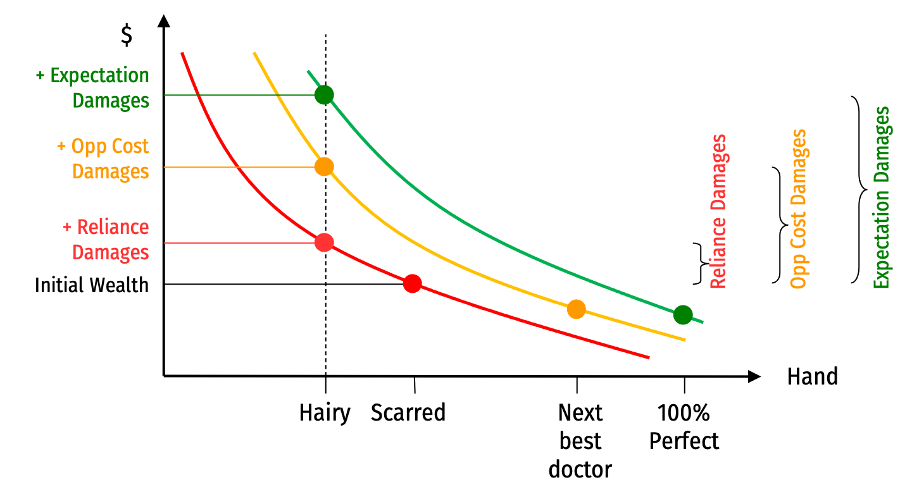

```{r setup, include=FALSE}
options(htmltools.dir.version = FALSE)
knitr::opts_chunk$set(echo=F,
                      message=F,
                      warning=F,
                      fig.retina=3,
                      fig.align = "center")
library("tidyverse")
library("ggrepel")
library("fontawesome")
xaringanExtra::use_tile_view()
xaringanExtra::use_tachyons()
xaringanExtra::use_freezeframe()
theme_slides <- theme_light() + 
  theme(
    text = element_text(family = "Fira Sans", size = 24)
  )
```

class: inverse

# Outline

### [Comparing Different Damages](#)
### [Specific Performance](#)
### [Comparing the Effect of Different Remedies](#)
### [Repeated Interactions](#)
### [Summing up Contract Law](#)

---

# Remedies for Breach of Contract

.pull-left[
.smallest[
- Three broad types of remedies:

1. Party-designed remedies
  - Specified in the contract

2. Court-imposed damages
  - Court may decide promisee entitled to some level of damages
  - Many ways to calculate these (expectation, reliance, etc.)

3. .hi[Specific performance]
  - Forces breaching party to honor contract
]
]

.pull-right[
.center[

]
]

---

class: inverse, center, middle

# Comparing Different Damages

---

# Expectation Damages

.pull-left[
.smallest[
- .hi[Expectation damages]: amount .blue[Promisee] expected to benefit from performance
  - $D=V-P$
  - Civil law tradition calls these “positive damages”

- Make .blue[Promisee] indifferent between performance and breach (i.e. **as if** the contract had been **performed**)
  - .red[Promisor] internalizes all costs of breach, makes the efficient decision whether to breach or perform
    - Perform if $V>C$, breach if $V<C$
]
]

.pull-right[
.center[

]
]

---

# Reliance Damages

.pull-left[
.smallest[
- .hi[Reliance damages]: compensate .blue[Promisee] for cost of any .hi[reliance investments] made, but **not** for additional surplus she expected to gain
  - $D=R$
  - Civil law tradition calls these “negative damages” (undo the negative harm that occured)

- Return .blue[Promisee] to level of well-being **before** she signed the contract
  - .red[Promisor] internalizes all costs of breach, makes the efficient decision whether to breach or perform
    - Perform if $V>C$, breach if $V<C$
]
]

.pull-right[
.center[

]
]

---

# Opportunity Cost Damages

.pull-left[

- .hi[Opportunity cost damages]: give .blue[Promisee] benefit she would have gotten from her **next-best option**

- Make .blue[Promisee] indifferent between breach of signed contract and performance of **next best contract**
  - $D=V-P'$ (where $P'$ is the price of the next-best contract)

- In highly competitive markets, $P \approx P'$, so expectation damages are nearly the same
]

.pull-right[
.center[

]
]

---

# Example

.pull-left[

- You agree to sell me ticket to football game for $50

- .hi-purple[Expectation damages]: you owe me value of game minus $50 $(D=V-P)$
  - Hard to determine my subjective value, easy if there are useful market prices
  - Suppose if I showed up (after you bailed), I had to pay a scalper $150
  - Then damages should be $D=100$

]

.pull-right[
.center[

]
]

---

# Example

.pull-left[

- You agree to sell me ticket to football game for $50

- .hi-purple[Reliance damages]: cost of whatever pre-game investments I made (and nothing more), relying on your ticket for entry 
  - Maybe $0...maybe I bought some foam fingers, beer coolers, etc.
  - Doen’t compensate me for the expected benefit I lost $(V-P)$
]

.pull-right[
.center[

]
]

---

# Example

.pull-left[

.smallest[

- Suppose lots of people were offering tickets on Craigslist for $60
  - Our contract would have made me $100 better off $V-P$ (again, using the scalped $150 ticket to guess the value)
  - The Craigslist ticket would have made me $90 better off

- .hi-purple[Opportunity cost damages]: $D=$90$, value lost from my next best option
  
]
]
.pull-right[
.center[

]
]

---

# Ranking Damages

| Contract Signed | $\geq$ | Best Alternative | $\geq$ | Do Nothing |
|--------:|----|---:|----|---:|
| Breach + Expectation damages | $\geq$ | Breach + opportunity cost damages | $\geq$ | Breach + reliance damages |
| $100 | $\geq$ | $90 | $\geq$ | $15 |

.smaller[
- In general, expectation damages $\geq$ opportunity cost damanges $\geq$ reliance damages

- If I am rational, will sign a contract at least as good as next best alternative, and doing nothing is an alternative (usually least valuable)
  - Expectation damages restore me to value of performance of *this* contract
  - Opportunity cost damages restore me to value of performance of next best contract
  - Reliance damages restore to me the value of having done nothing
]

---

# Example

.pull-left[
.smaller[
- In this example, a pretty thick market for tickets
  - Expectation damages ($100) $\approx$ opportunity cost damages ($90)
  - Again, using the market price of scalped tickets at game time as a good proxy for $V$ (replacement ticket)

- Much more difficult when goods are unique, very thin markets
  - What if promisee subjectively values performance differently from market?
]
]

.pull-right[
.center[

]
]

---

# Problem of Subjective Value: The Hairy Hand Case

.pull-left[

.smallest[
- *Hawkins v. McGee*, 84 N.H. 114, 146 A. 641 (N.H. 1929)

- Hawkins’ hand was scarred from an electrical accident as a child

- Dr. McGee approached Hawkins and guaranteed an operation that would result in a “one hundred percent good hand”
  - McGee was unfamiliar with skin grafting and botched the procedure, resulting in a hand full of thick hair 

- Hawkins sued for breach of contract

- .hi-turquoise[What is the appropriate amount of damages?]
]
]

.pull-right[
.center[

]
]

---

# Problem of Subjective Value: The Hairy Hand Case

.center[

]

---

# Other Court-Ordered Remedies

.pull-left[

- Other types of court-ordered remedies

- Types of damages (not interesting but worth knowing)
  - .hi[Restitution]: return money already received
  - .hi[Disgorgement]: give up wrongfully-gained profits
]

.pull-right[
.center[

]
]

---

class: inverse, center, middle

# Specific Performance

---

# Other Court-Ordered Remedies

.pull-left[

.smallest[
- .hi[Specific performance]: court mandates .red[Promisor] to honor promise
  - Civil law: often ordered instead of money damages
  - Common law: money damages more common
  - Sometimes used when seller breaches contract to sell a unique good (when money is not a good substitute for performance)

- Like injunctive relief in property law
  - .red[Promisor] is forbidden from getting out of their promise unless .blue[Promisee] chooses to release them
]
]

.pull-right[
.center[

]
]

---

# When is Specific Performance Efficient?

.pull-left[
.smallest[
- Can specific performance be efficient?
  - Concern about excessive performance that is inefficient
  
- We’ve generally seen that expectation damages will always result in efficient breach

- However, there is a case that demonstrates this can sometimes go wrong
  - Expectation damages sometimes calculated incorrectly
]
]

.pull-right[
.center[

]
]

---

# Peevyhouse v. Garland Coal

.pull-left[

- *Peevyhouse v Garland Coal and Mining Co*, 382 P.2d 109 (Okla. 1962)

- Garland contracted to strip-mine coal on Peevyhouses’ farm

- Contract specified Garland would restore property to original condition
  - Once Garland mined the coal, they made no attempt to restore the property

- Peevyhouses sued for breach of contract
]

.pull-right[
.center[

]
]

---

# Peevyhouse v. Garland Coal

.pull-left[

.quitesmall[
- *Peevyhouse v Garland Coal and Mining Co*, 382 P.2d 109 (Okla. 1962)

- Full restoration estimated to cost $29,000
  - Peevyhouse sued for approximately this value

- Both parties agreed everything else in the contract was successfully performed

- Garland introduced evidence that despite the $29,000 cost to restore, the “diminution of value” of farm from mining was only $300

- Original jury awarded $5,000 in damages to Peevyhouse
  - Both parties unhappy, both parties appealed

- OK Supreme Court reduced damages to $300
]
]

.pull-right[
.center[

]
]

---

# Peevyhouse v. Garland Coal

.pull-left[

- *Peevyhouse v Garland Coal and Mining Co*, 382 P.2d 109 (Okla. 1962)

- At first glance, seems like perfect example of efficient breach
  - .red[Promisor’s] performance cost $C$: $29,000
  - .blue[Promisee’s] net benefit, $V-P$: $300
  - Since $V<C$, efficient to breach and pay expectation damages (what happened)
]

.pull-right[
.center[

]
]

---

# Peevyhouse v. Garland Coal

.left-column[
.center[

]
]

.right-column[

.quitesmall[
> “We therefore hold that where, in a coal mining lease, lessee agrees to perform certain remedial work on the premises concerned at the end of the lease period, and thereafter the contract is fully performed by both parties except that the remedial work is not done, the measure of damages in an action by lessor against lessee for damages for breach of contact is ordinarily the reasonable cost of performance of the work; however, where the contract provision breached was merely incidental to the main purpose in view, and where the economic benefit which would result to lessor by full performance of the work is grossly disproportionate to the cost of performance, the damages which lessor may recover are limited to the diminution in value resulting to the premises because of the non-performance.

> “Under the most liberal view of the evidence herein, the diminution in value resulting to the premises because of non-performance of the remedial work was $300.00… It thus appears that the judgment was clearly excessive, and that the amount for which judgment should have been rendered is definitely and satisfactorily shown by the record.”

]
]

---

# Peevyhouse v. Garland Coal

.pull-left[

.quitesmall[
- But the dissent argued the coal company was well aware of what they were getting into when they signed the contract

- Most mining contracts at the time contained a standard per-acre diminution payment to cover damage (instead of working to achieve full restoration)
  - Peevyhouses specifically rejected this clause during negotiations, refused to sign unless contract specifically promised full restorative work
  - Apparently cared more about property condition than its market value

- Dissent argued Peevyhouses therefore entitled to specific performance of the contract, the $29,000 worth of restoration
  - Even though objectively, the damage as measured in market value was only $300, Peevyhouses’ subjective value appears to have suffered much more

- Expectation damages meant to make promisee as well off as if contract had been performed
  - Here, this was not the case!
]
]

.pull-right[
.center[

]
]

---

# Peevyhouse v. Garland Coal

.left-column[
.center[

]
]

.right-column[

.quitesmall[
 “Defendant admitted in the trial of the action, that plaintiffs insisted the [remedial work provisions] be included in the contract and that they would not agree to the coal mining lease unless [those] provisions were included.

“The cost for performing the contract in question could have been reasonably approximated when the contract was negotiated and executed, and there are no conditions now existing which could not have been reasonably anticipated by the parties. Therefore, defendant had knowledge, when it prevailed upon the plaintiffs to execute the lease, that the cost of performance might be disproportionate to the value or benefits received by plaintiff for the performance...

“[D]efendant has made no attempt to even substantially perform. The contract in question is not immoral, is not tainted with fraud, and was not entered into through mistake or accident and is not contrary to public policy. It is clear and unambiguous and the parties understood the terms thereof...The defendant could have performed the contract if it desired. It has accepted and reaped the benefits of its contract...Therefore, in my opinion, the plaintiffs were entitled to specific performance of the contract and since defendant has failed to perform, the proper measure of damages should be the cost of performance.”

]
]

---

# Peevyhouse v. Garland Coal

.pull-left[
.smaller[
- Appears the ruling attempted to turn an efficient **default** rule (expectation damages) into a **mandatory** rule, which would be enforced even when it was not what the parties intended in their contract

- Think about it in terms of penalty defaults (Ayres and Gertner): contract promised restoration work, but did not specify the remedy if it was performed

]
]

.pull-right[
.center[

]
]

---

# Peevyhouse v. Garland Coal

.pull-left[
- Garland regularly signed contracts with standard diminution fees, had no reason to bring up restoration work
  - If default rule is specific performance, Garland has a reason to bring up the fact it will cost too much, forces parties to address the issue in original contract
]


.pull-right[
.center[

]
]

---

# Party-Designed Remedies

.pull-left[

.smaller[
- Remedy for breach could be written directly into contract
  - Might stipulate an amount of money party has to pay to “buy out” of the contract to breach
  - Alternatively, a “performance bond” paid to third party, given to Promisee in event of breach
  - Or specify different process for resolving disputes, such as binding arbitration
]
]

.pull-right[
.center[

]

]

---

# Party-Designed Remedies

.pull-left[

.smallest[
- For some reason, courts often hesitant to enforce remedy terms in contracts
  - Sometimes they set aside remedy clauses and impose their own remedies

- Courts often refuse to enforce .hi-purple[penalty damages]: damages greater than actual harm that occurred (i.e. higher than expectation damages)
  - Courts will enforce .hi-purple[liquidated damages]: party-specified damages that are a reasonable estimate of the harm done by breach
]
]

.pull-right[
.center[

]

]

---

class: inverse, center, middle

# Comparing the Effects of Different Remedies

---

# Comparing the Effects of Different Remedies

.pull-left[

.smallest[
- Effects of different remedies on:
  - decision to perform or breach
  - decision to sign or not sign
  - investment in performance
  - investment in reliance

- Once all the decisions are made, and decision is in front of a jury, remedy is purely a question of redistribution

- So to think about effect of chosen remedy on efficiency, think of the incentives created by the rule for similar situations
]
]

.pull-right[
.center[

]
]

---

# Comparing the Effects of Remedies

.pull-left[

.smallest[
.bg-washed-green.b--dark-green.ba.bw2.br3.shadow-5.ph4.mt5[
- .hi-green[Example]: I am an aircraft manufacturer, you and I sign a contract
  - You agree to pay me $350,000
  - I agree to deliver an airplane to you
  - You value the airplane at $500,000
  - I expect it will cost me $300,000 to produce, but it’s possible my costs might rise to $1,000,000
]

- Compare if contract were enforced by specific performance, vs. by expectation damages
]
]

.pull-right[
.center[

]

.smallest[
- V: $500,000
- P: $350,000
- C (low): $300,000
- C' (high): $1,000,000
]
]

---

# Comparing the Effects of Remedies

.smallest[
Under .hi[expectation damages]

|     | Low Costs (Perform) | High Costs (Perform) | High Costs (Breach) |
|-----|--------:|-----:|---:|
| .blue[You] | V-P = .blue[$150,000] | V-P = .blue[$150,000] | D = .blue[$150,000] |
| Me | P-C = .red[$50,000] | P-C' = .red[-$650,000] | -D = .red[-$150,000] |
| **Joint** | V-C = **$200,000** | V-C' = **$-500,000** | **$0** |

- Will breach (efficiently) if $C>V$

]

---

# Comparing the Effects of Remedies

.smallest[
Under .hi[specific performance]

|     | Low Costs (Perform) | High Costs (Perform) | High Costs (Renegotiate) |
|-----|--------:|-----:|---:|
| .blue[You] | V-P = .blue[$150,000] | V-P = .blue[$150,000] | 150,000+(0.5*500,000) = .blue[$400,000] |
| .red[Me] | P-C = .red[$50,000] | P-C' = .red[-$650,000] | -650,000+(0.5*500,000) = .red[-$400,000] |
| **Joint** | V-C = **$200,000** | V-C' = **$-500,000** | **$0** |

- Will want to **renegotiate** the contract, $500,000 worth of cooperative surplus (S) to bargain over
  - Assume split evenly
  - So I will pay you $400,000 to buy my way out of the contract
]

---

# Comparing the Effects of Remedies

.pull-left[

- So long as transaction costs are low, either remedy leads to same (efficient) outcome (when $C>V)$

- But if transaction costs (of renegotiating) are high:
  - Expectation damages allow me to breach
  - Specific performance would lead to *inefficient* performance
  - I would still have to build you the plane, even though $C>V$

]

.pull-right[
.center[

]

.smallest[
- V: $500,000
- P: $350,000
- C (low): $300,000
- C' (high): $1,000,000
]
]

---

# Efficient Breach vs. Efficient Signing

.pull-left[

.smallest[
- We haven’t talked much about .hi[efficient signing]

- With contract protected by specific performance, we saw:
  - If my costs stay low, I get a $50,000 profit
  - If my costs rise and I need to renegotiate to buy my way out of the contract, I take a $400,000 loss
  - So, .hi-purple[would I be willing to sign this contract in the first place?]
    - Only for $p(50,000)+(1-p)(-400,000)>0$, i.e. $p>0.89$
]
]

.pull-right[
.center[

]

.smallest[
- V: $500,000
- P: $350,000
- C (low): $300,000
- C' (high): $1,000,000
]
]

---

# Efficient Breach vs. Efficient Signing

.pull-left[
.smallest[
- Even expectation damages face this problem!
  - If my costs stay low, I get a $50,000 profit
  - If my costs rise and I breach, I lose $150,000 in damages paid
  - So, .hi-purple[would I be willing to sign this contract in the first place?]
    - Only for $p(50,000)+(1-p)(-150,000)>0$, i.e. $p>0.75$

- So expectation damages might create efficient breach, but might lead to inefficient signing
  - Too often I *don’t* want to sign the contract (despite positive joint value)
]
]

.pull-right[
.center[

]

.smallest[
- V: $500,000
- P: $350,000
- C (low): $300,000
- C' (high): $1,000,000
]
]

---

# Efficient Breach vs. Efficient Signing

.pull-left[

- Suggests that, even if expectation damages are a sensible **default** rule, still efficient for parties to specify their own different damage rule in contract

- Expectation damages are *often* efficient, but not *always*, so no reason to make them mandatory

]

.pull-right[
.center[

]
]

---

class: inverse, center, middle

# Repeated Interactions

---

# One-Shot Interactions

.pull-left[
.smaller[
- Recall the .hi-purple[agency] or .hi-purple[trust] game

- .red[Principal] decides to .red[invest] money ($100) with .blue[Agent]
  - Investment grows to $200

- .blue[Agent] can then .blue[keep] or .blue[share] the returns with .red[Principal]

- As a .hi[one-shot] interaction, we saw .hi-purple[SPNE]: (.red[Don't], .blue[Keep])
]
]
.pull-right[
.center[

]
]

---

# One-Shot Interactions

.pull-left[
.smaller[
- Suppose they play this game again

- If .blue[Agent] .blue[kept] in previous round, .red[Principal] can **punish** their defection by playing .red[Don’t]

- This could lead to more cooperation, but all finite-games have a problem...
]
]
.pull-right[
.center[

]
]

---

# One-Shot Interactions

.pull-left[
.smaller[
- Suppose they both know there will be 10 rounds of this game

- Using backwards induction, what will the outcome be in round 10?
]
]
.pull-right[
.center[

]
]

---

# One-Shot Interactions

.pull-left[
.smaller[
- Suppose they both know there will be 10 rounds of this game

- Using backwards induction, what will the outcome be in round 10?

- Given this, what will the players do in round 9?
  - Knowing what will happen in round 10, punishment to defection in round 9 is worthless
  - So round 9 will have the same typical result
]
]
.pull-right[
.center[

]
]

---

# One-Shot Interactions

.pull-left[
.smaller[
- Given this, what will the players do in round 8? ...
]
]
.pull-right[
.center[

]
]

---

# One-Shot Interactions

.pull-left[
.smaller[
- The logical conclusion is that it is .hi-purple[not rational to cooperate] over time
  - We get the same SPNE in every round as in the one-shot game

- .hi[“The Endgame problem”], Selten’s “chain store paradox”

- The problem is the endgame is clearly defined
]
]
.pull-right[
.center[

]
]

---

# Repeated Interactions

.pull-left[
.smallest[
- One-shot or finitely-repeated games are interesting, but rare
  - How often do we know for certain when a game/relationship will end?

- Some predictions for finitely-repeated games don’t hold up well in experiments or reality
  - Prisoners’ dilemma, ultimatum game

- We often play games or are in relationships that are .hi-purple[indefinitely repeated] (have no *known* end), we call them .hi[infinitely-repeated games]

]
]

.pull-right[
.center[

]
]

---

# Repeated Interactions

.pull-left[

- Two nearly identical interpretations of infinitely-repeated games:

1. Agents play forever, but discount (payoffs in) the future by a constant rate
2. Game continues with some constant probability each round

]

.pull-right[
.center[

]
]

---

# Infinitely-Repeated Games

.pull-left[
.smaller[
- Suppose the players play this game indefinitely, with the following constant probabilities each round:
  - 0.90 the game will continue another round
  - 0.10 the game will end this round

- Suppose .red[Principal] plays a strategy known as the .hi[grim trigger strategy]: start by playing .red[Trust], and then if .blue[Agent] plays .blue[Keep] even just once, then play .red[Don’t] *forever* (infinite punishment)
]
]

.pull-right[
.center[

]
]

---

# Infinitely-Repeated Games

- With .red[Principal] playing grim trigger, consider .blue[Agent’s] incentives each round:

- If they .blue[Keep]: get $200 this round, nothing ever again

- If they .blue[Share]: get $50 this round, $50 next round, $50 indefinitely...

--

- Value of relationship:

$$50+50(0.90)+50(0.90)^2+50(0.90)^3+\cdots=\frac{50}{1-0.90}=500$$

--

- Since $500>200$, we can sustain cooperation!
  - Payoff to cooperation $>$ payoff to one-time defection (with infinite punishment)

- Can determine what probability (or discount rate) is sufficient to sustain cooperation

---

class: inverse

# Summing up Contract Law

---

# One Last Fun Contract Example

.pull-left[

- Suppose you propose (marriage) to your sweetheart, they accept

- Then you get cold feet

- Should your fiancee be able to sue you for breach of contract?
  - And if so, what are the damages?
]

.pull-right[

.center[

]
]

---

# One Last Fun Contract Example

.pull-left[
.smaller[
- In the old (and problematic) days, grooms had strong interest in preserving “purity” of bride
  - Problem for women: reluctant to “date” for fear of reduced ability to find a husband
  - Problem for men: hard to find women to “date” but not marry

- Traditional solution: if woman gets pregnant, man will marry her
  - Still problem of opportunistic breach by the man
]
]

.pull-right[

.center[

]
]

---

# One Last Fun Contract Example

.pull-left[

- Under common law, a spurned bride could sue for breach of promise to marry

- Damages were value of reduction in future marital prospects
]

.pull-right[

.center[

]
]

---

# One Last Fun Contract Example

.pull-left[

- Under common law, a spurned bride could sue for breach of promise to marry

- Damages were value of reduction in future marital prospects

- ...Until about the 1930s, when courts became unwilling to enforce this
]

.pull-right[

.center[

]
]

---

# One Last Fun Contract Example

.pull-left[
.smallest[
- A clever new solution: the engagement ring

- Contrary to what DeBeers will tell you, the “tradition” of engagement rings is not ancient custom

- Margaret Brining, “Rings and Promises”:
  - Engagement ring serves as a performance bond for promise to marry
  - Instead of suing (no longer option), abandoned fiancee could simply keep the ring
  - Ring must be valuable enough (2 months salary) to commit the promisor to perform

]
]
.pull-right[

.center[

]
]

---

# One Last Fun Contract Example

.pull-left[
.smallest[
- A clever new solution: the engagement ring

- Contrary to what DeBeers will tell you, the “tradition” of engagement rings is not ancient custom

- Margaret Brining, “Rings and Promises”:
  - Engagement ring serves as a performance bond for promise to marry
  - Instead of suing (no longer option), abandoned fiancee could simply keep the ring
  - Ring must be valuable enough (2 months salary) to commit the promisor to perform

]

]

.pull-right[

.center[

]
]

---

# One Last Fun Contract Example

.pull-left[

- Social changes: permissiveness of pre-marital sex, contraceptives, less stigma

- Today this performance bond is less necessary in marriage market
]

.pull-right[

.center[

]
]

---

# Economic Functions of Contract Law

.pull-left[

.quitesmall[
1. .hi[Encourage cooperation] & make .hi[promises credible]
  - Contracts should generally be enforceable when both parties want them to be (in advance)
2. Encourage .hi[efficient disclosure of information]
  - Penalty defaults penalize better-informed party that withholds information
3. Secure .hi[optimal commitment to performance]
  - Use expectation damages
4. Secure .hi[efficient level of reliance]
  - Not including full benefits of (over)reliance in expectation damages
5. Provide .hi[efficient default rules and regulations]
  - Allocate risk to low-cost bearer; situations where contracts should be invalidated
6. Foster .hi[enduring relationships]
]
]

.pull-right[
.center[

]
]