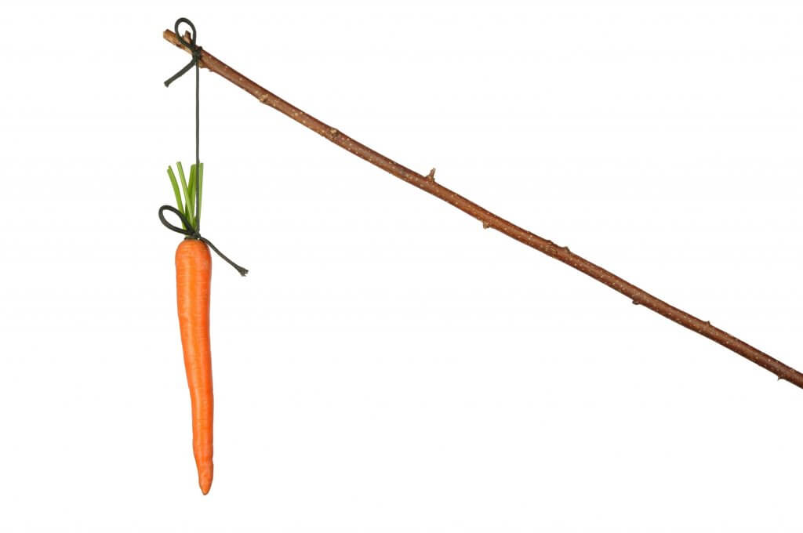
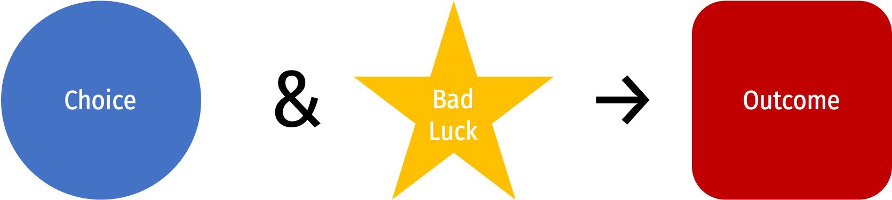
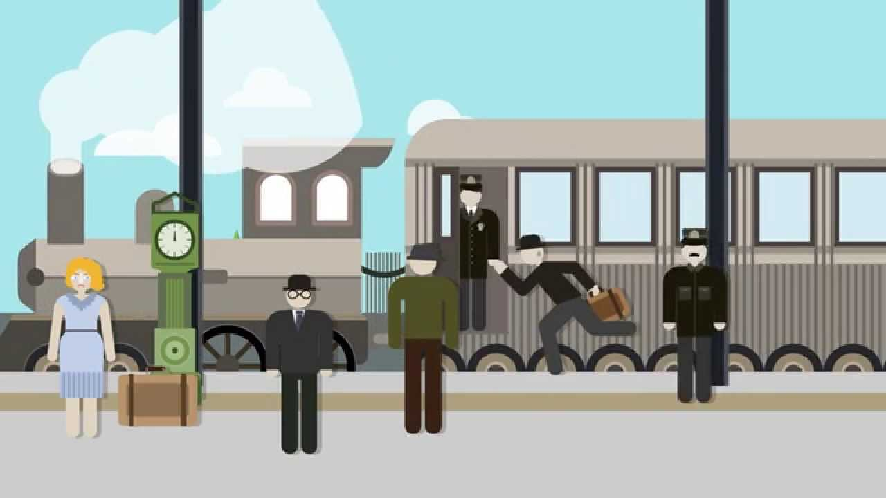
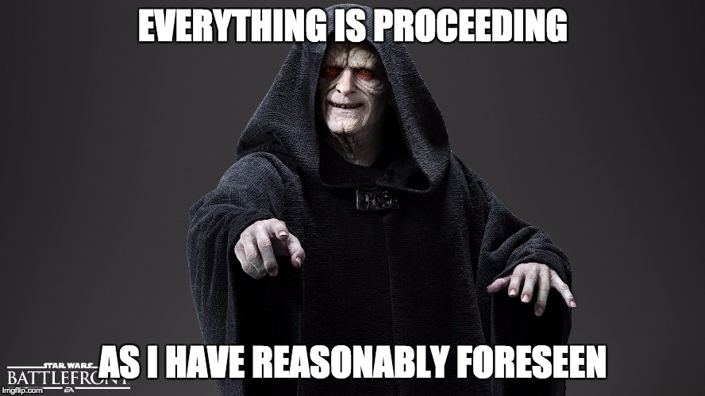
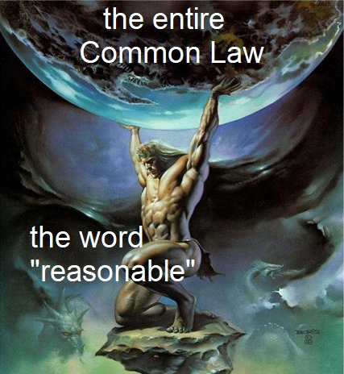

```{r setup, include=FALSE}
options(htmltools.dir.version = FALSE)
knitr::opts_chunk$set(echo=F,
                      message=F,
                      warning=F,
                      fig.retina=3,
                      fig.align = "center")
library("tidyverse")
library("ggrepel")
library("fontawesome")
xaringanExtra::use_tile_view()
xaringanExtra::use_tachyons()
xaringanExtra::use_freezeframe()
theme_slides <- theme_light() + 
  theme(
    text = element_text(family = "Fira Sans", size = 24)
  )
```

class: inverse

# Outline

### [A Recap of Our Approach So Far](#3)
### [Harm](#)
### [Causation](#)
### [Breach of Duty](#)

---

class: inverse, center, middle

# A Recap of Our Approach So Far

---

# Recap of Our Approach So Far

.pull-left[
.smaller[
- .hi[Efficiency]
  - maximize total surplus to all individuals
  - scarce resources owned by whoever **values them the most**
  - make changes if social benefit $>$ social cost

- Design legal system that obtains .hi-purple[efficient outcomes]
  - Once the rules are set, people only act in own self-interest, without regard for efficiency
  - So the goal is to .hi-purple[set up the rules so that people acting in their interest will naturally lead to efficient outcomes]
]
]

.pull-right[
.center[

]
]

---

# Recap of Our Approach So Far

.pull-left[

- .hi-purple[Coase]'s insights give us a way to accomplish this:

> If .hi-purple[transaction costs are low], with .hi-purple[well-defined] and .hi-purple[tradeable property rights], parties can bargain voluntarily to reach the efficient outcome. 

- So the initial allocation of rights doesn't matter for efficiency

- **But** if transaction costs are high, we may not get the efficient outcome

]

.pull-right[
.center[

]
]
---

# Recap of Our Approach So Far

.pull-left[

- Led us to two .hi-purple[normative] guidelines for designing an efficient legal system:
  1. Minimize transaction costs to facilitate exchange
  2. Allocate rights as efficiently as possible

- Tradeoff between .hi-purple[injunctive relief] and .hi-purple[damages]
]

.pull-right[
.center[

]
]
---

# Recap of Our Approach So Far

.pull-left[
.smallest[
- Law of .hi[property] works well for **spot** transactions

- Law of .hi[contracts] allow for more complicated **non-simultaneous** trade
  - enables cooperation and credible promises
  - encourages efficient disclosure of information
  - secures efficient commitment to performance
  - secures efficient reliance
  - supplies efficient default rules and regulations
  - fosters enduring relationships
]
]

.pull-right[
.center[

]
]

---

# Recap of Our Approach So Far

.pull-left[
.smallest[
- So far, we have only examined .hi-turquoise[voluntary exchange] and mutual consent
  - Parties reach an agreement *in advance* of transaction (though circumstances might change after the agreement)

- Up next: .hi-turquoise[“involuntary exchange”]
  - Parties who did *not* have an agreement before their (unfortunate) interaction
  - .hi-green[Example]: you are bicycling to class, I am texting while driving, and I hit you...
  - You did not want to deal with me, I did not want to deal with you, but here we are...
]
]
.pull-right[
.center[

]
]

---

# Recap of Our Approach So Far...In Other Words

.pull-left[
.smaller[
- .hi-purple[Property law]: situations where transaction costs are low enough to get agreement ahead of time (some exceptions of course!)

- .hi-purple[Contract law]: situations where transaction costs are low enough for us to agree to a contract, but high enough that we might not want to renegotiate the contract later (when something unexpected happens)

- .hi[Tort law]: situations where transaction costs are **too high to agree on anything in advance**
]
]

.pull-right[
.center[

]
]
---

# An Example

.pull-left[
.smallest[
- .hi-green[Example]: I am distracted and hit you with my car while you are bicycling to class
  - I did not *want* or *intend* to hit you

- Put aside questions of justice and retribution...and simply consider incentives

- Distracted driving (and hitting people) clearly imposes a serious negative externality on others

- Without any laws, we expect more than the efficient amount of distracted driving

- Society needs to design law to discourage this behavior
  - How do we do this?
]
]
.pull-right[
.center[

]
]
---

# An Example

- Harder with tort law, because I did not intend to hit you (and we had no prior agreement)

- I made a choice ahead of time (to be distracted) that increased the likelihood of an accident

--

.center[

]

--

- So how do we create an incentive to avoid this type of outcome?

- Can imagine several ways

---

# An Example

.center[

]

--

1. Punish the **choice** (criminal law, regulations): make it *illegal* to drive distracted (even if you don't hit anyone)

--

2. Punish the **outcome** (.hi[“Strict liability”]): if you hit someone, *regardless* of the choice you made, (distracted or not), you are liable

--

3. Punish the **combination** of choice & outcome (“.hi[“Negligence”]): if you hit someone, and you made a bad choice increasing the probability of an accident, you are liable

---

# Tort Law

.pull-left[

- .hi[Tort]: *noun.* (French): injury

- Contract law: where someone harms you by breaking a promise they made

- Tort law: where someone harms you *without* having made any promises

]

.pull-right[
.center[

]
]

---

# Tort Law vs. Criminal Law

.pull-left[

> “If someone shoots you, call a cop. If someone hits your car, call a lawyer.”

- Actually a lot of overlap between criminal law & tort law
  - Some torts have equivalent crimes
  - Intentional vs. unintentional torts
  - Can sue a criminal for damages in civil case
  - O.J. Simpson example
]

.pull-right[
.center[

]
]

---

# Torts and Efficiency

.pull-left[

- As usual, we will focus on attaining efficient outcomes

- I hit you with my car, causing $1,000 worth of damage to you (no damage to me)
  - Should I have to pay damages?
]

.pull-right[
.center[


]
]

---

# Torts and Efficiency

.pull-left[
.smallest[

Suppose the law holds me liable for:

|   | Nothing | $1,000 | $50,000 |
|----|----|----|----|
| .blue[You] | .blue[-1,000] | .blue[0] | .bkue[49,000] |
| .red[Me] | .red[0] | .red[-1,000] | .red[-50,000] |
| **Joint** | **-1,000** | **-1,000** | **-1,000** |


- Whatever happens **after** the accident has no apparent effect on efficiency
  - Just redistributing income, each of us obviously has different preference for this
  - No new value created or destroyed
  
- ...this can't be the way to think about efficiency
]
]

.pull-right[
.center[

]
]

---

# Remember the First Day of Class...

.pull-left[
- Everything that happens *after* the accident merely affects **distribution**, not efficiency

- Damage is *already* done, lawsuit = how to clean up the mess:
  - assign blame
  - maybe punish someone
  - maybe compensate
]

.pull-right[
.center[

]
]

---

# Remember the First Day of Class...

.pull-left[

- .hi-turquoise[Before] the incident, lots of .hi-turquoise[decisions] were made, e.g.
  - how much to invest in precaution (how fast to drive, wearing a helmet while biking, etc)
  - reaching a contractual agreement
  - transforming my property (planting trees that block my neighbor's view)
  - relying on my supplier to deliver on time

]

.pull-right[
.center[

]
]

---

# Remember the First Day of Class...

.pull-left[
.smallest[
- These were made based on .hi-turquoise[expectations] about what will happen

- These decisions affect the .hi-turquoise[outcomes] and .hi-purple[how much value is created and destroyed by society]

- More importantly, .hi[how do laws and court decisions affect *future* behavior on the margin?]

- Economists are more *forward*-looking about law
]
]
.pull-right[
.center[

]
]

---

# Designing Efficient Tort Law

.pull-left[

- How do we structure tort law to get people to behave in a way that results in efficient outcomes?

- For .hi-purple[deliberate] harms: make punishments severe (criminal law)

- For .hi-purple[accidental] harms, much trickier
  - The goal is not *no* accidents, but the *efficient amount* of accidents!

]

.pull-right[
.center[

]
]

---

# Designing Efficient Tort Law

.pull-left[
.smallest[
- How do we structure tort law to get people to behave in a way that results in efficient outcomes?

- Unlike property law, no injunctive relief possible

- Unlike contract law, no agreement in advance

- Cooter and Ulen: essence of tort law is 

> “the attempt to make injurers internalize the externalities they cause, in situations where transaction costs are too high to do this through property or contract rights”

]
]

.pull-right[
.center[

]
]

---

class: inverse, center, middle

# The Legal Theory of Torts

---

# The Legal Theory of Torts

.pull-left[

- .blue[Plaintiff]: person who brings the lawsuit
  - Victim, person who is harmed

- .red[Defendant]: person who is being sued
  - Injurer, person who caused the harm

- In a tort case, .red[Defendant] caused some harm to .blue[Plaintiff], who is asking for damages

]

.pull-right[
.center[

]
]

---

# The Legal Theory of Torts

.pull-left[

- Like contract law, a well-known legal theory of tort liability developed 100 years ago

- A valid tort case (where .blue[Plaintiff] can collect damages from .red[Defendant]) has three elements:
  1. .hi[Harm]
  2. .hi[Causation]
  3. .hi[Breach of duty] (sometimes)

]

.pull-right[
.center[

]
]
---

# Harm

.pull-left[

- For a tort to exist, the .blue[Plaintiff] needs to have suffered some harm

- “Without harm, there is no tort”

- .hi-green[Examples]:
  - Gas station sells gas with defective additive to cars with custom carburetors
  - Manufacturer exposes workers to a chemical that increases cancer risk by 1%
]

.pull-right[
.center[

]
]
---

# Harm: Perfect Compensation

.pull-left[

.smallest[
- Consider some preference relationship between money and health

- Accident has caused injured party (.blue[Plaintiff]) to suffer harm
  - Model as fall to lower indifference curve
]
]

.pull-right[

```{r}
apts2<-tribble(
  ~letter, ~x, ~y,
  "A", 4, 900,
  "B", 3, 400,
  "C", 3, 900,
  "D", 3, 1200,
)
IC=function(x){1200/x}

IC2=function(x){3600/x}
line_colors <- c("IC1" = "red", "IC2" = "blue")

ic<-ggplot(data.frame(x=c(0,10)), aes(x=x))+
  stat_function(fun=IC, geom="line", size=2, aes(color="IC1"))+
  geom_label(x=8, y=IC(8), aes(fill="IC1"), label="After", color = "white")+
  stat_function(fun=IC2, geom="line", size=2, aes(color="IC2"))+
  geom_label(x=8, y=IC2(8), aes(fill="IC2"), label="Before", color = "white")+
  geom_point(data = subset(apts2, letter %in% c("A", "B")),
             mapping=aes(x=x, y=y),
             size = 3)+
  geom_text_repel(data = subset(apts2, letter %in% c("A", "B")),
             mapping=aes(x=x, y=y,
             label = letter),
             seed = 2,
             size = 6)+
  scale_x_continuous(breaks=NULL,
                     limits=c(0,10),
                     expand=expand_scale(mult=c(0,0.1)))+
  scale_y_continuous(breaks=NULL,
                     limits=c(0,2000),
                     expand=expand_scale(mult=c(0,0.1)))+
  scale_colour_manual("Curves", values = line_colors, guide=F)+
  scale_fill_manual("Curves", values = line_colors, guide=F)+
  guides(fill = F)+
  labs(x = "Health",
       y = "Money")+
  theme_classic(base_family = "Fira Sans Condensed", base_size=20)
```

```{r}
ic+annotate("segment", x = 3.75, xend = 3.25, y = 800, yend = 500, colour = "purple", size=2, alpha=1, arrow=arrow(length=unit(0.5,"cm"), ends="last", type="closed"))
```
]

---

# Harm: Perfect Compensation

.pull-left[
.smallest[
- Consider some preference relationship between money and health

- Accident has caused injured party (.blue[Plaintiff]) to suffer harm
  - Model as fall to lower indifference curve

- .hi-turquoise[Perfect compensation] would restore .blue[Plaintiff] to original level of well-being
  - Return to original indifference curve
  - Again, often via money damages
  - Sometimes, can't restore health, must find some equivalent amount of of money to compsensate
]
]
.pull-right[
```{r}
ic+geom_point(data = subset(apts2, letter %in% c("C", "D")),
             mapping=aes(x=x, y=y),
             size = 3)+
  geom_text_repel(data = subset(apts2, letter %in% c("D")),
             mapping=aes(x=x, y=y,
             label = letter),
             seed = 2,
             size = 6)+
  annotate("segment", x = 3, xend = 3, y = 500, yend = 800, colour = "green", size=2, alpha=1, arrow=arrow(length=unit(0.5,"cm"), ends="last", type="closed"))+
  annotate("segment", x = 3.25, xend = 3.75, y = 900, yend = 900, colour = "green", size=2, alpha=1, arrow=arrow(length=unit(0.25,"cm"), ends="last", type="closed"))+
  annotate("segment", x = 3, xend = 3, y = 950, yend = 1100, colour = "green", size=2, alpha=1, arrow=arrow(length=unit(0.25,"cm"), ends="last", type="closed"))
```
]

---

# Harm: Perfect Compensation

.pull-left[

- Many of the harms are .hi-turquoise[tangible]:
  - Medical costs
  - Lost income
  - Damaged property

- But there can also be .hi-turquoise[intangible harms]:
  - Emotional distress
  - Pain and suffering
  - Loss of companionship

]

.pull-right[
.center[

]
]
---

# Harm: Perfect Compensation

.pull-left[
- In theory, perfect compensation should cover all these harms
  - Historically, courts were less willing to compensate for intangible harms (hard to measure)
  - Over time, U.S. courts have been compensating more for intangible harms

]

.pull-right[
.center[

]
]

---

# Harm: Perfect Compensation

.pull-left[
- Should we compensate for intangible harms?

- **Pros**: the closer liability is to the full harm done, the better the incentive to avoid these harms (internalize the full externality)

- **Cons**: hard to measure, subjective value, high variance in award sizes, incentive to rent-seek?

]

.pull-right[
.center[

]
]

---

class: inverse, center, middle

# Causation

---

# Causation: Cause-in-fact

.pull-left[
.smallest[
- To be liable for a tort, the .blue[Plaintiff] must show that the .red[Defendant] .hi-purple[caused] them harm

- .hi-purple[Cause-in-fact] test
  - .hi-purple[“But for] the .red[Defendant's] actions, would the harm have occurred?”
  - $A \rightarrow B$
  - Ambiguity (recall Coase’s insight that it takes *two* parties to create harm!)
]
]
.pull-right[
.center[

]
]

---

# Causation: Cause-in-fact

.left-column[
.center[


.smallest[
David D. Friedman

(1945—)
]
]
]

.right-column[
.smaller[
> “I stop my friend in the street to chat. He continues on down the street. As he passes by an office building, a safe falls out the window and crushes him. Have I caused his death? Should I be liable?

> One sense of “I caused his death” is “had I not acted as I did, he would not have died”—the “but for” definition of causality. In that sense I killed my friend—if I had not delayed him, he would not have been under the safe when it fell. Yet it would seem odd to blame me and odder still to hold me liable. Why?” (p.191)

]
.source[Friedman, David D, 2000, *Law's Order: What Economics Has to do with Law and Why it Matters*]

]

---

# Causation: Cause-in-fact

.pull-left[

- What about setting in motion a long chain of events that leads to harm?
  - $A \rightarrow c \rightarrow d \rightarrow e \rightarrow B$
  - Event A satisfies the “but-for” test!

]

.pull-right[
.center[

]
]
---

# Causation: *Palsgraf v. LIRR*

.pull-left[

- *Palsgraf v. Long Island Rairoad Co.*, 248 N.Y. 339 (1928)

- Railroad attendant’s actions caused, but were not the *proximate* cause to Ms. Palgraf's injuries

- Court ruled attendant’s actions were too remote to be considered a .hi-purple[proximate cause]
]

.pull-right[
.center[

]
.source[[Source](https://www.youtube.com/watch?v=G-9cIaMhtUE)]
]

---

# Causation: *Palsgraf v. LIRR*

.left-column[
.center[

]
.source[[Source](https://www.youtube.com/watch?v=G-9cIaMhtUE)]

]

.right-column[

.quitesmall[
> “Plaintiff [Mrs. Palsgraf] was standing on a platform of defendant’s railroad after buying a ticket to go to Rockaway Beach. A train stopped at the station, bound for another place. Two men ran forward to catch it. One of the men reached the platform of the car without mishap, though the train was already moving. The other man, carrying a pack- age, jumped aboard the car, but seemed unsteady as if about to fall. A guard on the car, who had held the door open, reached forward to help him in, and another guard on the platform pushed him from behind. In this act, the package was dislodged, and fell upon the rails. It was a package of small size, about fifteen inches long, and was covered by
a newspaper. In fact it contained fireworks, but there was nothing in its appearance to give notice of its contents. The fireworks when they fell exploded. The shock of the ex- plosion threw down some scales at the other end of the platform many feet away. The scales struck the plaintiff, causing injuries for which she sues.”

]

.source[Source: [Court Opinion](www.courts.state.ny.us/reporter/archives/palsgraf_lirr.htm)]

]

---

# Causation: *Palsgraf v. LIRR*
.left-column[
.center[


.smallest[
Benjamin N. Cardozo

1870—1938

Associate Justice of U.S. Supreme Court
]]
]

.right-column[

.quitesmall[
> “Negligence, like risk, is thus a term of relation. Negligence in the abstract, apart from things related, is surely not a tort, if indeed it is understandable at all...Negligence is not a tort unless it results in the commission of a wrong, and the commission of a wrong imports the violation of a right, in this case, we are told, the right to be protected against interference with one's bodily security.”

> “[T]he conduct of the defendant's guard, if a wrong in its relation to the holder of the package, was not a wrong in its relation to the plaintiff, standing far away. Relative to her it was not negligence at all...proof of negligence in the air, so to speak, will not do...a different conclusion will involve us, and swiftly too, in a maze of contradictions.”

]

.source[Source: [Court Opinion](www.courts.state.ny.us/reporter/archives/palsgraf_lirr.htm)]
]

---

# Causation: Proximate Cause

.pull-left[

- .hi-purple[Proximate cause]: .red[defendant]'s actions must not be too distant from the event that caused the actual harm to .blue[Plaintiff]

- But no precise legal definition of how close “proximate” is
  - In general, whatever consequences are .hi-purple[“reasonably foreseeable”] from .red[Defendant]'s actions
]

.pull-right[
.center[

]
]

---

class: inverse, center, middle

# Breach of Duty

---

# Breach of Duty

.pull-left[

- Breach of duty is **sometimes, but not always** necessary for a tort to exist

- Depends on the liability rule in place!

- Consider two different tort liability rules: .hi-purple[strict liability] and .hi[negligence]

]

.pull-right[

| Strict Liability | Negligence |
|------------------|------------|
|    |    |
|    |    |
|    |    |

]

---

# Breach of Duty

.pull-left[

- Under .hi-purple[strict liability], only necessary for .blue[Plaintiff] to show .red[Defendant] caused them harm
  - Does not matter whether .red[Defendant] was cautious or at fault!
  - Tends to be used for inherently dangerous activities (blasting with dynamite, etc.)

]

.pull-right[

| .hi-purple[Strict Liability] | Negligence |
|------------------|------------|
| 1. Harm |    |
| 2. Causation |    |
|    |    |

]
---

# Breach of Duty

.pull-left[

- Under a (more common) .hi[negligence] rule, .blue[Plaintiff] must show that .red[Defendant] breached a legal duty owed to .blue[Plaintiff], and this led to the harm
  - .red[Injurers] owe .blue[victims] the legal duty of .hi-purple[“due care”]
  - When an .red[Defendant]/.red[injurer] breaches their legal duty, they are .hi-purple[“at fault”], or found .hi-purple[“negligent”]
  - If .red[Defendant] demonstrates they exercised due care, they are *not* liable for any harms to .blue[Plaintiff]
]

.pull-right[

| Strict Liability | .hi[Negligence] |
|------------------|------------|
| 1. Harm | 1. Harm |
| 2. Causation | 2. Causation |
|    | 3. Breach of duty (fault) |

]
---

# Negligence and Due Care

.pull-left[

- So under a negligence rule:

- If I breach by due of due care and injure you, I am liable

- If I exercise the appropriate level of care but still injure you, I am not liable

- How is the .hi-purple[standard of care] determined?
  - How careful does .red[Injurer] have to be to avoid liability?
  - Is it negligent to drive 45 in a 40 MPH zone? 41?
]

.pull-right[
.center[

]
]
---

# Determining the Standard of Care

.pull-left[
.smallest[
- In some settings, governments impose .hi-purple[safety regulations] used as the standard for negligence
  - Speed limits for highway driving
  - Requirements that bicycles have breaks
  - Requirements that lifeguards must be on duty
  - Workplace regulations

- Some standards are left vauge
  - “Reckless driving” may depend on road and weather conditions
  - Common law focuses on duty of .hi[“reasonable care”]: the level of care a .hi-purple[reasonable person would have taken]
]
]

.pull-right[
.center[

]
]

---

# Reasonable Care Standard

.pull-left[
.center[

]
]

--

.pull-right[
.center[

]
]

---

# Strict Liability vs. Negligence Rule

.pull-left[

.smaller[
- .hi[Strict liability] rule: .blue[Plaintiff] must prove **harm** and **causation**

- .hi[Negligence] rule: .blue[Plaintiff] must prove **harm**, **causationn**, and **negligence**

- Historical development
  - In early Europe, strict liability was typical rule
  - By early 1900s, negligence became typical rule
  - Second half of 1900s, strict liability became more common again, especially for products liability in U.S.
]
]
.pull-right[
.center[

]
]