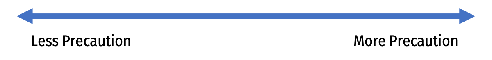
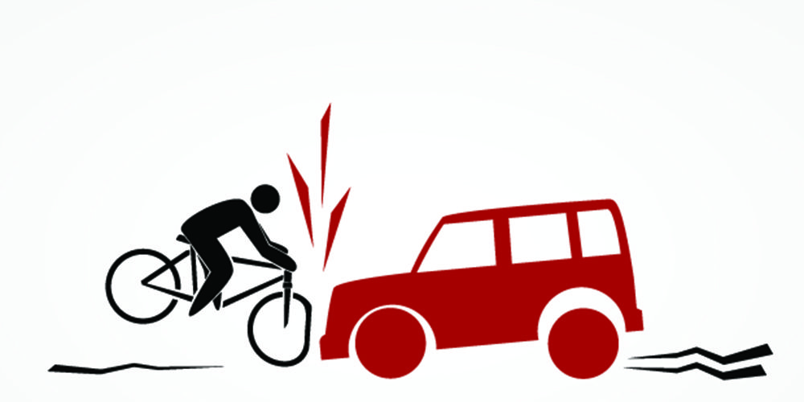
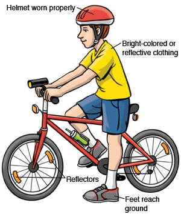
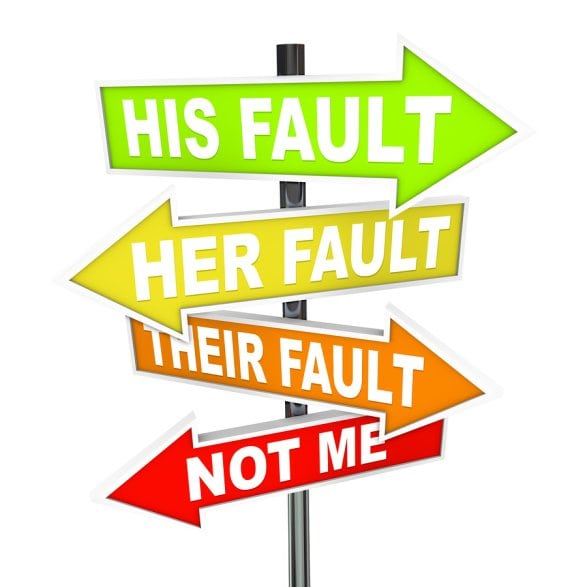
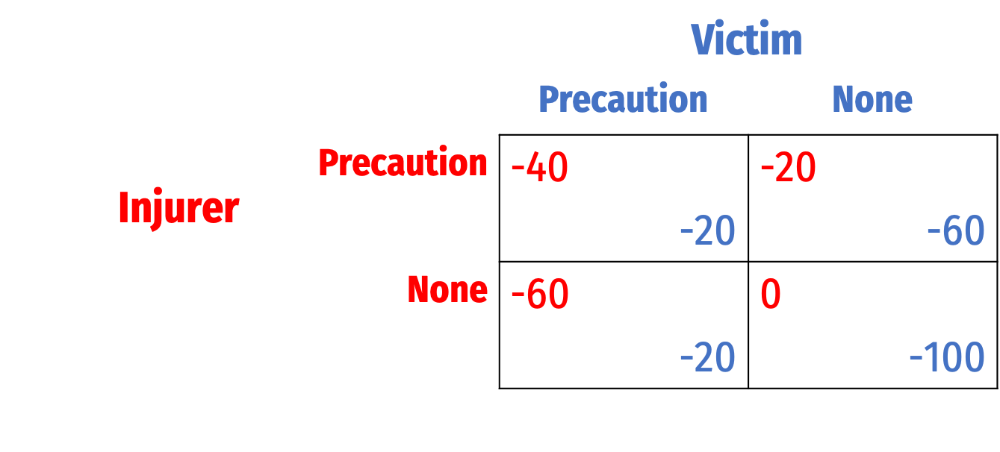
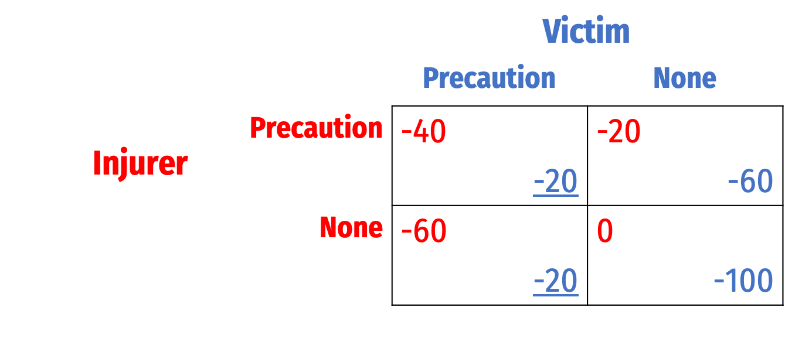
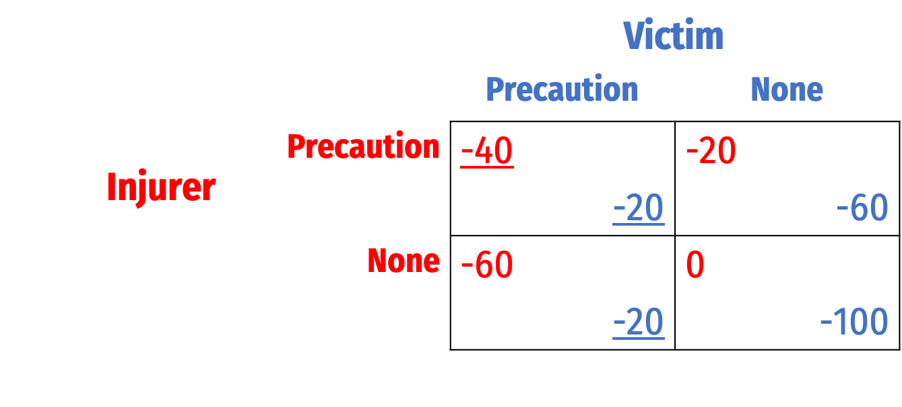

```{r setup, include=FALSE}
options(htmltools.dir.version = FALSE)
knitr::opts_chunk$set(echo=F,
                      message=F,
                      warning=F,
                      fig.retina=3,
                      fig.align = "center")
library("tidyverse")
library("ggrepel")
library("fontawesome")
xaringanExtra::use_tile_view()
xaringanExtra::use_tachyons()
xaringanExtra::use_freezeframe()
update_geom_defaults("label", list(family = "Fira Sans Condensed"))
update_geom_defaults("text", list(family = "Fira Sans Condensed"))
```

class: inverse

# Outline

### [Precaution: An Economic Model](#3)
### [No Liability](#)
### [Strict Liability](#)
### [Negligence](#)
### [A Family of Negligence Rules](#)
### [Comparing Negligence Rules, A Discrete Example of Bilateral Caution](#)

---

class: inverse, center, middle

# Precaution: An Economic Model

---
# Precaution

.pull-left[
.smallest[
- As usual, our main concern is with the incentives these various liability rules create

- For torts, focus on parties' incentive to invest in (costly) precaution to avoid accidents
  - Driving/bicyling carefully, installing seatbelts, airbags, wearing helmets, etc.
  - Inspecting products carefully, quality control, independent audits, mandatory work breaks
  - All of these things are **costly** to parties, so there must be some **efficient** level
]
]

.pull-right[
.center[

]
]
---

# Precaution

.smallest[
- Actions by both injurer and victim impact the number of accidents

.pull-left[
- Speed like hell, drive drunk, texting
- Bicycle in the dark wearing black, no helmet
- Manufacture cheap, shoddy product quickly

]

.pull-right[
- Drive slowly and soberly
- Bicycle wearing helmet and reflectors
- Manufacture slow, quality controlled & inspected product 
]
]

.center[

]

--

.smallest[
- .hi[Precaution]: any activity either party can do to reduce probability of an accident (or severity of damage)

- .hi-purple[How much precaution is efficient?]

- .hi-purple[How do we design the law to get this amount?]
]

---

# A Simple Economic Model of Accidents

.pull-left[

.smallest[
- Our main example was a car hitting a bicyclist, in real life:
  - Driver probably has insurance
  - Some damage to bicycle and to driver’s car
  - Driver and bicyclist may not even know what the law is

- We will simplify a lot by assuming:
  - Only one party is harmed
  - Parties know the law
  - Parties don’t have any insurance (for now)
  - Focus only on one party’s precaution at a time
  
]
]

.pull-right[
.center[

]
]

---

# A Unilateral Care Model

.pull-left[

- Unilateral harm (just one victim)

- .hi[Precaution]: costly actions that make accident less likely
  - Could be taken by either .blue[victim] or .red[injurer]
  - We'll consider both, but one at a time
  
.center[

]
]

---

# A Unilateral Care Model: Definitions/Notation

.pull-left[

.smallest[
- $x$: amount of precaution taken

- $w$: cost of each “unit” or precaution
  - total cost of precaution is $wx$

- $p(x)$: probability of an accident, given level of $x$
  - $\frac{\partial p(x)}{\partial x} < 0$

- $A$: cost of accident (to victim)
  - expected cost of accidents is $p(x)A$

- When we examine .red[injurer] we will use $x$, when we examine .blue[victim] we will use $y$
  - Your textbook uses $x^i$ and $x^v$
]
]

.pull-right[
.center[

]
]
---

# A Unilateral Care Model

.pull-left[

- .green[Cost of precaution, `\\(wx\\)`]

]

.pull-right[
```{r}
w<-0.5
wx<-function(x){w*x}
px<-function(x){5/x^2}
tc<-function(x){wx(x)+px(x)}
#min<-optim(par = 2.5,tc)
#min<-min$value
min<-2.714

model<-ggplot(tibble(x=c(0,10)), aes(x=x))+
  geom_function(fun = wx, geom = "line", size = 2, color = "green")+
  geom_label(x = 3.5, y = wx(3.5), size = 3, color = "green", label = "wx")+
  scale_x_continuous(breaks=NULL,
                     limits=c(0,4),
                     expand=expand_scale(mult=c(0,0.1)))+
  scale_y_continuous(breaks=NULL,
                     limits=c(0,7),
                     expand=expand_scale(mult=c(0,0.1)))+
  labs(x = "Level of Precaution",
       y = "$")+
  theme_classic(base_family = "Fira Sans Condensed", base_size = 16)
model
```
]

---

# A Unilateral Care Model
.pull-left[

- .green[Cost of precaution, `\\(wx\\)`]

- .red[Cost of accidents, `\\(p(x)A\\)`]
]

.pull-right[
```{r}
model<-model+geom_function(fun = px, geom = "line", size = 2, color = "red")+
  geom_label(x = 3.5, y = px(3.5), size = 3, color = "red", label = "p(x)A")

model
```
]

---
# A Unilateral Care Model
.pull-left[

- .green[Cost of precaution, `\\(wx\\)`]

- .red[Cost of accidents, `\\(p(x)A\\)`]

- .blue[Total Social Cost `\\(p(x)A+wx\\)`]
]

.pull-right[
```{r}
model<-model+geom_function(fun = tc, geom = "line", size = 2, color = "blue")+
  geom_label(x = 3.5, y = tc(3.5), size = 3, color = "blue", label = "TC")

model
```
]

---

# A Unilateral Care Model
.pull-left[

- .green[Cost of precaution, `\\(wx\\)`]

- .red[Cost of accidents, `\\(p(x)A\\)`]

- .blue[Total Social Cost `\\(p(x)A+wx\\)`]

- Efficient level of precaution:

$$\min_{x} \ color{blue}{p(x)A+wx}$$
]

.pull-right[
```{r}
model
```
]

---

# A Unilateral Care Model
.pull-left[

- .green[Cost of precaution, `\\(wx\\)`]

- .red[Cost of accidents, `\\(p(x)A\\)`]

- .blue[Total Social Cost `\\(p(x)A+wx\\)`]

- Efficient level of precaution:

$$\min_{x} \color{blue}{p(x)A+wx}$$

- Optimum $x^\star$:

.smallest[
$$\begin{align*} \color{green}{w} &= \color{red}{-p’(x)A}\\
\color{green}{\text{MSC of precaution}} &= \color{red}{\text{MSB of precaution}}\\ \end{align*}$$
]
]

.pull-right[
```{r}
model+geom_segment(x = min, xend = min, y = 0, yend = tc(min), linetype = "dashed", size = 1)+
  scale_x_continuous(breaks=c(min),
                     labels=c(expression(x^"*")),
                     limits=c(0,4),
                     expand=expand_scale(mult=c(0,0.1)))
```
]

---

# A Unilateral Care Model
.pull-left[

- The efficient level of precaution, $x^\star$ minimizes .blue[total social cost]
  - Balances the tradeoff between the .red[benefit of reduced accident likelihood] and the .green[cost of increased precaution]

]

.pull-right[
```{r}
model+geom_segment(x = min, xend = min, y = 0, yend = tc(min), linetype = "dashed", size = 1)+
  scale_x_continuous(breaks=c(min),
                     labels=c(expression(x^"*")),
                     limits=c(0,4),
                     expand=expand_scale(mult=c(0,0.1)))
```
]

---

# A Unilateral Care Model: Technical Note

.pull-left[
.smallest[
- We are thinking of bilateral precaution, just “one party at a time”; again: 
  - $x$ represent level of precaution by .red[injurer]
  - $y$ represent level of precaution by .blue[victim]

- Really, the social problem between both parties:
$$\min_{x,y} p(x,y)A-wx-wy$$

]
]

.pull-right[
```{r}
model+geom_segment(x = min, xend = min, y = 0, yend = tc(min), linetype = "dashed", size = 1)+
  scale_x_continuous(breaks=c(min),
                     labels=c(expression(x^"*"+y^"*")),
                     limits=c(0,4),
                     expand=expand_scale(mult=c(0,0.1)))+
  labs(x = "Both Parties' Precaution (x+y)",
       y = "$")
```
]

---

# A Unilateral Care Model: Technical Note

.pull-left[
.smallest[
- “Hold fixed” one party’s solution and consider the other, e.g.

$$\min_x p(x,y)A-wx-wy \quad \text{ given y}$$
which has same solution as 
$$\min_x p(x)A-wx$$
- Results will generally be efficient *given* what the other party is doing

]
]

.pull-right[
```{r}
model+geom_segment(x = min, xend = min, y = 0, yend = tc(min), linetype = "dashed", size = 1)+
  scale_x_continuous(breaks=c(min),
                     labels=c(expression(x^"*"+y^"*")),
                     limits=c(0,4),
                     expand=expand_scale(mult=c(0,0.1)))+
  labs(x = "Both Parties' Precaution (x+y)",
       y = "$")
```
]

---

# Effect of Liability Rules on Precaution

.pull-left[

- We know the **efficient** level of precaution is $x^\star$, which minimizes total social cost

- Now let’s consider the effect of .hi-turquoise[different liability rules] have on the **chosen** amount of precaution
]

.pull-right[
.center[

]
]

---

class: inverse, center, middle

# No Liability

---

# No Liability

.pull-left[
.smallest[
- Imagine a world of .hi[no liability] (NL)

- .red[Injurer] pays nothing for accidents
  - Bears the .green[cost] of his precaution
  - But no .red[benefit] (of avoided damages)
  - **Has no incentive to take any precaution**

- .blue[Victim] bears cost of any accidents, plus cost of her precaution taken
  - .blue[Victim] precaution imposes no externality on .red[Injurer]
  - .blue[Victim] will invest in efficient amount of precaution $y^\star$
]
]
.pull-right[
.center[

]
]

---

# No Liability

.pull-left[

- .red[Injurer]'s private costs: $\color{green}{wx}$
$$\min_{x} \color{green}{wx} \implies x_{NL}=0$$

]

.pull-right[
```{r}
model+geom_function(fun = wx, geom = "line", size = 3, color = "green")+
  scale_x_continuous(breaks=c(0),
                     labels=c(expression(x[NL])),
                     limits=c(0,4),
                     expand=expand_scale(mult=c(0,0.1)))
```
]

---

# No Liability

.pull-left[

- .red[Injurer]'s private costs: $\color{green}{wx}$
$$\min_{x} \color{green}{wx} \implies x_{NL}=0$$

- .blue[Victim]'s private costs: $\color{blue}{p(y)A+wy}$
$$\min_{y} \color{blue}{p(y)A+wy} \implies y_{NL}=y^\star$$
  - chooses efficient precaution

- Rule of .hi[no liability] leads to:
  - efficient precaution by .blue[Victims]
  - no precaution by .red[Injurers]
]

.pull-right[
```{r}
model+geom_segment(x = min, xend = min, y = 0, yend = tc(min), linetype = "dashed", size = 1)+
  geom_function(fun = wx, geom = "line", size = 3, color = "green")+
geom_function(fun = tc, geom = "line", size = 3, color = "blue")+  scale_x_continuous(breaks=c(0,min),
                     labels=c(expression(x[NL]), expression(y[NL]==y^"*")),
                     limits=c(0,4),
                     expand=expand_scale(mult=c(0,0.1)))
```
]

---

# Comparing Incentives Under Different Liability Rules

| Rule | .red[Injurer] Precaution | .blue[Victim] Precaution |
|------|---------|--------|
| No liability | Zero | .green[Efficient] |

---

# Determining Accidents

.pull-left[

- Precaution isn't the only thing that affects the number of accidents
  - Precautions are extra actions that make our activity less dangerous

- Also the .hi-purple[amount of activities] we do affects the number of accidents
  - I decide how often to drive
  - You decide how often to bike

- Liability rules also create incentives for .hi-purple[activity levels]
]

.pull-right[
.center[

]
]

---

# Determining Accidents: No Liability

.pull-left[

- With .hi[no liability], I am not liable if I hit you
  - I don't consider cost of accident when I decide **how fast** to drive
  - nor when I decide **how much** to drive
  - .hi-purple[So I drive too recklessly *and* too often]

- My driving imposes a negative externality on others
  - With no liability, .red[Injurer]'s activity level is inefficiently high
]

.pull-right[
.center[

]
]
---
# Determining Accidents: No Liability

.pull-left[

- With .i[no liability], you bear the full cost of an accident
  - More activity by victim (bicycling) leads to more accidents
  - You weigh cost of accidents when deciding **how carefully** to ride, and **how much** to ride
  - Your private cost equals the social cost
  - .hi-purple[You take the efficient level of precaution, and efficient level of activity]
]

.pull-right[
.center[

]
]
---

# Comparing Incentives Under Different Liability Rules

| Rule | .red[Injurer] Precaution | .blue[Victim] Precaution | .red[Injurer] Activity | .blue[Victim] Activity | 
|------|---------|--------|-----|-----|
| No liability | Zero | .green[Efficient] | Too High | .green[Efficient]

---

class: inverse, center, middle

# Strict Liability

---

# Strict Liability

.pull-left[
.smallest[
- Imagine a world of .hi[strict liability] (SL) with perfect compensation
  - $D=A$ damages equal to the cost of the accident

- .red[Injurer] pays for any accidents he causes
  - Bears the full .red[cost of accidents] plus his .green[precautions] taken
  - Receives .red[benefit] (of avoided damages)
  - Internalizes externality his actions cause, chooses the efficient level of precaution

- .blue[Victim] is fully insured
  - Has **no incentive** to invest in any precaution
]
]

.pull-right[
.center[

]
]

---

# Strict Liability

.pull-left[

- .red[Injurer]'s private costs:  $\color{blue}{p(x)A+wx}$
$$\min_{x} \color{blue}{p(x)A+wx} \implies x_{SL}=x^\star$$
  - chooses efficient precaution

]

.pull-right[
```{r}
model+geom_segment(x = min, xend = min, y = 0, yend = tc(min), linetype = "dashed", size = 1)+
  geom_function(fun = tc, geom = "line", size = 3, color = "blue")+ 
  scale_x_continuous(breaks=c(min),
                     labels=c(expression(x[SL]==x^"*")),
                     limits=c(0,4),
                     expand=expand_scale(mult=c(0,0.1)))
```
]

---

# Strict Liability

.pull-left[

- .red[Injurer]'s private costs:  $\color{blue}{p(x)A+wx}$
$$\min_{x} \color{blue}{p(x)A+wx} \implies x_{SL}=x^\star$$
  - chooses efficient precaution

- .blue[Victim]'s private costs: $\color{green}{wy}$
$$\min_{y} \color{green}{wy} \implies y_{SL}=0$$
  
- Rule of .hi[strict liability] leads to:
  - efficient precaution by .red[Injurers]
  - no precaution by .blue[Victims]
]

.pull-right[
```{r}
model+geom_segment(x = min, xend = min, y = 0, yend = tc(min), linetype = "dashed", size = 1)+
  geom_function(fun = wx, geom = "line", size = 3, color = "green")+
geom_function(fun = tc, geom = "line", size = 3, color = "blue")+  scale_x_continuous(breaks=c(0,min),
                     labels=c(expression(y[SL]), expression(x[SL]==x^"*")),
                     limits=c(0,4),
                     expand=expand_scale(mult=c(0,0.1)))
```
]

---

# Comparing Incentives Under Different Liability Rules

| Rule | .red[Injurer] Precaution | .blue[Victim] Precaution |
|------|---------|--------|
| No liability | Zero | .green[Efficient] |
| Strict liability | .green[Efficient] | Zero |
---

# Strict Liability: Activity Levels

.pull-left[
.smallest[
- Under strict liability, .red[injurer] internalizes cost of accidents
  - Weighs benefit from driving against cost of accidents
  - Takes **efficient** activity level

- Under strict liability, .blue[victim] does not bear cost of accidents
  - Ignores cost of accidents when deciding how much to bicycle
  - Takes **inefficiently high** activity level

- .hi-purple[Strict liability leads to **efficient** level of injurer activity, **inefficiently high** level of victim activity]
]
]

.pull-right[
.center[

]
]

---
# Comparing Incentives Under Different Liability Rules

| Rule | .red[Injurer] Precaution | .blue[Victim] Precaution | .red[Injurer] Activity | .blue[Victim] Activity | 
|------|---------|--------|-----|-----|
| No liability | Zero | .green[Efficient] | Too High | .green[Efficient] |
| Strict liability | .green[Efficient] | Zero | .green[Efficient] | Too High |

---

# Comparing Incentives Under Different Liability Rules

.pull-left[
.smallest[
- So for both precaution & activity level:

- .hi[No liability] leads to **inefficient** behavior by .red[injurer], **efficient** behavior by .blue[victim]

- .hi[Strict liability] leads to **efficient** behavior by .red[injurer], **inefficient** behavior by .blue[victim]

- Like the .hi-purple[paradox of compensation] from contract law!
  - One rule sets multiple incentives...we can't get them all right
  - ...or can we? Tort law has this One Weird Trick<sup>TM</sup>
]
]

.pull-right[
.center[

]
]

---

class: inverse, center, middle

# Negligence

---

# Negligence

.pull-left[

- .hi[Negligence rule]: .red[Injurer] is only liable **if he breached his duty of due care**
  - Put alternatively, liable only if accident is “his fault”

- Within our model: 
  - Legal standard of care $x^l$
  - .red[Injurer] owes damages if $x < x^l$
  - If $x<x^l \rightarrow D=A$
  - If $x \geq x^l \rightarrow D=0$

]

.pull-right[
.center[

]
]
---

# Negligence

.pull-left[

- Private cost to .red[injurer] is:

]

.pull-right[
```{r}
model
```

]

---

# Negligence

.pull-left[

- Private cost to .red[injurer] is:
$$\begin{cases}
p(x)A+wx && \text{if } x<x^l\\
\end{cases}$$

]

.pull-right[
```{r}
model+geom_segment(x = min, xend = min, y = 0, yend = tc(min), size = 1, linetype = "dotted")+
  geom_function(fun = tc, geom = "line", size = 3, color = "purple", xlim=c(0,min))+
  geom_point(aes(x = min, y = tc(min)), size = 3, shape = 21, color = "purple", fill = "white")+
#  geom_point(aes(x = min, y = wx(min)), size = 4, shape = 21, color = "purple", fill = "purple")+
# geom_function(fun = wx, geom = "line", size = 3, color = "purple", xlim=c(min,5))+
  scale_x_continuous(breaks=c(min),
                     labels=c(expression(x^l)),
                     limits=c(0,4),
                     expand=expand_scale(mult=c(0,0.1)))
```

]

---

# Negligence

.pull-left[

- Private cost to .red[injurer] is:
$$\begin{cases}
p(x)A+wx && \text{if } x<x^l\\
wx && \text{if } x \geq x^l\\
\end{cases}$$

]

.pull-right[
```{r}
model+geom_segment(x = min, xend = min, y = 0, yend = tc(min), size = 1, linetype = "dotted")+
  geom_function(fun = tc, geom = "line", size = 3, color = "purple", xlim=c(0,min))+
  geom_point(aes(x = min, y = tc(min)), size = 3, shape = 21, color = "purple", fill = "white")+
  geom_point(aes(x = min, y = wx(min)), size = 4, shape = 21, color = "purple", fill = "purple")+
 geom_function(fun = wx, geom = "line", size = 3, color = "purple", xlim=c(min,5))+
  scale_x_continuous(breaks=c(min),
                     labels=c(expression(x^l)),
                     limits=c(0,4),
                     expand=expand_scale(mult=c(0,0.1)))
```

]

---

# Negligence

.pull-left[

- Private cost to .red[injurer] is:
$$\begin{cases}
p(x)A+wx && \text{if } x<x^l\\
wx && \text{if } x \geq x^l\\
\end{cases}$$

- If standard of care $x^l$ is set to $x^\star$, .red[injurer] minimizes private cost by taking efficient caution
]

.pull-right[
```{r}
model+geom_segment(x = min, xend = min, y = 0, yend = tc(min), size = 1, linetype = "dotted")+
  geom_function(fun = tc, geom = "line", size = 3, color = "purple", xlim=c(0,min))+
  geom_point(aes(x = min, y = tc(min)), size = 3, shape = 21, color = "purple", fill = "white")+
  geom_point(aes(x = min, y = wx(min)), size = 4, shape = 21, color = "purple", fill = "purple")+
 geom_function(fun = wx, geom = "line", size = 3, color = "purple", xlim=c(min,5))+
  scale_x_continuous(breaks=c(min),
                     labels=c(expression(x^l==x^"*")),
                     limits=c(0,4),
                     expand=expand_scale(mult=c(0,0.1)))
```

]

---

# Negligence: Injurer Precaution

.pull-left[

- What about .blue[victim]'s incentives?
  - We saw .red[injurer] will exercise due care and *not* be liable!
  - .blue[Victim] now bears cost of any accidents! (.hi-purple[residual risk])

- Private cost to .blue[victim] is: $\color{blue}{p(y)A+wy}$
  - .blue[Victim] chooses $y^\star$, efficient precaution too!
]

.pull-right[
```{r}
model+geom_segment(x = min, xend = min, y = 0, yend = tc(min), size = 1, linetype = "dotted")+
  geom_function(fun = tc, geom = "line", size = 3, color = "blue")+
  scale_x_continuous(breaks=c(min),
                     labels=c(expression(y^"*")),
                     limits=c(0,4),
                     expand=expand_scale(mult=c(0,0.1)))
```

]

---

# Comparing Incentives Under Different Liability Rules

| Rule | .red[Injurer] Precaution | .blue[Victim] Precaution | .red[Injurer] Activity | .blue[Victim] Activity | 
|------|---------|--------|-----|-----|
| No liability | Zero | .green[Efficient] | Too High | .green[Efficient] |
| Strict liability | .green[Efficient] | Zero | .green[Efficient] | Too High |
| Negligence<sup>.magenta[†]</sup> | .green[Efficient] | .green[Efficient] | | |

.footnote[<sup>.magenta[†]</sup> Assuming standard of care is set at the efficient level `\\((x^l=x^*)\\)`]

---

class: inverse, center, middle

# A Family of Negligence Rules

---

# Other Negligence Rules

.pull-left[
- The rule we just considered is “simple” negligence
  - Only consider .red[injurer]'s actions in determining liability

- But in deciding whether .red[injurer] should be liable, we could also consider whether the .blue[victim] was negligent

]
.pull-right[
.center[

]
]

---

# Contributory Negligence: Butterfield v. Forrester

.pull-left[
.smallest[
- *Butterfield v. Forrester*, 11 East. 60, 103 Eng. Rep. 926 (K.B. 1809)

- Forrester (Defendent) placed a pole in road next to his house while making repairs

- Butterfield (Plaintiff) was riding at high speed at night, hit the pole, fell off his horse, sued for damages

- Witness said that if Forrester had not been riding fast, would have seen the pole

- Jury ruled Plaintiff should not be able to collect damages from Plaintiff due to their own .hi[contributory negligence]


]
]

.pull-right[
.center[

]

.smallest[
> “One person being in fault will not dispense with another’s using ordinary care for himself.”

]
]

---

# Family of Negligence Rules

.pull-left[

- Let’s compare the whole family of negligence rules

- .red[Injurer] is **negligent/at fault** when they fail to take due care, $x<x^*$<sup>.magenta[†]</sup>

- .blue[Victim] is **negligent/at fault** when they fail to take due care, $y<y^*$<sup>.magenta[†]</sup>

- Now let’s consider who is **liable** for the accident under various negligence rules

.tiny[<sup>.magenta[†]</sup> Assuming standards of care are set at the efficient levels `\\(x^l=x^\star\\)` and `\\(y^l=y^\star\\)`]

]

.pull-right[
```{r}
ggplot(tibble(x=c(0,10)), aes(x=x))+
  geom_rect(xmin=0,xmax=5,ymin=0,ymax=5,fill="purple",alpha=0.5)+
  geom_text(x=2.5,y=2.5,color="white", label="Both negligent")+
  
  geom_rect(xmin=5,xmax=10,ymin=0,ymax=5,fill="blue",alpha=0.5)+
  geom_text(x=7.5,y=2.5,color="white", label="Victim negligent")+

  geom_rect(xmin=0,xmax=5,ymin=5,ymax=10,fill="red",alpha=0.5)+
  geom_text(x=2.5,y=7.5,color="white", label="Injurer negligent")+
  
  geom_text(x=7.5,y=7.5,color="black", label="Neither negligent")+
 geom_vline(xintercept = 5, linetype = "dashed", size = 1)+
 geom_hline(yintercept = 5, linetype = "dashed", size = 1)+
  scale_x_continuous(breaks=c(5),
                     labels=c(expression(x^"*")),
                     limits=c(0,10),
                     expand=expand_scale(mult=c(0,0)))+
  scale_y_continuous(breaks=c(5),
                     labels=c(expression(y^"*")),
                     limits=c(0,10),
                     expand=expand_scale(mult=c(0,0)))+
  labs(x = "Injurer Precaution (x)",
       y = "Victim Precaution (y)")+
  theme_classic(base_family = "Fira Sans Condensed", base_size = 16)
```
]


---

# Simple Negligence

.pull-left[

- **Simple negligence**:

- .red[Injurer] is liable if they do not take due care $x<x^*$

- .red[Injurer] is *not* liable if they *do* take due care $x \geq x^*$
  - .blue[Victim] cannot collect damages for any accident
    
]

.pull-right[
```{r}
neg<-ggplot(tibble(x=c(0,10)), aes(x=x))+
  geom_rect(xmin=0,xmax=5,ymin=0,ymax=10,fill="red",alpha=0.5)+
  geom_rect(xmin=5,xmax=10,ymin=0,ymax=10,fill="blue",alpha=0.5)+
  geom_text(x=2.5,y=5,color="white", label="Injurer liable")+
  geom_text(x=7.5,y=5,color="white", label="Victim liable")+
 geom_vline(xintercept = 5, linetype = "dashed", size = 1)+
  scale_x_continuous(breaks=c(5),
                     labels=c(expression(x^"*")),
                     limits=c(0,10),
                     expand=expand_scale(mult=c(0,0)))+
  scale_y_continuous(breaks=c(5),
                     labels=c(expression(y^"*")),
                     limits=c(0,10),
                     expand=expand_scale(mult=c(0,0)))+
  labs(x = "Injurer Precaution (x)",
       y = "Victim Precaution (y)",
       title = "Simple Negligence")+
  theme_classic(base_family = "Fira Sans Condensed", base_size = 16)
neg
```
]

---

# Negligence With a Defense of Contributory Negligence

.pull-left[

- **Negligence with a defense of Contributory Negligence**:

- .red[Injurer] is liable if they do not take due care $x<x^*$

- .red[Injurer] is *not* liable if .blue[Victim] does not take due care $y<y^*$

]

.pull-right[
```{r}
contrneg<-ggplot(tibble(x=c(0,10)), aes(x=x))+
  geom_rect(xmin=0,xmax=5,ymin=5,ymax=10,fill="red",alpha=0.5)+
  geom_rect(xmin=0,xmax=5,ymin=0,ymax=5,fill="blue",alpha=0.5)+
  geom_rect(xmin=5,xmax=10,ymin=0,ymax=10,fill="blue",alpha=0.5)+
  geom_text(x=2.5,y=7.5,color="white", label="Injurer liable")+
  geom_text(x=7.5,y=2.5,color="white", label="Victim liable")+
  geom_text(x=2.5,y=2.5,color="white", label="Victim liable")+
  geom_text(x=7.5,y=7.5,color="white", label="Victim liable")+
 geom_vline(xintercept = 5, linetype = "dashed", size = 1)+
 geom_hline(yintercept = 5, linetype = "dashed", size = 1)+
  scale_x_continuous(breaks=c(5),
                     labels=c(expression(x^"*")),
                     limits=c(0,10),
                     expand=expand_scale(mult=c(0,0)))+
  scale_y_continuous(breaks=c(5),
                     labels=c(expression(y^"*")),
                     limits=c(0,10),
                     expand=expand_scale(mult=c(0,0)))+
  labs(x = "Injurer Precaution (x)",
       y = "Victim Precaution (y)",
       title = "Negligence with Contributory Negligence")+
  theme_classic(base_family = "Fira Sans Condensed", base_size = 16)
contrneg
```
]

---

# Family of Negligence Rules

.pull-left[

- **Comparative Negligence**: if both parties are negligent, they share the cost of the accident (possibly proportionately)

]

.pull-right[
```{r}
compneg<-ggplot(tibble(x=c(0,10)), aes(x=x))+
  geom_rect(xmin=0,xmax=5,ymin=5,ymax=10,fill="red",alpha=0.5)+
  geom_rect(xmin=0,xmax=5,ymin=0,ymax=5,fill="purple",alpha=0.5)+
  geom_rect(xmin=5,xmax=10,ymin=0,ymax=10,fill="blue",alpha=0.5)+
  geom_text(x=2.5,y=7.5,color="white", label="Injurer liable")+
  geom_text(x=7.5,y=2.5,color="white", label="Victim liable")+
  geom_text(x=2.5,y=2.5,color="white", label="Cost Shared")+
  geom_text(x=7.5,y=7.5,color="white", label="Victim liable")+
 geom_vline(xintercept = 5, linetype = "dashed", size = 1)+
 geom_hline(yintercept = 5, linetype = "dashed", size = 1)+
  scale_x_continuous(breaks=c(5),
                     labels=c(expression(x^"*")),
                     limits=c(0,10),
                     expand=expand_scale(mult=c(0,0)))+
  scale_y_continuous(breaks=c(5),
                     labels=c(expression(y^"*")),
                     limits=c(0,10),
                     expand=expand_scale(mult=c(0,0)))+
  labs(x = "Injurer Precaution (x)",
       y = "Victim Precaution (y)",
       title = "Comparative Negligence")+
  theme_classic(base_family = "Fira Sans Condensed", base_size = 16)
compneg
```
]

---

# Family of Negligence Rules

.pull-left[

- **Strict liability with defense of Contributory Negligence**:

- .red[Injurer] is liable (regardless of their level of precaution $x)$ *unless* .blue[Victim] does not take due care $y<y^*$

]

.pull-right[
```{r}
sl<-ggplot(tibble(x=c(0,10)), aes(x=x))+
  geom_rect(xmin=0,xmax=10,ymin=5,ymax=10,fill="red",alpha=0.5)+
  geom_rect(xmin=0,xmax=10,ymin=0,ymax=5,fill="blue",alpha=0.5)+
  geom_text(x=5,y=7.5,color="white", label="Injurer liable")+
  geom_text(x=5,y=2.5,color="white", label="Victim liable")+
 geom_hline(yintercept = 5, linetype = "dashed", size = 1)+
  scale_x_continuous(breaks=c(5),
                     labels=c(expression(x^"*")),
                     limits=c(0,10),
                     expand=expand_scale(mult=c(0,0)))+
  scale_y_continuous(breaks=c(5),
                     labels=c(expression(y^"*")),
                     limits=c(0,10),
                     expand=expand_scale(mult=c(0,0)))+
  labs(x = "Injurer Precaution (x)",
       y = "Victim Precaution (y)")+
  theme_classic(base_family = "Fira Sans Condensed", base_size = 16)
sl
```
]

---

# Family of Negligence Rules

.pull-left[
```{r, fig.height = 2.5}
neg
```

```{r, fig.height = 2.5}
sl
```

]

.pull-right[
```{r, fig.height = 2.5}
contrneg
```

```{r, fig.height = 2.5}
compneg
```

]

--

.smallest[
- These rules differ only in distribution of income

- .hi-purple[Any of these rules (with efficient standard of care) incentivize efficient precaution by both parties!] $(\color{blue}{x^\star}, \color{red}{y^\star})$
]

---

class: inverse, center, middle

# Comparing Negligence Rules, A Discrete Example of Bilateral Caution

---

# Discrete Example of Bilateral Precaution

.pull-left[
.smallest[
- Let's compare with a discrete example

- Each party .red[Injurer] and .blue[Victim] can either take **precaution** or **not**
  - Precaution costs each party $20
  - Each accident costs $1,000 in harm

- Chance of accident is:
  - 10% if nobody takes precaution
  - 6% if one party takes precaution
  - 2% if both parties take precaution

- Note: precaution is efficient for each party: costs $20; reduces expected damage by 0.04($1,000) = $40
]
]
.pull-right[
.center[

]
.quitesmall[
A: $1,000

w: $20 (each party)

p: 10% (neither), 6% (one careful), 2% (both)
]

]

---

# Discrete Example of Bilateral Precaution

.pull-left[

.smallest[
- Consider rule of **negligence with defense of contributory negligence**

- .red[Injurer] is liable if he failed to take precaution...unless .blue[blue] victim failed too

]
]

.pull-right[
.center[

]

.quitesmall[
A: $1,000

w: $20 (each party)

p: 10% (neither), 6% (one careful), 2% (both)
]
]

---

# Discrete Example of Bilateral Precaution

.pull-left[

.smallest[
- Consider rule of **negligence with defense of contributory negligence**

- .red[Injurer] is liable if he failed to take precaution...unless .blue[blue] victim failed too

- Notice .blue[Victim]'s dominant strategy is **Precaution**
  - If .red[Injurer] not taking precaution, .blue[victim] wants to avoid liability
  - If .red[Injurer] takes precaution, .blue[victim] bears residual risk, wants to minimize accidents

]
]
.pull-right[
.center[


]

.quitesmall[
A: $1,000

w: $20 (each party)

p: 10% (neither), 6% (one careful), 2% (both)
]
]


---

# Discrete Example of Bilateral Precaution

.pull-left[

.smallest[
- Consider rule of **negligence with defense of contributory negligence**

- .red[Injurer] is liable if he failed to take precaution...unless .blue[blue] victim failed too

- Notice .blue[Victim]'s dominant strategy is **Precaution**
  - If .red[Injurer] not taking precaution, .blue[victim] wants to avoid liability
  - If .red[Injurer] takes precaution, .blue[victim] bears residual risk, wants to minimize accidents

- For .red[Injurer], best response to .blue[Victim]'s precaution is precaution

- .hi-purple[Nash Eq.]: (.red[Precaution], .blue[precaution]), efficient!
]
]

.pull-right[
.center[


]

.quitesmall[
A: $1,000

w: $20 (each party)

p: 10% (neither), 6% (one careful), 2% (both)
]
]

---

# Discrete Example of Bilateral Precaution

.pull-left[

.smallest[
- Consider rule of **comparative negligence**, cost of accident divided proportionately
]

]

.pull-right[
.center[


]

.quitesmall[
A: $1,000

w: $20 (each party)

p: 10% (neither), 6% (one careful), 2% (both)
]
]

---

# Discrete Example of Bilateral Precaution

.pull-left[

.smallest[
- Consider rule of **comparative negligence**, cost of accident divided proportionately

- Notice .blue[Victim]'s dominant strategy is **Precaution**
]
]

.pull-right[
.center[


]
.quitesmall[
A: $1,000

w: $20 (each party)

p: 10% (neither), 6% (one careful), 2% (both)
]
]

---

# Discrete Example of Bilateral Precaution

.pull-left[

.smallest[
- Consider rule of **comparative negligence**, cost of accident divided proportionately

- Notice .blue[Victim]'s dominant strategy is **Precaution**

- For .red[Injurer], best response to .blue[Victim]'s precaution is precaution

- .hi-purple[Nash Equilibrium]: (.red[Precaution], .blue[precaution]) and is efficient!
]
]

.pull-right[
.center[

]
.quitesmall[
A: $1,000

w: $20 (each party)

p: 10% (neither), 6% (one careful), 2% (both)
]
]

---

# Discrete Example of Bilateral Precaution

.pull-left[

.smallest[
- Consider rule of **strict liability with defense of contributory negligence**

- .red[Injurer] is liable regardless of his precaution ... unless .blue[blue] victim was negligent

]
]

.pull-right[
.center[

]

.quitesmall[
A: $1,000

w: $20 (each party)

p: 10% (neither), 6% (one careful), 2% (both)
]

]

---

# Discrete Example of Bilateral Precaution

.pull-left[

.smallest[
- Consider rule of **strict liability with defense of contributory negligence**

- .red[Injurer] is liable regardless of his precaution ... unless .blue[blue] victim was negligent

- Notice .blue[Victim]'s dominant strategy is **Precaution**
]
]

.pull-right[
.center[

]

.quitesmall[
A: $1,000

w: $20 (each party)

p: 10% (neither), 6% (one careful), 2% (both)
]

]

---

# Discrete Example of Bilateral Precaution

.pull-left[

.smallest[
- Consider rule of **strict liability with defense of contributory negligence**

- .red[Injurer] is liable regardless of his precaution ... unless .blue[blue] victim was negligent

- Notice .blue[Victim]'s dominant strategy is **Precaution**

- For .red[Injurer], best response to .blue[Victim]'s precaution is precaution

- .hi-purple[Nash Equilibrium]: (.red[Precaution], .blue[precaution]) and is efficient!
]
]

.pull-right[
.center[

]

.quitesmall[
A: $1,000

w: $20 (each party)

p: 10% (neither), 6% (one careful), 2% (both)
]
]

---

# Comparing Incentives Under Different Liability Rules

| Rule | .red[Injurer] Precaution | .blue[Victim] Precaution | .red[Injurer] Activity | .blue[Victim] Activity | 
|------|---------|--------|-----|-----|
| No liability | Zero | .green[Efficient] | Too High | .green[Efficient] |
| Strict liability | .green[Efficient] | Zero | .green[Efficient] | Too High |
| (“Simple”) Negligence | .green[Efficient] | .green[Efficient] | | |
| Negligence w/Contributory Negligence | .green[Efficient] | .green[Efficient] | | |
| Comparative Negligence | .green[Efficient] | .green[Efficient] | | |
| Strict Liability w/Contributory Negligence | .green[Efficient] | .green[Efficient] | | |

Assuming all relevant standards of care are set at the efficient levels $(x^l=x^*)$

---

# Activity Levels under Negligence Rules

.pull-left[

.smallest[

- **Simple negligence**: .red[injurer] liable if he was negligent

- Leads .red[injurer] to take efficient precaution, so **injurer expects to not be liable for any accidents**

- So .red[Injurer] ignores cost of accidents when deciding on activity level
  - Drives carefully, but still **drives too much**

- .blue[Victim] bears residual risk
  - Bikes carefully, and bikes **efficient amount**
]
]

.pull-right[
.center[

]
]
---

# Comparing Incentives Under Different Liability Rules

| Rule | .red[Injurer] Precaution | .blue[Victim] Precaution | .red[Injurer] Activity | .blue[Victim] Activity | 
|------|---------|--------|-----|-----|
| No liability | Zero | .green[Efficient] | Too High | .green[Efficient] |
| Strict liability | .green[Efficient] | Zero | .green[Efficient] | Too High |
| (“Simple”) Negligence | .green[Efficient] | .green[Efficient] | Too High | .green[Efficient] |
| Negligence w/Contributory Negligence | .green[Efficient] | .green[Efficient] | | |
| Comparative Negligence | .green[Efficient] | .green[Efficient] | | |
| Strict Liability w/Contributory Negligence | .green[Efficient] | .green[Efficient] | | |

Assuming all relevant standards of care are set at the efficient levels $(x^l=x^*)$

---

# Activity Levels under Negligence Rules

.pull-left[
.smallest[
- **Contributory Negligence** and **Comparative negligence**: efficient precaution by both parties

- Leads .red[injurer] to take efficient precaution, so **injurer expects to not be liable for any accidents**

- So .red[Injurer] ignores cost of accidents when deciding on activity level
  - Drives carefully, but still **drives too much**

- .blue[Victim] bears residual risk
  - Bikes carefully, and bikes **efficient amount**
]
]

.pull-right[
.center[

]
]

---

# Comparing Incentives Under Different Liability Rules

| Rule | .red[Injurer] Precaution | .blue[Victim] Precaution | .red[Injurer] Activity | .blue[Victim] Activity | 
|------|---------|--------|-----|-----|
| No liability | Zero | .green[Efficient] | Too High | .green[Efficient] |
| Strict liability | .green[Efficient] | Zero | .green[Efficient] | Too High |
| (“Simple”) Negligence | .green[Efficient] | .green[Efficient] | Too High | .green[Efficient] |
| Negligence w/Contributory Negligence | .green[Efficient] | .green[Efficient] | Too High | .green[Efficient] |
| Comparative Negligence | .green[Efficient] | .green[Efficient] | Too High | .green[Efficient] |
| Strict Liability w/Contributory Negligence | .green[Efficient] | .green[Efficient] | | |

Assuming all relevant standards of care are set at the efficient levels $(x^l=x^*)$


---

# Activity Levels under Negligence Rules

.pull-left[
.smallest[
- **Strict liability w/comparative negligence defense**: if .blue[victim] is not negligent, .red[injurer] is liable regardless of precaution

- Leads both parties to take efficient precaution, so .red[injurer] is residual risk bearer, and is **liable for any accidents**
  - So .red[injurer] weighs cost of accidents against benefits, drives **efficient amount**

- .blue[Victim], fully insured, ignores cost of accidents when deciding on activity level
  - Bikes carefully, but still **bikes too much**

]
]

.pull-right[
.center[

]
]
---

# Comparing Incentives Under Different Liability Rules

| Rule | .red[Injurer] Precaution | .blue[Victim] Precaution | .red[Injurer] Activity | .blue[Victim] Activity | 
|------|---------|--------|-----|-----|
| No liability | Zero | .green[Efficient] | Too High | .green[Efficient] |
| Strict liability | .green[Efficient] | Zero | .green[Efficient] | Too High |
| (“Simple”) Negligence | .green[Efficient] | .green[Efficient] | Too High | .green[Efficient] |
| Negligence w/Contributory Negligence | .green[Efficient] | .green[Efficient] | Too High | .green[Efficient] |
| Comparative Negligence | .green[Efficient] | .green[Efficient] | Too High | .green[Efficient] |
| Strict Liability w/Contributory Negligence | .green[Efficient] | .green[Efficient] | .green[Efficient] | Too High |

Assuming all relevant standards of care are set at the efficient levels $(x^l=x^*)$
