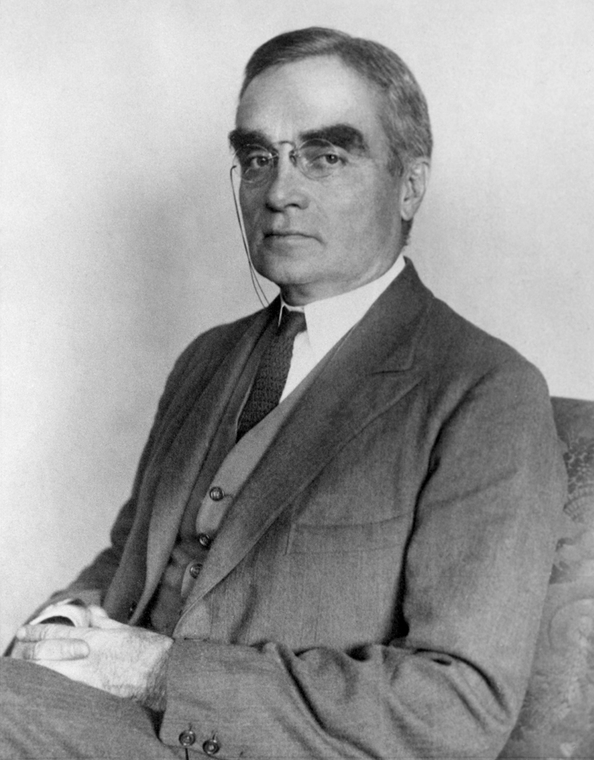
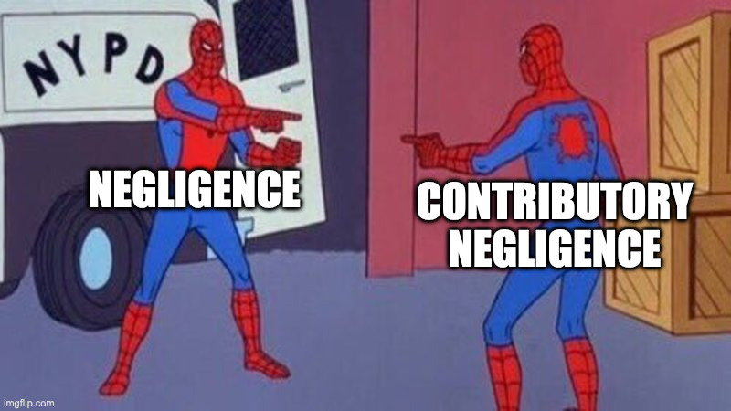

```{r setup, include=FALSE}
options(htmltools.dir.version = FALSE)
knitr::opts_chunk$set(echo=F,
                      message=F,
                      warning=F,
                      fig.retina=3,
                      fig.align = "center")
library("tidyverse")
library("ggrepel")
library("fontawesome")
xaringanExtra::use_tile_view()
xaringanExtra::use_tachyons()
xaringanExtra::use_freezeframe()
update_geom_defaults("label", list(family = "Fira Sans Condensed"))
update_geom_defaults("text", list(family = "Fira Sans Condensed"))
```

class: inverse

# Outline

### [Precaution: An Economic Model](#3)
### [No Liability](#)
### [Strict Liability](#)
### [Negligence](#)
### [A Family of Negligence Rules](#)
### [Comparing Negligence Rules, A Discrete Example of Bilateral Caution](#)

---

class: inverse, center, middle

# Standard of Care

---

# Standard of Care

.pull-left[

- So far, we have been assuming that the legal standard of care is set to the efficient level
$$x^l=x^\star$$
- In some cases, this is what courts actually try to do
]

.pull-right[
.center[

]
]
---

# U.S. v. Caroll Towing Co.

.pull-left[
.quitesmall[
- *U.S. v. Caroll Towing Co.* 159 F.2d 169 (2d. Cir. 1947)

- Several barges tied together to piers in NY Harbor

- Defendant’s tugboat was hired to tow one out to harbor
  - Crew readjusted the lines to free the barge
  - Done incorrectly, one broke loose, collided with another ship, sank

- Barge owner sued tugboat owner, claiming employees were negligent

- Tug owner claimed barge owner was also negligent (did not have an agent on board the barge)

- Question for court: .hi-turquoise[was it negligent to not have a “bargee” on board?]
]
]
.pull-right[
.center[

]
]

---

# U.S. v. Caroll Towing Co.

.left-column[
.center[


.smallest[
Learned Hand

1872—1961

U.S. 2<sup>nd</sup> Circuit Court of Appeals
]
]
]

.right-column[
.smallest[
> “It appears...that there is no general rule...Since there are occasions when every vessel will break away from her moorings, and since, if she does, she becomes a menace to those around her; the owner’s duty...to provide against resulting injuries is a function of three variables:

> “(1) the probability that she will break away; (2) the gravity of the resulting injury, if she does; (3) the burden of adequate precautions.

> “Perhaps it serves to bring this notion into relief to state it in algebraic terms:

> “if the probability be called P; the injury, L; and the burden, B;

> “.hi[liability depends upon whether B is less than L multiplied by P.]”

]
]

---

# The Hand Rule

.left-column[
.center[


.smallest[
Learned Hand

1872—1961

U.S. 2<sup>nd</sup> Circuit Court of Appeals
]
]
]

.right-column[

- .hi[The “Hand Rule”]: failure to take a precaution constitutes **negligence** if:

$$\color{green}{B} < \color{red}{L \times P}$$
  - $\color{green}{B}$: cost of precaution (“burden”)
  - $\color{red}{L}$: cost of accident (“liability”)
  - $\color{red}{p}$: probability of accident

- A particular precaution activity is required to avoid liability if it is .hi-purple[cost-justified]: costs less than the benefit it provides
  - “If a precaution is efficient, you are negligent if you failed to take it”
]

---

# The Hand Rule

.left-column[
.center[


.smallest[
Learned Hand

1872—1961

U.S. 2<sup>nd</sup> Circuit Court of Appeals
]
]
]

.right-column[

- .hi[The “Hand Rule”]: failure to take a precaution constitutes **negligence** if:

$$\color{green}{B} < \color{red}{L \times P}$$
  - $\color{green}{B}$: cost of precaution (“burden”)
  - $\color{red}{L}$: cost of accident (“liability”)
  - $\color{red}{p}$: probability of accident

- Ruled in this particular case (*Caroll Towing*) that barge owner was negligent for not having a bargee aboard the barge during the day
]

---

# The Hand Rule

.pull-left[
- Having a bargee or not is a discrete choice 

- If precaution is continuous variable $(x)$, we can think of these as $\color{green}{MC}$ and $\color{red}{MB}$ of precaution in our model
  - Burden (B): $w$
  - Probability (P) of accidents: $-p'(x)$
  - Liability (L) or size of accident: $A$
]

--
.pull-right[
```{r}
w<-0.5
wx<-function(x){w*x}
px<-function(x){5/x^2}
tc<-function(x){wx(x)+px(x)}
#min<-optim(par = 2.5,tc)
#min<-min$value
min<-2.714

model<-ggplot(tibble(x=c(0,10)), aes(x=x))+
  geom_segment(x = min, xend = min, y = 0, yend = tc(min), linetype = "dashed", size = 1)+
  geom_function(fun = wx, geom = "line", size = 2, color = "green")+
  geom_label(x = 3.5, y = wx(3.5), size = 3, color = "green", label = "wx")+
  geom_function(fun = px, geom = "line", size = 2, color = "red")+
  geom_label(x = 3.5, y = px(3.5), size = 3, color = "red", label = "p(x)A")+
  geom_function(fun = tc, geom = "line", size = 2, color = "blue")+
  geom_label(x = 3.5, y = tc(3.5), size = 3, color = "blue", label = "TC")+
  scale_x_continuous(breaks=c(min),
                     labels=c(expression(x^"*")),
                     limits=c(0,4),
                     expand=expand_scale(mult=c(0,0.1)))+
  scale_y_continuous(breaks=NULL,
                     limits=c(0,7),
                     expand=expand_scale(mult=c(0,0.1)))+
  labs(x = "Level of Precaution",
       y = "$")+
  theme_classic(base_family = "Fira Sans Condensed", base_size = 16)
model
```
]

---

# The Hand Rule

.pull-left[
.smallest[
- .hi[The “Hand Rule”]: failure to take a precaution constitutes **negligence** if:

$$\color{green}{B} < \color{red}{L \times P}$$

- In our model: negligence if $\color{green}{w}<\color{red}{-p'(x)A}$, i.e. if $x<x^\star$
]
]

.pull-right[
```{r}
model
```
]

---

# The Hand Rule

.pull-left[
.smallest[
- .hi[The “Hand Rule”]: failure to take a precaution constitutes **negligence** if:

$$\color{green}{B} < \color{red}{L \times P}$$

- In our model: negligence if $\underbrace{\color{green}{w}}_{\color{green}{MC}}<\underbrace{\color{red}{-p'(x)A}}_{\color{red}{MB}}$, i.e. if $x<x^\star$

- In marginal magnitudes:
  - $\color{green}{MC}$ of precaution: cost of precaution $w$
  - $\color{red}{MB}$ of precaution: reduced probability of accident $-p'(x)A$
]
]

.pull-right[
```{r}
px_der<-function(x){10*x^{-3}}

ggplot(tibble(x=c(0,10)), aes(x=x))+
  geom_segment(x = 2.25, xend = 2.25, y = 0, yend = px_der(2.25), linetype = "dashed", size = 1)+
  geom_segment(x = min, xend = min, y = 0, yend = px_der(min), linetype = "dashed", size = 1)+
  geom_hline(yintercept = 0.5, geom = "line", size = 2, color = "green")+
  geom_label(x = 3.5, y = 0.5, size = 4, color = "green", label = expression(B==w))+
  geom_function(fun = px_der, geom = "line", size = 2, color = "red")+
  geom_label(x = 3.5, y = px_der(3.5), size = 4, color = "red", label = expression(PL==p*minute (x)*A))+
  scale_x_continuous(breaks=c(2.25,min),
                     labels=c(expression(x[neg]),expression(x^"*")),
                     limits=c(0,4),
                     expand=expand_scale(mult=c(0,0.1)))+
  scale_y_continuous(breaks=NULL,
                     limits=c(0,2),
                     expand=expand_scale(mult=c(0,0.1)))+
  labs(x = "Level of Precaution",
       y = "$")+
  theme_classic(base_family = "Fira Sans Condensed", base_size = 16)  
```
]

---

# The Hand Rule

.pull-left[

.smallest[
.bg-washed-green.b--dark-green.ba.bw2.br3.shadow-5.ph4.mt5[
- .hi-green[Example]: Suppose a barge owner is considering whether to post an attendant on their barge:

Under the Hand rule, when would the barge owner be found negligent?

]

| Choice | Cost | Probability of Accident | Damages |
|--------|------|-------------------------|---------|
| No attendant | $0 | 0.25 | $400 |
| Attendant for 24 hours | $95 | 0.00 | $400 |
| Attendant for 12 hours | $50 | 0.10 | $400 |

]

.pull-right[
.center[

]
]

---

# The Standard of Care

.pull-left[

- The hand test is one (efficient!) way courts have tried to set standards of care

- Laws & regulations are another

- Finally: enforce social norms or industry best-practices
]

.pull-right[
.center[

]
]

---

# The Standard of Care

.pull-left[
.smallest[
- U.S. courts have consistently *misapplied* the Hand Rule (if their goal is efficiency)

- Efficient level of precaution $x^\star$ should be based on minimizing **total social cost** of accident
  - This includes **both** harm to victim (.hi-purple[“risk to others”]) and to injurer (.hi-purple[“risk to self”])
  - Social benefit of me driving carefully is reduced risk of harm to pedestrians/bikers *and* to me! 
  - Courts have tended to only count risk to *others* when calculating benefit of precaution $(PL)$

]

.pull-right[
.center[

]
]

---

# The Standard of Care

.pull-left[
- Hindsight bias
  - After an accident, we assume it was likely to occur
  - Hard to get unbiased probability estimate $(p)$ of something after it happens (likely to *over*estimate the likelihood)
]
.pull-right[
.center[

]
]

---
class: inverse, center, middle

# The Effect of Court Errors

---

# The Effect of Court Errors

.pull-left[

.smallest[
- We’ve seen .hi[negligence rules] lead to efficient precaution $(x^\star, y^\star)$ by both parties

- But .hi[strict liability] leads to efficient activity levels by injurers

- Over the 20<sup>th</sup> century, strict liability rules became more common (especially for manufacturers)...why?
  - We will examine products liability next class

- The role of information
]
]

.pull-right[
.center[

]
]
---

# The Effect of Court Errors

.pull-left[

- It’s relatively easy (for .blue[Plaintiff]) to demonstrate (1) harm and (2) causation
  - .hi-green[Example]: A Coca-cola bottle explodes and takes out my eye

- Much harder to prove (.red[Defendent’s]) negligence
  - .hi-green[Example]: How can I show Coca-cola was negligent in their bottling process?

.source[*Escola v. Coca-Cola Bottling Co.*, 24 Cal.2d 453 (1944)]
]

.pull-right[
.center[

]


]

---

# The Effect of Court Errors

.pull-left[

.smallest[
- If this is the case, .red[Injurers] might avoid liability altogether...in which case they would have no incentive to take precaution!
  - .hi-green[Example]: Negligence requires **me** to figure out the efficient level of care for Coca-Cola; strict liability only requires **Coca-Cola** to figure out its efficient level of care

- Coca-cola likely has better information about their bottling process than I do
  - May explain why .hi-turquoise[strict liability rules have become more common]

]
.source[*Escola v. Coca-Cola Bottling Co.*, 24 Cal.2d 453 (1944)]
]

.pull-right[
.center[

]


]

---

# Errors & Uncertainty in Assessing Damages

.pull-left[

- .hi[Random mistakes]: damages could be set too high or too low, but on average (cancel out and) are correct
  - Your textbook calls this “uncertainty”

- .hi[Systematic mistakes]: damages are consistently set *incorrectly* on average, consistently too high or too low
  - Your textbook calls this “errors”
]

.pull-right[
.center[

]
]
---

# Effects Errors & Uncertainty Under Strict Liability

.pull-left[
.smallest[
- Under .hi[strict liability]

- .red[Injurer] minimizes $wx+p(x)D$
  - With perfect compensation, $D=A$
  - Leads .red[Injurer] to efficiently minimize total social cost $wx+p(x)A$ at $x^\star$

- .hi-purple[Random errors in damages have no affect on incentives]
  - .red[Injurer] only cares about **expected** level of damages
  - As long as damages correct on average, .red[Injurers] still internalize cost of accidents, and .hi-purple[take efficient precaution and activity level]
]
]

.pull-right[
.center[

]
]
---

# Effects Errors & Uncertainty Under Strict Liability

.pull-left[
.smallest[
- On the other hand, **systematic errors** will skew .red[Injurer]’s incentives

- .hi-green[Example]: suppose damages are set too low, $D<A$
  - New expected level of damages, $\color{red}{p(x)D}$, below true $\color{red}{p(x)A}$
  - New private cost for .red[Injurer] to minimize: $\color{blue}{wx+p(x)D}$ at $x_2$
  - .red[Injurer] would internalize less than full social cost of accidents, **underinvest** in precaution $x_2<x^\star$

- Note if damages were set too high $D>A$, opposite would happen (too much precaution)!
]
]

.pull-right[
```{r}
w<-0.5
wx<-function(x){w*x}
px2<-function(x){2.5/x^2}
px<-function(x){5/x^2}
tc<-function(x){wx(x)+px(x)}
tc2<-function(x){wx(x)+px2(x)}

#min<-optim(par = 2.5,tc)
#min<-min$value
min<-2.714
min2<-2.154

ggplot(tibble(x=c(0,10)), aes(x=x))+
  geom_segment(x = min, xend = min, y = 0, yend = tc(min), linetype = "dashed", size = 1)+
  geom_segment(x = min2, xend = min2, y = 0, yend = tc2(min2), linetype = "dashed", size = 1)+
  geom_function(fun = wx, geom = "line", size = 2, color = "green")+
  geom_label(x = 3.5, y = wx(3.5), size = 3, color = "green", label = "wx")+
  geom_function(fun = px, geom = "line", size = 2, color = "red", alpha = 0.35)+
  geom_label(x = 3.5, y = px(3.5), size = 3, color = "red", label = "p(x)A")+
  geom_function(fun = px2, geom = "line", size = 1.5, color = "red", alpha = 1.0, linetype = "solid")+
  geom_label(x = 3, y = px2(3), size = 3, color = "red", label = "p(x)D")+
  geom_function(fun = tc, geom = "line", size = 2, color = "blue", alpha = 0.35)+
  geom_label(x = 3.5, y = tc(3.5), size = 3, color = "blue", label = "TC")+
    geom_function(fun = tc2, geom = "line", size = 1.5, color = "blue", alpha = 1.0, linetype="solid")+
  geom_label(x = 3, y = tc2(3), size = 3, color = "blue", label = "w(x)+p(x)D")+

  scale_x_continuous(breaks=c(min2, min),
                     labels=c(expression(x[2]), expression(x^"*")),
                     limits=c(0,4),
                     expand=expand_scale(mult=c(0,0.1)))+
  scale_y_continuous(breaks=NULL,
                     limits=c(0,7),
                     expand=expand_scale(mult=c(0,0.1)))+
  labs(x = "Level of Precaution",
       y = "$")+
  theme_classic(base_family = "Fira Sans Condensed", base_size = 16)
```
]

---

# Effects Errors & Uncertainty Under Strict Liability

.pull-left[

.smallest[
- So under .hi[strict liability]

- Random errors in setting damages have no effect

- Systematic errors in setting damages skew .red[Injurer’s] incentives in direction of the error
  - If damages set too low, $D<A$, precaution will be inefficiently low $x<x^\star$
  - If damages set too high, $D>A$, precaution will be inefficiently high $x>x^\star$
]
]

.pull-right[
.center[

]
]

---

# Effects Errors & Uncertainty Under Negligence

.pull-left[

.smallest[
- Under a .hi[negligence rule]

- Random errors in setting damages have no effect

- .hi-green[Example]: assume court had again accidentally set too high damages, $D>A$

]
]
.pull-right[
```{r}
w<-0.5
wx<-function(x){w*x}
px2<-function(x){2.5/x^2}
px<-function(x){5/x^2}
tc<-function(x){wx(x)+px(x)}
tc2<-function(x){wx(x)+px2(x)}

#min<-optim(par = 2.5,tc)
#min<-min$value
min<-2.714
min2<-2.154

ggplot(tibble(x=c(0,10)), aes(x=x))+
  geom_segment(x = min, xend = min, y = 0, yend = tc(min), linetype = "dashed", size = 1)+
  #geom_segment(x = min2, xend = min2, y = 0, yend = tc2(min2), linetype = "dashed", size = 1)+
  geom_function(fun = wx, geom = "line", size = 2, color = "green")+
  geom_label(x = 3.5, y = wx(3.5), size = 3, color = "green", label = "wx")+
  geom_function(fun = px, geom = "line", size = 2, color = "red", alpha = 0.35)+
  geom_label(x = 3.5, y = px(3.5), size = 3, color = "red", label = "p(x)A")+
  geom_function(fun = px2, geom = "line", size = 1.5, color = "red", alpha = 1.0, linetype = "solid")+
  geom_label(x = 3, y = px2(3), size = 3, color = "red", label = "p(x)D")+
  geom_function(fun = tc, geom = "line", size = 2, color = "blue", alpha = 0.35)+
  geom_label(x = 3.5, y = tc(3.5), size = 3, color = "blue", label = "TC")+
    geom_function(fun = tc2, geom = "line", size = 1.5, color = "blue", alpha = 1.0, linetype="solid")+
  geom_label(x = 3, y = tc2(3), size = 3, color = "blue", label = "w(x)+p(x)D")+
  scale_x_continuous(breaks=c(min),
                     labels=c(expression(x^l==x^"*")),
                     limits=c(0,4),
                     expand=expand_scale(mult=c(0,0.1)))+
  scale_y_continuous(breaks=NULL,
                     limits=c(0,7),
                     expand=expand_scale(mult=c(0,0.1)))+
  labs(x = "Level of Precaution",
       y = "$")+
  theme_classic(base_family = "Fira Sans Condensed", base_size = 16)
```
]

---

# Effects Errors & Uncertainty Under Negligence

.pull-left[

.smallest[
- Under a .hi[negligence rule]

- Random errors in setting damages have no effect

- .hi-green[Example]: assume court had again accidentally set too high damages, $D>A$

- Recall negligence is a threshold rule, private cost to .red[injurer] is:
$$\begin{cases}
p(x)A+wx && \text{if } x<x^l\\
\end{cases}$$

]
]

.pull-right[
```{r}
w<-0.5
wx<-function(x){w*x}
px2<-function(x){2.5/x^2}
px<-function(x){5/x^2}
tc<-function(x){wx(x)+px(x)}
tc2<-function(x){wx(x)+px2(x)}

#min<-optim(par = 2.5,tc)
#min<-min$value
min<-2.714
min2<-2.154

ggplot(tibble(x=c(0,10)), aes(x=x))+
  geom_segment(x = min, xend = min, y = 0, yend = tc(min), linetype = "dashed", size = 1)+
  #geom_segment(x = min2, xend = min2, y = 0, yend = tc2(min2), linetype = "dashed", size = 1)+
  geom_function(fun = wx, geom = "line", size = 2, color = "green")+
  geom_label(x = 3.5, y = wx(3.5), size = 3, color = "green", label = "wx")+
  geom_function(fun = px, geom = "line", size = 2, color = "red", alpha = 0.35)+
  geom_label(x = 3.5, y = px(3.5), size = 3, color = "red", label = "p(x)A")+
  geom_function(fun = px2, geom = "line", size = 1.5, color = "red", alpha = 1.0, linetype = "solid")+
  geom_label(x = 3, y = px2(3), size = 3, color = "red", label = "p(x)D")+
  geom_function(fun = tc, geom = "line", size = 2, color = "blue", alpha = 0.35)+
  geom_label(x = 3.5, y = tc(3.5), size = 3, color = "blue", label = "TC")+
    geom_function(fun = tc2, geom = "line", size = 1.5, color = "blue", alpha = 1.0, linetype="solid")+
  geom_label(x = 3, y = tc2(3), size = 3, color = "blue", label = "w(x)+p(x)D")+

  geom_function(fun = tc, geom = "line", size = 3, color = "purple", xlim=c(0,min))+
  geom_point(aes(x = min, y = tc(min)), size = 3, shape = 21, color = "purple", fill = "white")+
  scale_x_continuous(breaks=c(min),
                     labels=c(expression(x^l==x^"*")),
                     limits=c(0,4),
                     expand=expand_scale(mult=c(0,0.1)))+
  scale_y_continuous(breaks=NULL,
                     limits=c(0,7),
                     expand=expand_scale(mult=c(0,0.1)))+
  labs(x = "Level of Precaution",
       y = "$")+
  theme_classic(base_family = "Fira Sans Condensed", base_size = 16)
```
]

---

# Effects Errors & Uncertainty Under Negligence

.pull-left[

.smallest[
- Under a .hi[negligence rule]

- Random errors in setting damages have no effect

- .hi-green[Example]: assume court had again accidentally set too high damages, $D>A$

- Recall negligence is a threshold rule, private cost to .red[injurer] is:
$$\begin{cases}
p(x)A+wx && \text{if } x<x^l\\
wx && \text{if } x \geq x^l\\
\end{cases}$$

- So assuming the standard is set correctly, small errors in actual damages have no affect on .red[Injurer] precaution!
]
]

.pull-right[
```{r}
w<-0.5
wx<-function(x){w*x}
px2<-function(x){2.5/x^2}
px<-function(x){5/x^2}
tc<-function(x){wx(x)+px(x)}
tc2<-function(x){wx(x)+px2(x)}

#min<-optim(par = 2.5,tc)
#min<-min$value
min<-2.714
min2<-2.154

ggplot(tibble(x=c(0,10)), aes(x=x))+
  geom_segment(x = min, xend = min, y = 0, yend = tc(min), linetype = "dashed", size = 1)+
  #geom_segment(x = min2, xend = min2, y = 0, yend = tc2(min2), linetype = "dashed", size = 1)+
  geom_function(fun = wx, geom = "line", size = 2, color = "green")+
  geom_label(x = 3.5, y = wx(3.5), size = 3, color = "green", label = "wx")+
  geom_function(fun = px, geom = "line", size = 2, color = "red", alpha = 0.35)+
  geom_label(x = 3.5, y = px(3.5), size = 3, color = "red", label = "p(x)A")+
  geom_function(fun = px2, geom = "line", size = 1.5, color = "red", alpha = 1.0, linetype = "solid")+
  geom_label(x = 3, y = px2(3), size = 3, color = "red", label = "p(x)D")+
  geom_function(fun = tc, geom = "line", size = 2, color = "blue", alpha = 0.35)+
  geom_label(x = 3.5, y = tc(3.5), size = 3, color = "blue", label = "TC")+
    geom_function(fun = tc2, geom = "line", size = 1.5, color = "blue", alpha = 1.0, linetype="solid")+
  geom_label(x = 3, y = tc2(3), size = 3, color = "blue", label = "w(x)+p(x)D")+

  geom_function(fun = tc, geom = "line", size = 3, color = "purple", xlim=c(0,min))+
  geom_point(aes(x = min, y = tc(min)), size = 3, shape = 21, color = "purple", fill = "white")+
  geom_point(aes(x = min, y = wx(min)), size = 4, shape = 21, color = "purple", fill = "purple")+
 geom_function(fun = wx, geom = "line", size = 3, color = "purple", xlim=c(min,5))+
  scale_x_continuous(breaks=c(min),
                     labels=c(expression(x^l==x^"*")),
                     limits=c(0,4),
                     expand=expand_scale(mult=c(0,0.1)))+
  scale_y_continuous(breaks=NULL,
                     limits=c(0,7),
                     expand=expand_scale(mult=c(0,0.1)))+
  labs(x = "Level of Precaution",
       y = "$")+
  theme_classic(base_family = "Fira Sans Condensed", base_size = 16)
```
]

---

# Effects Errors & Uncertainty Under Negligence

.pull-left[

- Under a .hi[negligence rule]

- If the court makes a mistake in setting the standard of care, $x^l$...
]

.pull-right[
```{r}
ggplot(tibble(x=c(0,10)), aes(x=x))+
  geom_segment(x = min, xend = min, y = 0, yend = tc(min), linetype = "dashed", size = 1)+
  geom_function(fun = wx, geom = "line", size = 2, color = "green")+
  geom_label(x = 3.5, y = wx(3.5), size = 3, color = "green", label = "wx")+
  geom_function(fun = px, geom = "line", size = 2, color = "red", alpha = 1)+
  geom_label(x = 3.5, y = px(3.5), size = 3, color = "red", label = "p(x)A")+
  geom_function(fun = tc, geom = "line", size = 2, color = "blue", alpha = 1)+
  geom_label(x = 3.5, y = tc(3.5), size = 3, color = "blue", label = "TC")+
  geom_function(fun = tc, geom = "line", size = 3, color = "purple", xlim=c(0,min))+
  geom_point(aes(x = min, y = tc(min)), size = 3, shape = 21, color = "purple", fill = "white")+
  geom_point(aes(x = min, y = wx(min)), size = 4, shape = 21, color = "purple", fill = "purple")+
 geom_function(fun = wx, geom = "line", size = 3, color = "purple", xlim=c(min,5))+
  scale_x_continuous(breaks=c(min),
                     labels=c(expression(x^l==x^"*")),
                     limits=c(0,4),
                     expand=expand_scale(mult=c(0,0.1)))+
  scale_y_continuous(breaks=NULL,
                     limits=c(0,7),
                     expand=expand_scale(mult=c(0,0.1)))+
  labs(x = "Level of Precaution",
       y = "$")+
  theme_classic(base_family = "Fira Sans Condensed", base_size = 16)
```
]

---

# Effects Errors & Uncertainty Under Negligence

.pull-left[

- Under a .hi[negligence rule]

- If the court makes a mistake in setting the standard of care, $x^l$...
  - Setting lower standard reduces precaution
]

.pull-right[
```{r}
ggplot(tibble(x=c(0,10)), aes(x=x))+
  geom_segment(x = min, xend = min, y = 0, yend = tc(min), linetype = "dashed", size = 1)+
  geom_segment(x = 2, xend = 2, y = 0, yend = tc(2), linetype = "dashed", size = 1)+
  geom_function(fun = wx, geom = "line", size = 2, color = "green")+
  geom_label(x = 3.5, y = wx(3.5), size = 3, color = "green", label = "wx")+
  geom_function(fun = px, geom = "line", size = 2, color = "red", alpha = 1)+
  geom_label(x = 3.5, y = px(3.5), size = 3, color = "red", label = "p(x)A")+
  geom_function(fun = tc, geom = "line", size = 2, color = "blue", alpha = 1)+
  geom_label(x = 3.5, y = tc(3.5), size = 3, color = "blue", label = "TC")+
  geom_function(fun = tc, geom = "line", size = 3, color = "purple", xlim=c(0,2))+
  geom_point(aes(x = 2, y = tc(2)), size = 3, shape = 21, color = "purple", fill = "white")+
  geom_point(aes(x = 2, y = wx(2)), size = 4, shape = 21, color = "purple", fill = "purple")+
 geom_function(fun = wx, geom = "line", size = 3, color = "purple", xlim=c(2,5))+
  scale_x_continuous(breaks=c(2, min),
                     labels=c(expression(x[2]^l),expression(x^l==x^"*")),
                     limits=c(0,4),
                     expand=expand_scale(mult=c(0,0.1)))+
  scale_y_continuous(breaks=NULL,
                     limits=c(0,7),
                     expand=expand_scale(mult=c(0,0.1)))+
  labs(x = "Level of Precaution",
       y = "$")+
  theme_classic(base_family = "Fira Sans Condensed", base_size = 16)
```
]

---

# Effects Errors & Uncertainty Under Negligence

.pull-left[

- Under a .hi[negligence rule]

- If the court makes a mistake in setting the standard of care, $x^l$...
  - Setting lower standard reduces precaution
  - Setting higher standard increases precaution

- ....red[Injurer] adjusts precaution **exactly** to whatever the standard is set to
]

.pull-right[
```{r}
ggplot(tibble(x=c(0,10)), aes(x=x))+
  geom_segment(x = min, xend = min, y = 0, yend = tc(min), linetype = "dashed", size = 1)+
  geom_segment(x = 2, xend = 2, y = 0, yend = tc(2), linetype = "dashed", size = 1)+
  geom_segment(x = 3, xend = 3, y = 0, yend = tc(3), linetype = "dashed", size = 1)+
  geom_function(fun = wx, geom = "line", size = 2, color = "green")+
  geom_label(x = 3.5, y = wx(3.5), size = 3, color = "green", label = "wx")+
  geom_function(fun = px, geom = "line", size = 2, color = "red", alpha = 1)+
  geom_label(x = 3.5, y = px(3.5), size = 3, color = "red", label = "p(x)A")+
  geom_function(fun = tc, geom = "line", size = 2, color = "blue", alpha = 1)+
  geom_label(x = 3.5, y = tc(3.5), size = 3, color = "blue", label = "TC")+
  geom_function(fun = tc, geom = "line", size = 3, color = "purple", xlim=c(0,3))+
  geom_point(aes(x = 3, y = tc(3)), size = 3, shape = 21, color = "purple", fill = "white")+
  geom_point(aes(x = 3, y = wx(3)), size = 4, shape = 21, color = "purple", fill = "purple")+
 geom_function(fun = wx, geom = "line", size = 3, color = "purple", xlim=c(3,5))+
  scale_x_continuous(breaks=c(2, min,3 ),
                     labels=c(expression(x[2]^l),expression(x^l==x^"*"),expression(x[3]^l)),
                     limits=c(0,4),
                     expand=expand_scale(mult=c(0,0.1)))+
  scale_y_continuous(breaks=NULL,
                     limits=c(0,7),
                     expand=expand_scale(mult=c(0,0.1)))+
  labs(x = "Level of Precaution",
       y = "$")+
  theme_classic(base_family = "Fira Sans Condensed", base_size = 16)
```
]

---

# Effects Errors & Uncertainty Under Negligence

.pull-left[

.smallest[
- Under a .hi[negligence rule]

- If the court makes **random errors** in choosing a standard $x^l$, creates .hi[uncertainty] for the .red[Injurer]
  - or, equivalently, uncertain how court will compare chosen $x$ with $x^l$

- In general, .red[Injurer] being uncertain about whether they might be found liable or not causes them to **undertake excessive precaution**
  - Increased precaution $wx$ often costs little, whereas increased liability often costs a lot
]
]

.pull-right[
```{r}
ggplot(tibble(x=c(0,10)), aes(x=x))+
  geom_segment(x = min, xend = min, y = 0, yend = tc(min), linetype = "dashed", size = 1)+
  geom_function(fun = wx, geom = "line", size = 2, color = "green")+
  geom_label(x = 3.5, y = wx(3.5), size = 3, color = "green", label = "wx")+
  geom_function(fun = px, geom = "line", size = 2, color = "red", alpha = 1)+
  geom_label(x = 3.5, y = px(3.5), size = 3, color = "red", label = "p(x)A")+
  geom_function(fun = tc, geom = "line", size = 2, color = "blue", alpha = 1)+
  geom_label(x = 3.5, y = tc(3.5), size = 3, color = "blue", label = "TC")+
  geom_function(fun = tc, geom = "line", size = 3, color = "purple", xlim=c(0,3))+
  geom_point(aes(x = 3, y = tc(3)), size = 3, shape = 21, color = "purple", fill = "white")+
  geom_point(aes(x = 3, y = wx(3)), size = 4, shape = 21, color = "purple", fill = "purple")+
 geom_function(fun = wx, geom = "line", size = 3, color = "purple", xlim=c(3,5))+
  scale_x_continuous(breaks=c(min),
                     labels=c(expression(x^l=="?")),
                     limits=c(0,4),
                     expand=expand_scale(mult=c(0,0.1)))+
  scale_y_continuous(breaks=NULL,
                     limits=c(0,7),
                     expand=expand_scale(mult=c(0,0.1)))+
  labs(x = "Level of Precaution",
       y = "$")+
  theme_classic(base_family = "Fira Sans Condensed", base_size = 16)
```
]

---

# Summing Up Errors Under Different Rules

.pull-left[

.smallest[
- Under strict liability
  - failure to consistently hold injurers liable leads to less precaution
  - **random** errors in setting damages have **no effect**
  - **systematic** errors in setting damages skew .red[Injurer] incentives in same direction

- Under negligence
  - **small** errors (random or systematic) in setting damages have **no effect**
  - **systematic** errors in setting the **standard of care** have a 1:1 effect on precaution
]
]

.pull-right[
.center[

]
]

---

# Summing Up Errors Under Different Rules

.pull-left[

- So this has the following normative implications:

1. When a court can assess damages more accurately than standard of care, strict liability is better

2. When a court can better assess standards, negligence is better

3. When standard of care is vague, court should err on side of leniency (not encourage excessive precaution)
]

.pull-right[
.center[

]
]

---

# Bright-Line Rules vs. Standards

.pull-left[
.smallest[
- In our simple model, the economic goal of tort liability is to minimize total social costs (sum of costs of precaution and expected cost of accidents)

- In reality, we also have to consider any given rule’s .hi[administrative costs]

- Tradeoff between rules (like legal standard of care) tailored to individual situations, vs. broad, simple rules that apply to many situations
  - Broad, simple rules are cheaper to create and enforce, but will not create perfect incentives in every situation
  - More specific, detailed, “tailored” rules will be more costly to create and enforce, but will create more efficient incentives

]]

.pull-right[
.center[

]
]

---

# Administrative Costs: Negligence vs. Strict Liability

.pull-left[

.smallest[
- Under negligence:
  - Longer, more expensive trials (.blue[Plaintiff] needs to demonstrate .red[Defendant] was negligent)
  - But fewer trials! Not every .blue[Victim] has a case, since .red[Injurers] tend to take precautions to avoid liability!

- Under strict liability:
  - Fewer, speedier trials (no need to demonstrate negligence, only harm & causation)
  - But more trials! .blue[Victims] are much more likely to win, and have a stronger incentive to bring lawsuits
]
]
.pull-right[
.center[

]
]

---

# Another Point About Information and Errors

.pull-left[

- .hi[Negligence with a defense of contributory negligence] was dominant liability rule in common law countries
  - Negligent .red[Injurer] is liable, unless .blue[Victim] was also negligent
  - .hi-green[Example]: car going 60 MPH hits a car going 40 MPH in 25 MPH zone

]

.pull-right[
.center[

]
]

---

# Another Point About Information and Errors

.pull-left[

.smaller[
- Over the last half century, most U.S. States have adopted .hi[comparative negligence] rules
  - Often via legislation, sometimes through court decisions
  - Appealing from a fairness point of view
  - But we saw *any* negligence rule leads to efficient precaution
  - So why this consistent change?
]
]
.pull-right[
.center[

]
]

---

# Comparative Negligence and Evidentiary Uncertainty

.pull-left[

.smallest[
- .hi[Evidentiary uncertainty]: uncertainty in how court/jury will interpret evidence
  - Given a legal standard for negligence, $x^l$...
  - ...and an actual level of precaution chosen, $x$...
  - still uncertain whether court will find .red[Injurer] was negligent

- Evidentiary uncertainty leads to over-precaution

- But comparative negligence mitigates this effect!
  - Injurer might only be found *partly* liable (liability shared with victim), so less over-cautious
]
]
.pull-right[
.center[

]
]