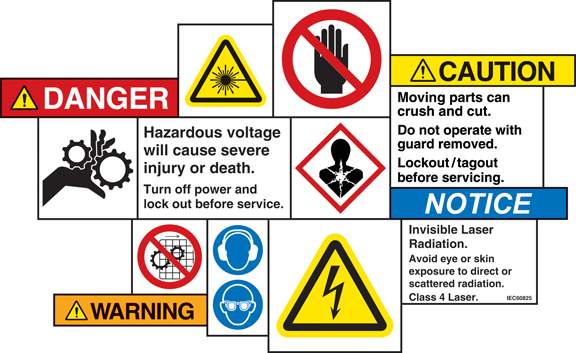
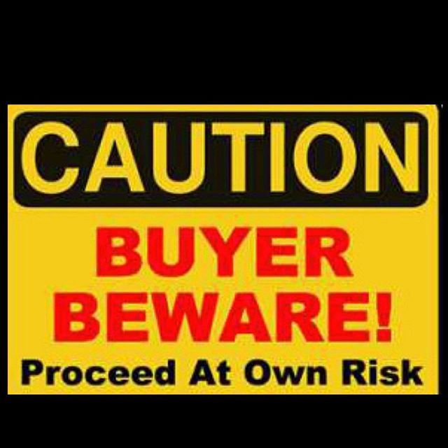
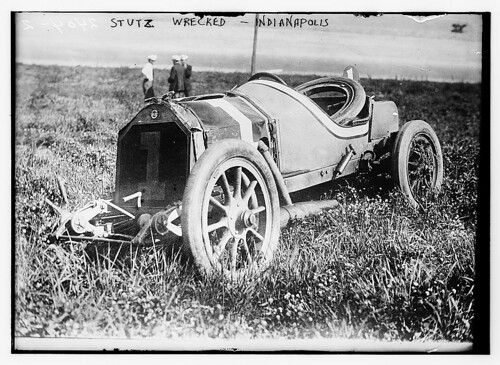
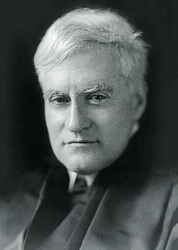
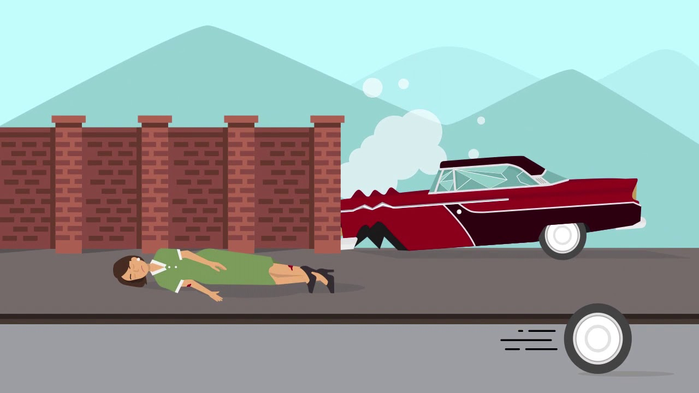

```{r setup, include=FALSE}
options(htmltools.dir.version = FALSE)
knitr::opts_chunk$set(echo=F,
                      message=F,
                      warning=F,
                      fig.retina=3,
                      fig.align = "center")
library("tidyverse")
library("ggrepel")
library("fontawesome")
xaringanExtra::use_tile_view()
xaringanExtra::use_tachyons()
xaringanExtra::use_freezeframe()
update_geom_defaults("label", list(family = "Fira Sans Condensed"))
update_geom_defaults("text", list(family = "Fira Sans Condensed"))
```

class: inverse

# Outline

### [A Brief History of Products Liability Law](#3)
### [A Simple Economic Model of a Risky Product](#)
### [Risky Products: Precaution Incentives](#)
---

# Products Liability

.pull-left[

- So far, we have been assuming accidents are entirely between strangers who have no personal or economic relationship

- We now turn to .hi[products liability], an subfield of tort law where the injurer is a business and the victim is a consumer of their product
  - Parties have an economic relationship
]

.pull-right[
.center[


]
]
---

# Products Liability

.pull-left[

- Worth studying for three reasons

- Used to be a minor type of tort case, now a major growing and specialized body of law

- Source of growing dissatisfaction with our tort liability system

- Accidents are between parties with a contractual relationship
  - Hybrid of contract and tort law
]

.pull-right[
.center[


]
]

---

# The Growth of Products Liability Cases

```{r}
pl<-tribble(
  ~"Year", ~"Cases", ~"Pct",
  1980, 6876, 4.07,
  1981, 8028, 4.45,
  1982, 7908, 3.84,
  1983, 8026, 3.32,
  1984, 7677, 2.94,
  1985, 12507, 4.57,
  1986, 12459, 4.89,
  1987, 14145, 5.92,
  1988, 16166, 6.75,
  1989, 13408, 5.74,
  1990, 18679, 8.57,
  1991, 12399, 5.97,
  1992, 10769, 4.75,
  1993, 16545, 7.24,
  1994, 23977, 10.16,
  1995, 17631, 7.38,
  1996, 38170, 14.00,
  1997, 23294, 8.79,
  1998, 18325, 10.84,
  1999, 18781, 7.2,
  2000, 14428, 5.6,
  2001, 12307, 4.9,
  2002, 41135, 15.0,
  2003, 21611, 8.5,
  2004, 34100, 21.1,
  2005, 29537, 11.7,
  2006, 48739, 18.8,
  2007, 36469, 14.2,
  2008, 52110, 19.5,
  2009, 58335, 21.1,
  2010, 63203, 22.3,
  2011, 59761, 20.7,
  2012, 43083, 15.5,
  2013, 49526, 17.4,
  2014, 60078, 20.3,
  2015, 41764, 15.0
)
```

.pull-left[
```{r}
library(scales)
ggplot(data = pl)+
  aes(x = Year,
      y = Cases)+
  geom_line(size = 2, color = "red")+
  geom_smooth(method = "lm", linetype = "dashed", se = F, alpha = 0.3, color = "red")+
  labs(x = "Year",
       y = "Cases Filed",
       title = "Total Products Liability Cases Filed",
       caption = "Source: Miceli (2017: 59)")+
  scale_x_continuous(breaks = seq(1980,2015,5),
                     limits = c(1980,2018),
                     expand = c(0,0))+
  scale_y_continuous(breaks = seq(0,70000,10000),
                     label = comma,
                     limits = c(0,70000),
                     expand = c(0,0))+
  theme_classic(base_family = "Fira Sans Condensed", base_size = 16)
```
]

.pull-right[
```{r}
ggplot(data = pl)+
  aes(x = Year,
      y = Pct)+
  geom_line(size = 2, color = "blue")+
  geom_smooth(method = "lm", linetype = "dashed", se = F, alpha = 0.3)+
  labs(x = "Year",
       y = "Percentage",
       title = "Products Liability Cases Filed as % of All Civil Cases",
       caption = "Source: Miceli (2017: 59)")+

  scale_x_continuous(breaks = seq(1980,2015,5),
                     limits = c(1980,2018),
                     expand = c(0,0))+
  scale_y_continuous(breaks = seq(0,25,2),
                     limits = c(0,25),
                     labels = function(x){paste0(x,"%")},
                     expand = c(0,0))+
  theme_classic(base_family = "Fira Sans Condensed", base_size = 16)
```
]

---

class: inverse, center, middle

# A Brief History of Products Liability Law

---

# A Brief History of Products Liability Law

.pull-left[

- Three main phases of products liability law development

- Corresponding to the main type of liability rule used

1. Pre-1916: No Liability

2. 1916-1960: Negligence

3. 1960—Present: Strict Liability
]

.pull-right[
.center[


]
]

---

# A Brief History of Products Liability Law

.pull-left[

- Since Industrial Revolution, focus on production and economic growth

- Some suggest influence of Classical Economists (or at least, their ideas) on weak tort law against business

- Some feared excessive liability for producers would threaten business

- .hi[No Liability] for manufacturer
  - Essentially .hi-purple[*caveat emptor*] (buyer beware)
]

.pull-right[
.center[

]
]
---

# A Brief History of Products Liability Law

.pull-left[
.smallest[
- Main law in operation was .hi[contract law]

- Doctrine of .hi-purple[privity of contract]: only parties to a contract can sue one another
  - If $A$ and $B$ have a contract, party $C$ cannot sue either $A$ or $B$, unless $C$ is part of the contract
  - i.e. consumer can only sue the immediate *retailer* from whom they purchased a product, not the product’s initial manufacturer

- This effectively insulated manufacturers from liability
]
]

.pull-right[
.center[

]
]

---

# A Brief History of Products Liability Law

.pull-left[

- *MacPherson v. Buick* (217 N.Y. 382, 1916)

- MacPherson had bought a Buick from a NY auto dealer, the car later lost a wheel and ejected him from the car

- Buick says they have **no privity** with MacPherson, only with the dealership

]

.pull-right[
.center[

]
]

---

# A Brief History of Products Liability Law

.left-column[
.center[


.smallest[
Benjamin N. Cardozo

1870—1938

Associate Justice of U.S. Supreme Court
]
]
]

.right-column[

.smaller[
> “If the nature of a thing is such that it is reasonably certain to place life and limb in peril when negligently made, it is then a thing of danger. Its nature gives warning of the consequence to be expected. If to the element of danger there is added knowledge that the thing will be used by persons other than the purchaser, and used without new tests, then, irrespective of contract, the manufacturer of this thing of danger is under a duty to make it carefully. That is as far as we need to go for the decision of this case...If he is negligent, where danger is to be foreseen, a liability will follow.”

]

.source[[Opinion of the Court](http://www.courts.state.ny.us/reporter/archives/macpherson_buick.htm)]

]

---

# A Brief History of Products Liability Law

.pull-left[

.smallest[
- *MacPherson v. Buick* (217 N.Y. 382, 1916)

- Court rejected privity, arguing the manufacturer could have reasonably forseen the possibility of such injuries to car’s ultimate users (consumers), and not just the *immediate* purchaser (dealer)
  - Victim must prove negligence of the manufacturer
  - MacPherson successfully showed Buick negligent

- Shift from 1916—1960 to a .hi[negligence] rule
  - Consumer must show manufacturer was negligent in its production

]
]
.pull-right[
.center[

]
]

---

# A Brief History of Products Liability Law

.pull-left[

- Final shift from negligence to strict liability occurred via two separate routes

1. Gradual increase in standard of due care owed by manufacturers

2. Increase in producer liability for breach of warranty
]

.pull-right[
.center[

]
]

---

# A Brief History of Products Liability Law

.pull-left[

- *Escola v. Coca-Cola Bottling Co.* (24 Cal.2d 453, 1944)

- Waitress in restaurant served a Coca-cola bottle that spontaneously exploded, causing injuries

- Plaintiff could not offer any evidence that Coca Cola was negligent in its production

]

.pull-right[
.center[

]
]

---

# A Brief History of Products Liability Law

.left-column[
.center[

]
]

.right-column[

Majority opinion (Chief Justice Phil S. Gibson): 

.smallest[
> “Upon an examination of the record, the evidence appears sufficient to support a reasonable inference that the bottle here involved was not damaged by any extraneous force after delivery to the restaurant by defendant. It follows, therefore, that the bottle was in some manner defective at the time defendant relinquished control, because sound and properly prepared bottles of carbonated liquids do not ordinarily explode when carefully handled.”

]

.source[[Opinion of the Court](https://law.justia.com/cases/california/supreme-court/2d/24/453.html)]

]

---

# A Brief History of Products Liability Law

.left-column[
.center[

]
]

.right-column[

Concurring opinion (Justice Roger Traynor):

.smallest[
> “[Public policy demands] responsibility be fixed wherever it will most effectively reduce the hazards to life and health inherent in defective products that reach the market...In leaving it to the jury to decide whether the inference has been dispelled, regardless of the evidence against it, the negligence rule approaches the rule of strict liability. It is needlessly circuitous to make negligence the basis of recovery and impose what is in reality liability without negligence. If public policy demands that a manufacturer of goods be responsible for their quality regardless of negligence there is no reason not to fix that responsibility openly.”

]

.source[[Opinion of the Court](https://law.justia.com/cases/california/supreme-court/2d/24/453.html)]
]

---

# A Brief History of Products Liability Law

.pull-left[
.smallest[
- *Escola v. Coca-Cola Bottling Co.* (24 Cal.2d 453, 1944)

- Court held Injurer liable under legal doctrine of .hi-purple[*res ipsa loquitor*] (“the thing speaks for itself”)
  - Evidence of the accident alone is sufficient to hold injurer liable
  - Only a defective Coke bottle would explode

- As due care does not entirely eliminate the risk of accidents under this rule, effectively a rule of .hi[strict liability] for the Injurer
  - Modern production makes it too difficult for consumers to inspect or verify the product is safe; strict liability more practical
]
]
.pull-right[
.center[

]
]

---

# A Brief History of Products Liability Law

.pull-left[

- In contract law, sellers are strictly liable for damages caused by products that fail to operate as presented (regardless of negligence), a .hi-purple[breach of warranty]

- However, privity of contract operates here — only those who are a party to the contract may sue (essentially for breach of contract)
]

.pull-right[
.center[

]
]
---

# A Brief History of Products Liability Law

.pull-left[

.smallest[
- *Henningsen v. Bloomfield Motors, Inc.* (32 N.J. 358, 1960)

- Henningsen bought a Chrysler car from Bloomfield Motors (an auto dealer)

- Steering mechanism in Henningsen’s Chrysler car failed, causing an accident

- Sale contract between Henningsen’s and the manufacturer expressly limited Chrysler’s liability to the original purchaser (dealer), and only for certain types of damages (defective parts, etc.)
  - Contract stipulated no express or implied warranty to customer

]
]

.pull-right[
.center[


.source[[Source](https://www.youtube.com/watch?v=MSlaPJAlAew)]
]
]

---

# A Brief History of Products Liability Law

.left-column[
.center[

]
]

.right-column[
.smaller[
- Court rejected this limitation, arguing implied warranty of fitness prevailed regardless of any expressed contractual terms to the contrary
  - Additionally, struck down the privity doctrine

- Although the victim was not the original purchaser, she:

]

.quitesmall[
> “in the reasonable contemplation of the parties to the warranty, might be expected to become a user of the automobile. Accordingly, her lack of privity does not stand in the way of prosecution of the injury suit against the defendant Chrysler.”

]

.smaller[
- So now both tort and contract law converge to a strict liability standard for manufacturers
]
]

---

# A Brief History of Products Liability Law

.quitesmall[
- *The Restatement (Second) of Torts 1965* $\S$ 402A:

> (1) One who sells any product in a defective condition unreasonably dangerous to the user or consumer or to his property is subject to liability for physical harm thereby caused to the ultimate user or consumer, or to his property, if

> (a) the seller is engaged in the business of selling such a product, and

> (b) it is expected to and does reach the user or consumer without substantial change in the condition in which it is sold.

> (2) The rule stated in Subsection (1) applies although

> (a) the seller has exercised all possible care in the preparation and sale
of the product, and

> (b) the user or consumer has not bought the product from or entered
into any contractual relation with the seller.

]
- Note that part (2)(a) excludes consideration of producer care (hence, liability is strict), part (2)(b) eliminates privity

---

# Strict Liability for Manufacturers?

.pull-left[

- Somewhat misleading to label the rule as “strict liability”

- In addition to harm & causation, Plaintiffs must show product is .hi[defective] in design or manufacture

- Or, if it is inherently dangerous, the manufacturer .hi[failed to warn] consumers of danger
  - e.g. cigarettes, dynamite, lithium ion batteries

]

.pull-right[
.center[

]
]

---

# Strict Liability for Manufacturers?

.pull-left[

- Element of .hi[negligence] here: manufacturers can avoid liability by meeting the design standard or the duty to warn
  - Though courts are still becoming more strict in determining whether or not Defendants meet these standards
]


.pull-right[
.center[

]
]

---

class: inverse, center, middle

# A Simple Economic Model of a Risky Product

---

# A Simple Economic Model of a Risky Product

.pull-left[

.smallest[
- Consider a typical .red[supply] and .blue[demand] model, first for a .hi-purple[safe product]

- .blue[Demand]: $\color{blue}{p=a-bq}$
  - marginal benefit to consumer
  - $a$: choke price (intercept)
  - $b$: slope

- .red[Supply]: $\color{red}{p=c}$
  - $c$ is marginal cost

- Equilibrium $(q^\star,p^\star)$
$$q^{\star}=\frac{c+b}{a}; p^{\star}=c$$
]

]
--

.pull-right[
```{r}
a<-10
b<-1
c<-4
demand<-function(x){a-b*x}
supply<-function(x){c}

base<-ggplot(data = tibble(x = c(0,10)), aes(x = x))+
  geom_segment(x = 6, xend = 6, y = 0, yend = c, size = 1, linetype = "dashed")+
  geom_function(fun = demand, geom = "line", size = 2, color = "blue")+
  geom_label(x = 9, y = demand(9), label = "Demand", color = "blue")+
  geom_function(fun = supply, geom = "line", size = 2, color = "red")+
  geom_label(x = 9, y = supply(9), label = "Supply", color = "red")+
  labs(x = "Quantity",
       y = "Price")+
  scale_x_continuous(breaks = c(0,6),
                     labels = c(0, expression(q^"*")),
                     limits = c(0,10),
                     expand = c(0,0))+
  scale_y_continuous(breaks = c(0,c, a),
                     labels = c(0, expression(c==p^"*"), "a"),
                     limits = c(0,10),
                     expand = c(0,0))+
  theme_classic(base_family = "Fira Sans Condensed", base_size = 16)
base
```
]

---

# A Simple Economic Model of a Risky Product

.pull-left[

- Now suppose the product comes with some .hi-turquoise[risk of an accident]
  - $p$: probability of accident (per unit)
  - $D$: damages from accident
  - $pD$: expected damages (per unit)
  - $pDq$: total expected damages

- Accidents are determined by both parties’:
  - care levels (e.g. $x$ and $y$ from before)
  - activity levels
]

.pull-right[
```{r}
base
```
]

---

# A Simple Economic Model of a Risky Product

.pull-left[

- We need to consider the .hi-purple[liability] rule in place
  - .hi-purple[s]: .red[manufacturer’s] share of liability
  - .hi-purple[1-s]: .blue[consumer’s] share of liability

- Two main alternatives:
  - .hi-purple[s=1: strict liability (SL)]
  - .hi-purple[s=0: no liability (NL)]
]

.pull-right[
```{r}
base
```
]

---

# A Simple Economic Model of a Risky Product

.pull-left[
.smallest[
- Now adjust .blue[Demand] and .red[Supply] to account for accident risk, determined by liability: 

- .blue[Demand] with risk: 
$$\color{blue}{p=a-bq-(1-s)pD}$$
  - $a-bq$: marginal benefit (WTP) ignoring risk
  - $(1-s)pD$: discounting by consumer’s expected liability

]
]

.pull-right[
```{r}
p<-0.05
D<-50
demand_risk<-function(x){(a-2)-b*x}
base+
  geom_segment(x = 4, xend = 4, y = 0, yend = c, size = 1, linetype = "dashed")+
  geom_label(x = 9, y = demand(9), label = "Demand (SL)", color = "blue")+
  geom_function(fun = demand_risk, geom = "line", size = 2, color = "darkblue")+
  geom_label(x = 7, y = demand_risk(7), label = "Demand (NL)", color = "darkblue")+
  
  annotate("segment", x = 3, xend = 3, y = demand(3), yend = demand_risk(3), colour = "black", size=2, alpha=1, arrow=arrow(length=unit(0.5,"cm"), ends="last", type="closed"))+

  scale_x_continuous(breaks = c(0,4, 6),
                     labels = c(0, expression(q^"**"), expression(q^"*")),
                     limits = c(0,10),
                     expand = c(0,0))+
    scale_y_continuous(breaks = c(0,c, 8, a),
                     labels = c(0, expression(c==p^"*"), "a-pD", "a"),
                     limits = c(0,10),
                     expand = c(0,0))
```
]

---

# A Simple Economic Model of a Risky Product

.pull-left[
.smallest[
- .blue[Demand] with risk: 
$$\color{blue}{p=a-bq-(1-s)pD}$$

- If .hi-purple[s=1 (SL)], no change in .blue[demand], consumer behaves as if product was perfectly safe
  - $\color{blue}{p=a-bq}$
  - Fully insured against any risk (manufacturer is strictly liable)

- If .hi-purple[s=0 (NL)], reduce spending exactly by expected damages per unit
  - Consumer full bears the risk of accident
]
]

.pull-right[
```{r}
base+
  geom_segment(x = 4, xend = 4, y = 0, yend = c, size = 1, linetype = "dashed")+
  geom_label(x = 9, y = demand(9), label = "Demand (SL)", color = "blue")+
  geom_function(fun = demand_risk, geom = "line", size = 2, color = "darkblue")+
  geom_label(x = 7, y = demand_risk(7), label = "Demand (NL)", color = "darkblue")+
  
  annotate("segment", x = 3, xend = 3, y = demand(3), yend = demand_risk(3), colour = "black", size=2, alpha=1, arrow=arrow(length=unit(0.5,"cm"), ends="last", type="closed"))+

  scale_x_continuous(breaks = c(0,4, 6),
                     labels = c(0, expression(q^"**"), expression(q^"*")),
                     limits = c(0,10),
                     expand = c(0,0))+
    scale_y_continuous(breaks = c(0,c, 8, a),
                     labels = c(0, expression(c==p^"*"), "a-pD", "a"),
                     limits = c(0,10),
                     expand = c(0,0))
```
]

---

# A Simple Economic Model of a Risky Product

.pull-left[
.smallest[
- Now adjust .blue[Demand] and .red[Supply] to account for accident risk, determined by liability: 

- .red[Supply] with risk 
$$\color{red}{p=c+spD}$$
  - $c$: marginal cost ignoring risk
  - $spD$: premium for seller’s expected liability

]
]
.pull-right[
```{r}
supply_risk<-function(x){c+2}
base+
  geom_segment(x = 4, xend = 4, y = 0, yend = (c+2), size = 1, linetype = "dashed")+
  geom_label(x = 9, y = demand(9), label = "Demand (SL)", color = "blue")+
  geom_function(fun = demand_risk, geom = "line", size = 2, color = "darkblue")+
  geom_label(x = 7, y = demand_risk(7), label = "Demand (NL)", color = "darkblue")+
  geom_label(x = 9, y = supply(9), label = "Supply (NL)", color = "red")+
  geom_function(fun = supply_risk, geom = "line", size = 2, color = "darkred")+
  geom_label(x = 9, y = supply_risk(9), label = "Supply (SL)", color = "darkred")+
  annotate("segment", x = 7, xend = 7, y = supply(7), yend = supply_risk(7), colour = "black", size=2, alpha=1, arrow=arrow(length=unit(0.5,"cm"), ends="last", type="closed"))+

  scale_x_continuous(breaks = c(0,4, 6),
                     labels = c(0, expression(q^"**"), expression(q^"*")),
                     limits = c(0,10),
                     expand = c(0,0))+
    scale_y_continuous(breaks = c(0,c, 6, 8, a),
                     labels = c(0, expression(c), expression(c+pD), "a-pD", "a"),
                     limits = c(0,10),
                     expand = c(0,0))
```
]

---


# A Simple Economic Model of a Risky Product

.pull-left[
.smallest[
- Now adjust .blue[Demand] and .red[Supply] to account for accident risk, determined by liability: 

- .red[Supply] with risk 
$$\color{red}{p=c+spD}$$

- If .hi-purple[s=0 (NL)], no change in .red[supply], producer behaves as if product was perfectly safe
  - Fully insured against any risk (caveat emptor, consumer incurs full cost)

- If .hi-purple[s=1 (SL)], raise asking price exactly by expected damages per unit
  - Seller fully bears the risk of accident
]
]
.pull-right[
```{r}
base+
  geom_segment(x = 4, xend = 4, y = 0, yend = (c+2), size = 1, linetype = "dashed")+
  geom_label(x = 9, y = demand(9), label = "Demand (SL)", color = "blue")+
  geom_function(fun = demand_risk, geom = "line", size = 2, color = "darkblue")+
  geom_label(x = 7, y = demand_risk(7), label = "Demand (NL)", color = "darkblue")+
  geom_label(x = 9, y = supply(9), label = "Supply (NL)", color = "red")+
  geom_function(fun = supply_risk, geom = "line", size = 2, color = "darkred")+
  geom_label(x = 9, y = supply_risk(9), label = "Supply (SL)", color = "darkred")+
  annotate("segment", x = 7, xend = 7, y = supply(7), yend = supply_risk(7), colour = "black", size=2, alpha=1, arrow=arrow(length=unit(0.5,"cm"), ends="last", type="closed"))+

  scale_x_continuous(breaks = c(0,4, 6),
                     labels = c(0, expression(q^"**"), expression(q^"*")),
                     limits = c(0,10),
                     expand = c(0,0))+
    scale_y_continuous(breaks = c(0,c, 6, 8, a),
                     labels = c(0, expression(c), expression(c+pD), "a-pD", "a"),
                     limits = c(0,10),
                     expand = c(0,0))
```
]

---

# A Simple Economic Model of a Risky Product

.pull-left[

.smallest[
- Regardless of the rule $(s)$, equilibrium quantity is always $q^{\star \star}$!
$$\begin{align*}
a-b(q)-(1-s)pD &= c+spD \\
\color{green}{a-b(q)} &= \color{orange}{c +pD}\\
\end{align*}$$

- $q^{\star \star}$ efficient level where .green[marginal social benefit] = .orange[*full* marginal social cost] (including expected accident costs)

- Application of the .hi-purple[Coase Theorem]: resource allocated efficiently $(MSB = MSC)$ regardless of the assignment of liability!
  - Main reason is liability is shifted via price (see next)

]
]

.pull-right[
```{r}
points<-tribble(
  ~x, ~y, ~label,
  4, 4, "NL (s=0)",
  4, 6, "SL (s=1)"
)
risk<-base+
  geom_segment(x = 4, xend = 4, y = 0, yend = (c+2), size = 1, linetype = "dashed")+
  geom_label(x = 9, y = demand(9), label = "Demand (SL)", color = "blue")+
  geom_function(fun = demand_risk, geom = "line", size = 2, color = "darkblue")+
  geom_label(x = 7, y = demand_risk(7), label = "Demand (NL)", color = "darkblue")+
  geom_label(x = 9, y = supply(9), label = "Supply (NL)", color = "red")+
  geom_function(fun = supply_risk, geom = "line", size = 2, color = "darkred")+
  geom_label(x = 9, y = supply_risk(9), label = "Supply (SL)", color = "darkred")+
  geom_point(data = points, aes(x = x, y = y), size = 4)+
  ggrepel::geom_label_repel(data = points, aes(x = x, y = y, label = label), seed = 2, box.padding = 1)+
  scale_x_continuous(breaks = c(0,4, 6),
                     labels = c(0, expression(q^"**"), expression(q^"*")),
                     limits = c(0,10),
                     expand = c(0,0))+
    scale_y_continuous(breaks = c(c, 6),
                     labels = c(expression(p[NL]), expression(p[SL])),
                     limits = c(0,10),
                     expand = c(0,0))
risk
```
]

---


# A Simple Economic Model of a Risky Product

.pull-left[

.smallest[
- The price of the product does depend on rule .purple[s]:
  - When .hi-purple[s=0 (No Liability)], $p=p_{NL}$
  - When .hi-purple[s=1 (Strict Liability)], $p=p_{SL}$

- .green[Area B] = $cq^{\star \star} = p_{NL}q^{\star \star}$
  - cost & revenue to seller

- .orange[Area A] = $pDq$
  - total expected damages, an additional cost

- Area .green[B] + .orange[A] = total social costs to produce (under Strict Liability $s=1)$
]
]

.pull-right[
```{r}
risk+
  geom_rect(xmin = 0, xmax = 4, ymin = 0, ymax = 4, fill = "green", alpha = 0.5)+
  geom_text(x = 2, y = 2, label = "B", color = "white", size = 6)+
  geom_rect(xmin = 0, xmax = 4, ymin = 4, ymax = 6, fill = "orange", alpha = 0.5)+
  geom_text(x = 2, y = 5, label = "A", color = "white", size = 6)
```
]

---

# A Simple Economic Model of a Risky Product

.pull-left[

- Producer will always directly bear area .green[B] as cost (MC of production)

- Liability rule .purple[s] will determine who will bear cost of area .orange[A]
  - No liability .purple[(s=0)]: consumer bears full cost of .orange[A]
  - Strict liability .purple[(s=1)]: producer bears full cost of .orange[A]
    - raises the price to $p_{SL}$ to collect cost upfront
]

.pull-right[
```{r}
risk+
  geom_rect(xmin = 0, xmax = 4, ymin = 0, ymax = 4, fill = "green", alpha = 0.5)+
  geom_text(x = 2, y = 2, label = "B", color = "white", size = 6)+
  geom_rect(xmin = 0, xmax = 4, ymin = 4, ymax = 6, fill = "orange", alpha = 0.5)+
  geom_text(x = 2, y = 5, label = "A", color = "white", size = 6)
```
]

---

# A Simple Economic Model of a Risky Product

.pull-left[

- Under a rule of .hi-purple[no liability (s=0)] (caveat emptor), consumer .hi-purple[self-insures]
  - decides how much to allocate extra savings of (not paying) area .orange[A] (lower price $p_{NL})$
  - save money, take out insurance, buy a different product, etc. to prepare for expected damages $pD$

]

.pull-right[
```{r}
risk+
  geom_rect(xmin = 0, xmax = 4, ymin = 0, ymax = 4, fill = "green", alpha = 0.5)+
  geom_text(x = 2, y = 2, label = "B", color = "white", size = 6)+
  geom_rect(xmin = 0, xmax = 4, ymin = 4, ymax = 6, fill = "orange", alpha = 0.5)+
  geom_text(x = 2, y = 5, label = "A", color = "white", size = 6)
```
]

---

# A Simple Economic Model of a Risky Product

.pull-left[

- Under .hi-purple[strict liability (s=1)], producer pays production costs .green[B] + expected liability costs .orange[A]
  - sells product bundled with an “insurance policy”
    - $(p_{SL}-p_{NL})$: “insurance premium”
  - law incentivizes producers to insure consumers against risk
]

.pull-right[
```{r}
risk+
  geom_rect(xmin = 0, xmax = 4, ymin = 0, ymax = 4, fill = "green", alpha = 0.5)+
  geom_text(x = 2, y = 2, label = "B", color = "white", size = 6)+
  geom_rect(xmin = 0, xmax = 4, ymin = 4, ymax = 6, fill = "orange", alpha = 0.5)+
  geom_text(x = 2, y = 5, label = "A", color = "white", size = 6)
```
]

---
# A Simple Economic Model of a Risky Product

.pull-left[
.smallest[
- The main question is, .hi-turquoise[who is the better insurer?]
  - Self-insurance at price $p_{NL}$
  - Manufacturer bundles good and insurance at price $p_{SL}$

- If accident happens with first unit
  - Consumer has not built up enough savings, far better to purchase insurance in market rather than self-insure
  - Same issue with (small) firms, usually also purchase insurance in market to cover expected tort liability under SL
  
]
]
.pull-right[
```{r}
risk+
  geom_rect(xmin = 0, xmax = 4, ymin = 0, ymax = 4, fill = "green", alpha = 0.5)+
  geom_text(x = 2, y = 2, label = "B", color = "white", size = 6)+
  geom_rect(xmin = 0, xmax = 4, ymin = 4, ymax = 6, fill = "orange", alpha = 0.5)+
  geom_text(x = 2, y = 5, label = "A", color = "white", size = 6)
```
]

---

class: inverse, center, middle

# Risky Products: Precaution Incentives

---

# Risky Products: Precaution Incentives

.pull-left[
.smallest[
- Will the .hi-purple[level of precaution] be optimal regardless of the liability rule? (like output $q^{\star \star})$?
  - Coase Theorem implies yes

- If .hi-purple[s=0 (no liability)]
  - In model of accidents between strangers (lesson 3.2), we saw .blue[victims] take efficient care $y=y^{\star}$ and .red[injurers] take no care $x=0$
  - In today's model, suppose .red[manufacturer] & .blue[consumer] bargain: .red[manufacturer] agrees to produce safe product in return for higher price $p_{SL}$
  - .red[Manufacturer] will invest in efficient safety level: where MB of reduction in accidents = MC
]
]

.pull-right[
.center[

]]

---
# Risky Products: Precaution Incentives

.pull-left[
.smallest[
- Will the .hi-purple[level of precaution] be optimal regardless of the liability rule? (like output $q^{\star \star})$?
  - Coase Theorem implies yes

- If .hi-purple[s=1 (strict liability)]
  - In model of accidents between strangers (lesson 3.2), we saw .red[injurers] take efficient care $x=x^{\star}$ and .blue[victims] take no care $y=0$
  - In today's model, suppose .red[manufacturer] & .blue[consumer] bargain: ,blue[consumer] promises to use product carefully in exchange for a price reduction by .red[manufacturer] $(p_{NL})$
  - .blue[Consumer] will use product safely in an efficient way: where MB of reduction in accidents = MC

- Both lead to safer products, **assuming low transaction costs**
]
]

.pull-right[
.center[

]]

---

# Risky Products: Precaution Incentives

.pull-left[
.smallest[

- How likely are these to work in practice?

- First case (no liability), .blue[consumer] pays higher price if she can see product is safer
  - sometimes .blue[consumers] *can't* inspect & determine safety at purchase (e.g. drugs)

- Second case (strict liability) is virtually impossible
  - .blue[consumer] has to live up to their long-term promise to use product safely
  - .red[Manufacturer] can't monitor .blue[consumer]'s behavior, hence, unwilling to make this bargain

]
]

.pull-right[
.center[

]]

---

# Risky Products: Precaution Incentives

.pull-left[
.smallest[
- Coase theorem fails with these high transaction costs
  - liability rule $s$ now very relevant
  - back to a world of strangers in accidents with other strangers

- We saw a strict liability rule is unlikely to achieve efficient level of victim (consumer) care

- Further complicates matters if (as they often do), **consumers mispercieve risks**
  - Empirical evidence that people overestimate low probability risks and underestimate high probabiliy risks
  - Product accidents primarily are the first case
]
]
.pull-right[
.center[

]]

---

# Consumer Misperceptions of Risk

.pull-left[

- Return to our model, let's first look at equilibrium output

- .red[Producers] correctly perceive probability of accident as $p$
  - Have better knowledge about its risk

- Suppose .blue[consumers] misperceive the probability of an accident as $\alpha p$
  - $\alpha = 1$: true probability

]

.pull-right[
.center[

]
]

---

# Consumer Misperceptions of Risk

.pull-left[

- Return to our model, let's first look at equilibrium output

- .red[Producers] correctly perceive probability of accident as $p$
  - Have better knowledge about its risk

- Suppose .blue[consumers] misperceive the probability of an accident as $\alpha p$
  - $\alpha = 1$: true probability
  - $\alpha > 1$: overestimate probability
  - $\alpha < 1$: underestimate probability

]

.pull-right[
.center[

]

]

---

# Consumer Misperceptions of Risk

- Now .blue[Demand] under any legal rule:

$$\color{blue}{a-b(q)-(1-s)\alpha pD}$$
--

- .red[Supply] under any legal rule remains:

$$\color{red}{c+spD}$$

--

- Setting these equal, equilibrium output is:

$$a-b(q)-(1-s)\alpha pD=c+spD$$
  - If $\alpha=1$, then output is $q^{\star \star}$

--

- Recall if .purple[s=1], then equilibrium is $q^{\star \star}$ where $a-b(q)=c+pD$

-- 

- If $\alpha \neq 1$, then for any liability rule *other* than strict liability $(s<1)$, output will **not** be the efficient level $q^{\star \star}$! 

---

# Consumer Misperceptions of Risk

.pull-left[

- As an example, conside .purple[no liability (s=0)]

- Equilibrium output where:
$$\color{blue}{a-b(q)-\alpha pD}=\color{red}{c}$$

- If $\alpha>1$, consumers overestimate risk, demand too little output
]

.pull-right[
```{r}
demand_under<-function(x){9-x}
demand_over<-function(x){7-x}

ggplot(data = tibble(x = c(0,10)), aes(x = x))+
  geom_segment(x = 3, xend = 3, y = 0, yend = c, size = 1, linetype = "dashed")+
  geom_segment(x = 4, xend = 4, y = 0, yend = c, size = 1, linetype = "dashed")+
  geom_function(fun = demand_over, geom = "line", size = 2, color = "blue", linetype = "dashed")+
  geom_label(x = 5, y = demand_over(5), label = expression(alpha>1), color = "blue")+
  geom_function(fun = supply, geom = "line", size = 2, color = "red")+
  geom_label(x = 9, y = supply(9), label = "Supply", color = "red")+
  geom_function(fun = demand_risk, geom = "line", size = 2, color = "darkblue")+
  geom_label(x = 7, y = demand_risk(7), label = expression(paste("Demand ", (alpha==1))), color = "darkblue")+
  geom_label(x = 9, y = supply(9), label = "Supply (NL)", color = "red")+
  #geom_point(data = subset(points, label== "NL (s=0)"), aes(x = x, y = y), size = 4)+
  #ggrepel::geom_label_repel(data = subset(points, label== "NL (s=0)"), aes(x = x, y = y, label = label), seed = 2, box.padding = 1)+
  scale_x_continuous(breaks = c(0,3, 4),
                     labels = c(0, expression(q[over]), expression(q^"**")),
                     limits = c(0,10),
                     expand = c(0,0))+
    scale_y_continuous(breaks = c(c),
                     labels = c(expression(p)),
                     limits = c(0,10),
                     expand = c(0,0))+
  theme_classic(base_family = "Fira Sans Condensed", base_size = 16)
```
]

---

# Consumer Misperceptions of Risk

.pull-left[

- As an example, conside .purple[no liability (s=0)]

- Equilibrium output where:
$$\color{blue}{a-b(q)-\alpha pD}=\color{red}{c}$$

- If $\alpha>1$, consumers overestimate risk, demand too little output

- If $\alpha>1$, consumers overestimate risk, demand too little output

]

.pull-right[
```{r}
ggplot(data = tibble(x = c(0,10)), aes(x = x))+
  geom_segment(x = 3, xend = 3, y = 0, yend = c, size = 1, linetype = "dashed")+
  geom_segment(x = 4, xend = 4, y = 0, yend = c, size = 1, linetype = "dashed")+
  geom_segment(x = 5, xend = 5, y = 0, yend = c, size = 1, linetype = "dashed")+
  geom_function(fun = demand_over, geom = "line", size = 2, color = "blue", linetype = "dashed")+
  geom_label(x = 5, y = demand_over(5), label = expression(alpha>1), color = "blue")+
  geom_function(fun = demand_under, geom = "line", size = 2, color = "blue", linetype = "dashed")+
  geom_label(x = 7, y = demand_under(7), label = expression(alpha<1), color = "blue")+
  geom_function(fun = supply, geom = "line", size = 2, color = "red")+
  geom_label(x = 9, y = supply(9), label = "Supply", color = "red")+
  geom_function(fun = demand_risk, geom = "line", size = 2, color = "darkblue")+
  geom_label(x = 7, y = demand_risk(7), label = expression(paste("Demand ", (alpha==1))), color = "darkblue")+
  geom_label(x = 9, y = supply(9), label = "Supply (NL)", color = "red")+
  #geom_point(data = subset(points, label== "NL (s=0)"), aes(x = x, y = y), size = 4)+
  #ggrepel::geom_label_repel(data = subset(points, label== "NL (s=0)"), aes(x = x, y = y, label = label), seed = 2, box.padding = 1)+
  scale_x_continuous(breaks = c(0,3, 4, 5 ),
                     labels = c(0, expression(q[over]), expression(q^"**"), expression(q[under])),
                     limits = c(0,10),
                     expand = c(0,0))+
    scale_y_continuous(breaks = c(c),
                     labels = c(expression(p)),
                     limits = c(0,10),
                     expand = c(0,0))+
  theme_classic(base_family = "Fira Sans Condensed", base_size = 16)
```
]

---

# Consumer Misperceptions of Risk

.pull-left[

- Different under .hi-purple[strict liability (s=1)], we saw equilibrium output is still efficient $q^{\star \star}$
  - Efficient for any $\alpha$ (i.e. regardless of .blue[consumer’s] mistaken beliefs)

- .blue[Consumer] misperceptions of risk have no effect on output
  - .red[Manufacturer] fully internalizes the expected damages via the higher market price $p_{SL}$, accurately reflecting the risk
]

.pull-right[
```{r}
risk
```
]

---

# Consumer Misperceptions of Risk

.pull-left[

- In other words, .hi-purple[when consumers misperceive risk, the liability rule matters for efficiency]
  - Only under strict liability will misperceptions of risk not affect efficient outcome

- .hi-purple[In general, the party who more accurately perceives the risk should bear the liability]

- Supports general historical trend of more strict liability for products
]

.pull-right[
```{r}
risk
```
]

---

# Consumer Precaution

- What about the level of precaution?

--

| Rule | .red[Injurer] Precaution | .blue[Victim] Precaution
|------|---------|--------|
| No liability | Zero | .green[Efficient] |
| Strict liability | .green[Efficient] | Zero |

--

- We saw before, under strict liability, .blue[Victim] has no incentive to take precautions $(y=0)$
  - High cost of enforcing contract conditioned on consumer appropriately using product


---

# Consumer Precaution

- What about the level of precaution?

--

| Rule | .red[Injurer] Precaution | .blue[Victim] Precaution
|------|---------|--------|
| No liability | Zero | .green[Efficient] |
| Strict liability | .green[Efficient] | Zero |
| Strict Liability w/Contributory Negligence | .green[Efficient] | .green[Efficient] |

--

.pull-left[

]

.pull-left[

.smallest[
- We also saw before that introducing a defense of contributory negligence restores incentive for .blue[Victim] to take due care to avoid liability

- However, most cases do not accept this as a defense!
]
]

.pull-right[
```{r, fig.height =3}
ggplot(tibble(x=c(0,10)), aes(x=x))+
  geom_rect(xmin=0,xmax=10,ymin=5,ymax=10,fill="red",alpha=0.5)+
  geom_rect(xmin=0,xmax=10,ymin=0,ymax=5,fill="blue",alpha=0.5)+
  geom_text(x=5,y=7.5,color="white", label="Injurer liable")+
  geom_text(x=5,y=2.5,color="white", label="Victim liable")+
 geom_hline(yintercept = 5, linetype = "dashed", size = 1)+
  scale_x_continuous(breaks=c(5),
                     labels=c(expression(x^"*")),
                     limits=c(0,10),
                     expand=expand_scale(mult=c(0,0)))+
  scale_y_continuous(breaks=c(5),
                     labels=c(expression(y^"*")),
                     limits=c(0,10),
                     expand=expand_scale(mult=c(0,0)))+
  labs(x = "Injurer Precaution (x)",
       y = "Victim Precaution (y)",
       title = "Strict Liability with Contributory Negligence")+
  theme_classic(base_family = "Fira Sans Condensed", base_size = 16)
```
]

---

# Conclusions

.pull-left[
.smallest[
- Contract law is not an adequate remedy for most product related accidents between .red[Producer] and .blue[Consumer]

- In theory, .hi-purple[Coase Theorem] suggests the parties could bargain to fully internalize the accident risk (between $p_{SL}$ and $p_{NL})$

- But high transaction costs prevent this:
  - .blue[Consumer] misperceptions of product risk
  - Inability of .red[producers] to monitor .blue[consumers] carefully using product

- High cost of contracting in the presence of these remote risks disproportionate to the benefits of a negotiated level of safety
  - Cheaper to use the .hi[default rule] of having tort law assign safety
]
]

.pull-right[
.center[

]
]