```{r setup, include=FALSE}
options(htmltools.dir.version = FALSE)
knitr::opts_chunk$set(echo=F,
                      message=F,
                      warning=F,
                      fig.retina=3,
                      fig.align = "center")
library("tidyverse")
library("ggrepel")
library("fontawesome")
xaringanExtra::use_tile_view()
xaringanExtra::use_tachyons()
xaringanExtra::use_freezeframe()
update_geom_defaults("label", list(family = "Fira Sans Condensed"))
update_geom_defaults("text", list(family = "Fira Sans Condensed"))
```

class: inverse

# Outline

### [Crimes vs. Torts, Or, Why Do We Need Criminal Law?](#3)
### [Economic Model of Crime and Punishment](#)
---

# The Civil Law vs. Criminal Law Distinction

.pull-left[

- Major areas of law can be split into:

- .hi[Public law] vs. .hi[Private law]
  - laws about relationship between individuals and State
  - laws about relationship between individuals

- .hi[Criminal] vs. .hi[Civil law]

]

.pull-right[
.center[
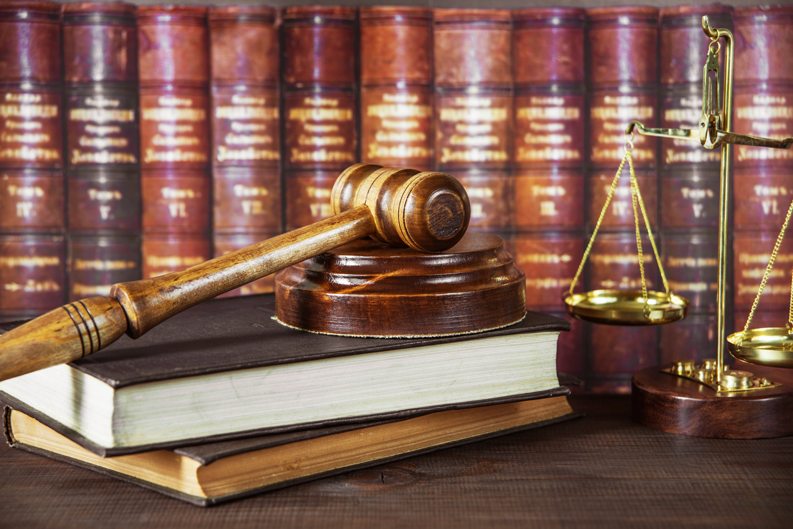
]
]

---

# Criminal Law

.pull-left[

- State proscribes behaviors deemed to be harmful to property, health, safety, or morals

- Established by statute (legislation)

- Punishes and/or rehabilitates criminal with fines, imprisonment, or execution

- *Highest* burden of proof against Plaintiff (State): .hi-turquoise[“beyond a reasonable doubt”]
]

.pull-right[
.center[
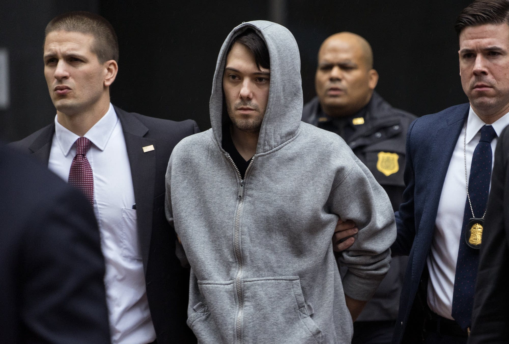
]
]

---

# Civil Law

.pull-left[

- Property, contracts, torts, family, business associations, etc

- Statutes, regulations, and case law

- Burden of proof lower: .hi-turquoise[“preponderance of the evidence”] (i.e. 50.1%)

]

.pull-right[
.center[

]
]

---

# Civil vs. Criminal Law

.pull-left[

- The same dispute can have both a criminal *and* a civil lawsuit

- O.J. Simpson
  - *The People of the State of California v. Simpson*: acquitted of 1st degree murder (criminal)
  - *Rufo v. Simpson*: lost civil case, Plaintiffs awarded $33.5 million in damages for wrongful death and battery
]

.pull-right[
.center[
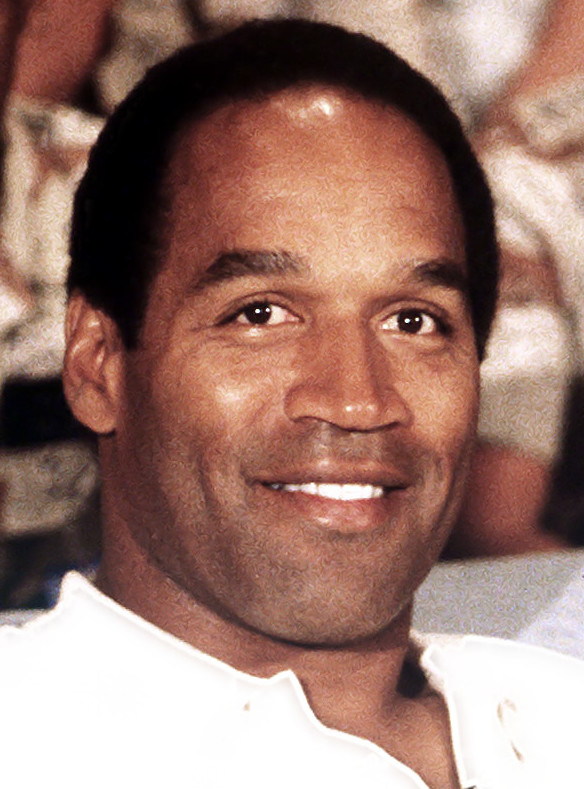
]
]

---

# Civil vs. Criminal Law

.pull-left[
- Antitrust, insider trading, financial regulation, etc.
  - SEC or FTC fine company or officers
  - DOJ charges officers for criminal activities
]

.pull-right[
.center[


]
]
---

class: inverse, center, middle
# Crimes vs. Torts, or Why Do We Need Criminal Law?

---

# Criminal Law vs. Civil Law

.pull-left[
- Criminal .hi[intended] to do wrong

- Case is brought by the State (“society”), not individual plaintiff

- Tends to be .hi[public harm] in addition to private harms

- .hi[Burden of proof] is higher at trial

- If found guilty, defendant will be .hi[punished]

]

.pull-right[
.center[
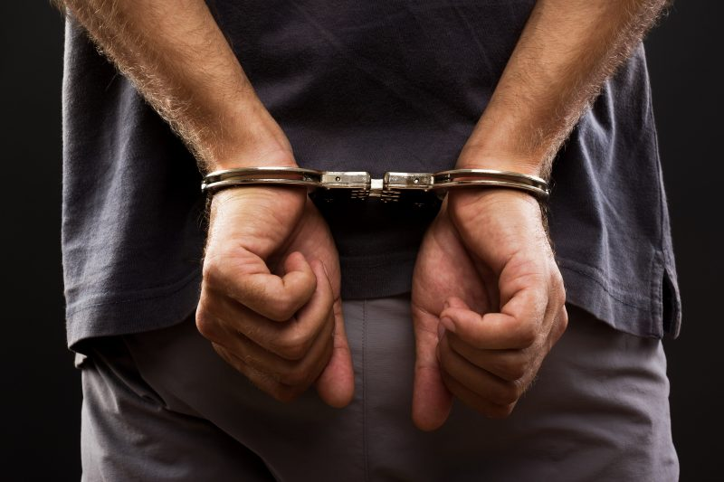
]
]
---

# Criminal Law vs. Tort Law: Intent

.pull-left[

- Unlike a tort, a crime generally requires .hi[intent]
  - .hi-purple[Mens rea]: a “guilty mind”

- Literal intent occasionally not required
  - .hi-green[Example]: Criminally negligent homicide (drunk doctor, lifeguard, etc.)

- Sometimes, intent is sufficient for a crime even without harm
  - .hi-green[Example]: Attempted murder
]

.pull-right[
.center[
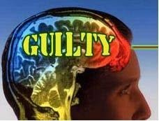
]
]

---

# Criminal Law vs. Tort Law: Plaintiffs

.pull-left[

.smallest[
- Recall wrongful death tort cases
  - Victim is dead, can't receive compensation
  - Family/friends can sue for lost wages, lost companionship, etc.

- Criminal complaints are **brought by the State**

- Potential for prosecution of **“victimless crimes”**
  - Theory: all crimes are .hi-purple[public bads] that harm the public
  - Breakdown of law & order in society harms *everyone*
  - So public (represented by the State) brings criminal suits
]
]
.pull-right[
.center[
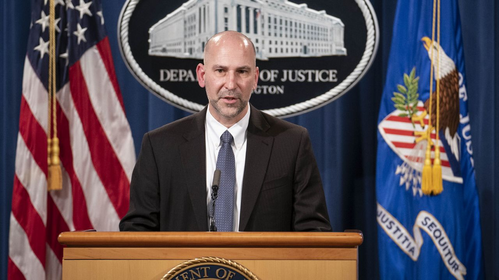
]
]

---

# Criminal Law vs. Tort Law: Remedies

.pull-left[
.smallest[
- Nuisance (property) law, contract law, tort law: damages serve two purposes:
  1. Compensate the .blue[victim]
  2. Incentivize .red[injurer] to internalize cost of harm done

- When .red[injurer] internalizes harm, we get pollution, breach, accidents only when they are efficient

- **Criminal law**: objective is to .hi-purple[deter] crimes, i.e. .hi-purple[prevent them entirely] — not just the “inefficient ones”!
  - Punishment need not be limited to amount of harm done
]
]
.pull-right[
.center[
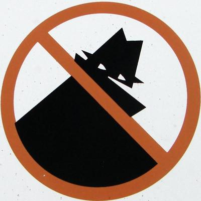
]
]
---

# Criminal Law vs. Tort Law: Standards of Proof

.pull-left[

- Most **civil cases**: .hi-purple[preponderance of the evidence]
  - Interpreted as 51% certainty .blue[Plaintiff] is correct
  - for punitive damages: .hi-purple[clear and convincing evidence] (higher standard)

- **Criminal cases**: .blue[Prosecution] must prove .red[Defendant]'s guilt .hi-purple[beyond a reasonable doubt]
]

.pull-right[
.center[
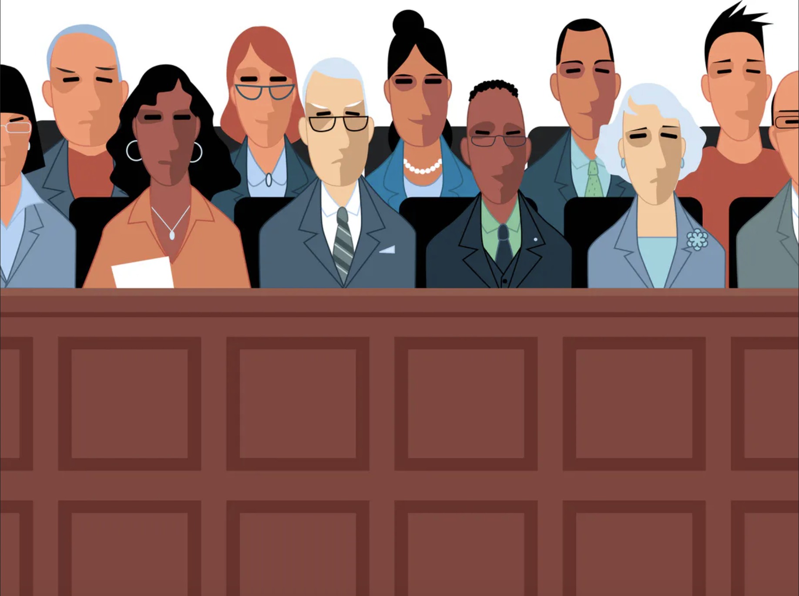
]
]

---

# Criminal Law vs. Tort Law: Standards of Proof

- Consider error costs in tort vs. criminal case:

.center[
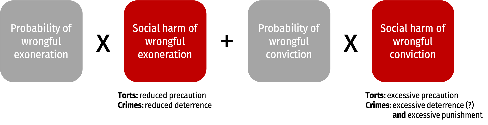
]

--

- If “false positives” are more costly in criminal law, suggests conviction should require more certainty

---

# Criminal Law vs. Tort Law: Standards of Proof

.left-column[
.center[
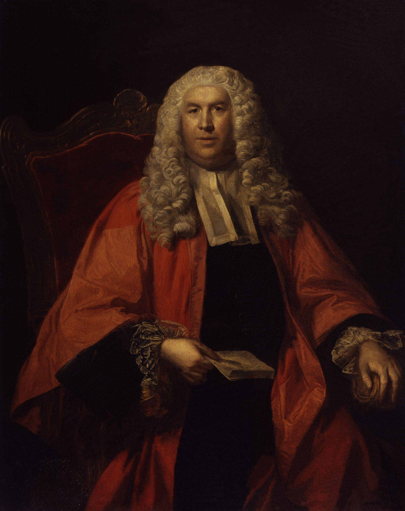

.smallest[
William Blackstone

(1723-1780)
]
]
]

.right-column[

> “It is better that ten guilty persons escape than that one innocent suffer.”

.source[Blackstone, William, 1765-1770, *Commentaries on the Laws of England*]
]

---

# Criminal Law vs. Tort Law: Stigma

.pull-left[

- Harsher stigma to injurer convicted as a .hi-purple[criminal], rather than a .hi-purple[tortfeasor]

- Loss of civil rights (e.g. voting rights)

- Harder to find work, obtain a loan, find housing
]

.pull-right[
.center[
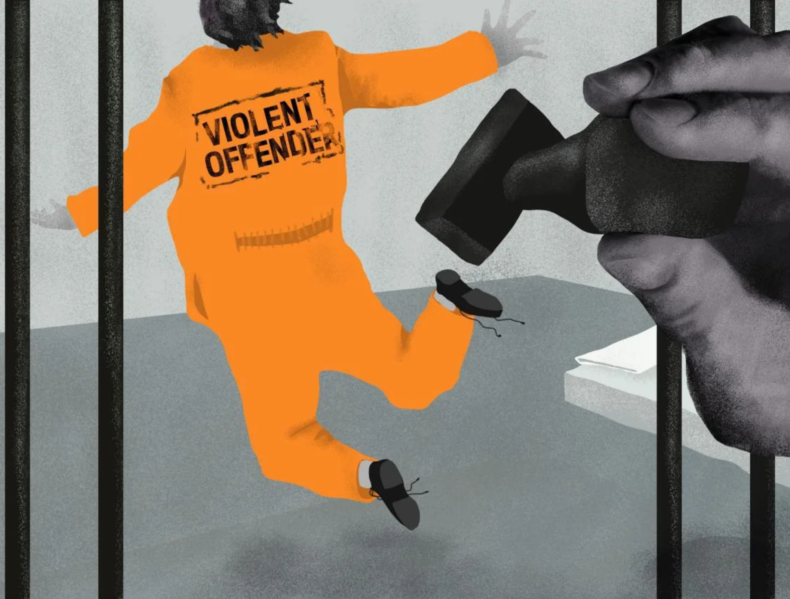
]
]

---

# Why Criminal Law? Why Not Just Tort Law?

.pull-left[
.smallest[
- Tort law creates an incentive to avoid harms
  - If it worked perfectly, maybe no need for criminal law?

- Shortcomings of tort law for certain offenses:
  - Relies on .hi-purple[perfect compensation], which may be impossible (loss of life, crippling injury)
  - If .hi-purple[probability of being caught/convicted] is small, deterrence requires punishment that is .hi-purple[more severe] than benefit obtained
  - If civil penalties are high enough, criminals might be .hi-purple[judgment-proof]
]
]
.pull-right[
.center[

]
]

---


class: inverse, center, middle

# A Theory of Criminal Law

---

# A Theory of Criminal Law

.pull-left[
.smaller[
- A full theory of criminal law must answer:
  1. Which acts should be punished as crimes?
  2. How should they be punished?

- Cooter and Ulen:
  - When goal is .hi-purple[deterrence], acts should be .hi-purple[punished]
  - When goal is .hi-purple[internalization], acts should be .hi-purple[priced]

]
]

.pull-right[
.center[

]
]
---

# A Theory of Criminal Law

.pull-left[

- Our .hi-purple[goal should be deterrence] when:
  - perfect compensation is impossible
  - people want law to protect “rights” instead of “interests” (i.e. consider property rules vs. liability rules)
  - enforcement errors undermine liability
]

.pull-right[
.center[

]
]

---

# Economic Model of Crime and Punishment

.pull-left[

- Key assumption: .hi[rational criminals]
  - Potential criminals, on the margin, weigh private cost (chance of getting caught $\times$ severity of punishment) against benefit

- C’mon are they really though?
  - Well, if our goal is deterrence, we are implicitly assuming criminals are rational, at least on the margin!
  - Otherwise, what’s the point?!

- But for a good counter, see Tabarrok “What Was Gary Becker’s Greatest Mistake?”
]

.pull-right[
.center[

]
]

---

# Economic Model of Crime and Punishment

.left-column[
.center[


.smallest[
David D. Friedman

(1945—)
]
]
]

.right-column[
.quitesmall[
> “Here, as elsewhere in economics, the assumption of rationality does not imply that muggers (or economics professors) calculate the costs and benefits of available alternatives to seventeen decimal places-merely that they tend to choose the one that best achieves their objectives.

> “.hi[If muggers are rational, we do not have to make mugging impossible in order to prevent it, merely unprofitable.] If the benefits of a profession decrease or its costs increase, fewer people will enter it-whether the profession is plumbing or burglary. If little old ladies start carrying pistols in their purses, so that one mugging in ten puts the mugger in the hospital or the morgue, the number of muggers will decrease drastically-not because they have all been shot but because most will have switched to safer ways of making a living. If mugging becomes sufficiently unprofitable, nobody will do it.”

]
.source[Friedman, David D, 1995, “Rational Criminals and Profit-Maximizing Police: Gary Becker's Contribution to the Economic Analysis of Law and Law Enforcement”]
]

---

# Economic Model of Crime and Punishment

.pull-left[
- If enforcement were free, we could eliminate crime
  - Hire enough police to detect nearly all crimes
  - Punish them very severely
  - Nobody rational would commit a crime

- But .hi[enforcement is costly], making this an interesting tradeoff
]

.pull-right[
.center[
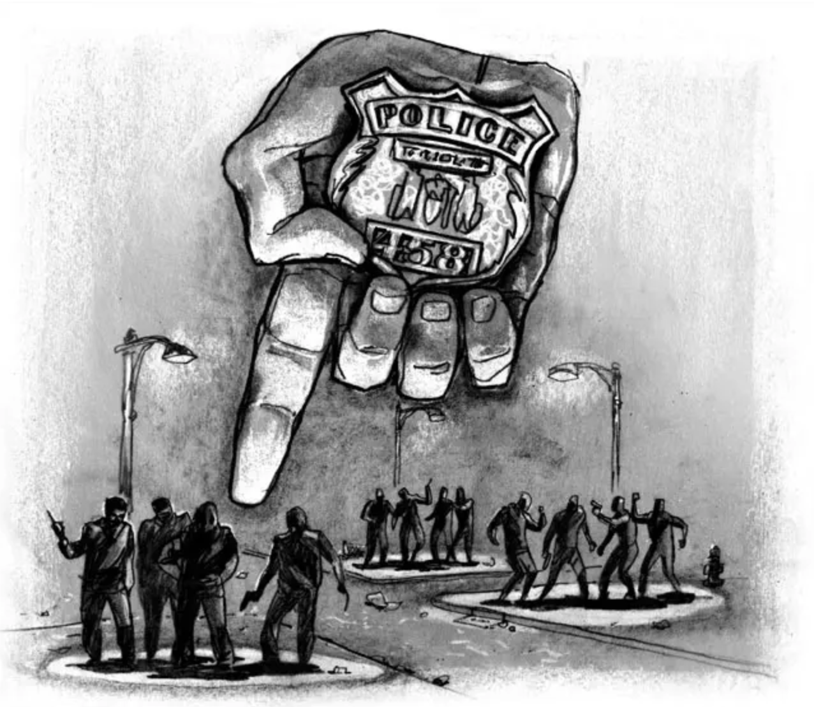
]
]

---

# Economic Model of Crime and Punishment

.left-column[
.center[


.smallest[
David D. Friedman

(1945—)
]
]
]

.right-column[
.smallest[
> “In designing institutions to control crime, our concern is not sin but cost. Eliminating all murders, even all muggings, would no doubt be a fine thing-but whether we ought to try to do it depends on how much it costs. If reducing the annual murder rate from ten to zero requires us to turn half the population into police, judges, and prison guards, it is probably not worth doing.”

]
.source[Friedman, David D, 1995, “Rational Criminals and Profit-Maximizing Police: Gary Becker's Contribution to the Economic Analysis of Law and Law Enforcement”]
]

---

# Economic Model of Crime and Punishment

.left-column[
.center[


.smallest[
David D. Friedman

(1945—)
]
]
]

.right-column[
.smallest[
> “Our first guess might be that the fine should be high enough to deter all crimes. But there may be some crimes we do not want to deter. Consider a hunter, lost and starving in the woods, who comes across a locked cabin containing food and a telephone. The benefit to him of breaking in and calling for rescue is much larger than the cost to the cabin's owner; we will, on net, be better off if that particular offense is not deterred. For a less exotic example, consider the driver who occasionally exceeds the speed limit when he is in a hurry. We could deter all or almost all speeding if we routinely confiscated the cars of convicted speeders-but many of us would regard that as more deterrence than we want.

]
.source[Friedman, David D, 1995, “Rational Criminals and Profit-Maximizing Police: Gary Becker's Contribution to the Economic Analysis of Law and Law Enforcement”]
]

---

# Economic Model of Crime and Punishment

.left-column[
.center[


.smallest[
David D. Friedman

(1945—)
]
]
]

.right-column[
.quitesmall[

> “If a crime produces a net benefit, if the gain to the speeder or the lost hunter is more than the loss to the rest of us, we are better off not deterring it. In many cases our legal system permits such "efficient crimes" by not classifying them as crimes. Every time I breath out I exhale carbon dioxide-regarded, in some contexts, as a pollutant. Most of us are confident that this particular offense is an efficient one-we are better off if we put up with a certain amount of extra carbon dioxide than if we all stop breathing. So exhaling, unlike some other forms of pollution, is not illegal. Similarly, the lost hunter of my example would probably be excused from criminal liability under the doctrine of necessity.

> “How, in such situations, can we deter inefficient speeding while permitting efficient speeding? The answer is simple: Set the expected punishment equal to the damage done. Under this rule, criminal punishment functions as a probabilistic price system.”

]
.source[Friedman, David D, 1995, “Rational Criminals and Profit-Maximizing Police: Gary Becker's Contribution to the Economic Analysis of Law and Law Enforcement”]
]

---


# Economic Model of Crime and Punishment

.left-column[
.center[


.smallest[
David D. Friedman

(1945—)
]
]
]

.right-column[
.smallest[

> “While this may be a reasonable way of looking at speeding, it seems less appropriate for more serious offenses. Do we really have a legal system where the reason we do not raise the punishment for murder is the fear that we would then have too few murders?

> The answer is no. So far I have been describing a world where crime control costs nothing and we therefore buy as much of it as we want. In order to catch and convict criminals we must pay police, hold trials, train lawyers-pay a variety of costs which I will refer to, for convenience, as apprehension costs. Once the criminals are convicted, we must punish them-and that too is costly.”

]
.source[Friedman, David D, 1995, “Rational Criminals and Profit-Maximizing Police: Gary Becker's Contribution to the Economic Analysis of Law and Law Enforcement”]
]

---

# Economic Model of Crime and Punishment

.left-column[
.center[
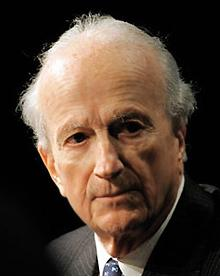

.smallest[

1930—2014

Economics Nobel 1992
]
]
]

.right-column[

- Chicago School economist interested in sociology

- Brought rational choice theory tools (optimization & equilibrium) to traditionally “non-economic” issues:
  - The family, marriage, children, household production
  - Employment discrimination
  - Education
  - Addiction, “irrationality”
  - Crime

- Becker, Gary, 1968, “Crime and Punishment: An Economic Approach,” *Journal of Political Economy*
]

---

# Economic Model of Crime and Punishment

.pull-left[

- .hi[“Rational offender model”]:
  - $g$: gain for committing criminal act
  - $p$: probability of apprehension
  - $f$: fine paid
  - $ct$: (opportunity) cost of prison time

- Any rational individual will commit a crime if
$$g > p(f+ct)$$

]

.pull-right[
.center[

]
]
---

# Economic Model of Crime and Punishment

.pull-left[
- The .red[Supply of criminal offenses] is a function of $\color{red}{S(p,f,t)}$
  - These variables $(p,f,t)$ can be chosen by policymakers

- Raising any of these variables will lower $\color{red}{S}$, reflecting .hi[deterrence]
]

.pull-right[
.center[

]
]

---

# Optimal Punishment

.pull-left[

$$\color{red}{S(p,f,t)}$$

- What is the optimal enforcement policy?
  - Policymakers choose $p,f,t$ to maximize social welfare (minimize total social costs)

- To deter crime, we need to do two things:
  1. .hi-purple[Catch] offenders $(p)$
  2. .hi-purple[Punish] them $(f,t)$
]

.pull-right[
.center[

]
]


---

# Economic Model of Crime and Punishment

.pull-left[

$$\color{red}{S(p,f,t)}$$

- Raising $p$ (catching a higher fraction of offenders) is costly
  - Requires more police, detectives, etc.

- Fines $f$ are **free**, even **make the State money**!
  - But don’t always work: most criminals are judgment-proof

- Supplement with **imprisonment** $t$ (or even **execution**) for additional deterrence
  - But these are costly to society — cost of prisons, guards, etc.
  - Execution also costly to society — loss of a life
]

.pull-right[
.center[
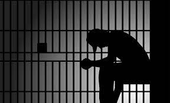
]
]


---


# Economic Model of Crime and Punishment

.left-column[
.center[


.smallest[
David D. Friedman

(1945—)
]
]
]

.right-column[
.quitesmall[

> “In controlling crime, we can get a given amount of deterrence in many different ways. We might catch half the criminals and fine them each $500, we might catch one criminal in twenty and put him in jail for a year, or we might catch one in five hundred and hang him. Suppose that all of these alternatives are equivalent from the standpoint of the criminal and thus have the same deterrent effect, just as a $100 fine was equivalent, in the earlier example, to one chance in ten of a $1000 fine. Generalizing our earlier term, we may say that all of these alternative combinations of probability and punishment represent the same expected punishment.

> .hi[In choosing among them, we are trading off one kind of cost against another.] It takes fewer policemen to catch five criminals out of a hundred than fifty and fewer judges to try them, so lowering the number we catch while raising their punishment saves on apprehension costs. But, since there is a limit to how large a fine a convicted criminal can pay, raising the punishment typically means shifting from fines to imprisonment or execution-which increases punishment cost. .hi[An efficient law enforcement system would produce any given level of deterrence with whatever combination of probability and punishment minimized the sum of the two sorts of cost.]”

]
.source[Friedman, David D, 1995, “Rational Criminals and Profit-Maximizing Police: Gary Becker's Contribution to the Economic Analysis of Law and Law Enforcement”]
]

---

# Economic Model of Crime and Punishment

.bg-washed-green.b--dark-green.ba.bw2.br3.shadow-5.ph4.mt5[
.hi-green[Example]: Suppose a crime has a 20% chance of being apprehended and a punishment equal to $20,000 (assume it is a fine for convenience, etc.)
]

- Person will commit crime if:
$$\begin{align*}
g &> p(f) \\
g &> (0.20)20,000 \\
g &> 4,000 \\ \end{align*}$$

---

# Economic Model of Crime and Punishment

.bg-washed-green.b--dark-green.ba.bw2.br3.shadow-5.ph4.mt5[
.hi-green[Example]: Suppose a crime has a 20% chance of being apprehended and a punishment equal to $20,000 (assume it is a fine for convenience, etc.)

]

- Society could save money by:
  - Firing half the police & judges, so probability of apprehension falls to 10%
  - Double the punishment to $40,000

- Punishing someone $40,000 may cost society more than punishing them $20,000, but not more than twice as much...and half as many people to punish
  - Cost of punishment is the same or lower, but we’d save money on apprehension
  
---

# Economic Model of Crime and Punishment

.bg-washed-green.b--dark-green.ba.bw2.br3.shadow-5.ph4.mt5[
.hi-green[Example]: Suppose a crime has a 20% chance of being apprehended and a punishment equal to $20,000 (either fines, lost wages from imprisonment, etc.)

]

- Follow the logic to its conclusion: “optimal” law enforcement system has infinitely low probability of being apprehended, but an infinitely severe punishment!

- Note, Becker didn’t actually believe this:

- Empirically, criminals seem to respond more to probability of being caught than to severity of punishment

---

# Enforcement Costs...Back to Tort Law?

.left-column[
.center[


.smallest[
David D. Friedman

(1945—)
]
]
]

.right-column[
.quitesmall[

> “The assumption of rationality applies not only to criminals but to everyone included in the analysis. Judges, policemen, legislators and potential victims are all, like criminals, rational individuals pursuing their own ends as best they can. Economic theory gives us no reason to assume that criminals are less rational than judges, or judges less self-interested than criminals.”

]
.source[Friedman, David D, 1995, “Rational Criminals and Profit-Maximizing Police: Gary Becker's Contribution to the Economic Analysis of Law and Law Enforcement”]
]


---

# Enforcement Costs...Back to Tort Law?

.left-column[
.center[


.smallest[
David D. Friedman

(1945—)
]
]
]

.right-column[
.quitesmall[

> “I am a policeman, you are a criminal, and I have the evidence that will convict you. The cost to you of being convicted is $50,000-either a fine or an equivalent jail sentence. The benefit to me of convicting you is a commendation from my superior officer and a small increase in my prospects for promotion-worth, say, $10,000 in future income.

> Seen from the standpoint of Dragnet, the rest is obvious. I deliver both you and the evidence to the D.A., and the story is over. Seen from the standpoint of an economically rational police officer, it is equally obvious. I sell you the evidence for something between ten and fifty thousand dollars, and we both go home.”

> Of course, this is not the whole story-if it were, criminals would almost never be convicted. Real world legal systems spend considerable time and effort trying to prevent such transactions and punishing those who engage in them. But the need to do so is a substantial cost-it means that police officers must spend part of their time watching each other instead of watching criminals. And sometimes, when one police officer eludes the vigilance of his fellows or when a whole department succeeds in conspiring together in their own interest and against the interest of the taxpayers who employ them, the economics text is a better description of the real world than the television program.

]
.source[Friedman, David D, 1995, “Rational Criminals and Profit-Maximizing Police: Gary Becker's Contribution to the Economic Analysis of Law and Law Enforcement”]
]

---

# Enforcement Costs...Back to Tort Law?

.left-column[
.center[


.smallest[
David D. Friedman

(1945—)
]
]
]

.right-column[
.quitesmall[

> Becker and Stigler suggested a simple and radical solution to this problem-privatize the catching of criminals. Instead of paying the policeman a salary, pay him the fines collected from the criminals he brings in. If the convicted criminal will owe a $50,000 fine to the policeman, the lowest bribe the policeman will accept to let him off is $50,000. If the criminal offers that much, in order to avoid the expense of defending a hopeless case in court, there is no reason we should object-the criminal has paid his fine, the policeman has received his salary, and the taxpayers have been saved the cost of a trial.

> Such a system of private enforcement raises a new issue: how to allocate crimes. Since policemen are now private bounty hunters, how do we decide which one is entitled to catch a particular criminal and collect his fine? One solution is to make the crime the property of the victim. He sells the right to solve it to a (private) policeman. This process allocates crimes to enforcers-efficiently, since the enforcer best able to catch the criminal will be willing to pay the highest price. Victims receive some reimbursement for their loss, and we need no longer worry about keeping policemen from accepting bribes.

]
.source[Friedman, David D, 1995, “Rational Criminals and Profit-Maximizing Police: Gary Becker's Contribution to the Economic Analysis of Law and Law Enforcement”]
]

---


# Enforcement Costs...Back to Tort Law?

.left-column[
.center[


.smallest[
David D. Friedman

(1945—)
]
]
]

.right-column[
.quitesmall[

> By following out the line of argument begun by Becker and Stigler, we have reinvented civil law-the law of torts as distinguished from the law of crimes. It is the victim of a tort, not the state, who has a claim against the tortfeasor. While modern American law does not permit him to sell the entire claim to the lawyer who will go to court and collect it, he can sell part of the claim by hiring the lawyer on a contingency basis. Some earlier forms of civil law permitted the outright sale of civil claims, and some modern writers have argued that we should do the same. (Friedman 1984, Shukaitis 1987).

> What we call bribery in the criminal context is called an out of court settlement in civil law-and is how most civil claims are collected. Since the payment is made to the person who would have collected the fine (called a "damage payment" in the civil system), an out of court settlement achieves the same result as a trial and at lower cost.

> This suggests an interesting question: Should we abolish the criminal law? Would we be better off if we turned all crimes into torts, replacing enforcement by the state with enforcement by private police selected by the victims? To put the question differently, is there any logic to our present system, where if someone assaults me I call the police but if he reneges on a contract I call my lawyer?
]

.source[Friedman, David D, 1995, “Rational Criminals and Profit-Maximizing Police: Gary Becker's Contribution to the Economic Analysis of Law and Law Enforcement”]
]

---

# Interesting Historical Cases

.pull-left[

1. England before 1828
  - Koyama (2012)

2. Medieval Iceland
  - Friedman (1979)

]

