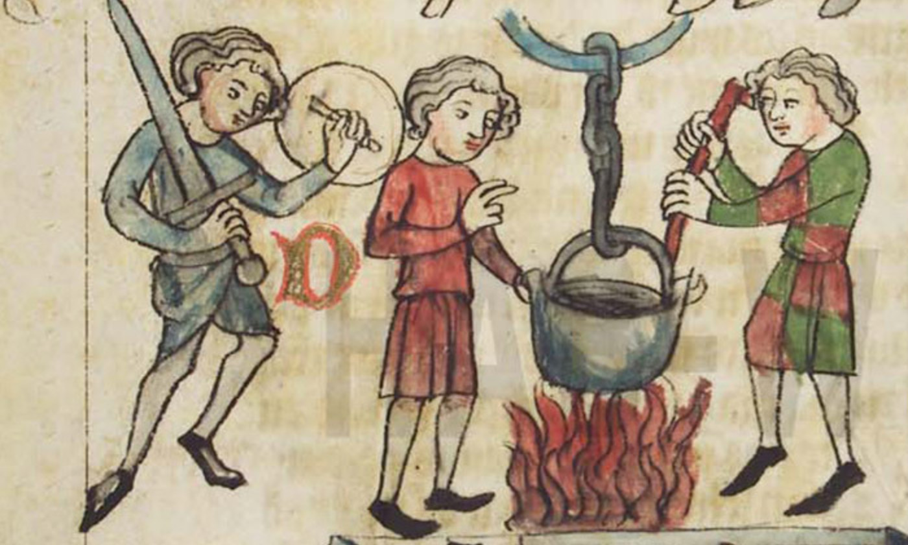
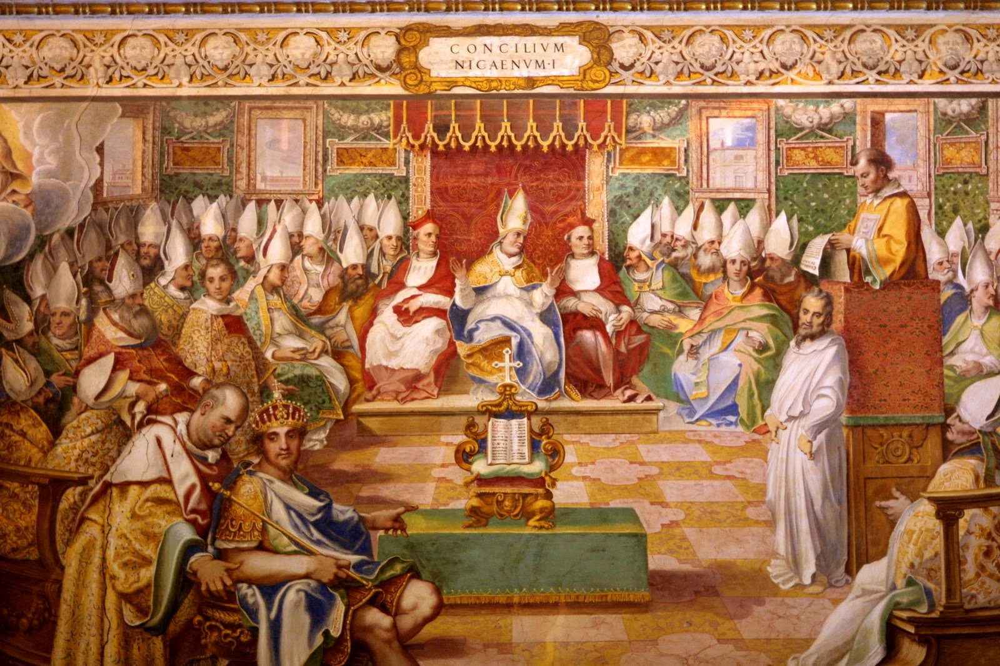
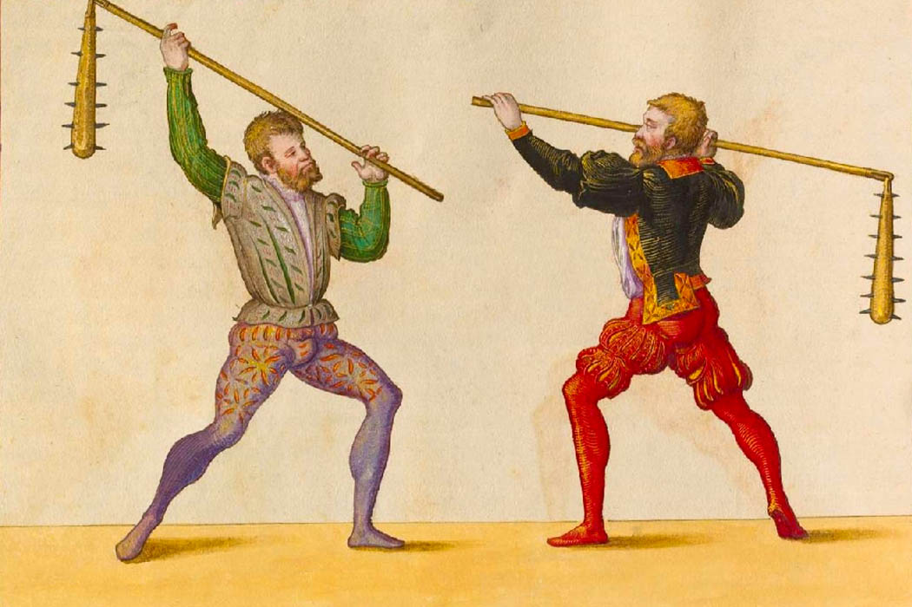
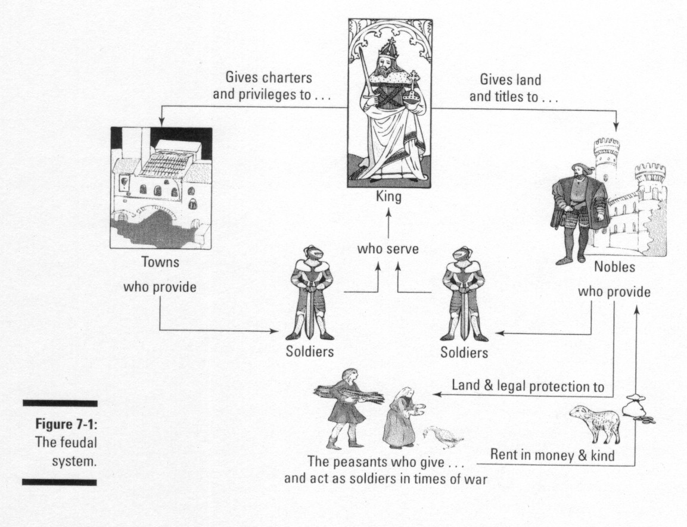
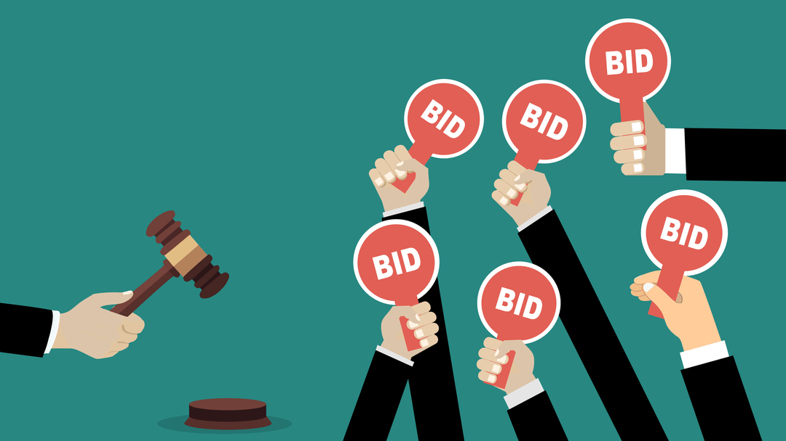
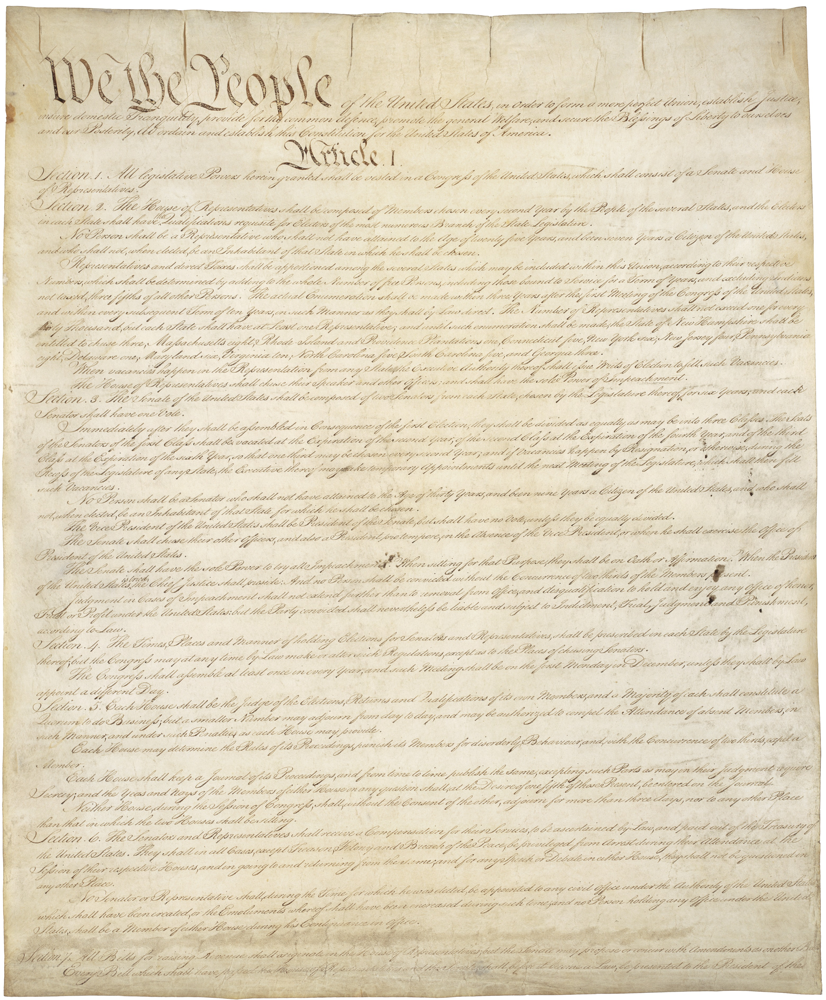
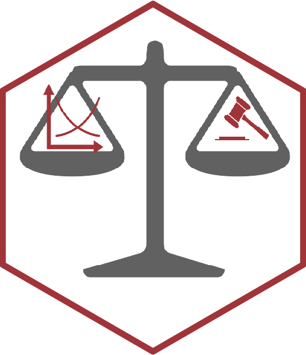

```{r setup, include=FALSE}
options(htmltools.dir.version = FALSE)
knitr::opts_chunk$set(echo=F,
                      message=F,
                      warning=F,
                      fig.retina=3,
                      fig.align = "center")
library("tidyverse")
library("ggrepel")
library("fontawesome")
xaringanExtra::use_tile_view()
xaringanExtra::use_tachyons()
xaringanExtra::use_freezeframe()
update_geom_defaults("label", list(family = "Fira Sans Condensed"))
update_geom_defaults("text", list(family = "Fira Sans Condensed"))
```

class: inverse

# Outline

### [Ordeals](#3)
### [Trial By Battle](#)
### [Wrapping Up the Semester](#)

---

# Determining Guilt or Innocence

.pull-left[
.smallest[
- We spent most of our focus in criminal law (and in all of our areas of law) on **how law affects incentives**
  - i.e. deter crime; reduce accidents; encourage trade

- We have not spent any time on **how the legal process determines guilt or innocence**
  - We don’t have time to build a detailed theory
  - So instead, here are two of my favorite papers on the subject
]
]
.pull-right[
.center[

]
]

---

class: inverse, center, middle

# Ordeals

---

# Obligatory

.center[
<iframe width="980" height="550" src="https://www.youtube.com/embed/zrzMhU_4m-g" title="YouTube video player" frameborder="0" allow="accelerometer; autoplay; clipboard-write; encrypted-media; gyroscope; picture-in-picture" allowfullscreen></iframe>
]

---

# Ordeals

.left-column[
.center[


.smallest[
Peter Leeson

1979—
]
]
]

.right-column[

.smaller[
> “For 400 years the most sophisticated persons in Europe decided difficult criminal cases by asking the defendant to thrust his arm into a cauldron of boiling water and fish out a ring. If his arm was unharmed, he was exonerated. If not, he was convicted. Alternatively, a priest dunked the defendant in a pool. Sinking proved his innocence; floating proved his guilt. People called these trials ordeals. No one alive today believes ordeals were a good way to decide defendants’ guilt. But maybe they should....hi[Medieval judicial ordeals achieved what they sought: a way of accurately assigning guilt and innocent where traditional means couldn’t].”

]

.source[Leeson, Peter T, 2012, “Ordeals,” *Journal of Law and Economics* 55: 691—714]
]

---

# Ordeals: *Why* They Worked

.pull-left[

- Ordeals were only used when there was uncertainty about a person's innocence or guilt

- Obvious cases were settled with evidence and witnesses 

]

.pull-right[
.center[

]
]

---

# Ordeals: *Why* They Worked

.pull-left[

- .red[Accused] is either (truly) Innocent or Guilty (with probability $p)$
  - Choice is a message to .blue[Priest]: **Undergo** or **Refuse** an ordeal

- .blue[Priest] observes choice, but does not know *true* innocence or guilt

- Must find a signal such that payoffs create a .hi[separating equilibrium] where (.red[Innocent]: **Undergo**, .red[Guilty]: **refuse**) 

]

.pull-right[
.center[

]
]

---

# Ordeals: The Law and Economics of Superstition

.pull-left[

- Ordeals "worked" because of .hi-purple[iudecium Dei]: God would protect the truly innocent and expose the guilty during the ordeal
  - Specifically, worked because of people’s *believeds* in *iudecium Dei*

- Priests didn’t *actually* leave it in God's hands, but cleverly leveraged people's belief in *iudecium Dei*

]

.pull-right[
.center[

]
]

---

# Ordeals: The Law and Economics of Superstition

.pull-left[

- If people believe in *iudecium Dei*

- and .red[Accused] ranks payoffs:
    1. Truly innocent: Undergo and pass
    2. Truly guilty: Refuse and confess
    3. Truly innocent: Refuse
    4. Truly guilty: Undergo and fail

- Then:
  - $p(Innocent|Undergo) \rightarrow 1$
  - $p(Guilty|Refuse) \rightarrow 1$

]

.pull-right[
.center[

]
]

---

# Ordeals: The Law and Economics of Superstition

.pull-left[

- Conditional on observing the .red[Accused]’s decision to undertake ordeal, .blue[Priest] knows person is (very probably) innocent
  
- .blue[Priest] rigs the Ordeal so the accused "miraculously" passes it

- Events were religious, sanctimonious, ritualized, .blue[Priest] had lots of (trusted) discretion

]

.pull-right[
.center[

]
]

---

# Ordeals: The Law and Economics of Superstition

.pull-left[
.smallest[
- Ordeals *only* work for people who believe in *iudicium Dei*
  - Reserved for the most difficult cases with no evidence or witnesses

- What about “skeptics”?
  - Priest had to let a proportion of those undertaking ordeal fail them (even if they were innocent!)
  - Maintains an equilibrium of belief in *iudicium Dei*

- *Known* non-believers (or non-Christians) were *not* presented with Ordeals as an option
]
]

.pull-right[
.center[

]
]

---

# Ordeals: The Law and Economics of Superstition

.pull-left[
- In 1215, Fourth Lateran Council rejects the legitimacy of judicial ordeals, banned priests from administering them
  - Belief in *iudicium Dei* evaporates
  - Ordeals would no longer work — requires the superstition as sorting mechanism

- Today we have technology that can accurately separate innocence and guilt in very hard cases (e.g. DNA evidence)  

]

.pull-right[
.center[

]
]

---

# Ordeals

.left-column[
.center[


.smallest[
Peter Leeson

1979—
]
]
]

.right-column[

.smallest[
> “Though rooted in superstition, judicial ordeals weren’t irrational. Expecting to emerge from ordeals unscathed and exonerated, innocent persons found it cheaper to undergo ordeals than to decline them. Expecting to emerge...boiled, burned, or wet and naked and condemned, guilty persons found it cheaper to decline ordeals than to undergo them. [Priests] knew that only innocent persons would want to undergo ordeals...[and] exonerated probands whenever they could. Medieval judicial ordeals achieved what they sought: they accurately assigned guilt and innocence where traditional means couldn’t.”

]

.source[Leeson, Peter T, 2012, “Ordeals,” *Journal of Law and Economics* 55: 691—714]
]

---
# The Law and Economics of Superstitution: Persistance

.center[

]

---

# The Law and Economics of Superstitution: Persistance

.center[
<iframe width="980" height="550" src="https://www.youtube.com/embed/rN7pkFNEg5c" title="YouTube video player" frameborder="0" allow="accelerometer; autoplay; clipboard-write; encrypted-media; gyroscope; picture-in-picture" allowfullscreen></iframe>
]

---

class: inverse, center, middle

# Trial By Battle

---

# Trial By Battle

.pull-left[

- Norman conquest of England (1066) introduced trial by battle (*duellum*)

- Until 1179, it was England’s *primary* judicial procedure for deciding land ownership disputes

- Most dismiss it as being barbaric, irrational, ineffective solution to disputes
]

.pull-right[
.center[

]
]

---

# Trial By Battle

.left-column[
.center[


.smallest[
Peter Leeson

1979—
]
]
]

.right-column[

> “This paper defends trial by battle. It examines trial by battle in England as judges used it to decide property disputes from the Norman Conquest to  1179. I argue that  judicial combat  was sensible and effective. In a feudal world where high transaction costs confounded the Coase theorem, trial by battle allocated disputed property rights efficiently,” (342).

.source[Leeson, Peter T, 2011, “Trial by Battle,” *Journal of Legal Analysis* 3(1): 341—375]
]

---

# Trial By Battle: How they Worked

.pull-left[
- .blue[Demandant] (.blue[Plaintiff]) challenged .red[Tenant] (.red[Defendant]) via a writ of right, requesting the crown to issue an order compelling .red[Tenant] to appear before a court to defend his property

- Court required evidence, such as witness testimony, to settle claims
  - Also acted as screening device to reduce frivolous cases
  - But, often no evidence existed, and no objective way to determine the land’s “true” owner
  - Used trial by combat to determine the owner
    - Again, official belief was God would favor the true owner and abandon the fraud

]

.pull-right[
.center[

]
]

---

# Trial By Battle: How they Worked

.pull-left[
- Both parties could hire .hi-purple[champions] to serve as the combatants
  - In theory, champions were supposed to be each party’s witnesses, sworn to support their claim
  - In practice, parties were allowed to hire “professional” champions 
  - Only after 1275 did the law officially require champions be sworn witnesses
]

.pull-right[
.center[

]
]

---

# Trial By Battle: Why They Were Necessary

.pull-left[
.smaller[
- .hi[Feudalism]: political & economic power is determined by **land-ownership**

- All land in England is owned by the King, who **rents** out land to tenants
  - Lords are granted their own fief to rule for the King
  - Lords rent out part of their own land out to their own tenants
  - All the way down to landless serfs who work their Lord’s land

- Rent often in-kind or military service, only centuries later that rents paid in money
]
]

.pull-right[
.center[

]
]

---

# Trial By Battle: Why They Were Necessary

.pull-left[

- Under feudalism, property rights (in land) were **extremely sticky**
  - Land is inherited by eldest son, or reallocated by authority of the crown
  - All users of land (all the way down to tenants) had veto rights over changes in land use
  - Not even the beginnings of a market for land until at least 13th century

- Prohibitively high transaction costs for land ownership
]

.pull-right[
.center[

]
]

---

# Trials as Auctions

.pull-left[

- For efficiency, property rights should flow to their highest valued users

- Coase Theorem: if transaction costs are low, this is exactly what will happen, so long as rights are clearly defined and tradeable

- Ideally, we want disputes, where there is no clear evidence of legitimate ownership (for either way), to go to the party that values the land more
]

.pull-right[
.center[

]
]

---

# Trials as Auctions

.pull-left[

.smallest[
- Any auction *tends* to allocate resources to their highest valued user
  - Bids generally correlate with willingness to pay

- **Market auction**: highest bidder always wins

- **“Legal” auction**: party spending most on attorneys increases likelihood of winning

- **“Violent” auction**: party spending most on champion increases likelihood of winning

]
]

.pull-right[
.center[

]
]

---

# Trials as Auctions

.pull-left[
.smallest[
- All types of auction tend to allocate resources efficiently — to higher bidding party
  - But auctions come with social costs
  
- Problem 1: might be differences in endowments (wealth) that affect WTP; can mitigate with credit markets (but poor access to credit in 10th century England!)

- Problem 2: bids are a transfer to the party or institution holding the auction, which creates incentives for rent-seeking
  - Create bogus disputes just to extract wealth, which weakens property rights
]

]
.pull-right[
.center[

]
]


---

# Trials as Auctions

.left-column[
.center[


.smallest[
Peter Leeson

1979—
]
]
]

.right-column[

> “Illegitimate land disputes, which result from bid recipients’ attempts to raise their  incomes instead of from genuinely felt ownership disagreements, undermine property rights. They constitute socially costly rent-seeking activity rather than socially productive ownership resolution. Individuals who confront the specter of rampant rent seeking are insecure in their property rights. They live in constant fear that fraudulent legal challengers will deprive them of their property. Therefore they have weak incentives to invest in their land,” (p.342).

.source[Leeson, Peter T, 2011, “Trial by Battle,” *Journal of Legal Analysis* 3(1): 341—375]
]

---

# Trials as Auctions

.left-column[
.center[


.smallest[
Peter Leeson

1979—
]
]
]

.right-column[

.smallest[
> “Why didn’t Norman England’s legal system use “regular” auctions—the first-price ascending-bid variety—to auction contested property rights todisputants instead? Because regular auctions would’ve encouraged more rent seeking than violent ones. As in violent  auctions, in regular ones, too, there are bid recipients...If proceeds accrue to the legal system, say to the king, or to the judges, officials have an incentive to permit and create fictitious property conflicts. 

> “.hi[Trial by battle’s violent auctions encouraged less rent seeking than regular auctions—and thus were less socially costly—because they generated lower bid receipts, which motivate rent-seeking behavior],” (p.342).

]
.source[Leeson, Peter T, 2011, “Trial by Battle,” *Journal of Legal Analysis* 3(1): 341—375]
]

---

# How Trial By Battle Reduced Social Costs

.left-column[
.center[


.smallest[
Peter Leeson

1979—
]
]
]

.right-column[

.smallest[
> “First, unlike in a regular auction, in trial by battle’s violent auction both the  higher bidder and the lower bidder must pay their bids. Expecting the higher-valuing  disputant to outbid him, the lower-valuing disputant is therefore encouraged to bid less. That, in turn, allows the higher-valuing disputant to bid less too. In contrast, in a regular auction only the higher bidder pays his bid. The lower-valuing user therefore has no incentive to bid anything lower than his full valuation of the disputed right...As  a result, disputants spend more to affect the allocation of disputed property rights in a regular auction than they do in trial by battle’s violent one.

]
.source[Leeson, Peter T, 2011, “Trial by Battle,” *Journal of Legal Analysis* 3(1): 341—375]
]

---

# How Trial By Battle Reduced Social Costs

.left-column[
.center[


.smallest[
Peter Leeson

1979—
]
]
]

.right-column[

.smallest[

> Second, unlike in a regular auction, in trial by battle’s violent auction the higher-biddingdisputant only wins the auction probabilistically. The higher-spending  disputant who sends a better champion to the arena is more likely to win the disputed  right, but it’s possible for the lower-spending disputant’s inferior champion to upset him. In contrast, in a regular auction the  higher-bidding disputant always wins the  auction. The “randomness” in trial by battle’s violent auction, which doesn’t exist in a  regular auction, reduces the value of making higher bids. That, in turn, encourages disputants to bid less. The result again is that disputants spend more to affect the allocation of disputed property rights in a regular auction than they do in trial by battle’s violent one,” (p.360).

]
.source[Leeson, Peter T, 2011, “Trial by Battle,” *Journal of Legal Analysis* 3(1): 341—375]
]

---

# Trial By Battle: Predictions & Evidence

.left-column[
.center[


.smallest[
Peter Leeson

1979—
]
]
]

.right-column[

.quitesmall[
> “Once each disputant knows who their adversary has hired, and thus has a good idea about what he spent on the trial, battle is unnecessary. At this point both parties know the  trial’s probabilistic outcome. They can save time and expense by settling their dispute instead. Thus my theory predicts that disputants should’ve settled most trials by battle. In fact it predicts that disputants should’ve always settled unless they had sufficiently different assessments of their champions’ comparative skill, or bargaining itself proved too costly and thus broke down...As long as the victorious champion’s identity isn’t a fore-gone conclusion, a mutually beneficial bargaining range that permits settlement exists. Disputants have an incentive to settle until battle is over,” (p.363).

]
.source[Leeson, Peter T, 2011, “Trial by Battle,” *Journal of Legal Analysis* 3(1): 341—375]
]

---

# Trial By Battle: Predictions & Evidence

.pull-left[
.smallest[
- Trials by battle were a mechanism meant to .hi-purple[induce settlement] between the parties, so long as it was unclear who would win

- Courts took pains to minimize the social cost of the trials
  - Combatants mandated to use non-lethal weapons (clubs, *baculi cornuti* and shields), and use protective gear; very rare a combatant was killed (only 1 documented case)
  - Turned into public spectator sport; popular, well-attended (also increases the public finality of the title!)

]
]
.pull-right[
.center[

]
]
---

# Trial By Battle: Predictions & Evidence

.left-column[
.center[


.smallest[
Peter Leeson

1979—
]
]
]

.right-column[

.smallest[
> “Historian of trial by battle M. J. Russell (1980a, 129) has identified 598 cases in England between 1200 and 1250 that mention trial by battle. Disputants actually wagered battle in only 226 of these cases, or 37.8 percent of the time. .hi[Champions only fought in 123 of these cases, or 20.6 percent of the time]. These data suggest that .hi[disputants settled trials by battle nearly 80 percent of the time]. Even taking Russell’s lower-most bound of 66.6 percent, the evidence suggests that medieval English disputants overwhelmingly settled under trial by battle. .hi[‘[I]t is abundantly clear that trial by battle in civil cases did from an early time tend to become little more than a picturesque setting for an ultimate compromise’] (Pollock 1912: 295). .hi[‘[B]attles were often pledged but seldom fought’] (Russell 1959, 245),” (p.364).

]
.source[Leeson, Peter T, 2011, “Trial by Battle,” *Journal of Legal Analysis* 3(1): 341—375]
]

---

# Trial By Battle: Predictions & Evidence

.left-column[
.center[


.smallest[
Peter Leeson

1979—
]
]
]

.right-column[

.smallest[
> “My analysis explains how a seemingly irrational legal institution—trial by battle—is consistent with rational, maximizing behavior. It illuminates why this apparently inefficient institution played a central role in England’s legal system for so long. Most important, it demonstrates how societies can use legal arrangements to substitute for the Coase theorem where high transaction costs preclude trade,” (p.364).

]
.source[Leeson, Peter T, 2011, “Trial by Battle,” *Journal of Legal Analysis* 3(1): 341—375]
]

---

# Trial By Battle: Why It Ended

.left-column[
.center[


.smallest[
Peter Leeson

1979—
]
]
]

.right-column[

.quitesmall[
> “When the transaction cost of trading land is low, and thus property rights in land are fluid, things are different. In this case society can rely on the Coase theorem to reallocate land to higher-valuing users if judges’ initial allocation of contested property is wrong. Trial by battle’s demand-revelation and allocation  mechanism  is  unnecessary. It imposes a cost without a corresponding benefit. Trial by battle is inefficient. Thus my theory predicts that England’s legal system should’ve abandoned trial by battle for deciding land disputes when the transaction cost of trading land  fell significantly. The history of trial by battle’s decline in English land disputes supportsthis prediction. In the second half of the twelfth century Henry II introduced important legal changes in England—the so-called Angevin reforms. These changes mark the birth of English common law and the beginning of feudalism’s end in England...In this  period traditional feudal property arrangements declined significantly. With them, so did the transaction cost of trading land,” (p.366—367).

]
.source[Leeson, Peter T, 2011, “Trial by Battle,” *Journal of Legal Analysis* 3(1): 341—375]
]

---

class: inverse, center, middle

# Wrapping Up the Semester

---

# Outline and Areas of Law

.pull-left[
.smaller[
1. .hi[Property Law]
  - how do we establish who is entitled to what?
2. .hi[Contract Law]
  - how do individuals permit use or exchange of entitlements?
3. .hi[Tort Law]
  - how do we remedy violations of persons or entitlements?
4. .hi[Criminal Law]
  - how does *the State* punish *egregious* harms to *society*?

]
]

.pull-right[
.center[

]
]

---

# Of Course We Haven't Covered the Whole Story

.pull-left[

- Laws themselves have to come from somewhere
  - Constitution, legislation, regulation, common law, custom

- .hi[Political economy] of how laws are determined
  - Legislators, judges, police, voters are all agents that have their own objectives and respond to incentives
]

.pull-right[
.center[

]
]

---

# Three Projects in Law & Economics

.pull-left[

.smallest[
1. .hi-purple[Predicting consequences of law]
  - least controversial

2. .hi-purple[Predicting what law will be]
  - an empirical conjecture: law *is* efficient

3. .hi-purple[Recommending what law should be]
  - a normative project: law *should* be efficient

- You could still believe:
  - law is efficient, but should not be
  - law is not efficient, but should be
]
]

.pull-right[
.center[

]
]

---

# Recap of the Semester

.pull-left[

- We have developed theories of property/nuisance law, contract law, tort law, criminal law

- Looked at how rules of legal liability create/change incentives

- Thought about how these rules can be chosen to try to achieve (more) efficient outcomes

]

.pull-right[
.center[

]
]

---

# Normative Goal: Minimize Social Costs

.pull-left[
.quitesmall[
- .hi[Property law]
  - Goal: allocate resources/entitlements efficiently
  - Or to minimize inefficiencies due to misallocation

- .hi[Contract law]
  - Goal: further facilitate trade
  - Or to decrease inefficiencies due to unrealized Kaldor-Hicks improvements

- .hi[Tort law]
  - Goal: minimize total social costs of accidents (cost of accidents + cost of precaution)

- .hi[Criminal law]
  - Goal: minimize total costs of crime and enforcement
]
]

.pull-right[
.center[

]
]

---

# Administrative Costs and Error Costs

.pull-left[

.smallest[
- .hi[Administrative costs]
  - Hiring judges, building courthouses, paying jurors, etc.
  - .hi-purple[More complex process lead to higher costs]

- .hi[Error costs]
  - Errors are judgments that differ from theoretically perfect ones
  - Not about computing damages (only affects distribution, not efficiency)
  - .hi-purple[Anticipated errors affect incentives], causing inefficient precaution, activity levels, etc.
]
]
.pull-right[
.center[

]
]

---

# Administrative Costs and Error Costs

.pull-left[

- So theoretically, an efficient legal process (in the real world) is one that minimizes sum of:
  1. .hi[Direct costs] of administering the system
  2. The .hi[economic effects of errors] due to imperfect process

- We've already seen tradeoff between these two types of costs:
  - Simpler vs. more complex rules
]

.pull-right[
.center[

]
]

---

# Tradeoff Between Administrative & Error Costs

.smallest[
- Whaling law: “fast fish/loose fish” vs. “iron holds the whale”
  - FF/LF: lower administrative costs (fewer disputes)
  - IHTW: lower error costs (better incentives for whaling)

- Pierson v. Post (fox hunt case)
  - Majority: first to catch, otherwise “fertile source of quarrels”
  - Dissent: first to chase, hunting foxes is “meritorious”

- Privatizing ownership of land
  - Expanding property rights addes admin costs
  - But lowers error costs (better incentives for efficient use of resource)
  - Demsetz (1967): privatize when gains outweigh costs
  - Same as: pick system with lower sum of admin + error costs
]

---

# Goals of the Course

.pull-left[
.smallest[
- Not to memorize facts like which liability rules lead to efficient behavior

- But to understand and **learn how to think about why**

- This was never a law class, but a class about how to think about the law
  - How people respond to incentives, the consequences of any particular rule
  - Which rules would lead to efficient behavior
  - And whether we should want to attain that
]
]

.pull-right[
.center[

]
]
---

# Big Ideas to Take Away

.pull-left[

1) Incentives matter

(...need I say more?)
]

.pull-right[
.center[

]
]

---

# Big Ideas to Take Away

.pull-left[
2) Efficiency as a goal is a good starting point
  - Not the *only* goal for society, but maximizing total wealth is a good thing
  - Can always *redistribute* resources (via government) afterwards
  - Forces us to be honest about other political goals

]

.pull-right[
.center[

]
]

---

# Big Ideas to Take Away

.pull-left[
3) Coase Theorem: can we depend on people to bargain to efficient outcomes?
  - Yes, if transaction costs are low — design law to keep them low
  - No, if transaction costs are high — design law to get the initial allocation correct
      - Private necessity, duress, eminent domain
]

.pull-right[
.center[

]
]

---

# Big Ideas to Take Away

.pull-left[
4) Efficiency requires incentives to engage in socially productive activities...but in excess can cause rent-seeking
  - Nuisance law, contract law, tort law help people internalize externalities they cause
  - Allowing people to profit from (productive, but not redistributive) information and ownership (but avoid excessive quarrels over first possession)
]
.pull-right[
.center[

]
]

---

# Big Ideas to Take Away

.pull-left[
5) A perfect rule may not exist, even in theory...
  - Paradox of compensation: single rule sets multiple parties’ incentives
  - Expectation damages for contract breach can’t get both efficient breach and efficient reliance
  - Tort liability can’t get efficient activity level for injurers and victims

]
.pull-right[
.center[

]
]

---

# Big Ideas to Take Away

.pull-left[
6) ...and even if it does, it might not be what we want in practice
  - Administrative costs vs. error costs
  - Whaling: fast fish/loose fish vs. iron-holds-the-whale; Fox case: initial pursuer vs. final claimaint owning
  - Demsetz: cost vs. benefits of property rights vs. commons
  - Criminal law: deterrence is costly, but reduces crimes
]
.pull-right[
.center[

]
]

---

# Big Ideas to Take Away

.pull-left[
7) Understand how our conclusions depend on our assumptions
  - Rationality
  - Perfect compensation
  - Incorruptibility
  - The world is a complicated place! How robust are our institutions to these real world problems?
]
.pull-right[
.center[

]
]
